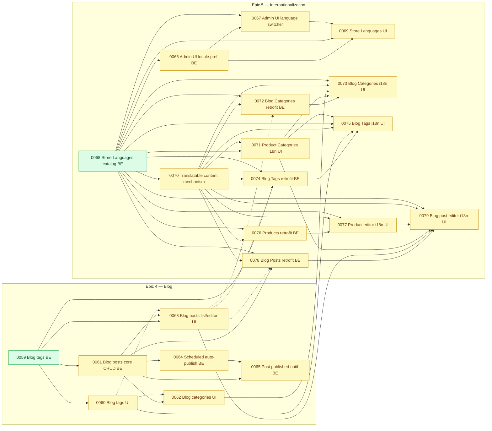

# Task Map — `ai-spec/tasks/` Inventory and Dependency Graph

**This file maps parallelization risk for pending work only.** `done/` tasks are intentionally
left out of the dependency graph below — a merged, closed task can only ever be a *satisfied*
dependency for something still pending, never a source of conflict for work still being
implemented, so drawing it as a node would only add clutter with no decision value.

Aggregated view of every task file under `ai-spec/tasks/` (the three-stage `ai-spec/tasks/` →
`ai-spec/tasks/in-progress/` → `ai-spec/tasks/done/` convention documented in
[`docs/workflow.md`](../docs/workflow.md)). **This file was originally a point-in-time,
manually-regenerated snapshot; it no longer is.** Per
[`docs/workflow.md`'s task-coordination-file regeneration step](../docs/workflow/task-files-links-and-ordering.md#regenerating-the-task-coordination-files),
`docs-keeper` now updates the affected part of this file on the same pass as the mandatory
link-integrity check, every time a task file is created, moves to `in-progress/`/`done/`, or has
its own "Dependencies" section edited — so it should reflect the real backlog rather than
needing a manual "is this stale" check. `docs/workflow.md`'s per-story `ai-spec/tasks/` files
remain the source of truth for any individual story's dependencies; this file only aggregates
and cross-references what those files already state — if the two ever disagree, the individual
task file is correct and this one needs a refresh.

**This pass is story 0055's closure (Orders list + detail/editor UI, Epic 3's terminal node).** Its task
file moved `ai-spec/tasks/in-progress/` -> `ai-spec/tasks/done/`, its `tasks-status.json` entry was deleted,
its node and its `ready` class membership were removed from the graph, and it joined the flat `done/`
inventory (Epic 3: 17 -> 18). It was nothing's hard dependent (`depends_on` edges pointing *at* 0055: none), so
no other task's `status` changes. `0058`/`0059`/`0068` remain `ready`. The prose below this note describes the
state as of the earlier 0054 pass and is otherwise unchanged.

**The pass before it (story 0054's own closure) also reconciled four closures this file had not caught up
to.** `0052-order-auto-cancel-full-refund-backend.md`, `0053-order-tax-region-resolution-physical-
backend.md`, `0053a-order-totals-tax-rate-percentage-backend.md` and `0057-notification-bell-ui.md`
were all already merged into `finalproject-ARP` on other branches/sessions — found in `done/` at
the start of this pass rather than moved by it — exactly the "a task can turn dependency-ready and
get claimed by another session before this snapshot is regenerated" gap this file's own **Scope
and known limitations** section already names. Reconciled here: `0052`'s node and its edge
(`0052 → 0055`) are dropped; `0053`'s node and its edges (`0053 -.-> 0054`, `0053 → 0055`) are
dropped; `0053a` was never drawn as a node (an amendment to 0053 rather than an independent story
gating anything of its own); and `0054`'s own node and its edge (`0054 → 0055`) are dropped as this
same pass's own closure. Together, this leaves **0055 (Orders list + detail/editor UI) with zero
pending dependencies left at all** — every one of the seven Orders stories its own file names as a
Phase-3 blocker (`0048`–`0054`) is now `done/` — so it moves from `blocked` to `ready`, the epic's
terminal node finally unblocked. `0057`'s own node is likewise dropped from the graph; it had no pending dependent of its own to
re-derive against `done/`.

As of this snapshot, `ai-spec/tasks/in-progress/` is empty again (story 0055 was checked out there for Phase 3 and closed to `done/` in this same pass). Before that it was empty too: `0056-notification-viewing-
backend.md` completed Phase 7 and moved straight from `in-progress/` to `done/` in this same
regeneration pass — its node and edge (`P0056 --> P0057`) are dropped from the graph below, its
`tasks-status.json` entry was deleted outright, and its own former dependent (`0057`) is
re-derived against `done/` and moves from `blocked` to `ready` (see its updated bullet under
[Pending tasks that are independent](#pending-tasks-that-are-independent-of-each-other-and-safe-to-parallelize)).

Update (2026-09-23): `0058-blog-categories-backend.md` completed Phase 7 and moved from
`in-progress/` to `done/` — the first Epic 4 story to close. Its node and every edge touching it are
dropped from the graph below, its `tasks-status.json` entry was deleted, and its four dependents
(`0061`, `0062`, `0063`, `0072`) are re-derived against `done/`: each drops `"0058"` from
`depends_on` and stays `blocked` on its other still-pending dependencies.

Reconciled into this same pass: three more stories closed on `finalproject-ARP` while `0056` was
in progress — `0049-order-status-transition-backend.md` (PR #15), `0051-order-payment-refund-
state-backend.md` (PR #17), and `0050-order-manual-cancellation-backend.md` (PR #18, which itself
depended on `0051`) — all arriving here as a `git merge` of `origin/finalproject-ARP` into this
branch, resolved in the same pass as `0056`'s own closure — the same reconciliation shape `0047`'s
closure already used inside `0048`'s pass, two paragraphs below. `0049` had `depends_on: []` of
its own (its only real prerequisite, `0045`, was already `done/`), and two stories named it as a
hard blocker: `0050` dropped it (at that point still `blocked` on `0051`) and `0055` dropped it
(still `blocked` on its other pending Orders dependencies). `0051` had `depends_on: []` of its
own too, and three stories named it as a hard blocker: `0050` dropped it and moved to `ready`
(its `0049` dependency already dropped); `0052` dropped it and moved to `ready` (no other pending
dependency); `0055` dropped it and stayed `blocked` on its remaining Orders dependencies. `0050`
then closed in the same window — nothing pending named it as a hard blocker of its own, so its
closure re-derives nothing further against this pending list. Together, these three closures
leave `0055` `blocked` on exactly `0052`/`0053`/`0054` (see its updated bullet under
[Pending tasks that must be sequenced](#pending-tasks-that-must-be-sequenced)).

Before that, `0048-order-line-item-editing-
backend.md` completed Phase 7 and moved straight from `in-progress/` to `done/` in a prior
regeneration pass. `0048` had `depends_on: []` of its own (its only real prerequisite, `0045`, was already
`done/` when it was claimed), and only `0055` named it as a hard (`depends_on`) blocker — `0055`
dropped `"0048"` from its own `depends_on` array in that pass, but stayed `blocked` on its six
other still-pending Orders dependencies (`0049`/`0050`/`0051`/`0052`/`0053`/`0054`) at the time.
Reconciled into
this same pass: `0047-customer-order-history-view-ui.md` closed on its own branch and merged via
PR #13 into `finalproject-ARP` while `0048` was in progress — its own dependency-graph and
coordination-file changes (moving `in-progress/` → `done/`, deleting its `tasks-status.json` entry,
dropping `0047` from `0055`'s `conflict_risk_with` array) arrive here as a `git merge` of
`origin/finalproject-ARP` into this branch, resolved in the same pass as `0048`'s own closure —
the same reconciliation shape `0044`'s and `0045`'s closures already used two paragraphs below.
Before that, `0046-orders-new-order-notification-backend.md` completed Phase 7 and moved straight from
`in-progress/` to `done/` in a prior regeneration pass — nothing pending named it as a hard
blocker either, the only stories referencing it (`0056`, `0057`) held it as a soft/informational,
non-blocking sibling. Before that, `0044-customers-list-create-edit-ui.md` and
`0045-orders-core-crud-backend.md` both completed Phase 7 and moved to `done/` in the prior
regeneration pass (0044 on its own branch, merged via PR #9; 0045 checked out into `in-progress/`
for Phase 3, then closed in that same pass). Together their closure freed `0046`, `0047`, `0048`,
`0049`, `0051`, `0053` and `0054` into `ready` with no pending dependency left for any of them (see
the note under
[Pending tasks that are independent](#pending-tasks-that-are-independent-of-each-other-and-safe-to-parallelize)
for what else this closure unblocked) — `0045` was, before that pass, the single biggest hub in the
backlog, so that remains the largest one-story unblock this map has recorded to date. Every other
task is either `done/` (closed, merged) or still sitting directly in `ai-spec/tasks/` (not started).
One additional file, `ci-database-connection-gap.md`, lives outside the `00XX-` numbering — it is an
infrastructure fix (not a PRD-derived user story) and is already marked `Status: fixed and fully
documented` inside its own file, so it is listed for completeness but excluded from the dependency
graph and from the parallelization analysis below.

- **96 files total**: 95 numbered user stories (74 `done/`, 21 still in `ai-spec/tasks/`, 0 checked
  out to `ai-spec/tasks/in-progress/`) + 1 non-numbered infrastructure doc (already resolved). The
  `done/` count jumps from 67 to 72 in this pass — one from this story's own closure (`0054`), four
  from the reconciliation of `0052`/`0053`/`0053a`/`0057` noted above.
- For a machine-readable, per-task claim registry that two parallel Claude Code sessions can use
  to coordinate against this same dependency data, see
  [`ai-spec/tasks-status.json`](tasks-status.json) and its companion protocol,
  [`ai-spec/tasks-coordination.md`](tasks-coordination.md).

## Table of contents

- [Inventory](#inventory)
  - [Done (67) — shipped, out of scope for this graph](#done-67--shipped-out-of-scope-for-this-graph)
  - [Pending — not started (27 numbered + 1 infra doc)](#pending--not-started-27-numbered--1-infra-doc)
- [Dependency graph (pending tasks only)](#dependency-graph-pending-tasks-only)
- [Analysis](#analysis)
  - [Pending tasks that are independent of each other and safe to parallelize](#pending-tasks-that-are-independent-of-each-other-and-safe-to-parallelize)
  - [Pending tasks that must be sequenced](#pending-tasks-that-must-be-sequenced)
  - [File/merge-conflict risk even where no formal dependency exists](#filemerge-conflict-risk-even-where-no-formal-dependency-exists)
  - [Scope and known limitations of this map](#scope-and-known-limitations-of-this-map)

## Inventory

### Done (74) — shipped, out of scope for this graph

Already merged into `main`/`finalproject-ARP` and closed via the workflow's Phase 7; see
[`ai-spec/tasks/done/`](tasks/done/) for each story's full file. Listed here only as IDs, grouped
by the epic area they belong to, since — per the note at the top of this file — none of them
appears as a node in the dependency graph below:

- **Epic 1 — Users, Roles & Auth (20):** 0001, 0002, 0003, 0004, 0005, 0006, 0006b, 0007, 0008,
  0008a, 0009, 0010, 0011, 0012, 0013, 0014, 0015, 0015a, 0015b, 0040.
- **Epic 2 — Products, Taxes, Media, Shipping (35):** 0016, 0017, 0018, 0019, 0019a, 0019b,
  0019c, 0019d, 0020, 0021, 0022, 0023, 0024, 0024a, 0024b, 0025, 0026, 0027, 0028, 0029, 0029a,
  0029b, 0030, 0030a, 0031, 0031a, 0032, 0033, 0034, 0035, 0036, 0037, 0038, 0039, 0080.
- **Epic 3 — Customers, Orders & Notifications (18):** 0041 — the epic's foundation story (the first to close in
  this epic); its own three former dependents (0042, 0043, 0045) are re-derived against `done/`
  rather than against this pending list from here on. 0042 — Customers soft delete (backend), the
  second story to close in this epic; its own two former dependents (0044, 0047) are re-derived
  against `done/` from here on. 0043 — the "new customer" notification backend, the third story to
  close, and closed in parallel with 0042 on a separate branch, reconciled into a prior
  regeneration pass; its own former dependents (0044, 0046, 0056, 0065) are likewise re-derived
  against `done/` from here on. 0044 — Customers list + create/edit UI, the fourth story to close;
  its own former dependent (0047) is re-derived against `done/` from here on. 0045 — Orders core
  CRUD backend, the fifth story to close and the epic's biggest hub: its own seven former
  dependents (0046, 0047, 0048, 0049, 0051, 0053, 0054) are all re-derived against `done/` from
  here on. 0046 — Orders "new order" notification (backend), the sixth story to close; it had no
  dependents of its own with a hard `depends_on` edge — `0056`/`0057` held it only as a soft,
  non-blocking sibling — so its closure re-derives nothing further against this pending list.
  0047 — Customer detail — order history view UI, the seventh story to close; `0055` held it only
  as a `conflict_risk_with` sibling (both touch `resources/views/livewire/customers/show.blade.php`),
  never a hard `depends_on` edge, so this closure removes `0047` from `0055`'s `conflict_risk_with`
  list but re-derives no `depends_on`/`status` change against this pending list. 0048 — Order
  line-item editing backend, the eighth story to close; its own only dependent, `0055`, is
  re-derived against `done/` from here on (`0055` still had six other pending dependencies at the
  time, so it stayed `blocked`). 0056 — Notification viewing (backend), the ninth story to close;
  its own only dependent, `0057`, is re-derived against `done/` from here on — `0057` had no other
  pending dependency, so it moves from `blocked` to `ready`. 0049 — Order status transition
  backend, the tenth story to close; two stories named it as a hard dependent — `0050` (whose
  `depends_on` then read `0051` alone) and `0055` (still had five other pending dependencies, so
  it stayed `blocked`) — both re-derived against `done/` at the time. 0051 — Order payment/refund
  state backend, the eleventh story to close; three stories named it as a hard dependent — `0050`
  and `0052` both drop it from their own `depends_on` array and move to `ready` (neither has any
  other pending dependency), and `0055` drops it too but stays `blocked` on its four other pending
  Orders dependencies (`0050`/`0052`/`0053`/`0054`) — all three re-derived against `done/` from
  here on. 0050 — Order manual cancellation backend, the twelfth story to close; one story named
  it as a hard dependent — `0055`, which drops `"0050"` from its own `depends_on` array and stays
  `blocked` on its three other pending Orders dependencies (`0052`/`0053`/`0054`) — and two named
  it a soft `conflict_risk_with` sibling (`0052`, `0054`, both sharing `app/Policies/
  OrderPolicy.php`/`lang/{en,es}/orders.php` with it), both now dropped since a done/ story is
  never a conflict risk to anything still pending. **Reconciled into this pass** — found already
  merged rather than closed by it, per the note at the top of this file: 0052 — Order auto-cancel
  on full refund backend, the thirteenth story to close; only `0055` named it as a hard dependent,
  dropped and re-derived. 0053 — Order tax Sales-Region resolution, physical products (backend),
  the fourteenth; `0054` held it only as a soft/informational sibling (never a hard blocker), and
  `0055` dropped it as a hard dependent. 0053a — Order totals `tax_rate`-as-percentage fix, an
  amendment consumed by both 0053 and 0054 rather than an independent node with dependents of its
  own. 0057 — Notification bell UI, its only dependency (`0056`) already `done/` at the time it
  closed, and nothing pending names it as a dependent. **0054 — Order tax Sales-Region resolution,
  virtual products (backend), the seventeenth story to close, and this pass's own closure** — its
  only hard dependency, `0045`, was already `done/`; `0055` named it as its last remaining hard
  blocker and drops it, leaving `0055` with `depends_on: []` and `status: ready` for the first time.
  0055 — Orders list + detail/editor UI, the eighteenth story to close and the epic's terminal node:
  nothing named it as a hard dependent, so its closure re-derives no `depends_on`/`status` change
  against this pending list.
- **Epic 4 — Blog (1):** 0058 — Blog categories (backend), the first Epic 4 story to close; its four
  dependents (0061, 0062, 0063, 0072) are re-derived against `done/` from here on and all stay
  `blocked` on other pending dependencies. The other backend story it was paired with, 0059, was
  never a dependency of it in either direction.

### Pending — not started (21 numbered + 1 infra doc)

| ID | Title | Epic area |
| --- | --- | --- |
| 0059 | Blog tags — backend (table, model, create/rename/delete, find-or-create, name validation) | Epic 4 — Blog |
| 0060 | Blog tags — management screen (list, create/edit modal, unconditional delete) | Epic 4 — Blog |
| 0061 | Blog posts — core CRUD backend (+ the blog-category in-use delete guard) | Epic 4 — Blog |
| 0062 | Blog categories — management screen (list, create/edit modal, blocked delete) | Epic 4 — Blog |
| 0063 | Blog posts — list + editor UI | Epic 4 — Blog |
| 0064 | Scheduled post auto-publish — backend (the app's first scheduled command) | Epic 4 — Blog |
| 0065 | Blog post published — notification (backend) | Epic 4 — Blog |
| 0066 | Admin UI locale preference & resolution — backend | Epic 5 — i18n |
| 0067 | Admin UI language switcher — frontend | Epic 5 — i18n |
| 0068 | Store Languages catalog + the app's two default-locale settings | Epic 5 — i18n |
| 0069 | Store Languages settings screen — frontend | Epic 5 — i18n |
| 0070 | Translatable content mechanism — backend, piloted on Product Categories | Epic 5 — i18n |
| 0071 | Product Categories taxonomy screen — language tabs (frontend) | Epic 5 — i18n |
| 0072 | Translatable content retrofit — Blog Categories backend | Epic 5 — i18n |
| 0073 | Blog Categories screen — language tabs | Epic 5 — i18n |
| 0074 | Translatable content retrofit — Blog Tags backend | Epic 5 — i18n |
| 0075 | Blog Tags screen — language tabs | Epic 5 — i18n |
| 0076 | Translatable content retrofit — Products backend | Epic 5 — i18n |
| 0077 | Product editor — language tabs (UI) | Epic 5 — i18n |
| 0078 | Translatable content retrofit — Blog Posts backend | Epic 5 — i18n |
| 0079 | Blog post editor — language tabs (frontend) | Epic 5 — i18n |
| _(no number)_ | Infrastructure fix: no test suite can open a database connection (local fresh setup or CI) — **status: already fixed and documented**, kept out of the numbering and out of the dependency graph below | Infrastructure |

## Dependency graph (pending tasks only)

Edges were derived from each task file's own **"Dependencies"** (or, for Epic 5 files, **"5.
Dependencies, risks, open technical questions"**) section — hard/blocking dependencies, explicit
"depends on story NNNN" statements, and file-relative links to sibling task files. No dependency
below is inferred purely from task numbering; every edge quotes or paraphrases language the
source task file states about itself. A dependency on an already-`done` task (e.g. `0047`'s
mention of `done/0045`) is **not** drawn — it is already satisfied and contributes nothing to a
parallelization decision — which is why several nodes below have no incoming edge at all even
though their own task file lists real prerequisites: those prerequisites are simply already
shipped.

Two edge styles:

- **Solid arrow (`-->`)** — a hard/blocking dependency: the task file itself says Phase 3 cannot
  start, or a specific class/table/contract is consumed, before the upstream task is `done`.
- **Dashed arrow (`-.->`)** — a soft, informational, sibling, or "shares one file/artifact"
  relationship: explicitly called out in the task file, but not stated as blocking.

Nodes with **no incoming edge at all** (green, `ready` style) have every one of their real
prerequisites already in `done/` — nothing pending stands between them and Phase 3.



Legend: green (`ready`) = unblocked and unclaimed, safe to hand to a new session today; blue
(`claimed`) = unblocked but a session already has it (per
[`tasks-status.json`](tasks-status.json)) — do not start it without checking that registry first
(no node is `claimed` in this snapshot); yellow (`pending`) = still blocked on at least one open
pending dependency.

## Analysis

### Pending tasks that are independent of each other and safe to parallelize

These are the tasks whose **entire dependency chain is already `done/`** — nothing pending blocks
them — the four green `ready` nodes in the diagram above. (`0046`–`0054` and `0057` all had the
identical property in their own turn — but none of them is listed anywhere in this section any
more: each closed to `done/` in this or a prior regeneration pass, so per this file's own "`done/`
tasks are omitted from the graph" rule none has a node at all any more. See the note at the top of
this file.)

- **0059 — Blog tags (backend).** No hard dependency on 0058 in either direction (both depend only
  on already-shipped work plus `done/0022`'s `NormalizeForSearch`). Ready now.
- **0068 — Store Languages catalog (backend).** Depends only on `done/0002` (the
  `store-languages.*` permissions) and cites `done/0016`/`0017`/`0018` only as a *precedent*, not a
  code dependency. Ready now — and, being the root of the entire Epic 5 chain (every i18n story
  ultimately depends on it), it is also the single highest-leverage task to start first if only
  one of these eleven can be picked up immediately.

**`0045` — Orders core CRUD backend — closed in this same regeneration pass, and is what freed the
seven Orders nodes above (`0046`, `0047`, `0048`, `0049`, `0051`, `0053`, `0054`) into `ready` at
once.** It was, before this pass, the single biggest hub in the backlog (see
[Pending tasks that must be sequenced](#pending-tasks-that-must-be-sequenced) below for the chain
it used to gate); its task file moved `ai-spec/tasks/in-progress/` → `ai-spec/tasks/done/`, and its
`tasks-status.json` entry was removed, per
[`docs/workflow.md`'s task-coordination-file regeneration step](../docs/workflow/task-files-links-and-ordering.md#regenerating-the-task-coordination-files).
`0050`, `0052` and `0055` each also named `0045` as a hard blocker and each dropped it from their
own `depends_on` array in the same pass, but stay `blocked` on their *other* still-pending
dependencies (`0050` on `0049`/`0051`; `0052` on `0051`; `0055` on its six remaining Orders
stories) — recomputing a status, not merely stripping a satisfied id, per the same rule this file
applied when `0043` closed (see the note further below).

**0059 and 0068 are fully independent of each other** — no shared files, no shared
tables, and none of them appears in the other's `conflict_risk_with` set in
[`ai-spec/tasks-status.json`](tasks-status.json). The `app/Policies/OrderPolicy.php` /
`lang/{en,es}/orders.php` parallel-write hazard this section used to flag was among `0049`,
`0051`, `0052` and `0054`, all `done/` now — with them closed, `0055` (the only still-pending
writer of either file) has no live pairing left to coordinate against. All four can be dispatched
to parallel agents/worktrees today, with no coordination needed beyond the project's usual
per-branch worktree isolation (see
[`docs/testing/worktree-databases.md`](../docs/testing/worktree-databases.md)).

**0037, 0038, 0039, 0041, 0042, 0043, 0044 and 0045 already closed** (each went dependency-ready
the moment its own last blocker shipped — `0036` for `0037`, nothing pending at all for `0038`,
`0038` for `0039`, nothing pending at all for `0041`, `0041` for `0042`, `0041` for `0043`, `0042`
+ `0043` for `0044`, and `0041`/`done/0024`/`done/0029`/`done/0035`/`done/0036`/`done/0038` for
`0045` — was claimed via `tasks-status.json` by whichever session picked it up next, and is now in
`done/` too) — a real, worked instance, eight times over, of why the JSON registry exists alongside
this diagram: a task can turn dependency-ready and get claimed by another session before this
snapshot is regenerated, so the JSON's live `status`/`claimed_by` is always the thing to check
before dispatching a "ready" node from here, never this diagram alone. **0041's own closure is
what freed 0042 and 0043 into `ready`; both closed too, in parallel on separate branches, in a
prior regeneration pass.** Combined, closing both freed `0044` (both of its former dependencies,
`0042` and `0043`, were `done/`) and `0056` (its only former dependency, `0043`, was `done/`) into
fully `ready` — with no pending dependency left for either — while `0045` was already `ready` on
its own at that point (`0041` was its last blocker, independent of 0042/0043). **This regeneration
pass is what reconciles 0044's and 0045's own subsequent closures into one snapshot** — 0044 on its
own branch (merged via PR #9), 0045 checked out into `in-progress/` for Phase 3 and closed at the
end of the same session. `0046`, `0047`, `0048`, `0049`, `0051`, `0053` and `0054` each cited `0045`
as a hard blocker (`0047` also cited `0044`), so each dropped it from its own `depends_on` array —
all seven are now fully `ready`, per
[workflow.md](../docs/workflow/task-files-links-and-ordering.md#regenerating-the-task-coordination-files)'s "recompute `status`
for every remaining task that named it as a dependency" rule, which recomputes a status, not
merely strips a satisfied id. `0050`, `0052` and `0055` also cited `0045` and dropped it the same
way, but stay `blocked` on other still-pending dependencies (see the note two paragraphs above).

**0059 has no pending Blog-backend sibling any more.** `0058` (its only peer inside `app/Actions/Blog/`) is `done/`; `0061`, which extends both, still waits on `0059`.

Once those land, the same "ready" property propagates outward in a few places — **0037**, **0038**,
**0041**, **0042**, **0043**, **0044** and **0045** already did (per the note above), and that
chain has since run all the way to its own end: **0046**–**0054** (all seven Orders siblings 0045
gated) are now every one of them `done/`, which is what finally frees **0055** — the epic's
terminal node — into `ready` too, with zero pending dependencies left; **0065** the moment **both
0061 and 0064** close; the same will also happen for **0060** the moment **0059** closes,
**0066**/**0070**/**0071** the moment **0068** closes, and **0061** the moment **0059**
closes (0058 is `done/`) — none of those is parallel-safe to a second session today, only sequential.

### Pending tasks that must be sequenced

The dependency graph above makes most of the backlog a strict sequencing problem rather than a
parallelization one. The major chains, in the order they must be executed:

1. **Customers → Orders (Epic 3) — this chain is now fully resolved.** `0041` (`done/`) unblocked
   `{0042, 0043}`; both closed too (`done/`) in a prior regeneration pass — in parallel on separate
   branches — which unblocked `0044`, now also `done/`. `0045` (Orders core CRUD backend) likewise
   had its six former hard dependencies — `0041` plus `done/0024`/`done/0029`/`done/0035`/
   `done/0036`/`done/0038` — all satisfied, and is now `done/` too: it was the single biggest hub
   in the backlog, gating `0046`, `0047`, `0048`, `0049`, `0050`, `0051`, `0052`, `0053` and
   `0054`. **All seven of those Orders siblings have since closed too**, in their own turns — see
   [Pending tasks that are independent](#pending-tasks-that-are-independent-of-each-other-and-safe-to-parallelize)
   above for what each closure freed.
   **`0055` (the Orders UI) was the epic's terminal node** — its own task file states Phase 3
   cannot begin until **all seven** of `0048`–`0054` are `done`. All seven now are, so `0055` is
   `ready` with `depends_on: []` for the first time — no chain left to sequence in this epic.
2. **Notifications (Epic 3) — this chain is also now fully resolved.** `0043` (`done/`) unblocked
   `0056`, which closed to `done/` in an earlier regeneration pass — its own only dependent,
   `0057`, closed too. `0046` was never a hard blocker of either — only a soft/informational,
   non-blocking sibling that made their "two distinct notification types" test meaningful — and it
   too is `done/` as of an earlier pass, so that soft reference is fully satisfied either way.
3. **Blog (Epic 4).** `0059 → 0061 → {0062, 0063, 0064 → 0065}` (`0058` is `done/`), with `0059 → 0060` running
   in parallel to `0061` (0060 only needs 0059) and `0062`/`0063` each also softly preferring
   `0060` to land first (it creates the `groups.blog` sidebar entry both reuse).
4. **Internationalization (Epic 5).** This is the most heavily sequenced part of the backlog, and
   it is **cross-epic**: every retrofit story blocks on `0068` (Store Languages catalog) and
   `0070` (the translatable-content mechanism, itself gated on `0068`), and each UI-facing i18n
   story additionally blocks on the Epic 4 backend story whose table it retrofits. The full
   strict order, as stated across several of these task files' own "Dependencies" sections:

   ```text
   0068 → 0066 → 0067          (admin UI locale preference, note the inverted numbering — 0066 needs
                                 0068's LocaleSetting piece even though 0066 < 0068 numerically)
   0068 → 0069                 (Store Languages settings UI)
   0068 → 0070 → 0071          (translatable-content mechanism, piloted + UI'd on Product Categories)
   0061 → 0062 → 0068 → 0070 → 0071 → 0072 → 0073   (Blog Categories retrofit + i18n UI)
   0059 → 0061 → 0063 → 0068 → 0070 → 0074 → 0075          (Blog Tags retrofit + i18n UI, 0075 also
                                                              needs 0071's shared <x-language-tab-strip>)
   0068 → 0070 → 0076 → 0077                                (Products retrofit + i18n UI — 0024, the
                                                              table itself, is already done)
   0059 → 0061 → 0063 → 0068 → 0070 → 0074 → 0078 → 0079   (Blog Posts retrofit + i18n UI)
   ```

   Two things worth calling out explicitly because they are easy to misread from the numbering
   alone: **(a)** `0066` genuinely depends on `0068` despite being numbered lower — this is a
   documented, deliberate exception to the project's usual "dependency is numbered below its
   dependent" convention, not an error in this map; **(b)** `0063` is listed as a (dashed, soft)
   dependency *of* `0072`/`0074`/`0078` in those files' own tables, but the direction that actually
   matters for scheduling is the reverse — `0063` must ship **before** those retrofit stories, so
   they have something to retrofit, and then `0063`'s own queries need a follow-up correction once
   each retrofit lands. It is drawn dashed in the graph to reflect that it is a "will need
   revisiting" relationship, not a blocking prerequisite.

### File/merge-conflict risk even where no formal dependency exists

Flagged explicitly in the source task files, even though no hard dependency edge connects the two
sides. Every pair below is also recorded, symmetrically, in each task's `conflict_risk_with` array
in [`ai-spec/tasks-status.json`](tasks-status.json):

- **`app/Policies/OrderPolicy.php` is written by five different Epic 3 stories** — `0045` (created
  it), `0049` (added `transitionStatus`), `0050` (added `cancel`) and `0052` (auto-cancel on full
  refund), all four now `done/`, leaving only `0055` still pending. `0050`'s own file states in an
  explicit warning block, written before `0049`/`0051`/`0052` closed: *"This story is not
  parallel-safe with 0049, 0051, 0052 or 0055 — they all write `app/Policies/OrderPolicy.php`."* —
  every half of that warning except `0055` is now moot (a `done/` task can no longer collide with
  anything). `0055` is the **only** pending writer of this file left, so there is no undeclared
  residual risk in this cluster at all any more.
- **`lang/{en,es}/orders.php` is written by `0045`, `0049`, `0050` and `0054` (all already
  `done/`), leaving only `0055` still pending** — different key groups in the same file each time,
  and with every other writer closed, no undeclared risk is left here either.
- **`App\Concerns\ResolvesSalesRegionFromAddress` was a create-if-absent shared trait between
  `0053` and `0054` — both now `done/`, so this pairing is resolved.** `0053` reached Phase 3
  first and created the file; `0054` consumed it unchanged, as specified.
- **`0060` and `0062`/`0063` (Blog Tags UI vs. Blog Categories UI / Blog Posts list+editor UI)**
  each touch the shared blog sidebar registry (`config/modules.php`'s `groups.blog`) and
  `lang/{en,es}/blog.php` around the same point in the roadmap, without a formal dependency
  forcing an order.
- **`0062` and `0063` are also an explicit parallel-write hazard against each other**, per `0063`'s
  own dependency notes, for the same registry/lang-file reason.
- **The Epic 5 retrofit stories (`0072`, `0074`, `0076`, `0078`) all depend on the same pair,
  `0068` and `0070`**, and each also touches `config/modules.php` / `lang/{en,es}/*.php` for its
  own domain. They do not depend on each other and their tables are disjoint (blog categories vs.
  blog tags vs. products vs. blog posts), so once `0068`/`0070` are both closed, **these four
  retrofit stories are themselves a second, smaller "independent and parallelizable" cluster** —
  with the same caveat as the Blog backend pair (`0058`, now `done/`, and `0059`) about shared registry/lang files, all six pairs among
  them (`0072`~`0074`, `0072`~`0076`, `0072`~`0078`, `0074`~`0076`, `0074`~`0078`, `0076`~`0078`)
  recorded in the JSON registry.
- **`0067` and `0069` collide on the same rendered page** — the personal language switcher (0067)
  renders in the chrome of the Store Languages settings screen (0069), which the source task file
  calls out as *"a real assertion collision (R-3)"* even though 0069 does not depend on 0067's
  code.
- **`0077`/`0079`** carry one softer, non-file-overlap "informational" pairing already shown dashed
  in the graph (a "worked out the UI shape first" precedent) — included in the JSON registry's
  `conflict_risk_with` for completeness, even though the practical collision risk is lower than the
  file-sharing cases above. (`0046`/`0056`/`0057` used to be listed here as the same shape of soft
  pairing; `0046` is `done/` as of this pass, so its entry was dropped from `0056`'s and `0057`'s
  own `conflict_risk_with` arrays in [`ai-spec/tasks-status.json`](tasks-status.json) rather than
  left pointing at a task the registry no longer lists at all.)

### Scope and known limitations of this map

- **The `done/` tasks are omitted from the graph entirely, on purpose** (see the note at the top of
  this file). They are still listed as flat IDs in the [inventory](#done-63--shipped-out-of-scope-for-this-graph)
  above and are still referenced by ID in this analysis' prose where they explain *why* a pending
  task has no incoming edge (i.e. all its real prerequisites already shipped) — but re-deriving a
  full internal dependency graph for 63 already-merged stories would not change anything actionable
  today, so it was not attempted.
- **Several pending task files themselves warn that their own dependency sections may be stale.**
  Many Epic 3/4/5 stories were composed before their prerequisites shipped, and each carries a
  self-aware note along the lines of *"this document goes stale while it waits… every name in this
  file is a reading aid, not a locator"* (a rule this project's own
  [`docs/errors-log.md`](../docs/errors-log/archive-2026-08-23-to-2026-08-26.md#a-deferred-storys-findings-were-claims-about-a-tree-that-no-longer-existed-and-one-of-them-would-have-reopened-a-bug-in-this-log--2026-08-23)
  states explicitly). This map inherits that caveat: **before actually starting a pending story,
  re-verify its own "Dependencies" section against `HEAD` rather than trusting this snapshot**,
  especially for any story more than a few positions deep in a chain (0073 and 0079 in particular
  chain through seven or more prerequisites each — 0055's own seven-story Orders chain, once the
  deepest in this backlog, closed out entirely as of this pass).
- **One dependency in this map is already stale as written and is called out here rather than
  silently "corrected."** Story `0055`'s own file lists `done/0022` (the searchable multi-select
  component) as an unresolved *"soft dependency, worked around rather than waited on"* — but
  `0022` has since shipped and is in `done/`. No edge was ever drawn for it (it was never a hard
  blocker), but a Phase 2 re-read of `0055` should drop the interim workaround its `D-1` describes
  and use the real component instead.
- **The infra fix `ci-database-connection-gap.md`** is intentionally excluded from the graph — its
  own file's status banner confirms it was fixed and fully documented on 2026-08-26, so it blocks
  nothing today.
