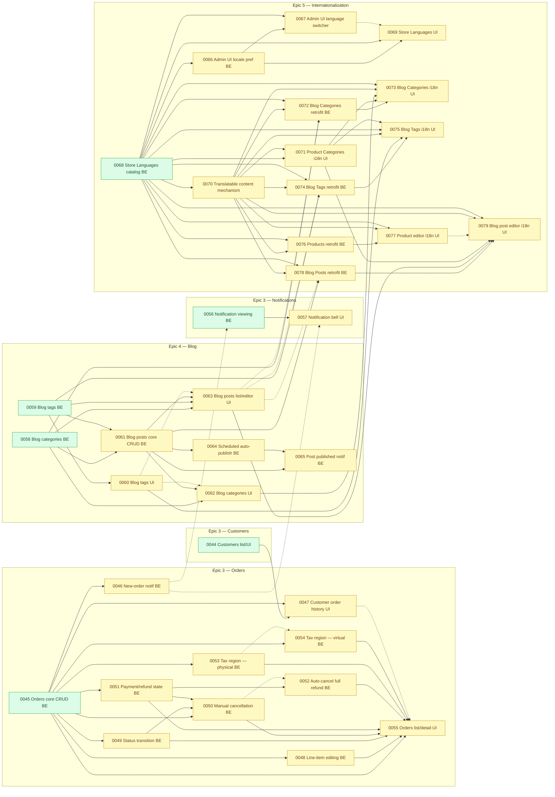

# Task Map — `ai-spec/tasks/` Inventory and Dependency Graph

**This file maps parallelization risk for pending work only.** `done/` tasks are intentionally
left out of the dependency graph below — a merged, closed task can only ever be a *satisfied*
dependency for something still pending, never a source of conflict for work still being
implemented, so drawing it as a node would only add clutter with no decision value.

Aggregated view of every task file under `ai-spec/tasks/` (the three-stage `ai-spec/tasks/` →
`ai-spec/tasks/in-progress/` → `ai-spec/tasks/done/` convention documented in
[`docs/workflow.md`](../docs/workflow.md)). **This file was originally a point-in-time,
manually-regenerated snapshot; it no longer is.** Per
[`docs/workflow.md`'s task-coordination-file regeneration step](../docs/workflow.md#regenerating-the-task-coordination-files),
`docs-keeper` now updates the affected part of this file on the same pass as the mandatory
link-integrity check, every time a task file is created, moves to `in-progress/`/`done/`, or has
its own "Dependencies" section edited — so it should reflect the real backlog rather than
needing a manual "is this stale" check. `docs/workflow.md`'s per-story `ai-spec/tasks/` files
remain the source of truth for any individual story's dependencies; this file only aggregates
and cross-references what those files already state — if the two ever disagree, the individual
task file is correct and this one needs a refresh.

As of this snapshot, `ai-spec/tasks/in-progress/` is empty again — two stories closed in parallel
on separate branches and are reconciled into this same regeneration pass together:
`0042-customers-soft-delete-backend.md` and `0043-customers-new-customer-notification-backend.md`
both completed Phase 7 and moved to `done/`. Together their closure freed `0044` (Customers list +
create/edit UI), `0045` (Orders core CRUD backend) and `0056` (Notification viewing backend) into
`ready` with no pending dependency left for any of the three (see the note under
[Pending tasks that are independent](#pending-tasks-that-are-independent-of-each-other-and-safe-to-parallelize)
for what else this closure unblocked). Every other task is either `done/` (closed, merged) or
still sitting directly in `ai-spec/tasks/` (not started). One additional file,
`ci-database-connection-gap.md`, lives
outside the `00XX-` numbering — it is an infrastructure fix (not a PRD-derived user story) and is
already marked `Status: fixed and fully documented` inside its own file, so it is listed for
completeness but excluded from the dependency graph and from the parallelization analysis below.

- **95 files total**: 94 numbered user stories (58 `done/`, 36 still in `ai-spec/tasks/`) + 1
  non-numbered infrastructure doc (already resolved).
- For a machine-readable, per-task claim registry that two parallel Claude Code sessions can use
  to coordinate against this same dependency data, see
  [`ai-spec/tasks-status.json`](tasks-status.json) and its companion protocol,
  [`ai-spec/tasks-coordination.md`](tasks-coordination.md).

## Table of contents

- [Inventory](#inventory)
  - [Done (58) — shipped, out of scope for this graph](#done-58--shipped-out-of-scope-for-this-graph)
  - [Pending — not started (36 numbered + 1 infra doc)](#pending--not-started-36-numbered--1-infra-doc)
- [Dependency graph (pending tasks only)](#dependency-graph-pending-tasks-only)
- [Analysis](#analysis)
  - [Pending tasks that are independent of each other and safe to parallelize](#pending-tasks-that-are-independent-of-each-other-and-safe-to-parallelize)
  - [Pending tasks that must be sequenced](#pending-tasks-that-must-be-sequenced)
  - [File/merge-conflict risk even where no formal dependency exists](#filemerge-conflict-risk-even-where-no-formal-dependency-exists)
  - [Scope and known limitations of this map](#scope-and-known-limitations-of-this-map)

## Inventory

### Done (58) — shipped, out of scope for this graph

Already merged into `main`/`finalproject-ARP` and closed via the workflow's Phase 7; see
[`ai-spec/tasks/done/`](tasks/done/) for each story's full file. Listed here only as IDs, grouped
by the epic area they belong to, since — per the note at the top of this file — none of them
appears as a node in the dependency graph below:

- **Epic 1 — Users, Roles & Auth (20):** 0001, 0002, 0003, 0004, 0005, 0006, 0006b, 0007, 0008,
  0008a, 0009, 0010, 0011, 0012, 0013, 0014, 0015, 0015a, 0015b, 0040.
- **Epic 2 — Products, Taxes, Media, Shipping (35):** 0016, 0017, 0018, 0019, 0019a, 0019b,
  0019c, 0019d, 0020, 0021, 0022, 0023, 0024, 0024a, 0024b, 0025, 0026, 0027, 0028, 0029, 0029a,
  0029b, 0030, 0030a, 0031, 0031a, 0032, 0033, 0034, 0035, 0036, 0037, 0038, 0039, 0080.
- **Epic 3 — Customers & Orders (3):** 0041 — the epic's foundation story (the first to close in
  this epic); its own three former dependents (0042, 0043, 0045) are re-derived against `done/`
  rather than against this pending list from here on. 0042 — Customers soft delete (backend), the
  second story to close in this epic; its own two former dependents (0044, 0047) are re-derived
  against `done/` from here on. 0043 — the "new customer" notification backend, the third story to
  close, and closed in parallel with 0042 on a separate branch, reconciled into this same
  regeneration pass; its own former dependents (0044, 0046, 0056, 0065) are likewise re-derived
  against `done/` from here on.

### Pending — not started (36 numbered + 1 infra doc)

| ID | Title | Epic area |
| --- | --- | --- |
| 0044 | Customers — list + create/edit UI | Epic 3 — Customers |
| 0045 | Orders core CRUD backend | Epic 3 — Orders |
| 0046 | Orders — "new order" notification (backend) | Epic 3 — Orders |
| 0047 | Customer detail — order history view UI | Epic 3 — Orders/Customers |
| 0048 | Order line-item editing backend | Epic 3 — Orders |
| 0049 | Order status transition backend | Epic 3 — Orders |
| 0050 | Order manual cancellation backend | Epic 3 — Orders |
| 0051 | Order payment/refund state backend | Epic 3 — Orders |
| 0052 | Order auto-cancel on full refund backend | Epic 3 — Orders |
| 0053 | Order tax Sales-Region resolution — physical products (backend) | Epic 3 — Orders |
| 0054 | Order tax Sales-Region resolution — virtual products (backend) | Epic 3 — Orders |
| 0055 | Orders list + detail/editor UI | Epic 3 — Orders |
| 0056 | Notification viewing — unread count, recent list, mark-as-read (backend) | Epic 3 — Notifications |
| 0057 | Notification bell UI — topbar dropdown, unread indicator, generic per-type rendering | Epic 3 — Notifications |
| 0058 | Blog categories — backend (table, model, create/rename/delete, name validation) | Epic 4 — Blog |
| 0059 | Blog tags — backend (table, model, create/rename/delete, find-or-create, name validation) | Epic 4 — Blog |
| 0060 | Blog tags — management screen (list, create/edit modal, unconditional delete) | Epic 4 — Blog |
| 0061 | Blog posts — core CRUD backend (+ the blog-category in-use delete guard) | Epic 4 — Blog |
| 0062 | Blog categories — management screen (list, create/edit modal, blocked delete) | Epic 4 — Blog |
| 0063 | Blog posts — list + editor UI | Epic 4 — Blog |
| 0064 | Scheduled post auto-publish — backend (the app's first scheduled command) | Epic 4 — Blog |
| 0065 | Blog post published — notification (backend) | Epic 4 — Blog |
| 0066 | Admin UI locale preference & resolution — backend | Epic 5 — i18n |
| 0067 | Admin UI language switcher — frontend | Epic 5 — i18n |
| 0068 | Store Languages catalog + the app's two default-locale settings | Epic 5 — i18n |
| 0069 | Store Languages settings screen — frontend | Epic 5 — i18n |
| 0070 | Translatable content mechanism — backend, piloted on Product Categories | Epic 5 — i18n |
| 0071 | Product Categories taxonomy screen — language tabs (frontend) | Epic 5 — i18n |
| 0072 | Translatable content retrofit — Blog Categories backend | Epic 5 — i18n |
| 0073 | Blog Categories screen — language tabs | Epic 5 — i18n |
| 0074 | Translatable content retrofit — Blog Tags backend | Epic 5 — i18n |
| 0075 | Blog Tags screen — language tabs | Epic 5 — i18n |
| 0076 | Translatable content retrofit — Products backend | Epic 5 — i18n |
| 0077 | Product editor — language tabs (UI) | Epic 5 — i18n |
| 0078 | Translatable content retrofit — Blog Posts backend | Epic 5 — i18n |
| 0079 | Blog post editor — language tabs (frontend) | Epic 5 — i18n |
| _(no number)_ | Infrastructure fix: no test suite can open a database connection (local fresh setup or CI) — **status: already fixed and documented**, kept out of the numbering and out of the dependency graph below | Infrastructure |

## Dependency graph (pending tasks only)

Edges were derived from each task file's own **"Dependencies"** (or, for Epic 5 files, **"5.
Dependencies, risks, open technical questions"**) section — hard/blocking dependencies, explicit
"depends on story NNNN" statements, and file-relative links to sibling task files. No dependency
below is inferred purely from task numbering; every edge quotes or paraphrases language the
source task file states about itself. A dependency on an already-`done` task (e.g. `0045`'s
mention of `done/0024`, `done/0029` and `done/0035`) is **not** drawn — it is already satisfied
and contributes nothing to a parallelization decision — which is why several nodes below have no
incoming edge at all even though their own task file lists real prerequisites: those
prerequisites are simply already shipped.

Two edge styles:

- **Solid arrow (`-->`)** — a hard/blocking dependency: the task file itself says Phase 3 cannot
  start, or a specific class/table/contract is consumed, before the upstream task is `done`.
- **Dashed arrow (`-.->`)** — a soft, informational, sibling, or "shares one file/artifact"
  relationship: explicitly called out in the task file, but not stated as blocking.

Nodes with **no incoming edge at all** (green, `ready` style) have every one of their real
prerequisites already in `done/` — nothing pending stands between them and Phase 3.



Legend: green (`ready`) = unblocked and unclaimed, safe to hand to a new session today; blue
(`claimed`) = unblocked but a session already has it (per
[`tasks-status.json`](tasks-status.json)) — do not start it without checking that registry first;
yellow (`pending`) = still blocked on at least one open pending dependency.

## Analysis

### Pending tasks that are independent of each other and safe to parallelize

These are the tasks whose **entire dependency chain is already `done/`** — nothing pending blocks
them — the six green `ready` nodes in the diagram above:

- **0044 — Customers list + create/edit UI.** Its two former dependencies, `0042` (Customers soft
  delete, backend) and `0043` (Customers "new customer" notification, backend), are now **both**
  `done/` — closed in parallel on separate branches and reconciled into this same regeneration
  pass. Depends on nothing else pending. Ready now.
- **0045 — Orders core CRUD backend.** Its own task file names six hard blockers —
  `done/0024`, `done/0029`, `done/0035`, `done/0036`, `done/0038` and `0041` — every one of which
  is now `done/`. No pending dependency remains at all; this is the biggest hub in the backlog
  (see [Pending tasks that must be sequenced](#pending-tasks-that-must-be-sequenced) below for what
  it in turn gates). **Now fully independent** — it used to carry a soft/informational
  `conflict_risk_with: ["0042"]` pairing (a mutual entry, `0042`'s own naming `0045` back), which
  resolved the moment `0042` itself closed, since a `done/` task can no longer be a live
  merge-conflict risk; `tasks-status.json`'s regenerated `0045` entry now carries an empty
  `conflict_risk_with`. Ready now.
- **0058 — Blog categories (backend).** "None inside Epic 4 for its schema, model, actions or
  policy… the foundational story the other blog stories build on." Ready now.
- **0059 — Blog tags (backend).** No hard dependency on 0058 in either direction (both depend only
  on already-shipped work plus `done/0022`'s `NormalizeForSearch`). Ready now.
- **0056 — Notification viewing (backend).** Its only dependency, `0043`, is now `done/` too —
  depends on nothing else pending. Touches `App\Models\User` (the unread-count/mark-as-read
  surface) and a new `app/Actions/Notifications/` namespace. Ready now.
- **0068 — Store Languages catalog (backend).** Depends only on `done/0002` (the
  `store-languages.*` permissions) and cites `done/0016`/`0017`/`0018` only as a *precedent*, not a
  code dependency. Ready now — and, being the root of the entire Epic 5 chain (every i18n story
  ultimately depends on it), it is also the single highest-leverage task to start first if only
  one of the six can be picked up immediately.

**0044, 0045, 0056 and 0068 are fully independent of each other and of 0058/0059** — no shared
files, no shared tables, and none of them appears in the other's `conflict_risk_with` set in
[`ai-spec/tasks-status.json`](tasks-status.json) (0056's own entry there names only `0046`, which
is still `blocked` and outside this set). All four can be dispatched to parallel
agents/worktrees today with no coordination needed beyond the project's usual per-branch worktree
isolation (see [`docs/testing/worktree-databases.md`](../docs/testing/worktree-databases.md)).
`0045` no longer needs the carve-out this file once gave it: its `conflict_risk_with` entry named
`0042` as a soft/informational risk (mutually, from `0042`'s own entry), and that risk resolved the
moment `0042` closed, since a `done/` task can no longer be a live merge-conflict risk —
`tasks-status.json`'s regenerated `0045` entry now carries an empty `conflict_risk_with`, which is
why it belongs in this fully-independent set rather than a separate one.

**0037, 0038, 0039, 0041, 0042 and 0043 already closed** (each went dependency-ready the moment its
own last blocker shipped — `0036` for `0037`, nothing pending at all for `0038`, `0038` for `0039`,
nothing pending at all for `0041`, `0041` for `0042`, `0041` for `0043` — was claimed via
`tasks-status.json` by
whichever session picked it up next, and is now in `done/` too) — a real, worked instance, six
times over, of why the JSON registry exists alongside this diagram: a task can turn
dependency-ready and get claimed by another session before this snapshot is regenerated, so the
JSON's live `status`/`claimed_by` is always the thing to check before dispatching a "ready" node
from here, never this diagram alone. **0041's own closure is what freed 0042 and 0043 into
`ready`; both have since closed too, in parallel on separate branches, and this regeneration pass
is what reconciles that pair of closures into one snapshot.** Combined, closing both freed `0044`
(both of its former dependencies, `0042` and `0043`, are now `done/`) and `0056` (its only former
dependency, `0043`, is now `done/`) into fully `ready` — with no pending dependency left for
either — while `0045` was already `ready` on its own (`0041` was its last blocker, independent of
0042/0043). `0046` and `0065` each also cited `0043` (`0046` as a hard blocker alongside a
still-pending `0045`; `0065` as a soft/informational one alongside two still-pending hard
blockers), so each dropped `0043` from its own `depends_on` array but stays `blocked` — `0046` on
`0045` alone now, `0065` on `0061` and `0064` — per
[workflow.md](../docs/workflow.md#regenerating-the-task-coordination-files)'s "recompute `status`
for every remaining task that named it as a dependency" rule, which recomputes a status, not
merely strips a satisfied id.

**0058 and 0059 are a softer case.** Neither blocks the other and both are ready today, but both
land inside `app/Actions/Blog/` (different files — `CreateBlogCategory`/`RenameBlogCategory`/
`DeleteBlogCategory` vs. `CreateBlogTag`/`RenameBlogTag`/`DeleteBlogTag`/`FindOrCreateBlogTag` —
so a git merge between them is mechanically safe) and both extend the same seeded `blog.*`
permission module and the same kind of `lang/en|es/blog.php` file. This is low risk (see
[File/merge-conflict risk](#filemerge-conflict-risk-even-where-no-formal-dependency-exists)) but
worth a quick coordination check (e.g. who creates `lang/{en,es}/blog.php` first) rather than
treating it as zero-risk parallelism.

Once those land, the same "ready" property propagates outward in a few places — **0037**, **0038**,
**0041**, **0042** and **0043** already did (per the note above), and that is what freed **0044**
and **0056** into `ready` too, alongside **0045** (already `ready` once `0041` closed, independent
of 0042/0043); **0046** will do the same the moment **0045** closes; **0065** the moment **both
0061 and 0064** close; the same will also happen for **0060** the moment **0059** closes,
**0066**/**0070**/**0071** the moment **0068** closes, and **0061** the moment **both 0058 and
0059** close — none of those is parallel-safe to a second session today, only sequential.

### Pending tasks that must be sequenced

The dependency graph above makes most of the backlog a strict sequencing problem rather than a
parallelization one. The major chains, in the order they must be executed:

1. **Customers → Orders (Epic 3).** `0041` (`done/`) unblocked `{0042, 0043}`; both have since
   closed too (`done/`) — in parallel on separate branches, reconciled into this same regeneration
   pass — so `0044` now has **zero remaining pending dependencies** of its own and sits `ready`
   above rather than sequenced behind anything. `0045` likewise has **zero remaining blockers**:
   all six of its former hard dependencies — `0041` plus
   `done/0024`/`done/0029`/`done/0035`/`done/0036`/`done/0038` — are now `done/`, so it too is
   `ready` above rather than merely sequenced behind this chain. `0045` is the single biggest hub
   in the backlog: it gates `0046`, `0047` (also needs `0044`, since a *ready* task is not yet a
   *done* one), `0048`, `0049`, `0050` (also needs `0049` and `0051`), `0051`, `0052` (via `0051`),
   `0053`, and `0054`. **`0055` (the Orders UI) is the epic's terminal node** — its own task file
   states Phase 3 cannot begin until **all eight** of `0045`, `0048`, `0049`, `0050`, `0051`,
   `0052`, `0053` and `0054` are `done`.
2. **Notifications (Epic 3).** `0043` (`done/`) is what unblocked `0056` — it is `ready` above with
   no pending dependency left at all; `0056 → 0057` next. `0046` remains a soft/informational
   (non-blocking) dependency of both `0056` and `0057` — it only makes their "two distinct
   notification types" test meaningful, it does not gate them.
3. **Blog (Epic 4).** `{0058, 0059} → 0061 → {0062, 0063, 0064 → 0065}`, with `0059 → 0060` running
   in parallel to `0061` (0060 only needs 0059) and `0062`/`0063` each also softly preferring
   `0060` to land first (it creates the `groups.blog` sidebar entry both reuse).
4. **Internationalization (Epic 5).** This is the most heavily sequenced part of the backlog, and
   it is **cross-epic**: every retrofit story blocks on `0068` (Store Languages catalog) and
   `0070` (the translatable-content mechanism, itself gated on `0068`), and each UI-facing i18n
   story additionally blocks on the Epic 4 backend story whose table it retrofits. The full
   strict order, as stated across several of these task files' own "Dependencies" sections:

   ```text
   0068 → 0066 → 0067          (admin UI locale preference, note the inverted numbering — 0066 needs
                                 0068's LocaleSetting piece even though 0066 < 0068 numerically)
   0068 → 0069                 (Store Languages settings UI)
   0068 → 0070 → 0071          (translatable-content mechanism, piloted + UI'd on Product Categories)
   0058 → 0061 → 0062 → 0068 → 0070 → 0071 → 0072 → 0073   (Blog Categories retrofit + i18n UI)
   0059 → 0061 → 0063 → 0068 → 0070 → 0074 → 0075          (Blog Tags retrofit + i18n UI, 0075 also
                                                              needs 0071's shared <x-language-tab-strip>)
   0068 → 0070 → 0076 → 0077                                (Products retrofit + i18n UI — 0024, the
                                                              table itself, is already done)
   0058 → 0059 → 0061 → 0063 → 0068 → 0070 → 0074 → 0078 → 0079   (Blog Posts retrofit + i18n UI)
   ```

   Two things worth calling out explicitly because they are easy to misread from the numbering
   alone: **(a)** `0066` genuinely depends on `0068` despite being numbered lower — this is a
   documented, deliberate exception to the project's usual "dependency is numbered below its
   dependent" convention, not an error in this map; **(b)** `0063` is listed as a (dashed, soft)
   dependency *of* `0072`/`0074`/`0078` in those files' own tables, but the direction that actually
   matters for scheduling is the reverse — `0063` must ship **before** those retrofit stories, so
   they have something to retrofit, and then `0063`'s own queries need a follow-up correction once
   each retrofit lands. It is drawn dashed in the graph to reflect that it is a "will need
   revisiting" relationship, not a blocking prerequisite.

### File/merge-conflict risk even where no formal dependency exists

Flagged explicitly in the source task files, even though no hard dependency edge connects the two
sides. Every pair below is also recorded, symmetrically, in each task's `conflict_risk_with` array
in [`ai-spec/tasks-status.json`](tasks-status.json):

- **`app/Policies/OrderPolicy.php` is written by five different Epic 3 stories** —
  `0049` (creates it), `0050`, `0051` (adds no ability per its own decision, but was in scope
  before that), `0052`, and `0055`. `0050`'s own file states in an explicit warning block: *"This
  story is not parallel-safe with 0049, 0051, 0052 or 0055 — they all write
  `app/Policies/OrderPolicy.php`."* Most of that cluster is already sequenced by a hard dependency
  edge (`0049 → 0050 → {0051, 0052} → 0055`), so the residual, *undeclared* risk is narrower than
  the whole five-way cluster: **`0049` ~ `0051`**, **`0049` ~ `0052`** and **`0050` ~ `0052`** are
  the pairs with no direct dependency edge between them, which is what the project's own
  [Parallel Agent File-Ownership Rule](../docs/contracts.md#parallel-agent-file-ownership-rule)
  exists to prevent two sessions from hitting at once.
- **`lang/{en,es}/orders.php` is written by `0045`, `0049`, `0050`, `0054` and `0055`** — different
  key groups in the same file each time, which is ordinary sequential maintenance where a hard
  dependency already orders the pair, and a real (if minor) conflict risk for the two pairs that
  are *not* already sequenced: **`0049` ~ `0054`** and **`0050` ~ `0054`**.
- **`App\Concerns\ResolvesSalesRegionFromAddress` is a create-if-absent shared trait between `0053`
  and `0054`.** Neither depends on the other, but whichever implementation phase runs first creates
  the file and the second must `use` it unchanged rather than duplicating it.
- **`app/Actions/Blog/` is shared by `0058` and `0059`** (see above) — different files, low risk,
  but worth a quick check on shared conventions (permission-constant naming, lang-file key groups)
  before dispatching both at once.
- **`0060` and `0062`/`0063` (Blog Tags UI vs. Blog Categories UI / Blog Posts list+editor UI)**
  each touch the shared blog sidebar registry (`config/modules.php`'s `groups.blog`) and
  `lang/{en,es}/blog.php` around the same point in the roadmap, without a formal dependency
  forcing an order.
- **`0062` and `0063` are also an explicit parallel-write hazard against each other**, per `0063`'s
  own dependency notes, for the same registry/lang-file reason.
- **The Epic 5 retrofit stories (`0072`, `0074`, `0076`, `0078`) all depend on the same pair,
  `0068` and `0070`**, and each also touches `config/modules.php` / `lang/{en,es}/*.php` for its
  own domain. They do not depend on each other and their tables are disjoint (blog categories vs.
  blog tags vs. products vs. blog posts), so once `0068`/`0070` are both closed, **these four
  retrofit stories are themselves a second, smaller "independent and parallelizable" cluster** —
  with the same caveat as 0058/0059 above about shared registry/lang files, all six pairs among
  them (`0072`~`0074`, `0072`~`0076`, `0072`~`0078`, `0074`~`0076`, `0074`~`0078`, `0076`~`0078`)
  recorded in the JSON registry.
- **`0067` and `0069` collide on the same rendered page** — the personal language switcher (0067)
  renders in the chrome of the Store Languages settings screen (0069), which the source task file
  calls out as *"a real assertion collision (R-3)"* even though 0069 does not depend on 0067's
  code.
- **`0046`/`0056`/`0057` and `0077`/`0079`** each carry one softer, non-file-overlap "informational"
  pairing already shown dashed in the graph (a shared-type test-realism concern for the first
  group, a "worked out the UI shape first" precedent for the second) — included in the JSON
  registry's `conflict_risk_with` for completeness, even though the practical collision risk is
  lower than the file-sharing cases above.

### Scope and known limitations of this map

- **The `done/` tasks are omitted from the graph entirely, on purpose** (see the note at the top of
  this file). They are still listed as flat IDs in the [inventory](#done-58--shipped-out-of-scope-for-this-graph)
  above and are still referenced by ID in this analysis' prose where they explain *why* a pending
  task has no incoming edge (i.e. all its real prerequisites already shipped) — but re-deriving a
  full internal dependency graph for 58 already-merged stories would not change anything actionable
  today, so it was not attempted.
- **Several pending task files themselves warn that their own dependency sections may be stale.**
  Many Epic 3/4/5 stories were composed before their prerequisites shipped, and each carries a
  self-aware note along the lines of *"this document goes stale while it waits… every name in this
  file is a reading aid, not a locator"* (a rule this project's own
  [`docs/errors-log.md`](../docs/errors-log-archive.md#a-deferred-storys-findings-were-claims-about-a-tree-that-no-longer-existed-and-one-of-them-would-have-reopened-a-bug-in-this-log--2026-08-23)
  states explicitly). This map inherits that caveat: **before actually starting a pending story,
  re-verify its own "Dependencies" section against `HEAD` rather than trusting this snapshot**,
  especially for any story more than a few positions deep in a chain (0055, 0073, 0079 in
  particular chain through seven or more prerequisites each).
- **One dependency in this map is already stale as written and is called out here rather than
  silently "corrected."** Story `0055`'s own file lists `done/0022` (the searchable multi-select
  component) as an unresolved *"soft dependency, worked around rather than waited on"* — but
  `0022` has since shipped and is in `done/`. No edge was ever drawn for it (it was never a hard
  blocker), but a Phase 2 re-read of `0055` should drop the interim workaround its `D-1` describes
  and use the real component instead.
- **The infra fix `ci-database-connection-gap.md`** is intentionally excluded from the graph — its
  own file's status banner confirms it was fixed and fully documented on 2026-08-26, so it blocks
  nothing today.
