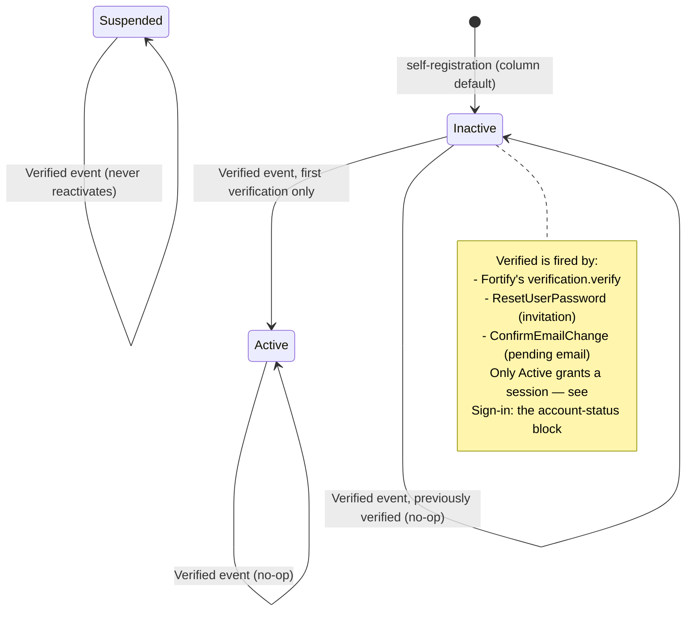
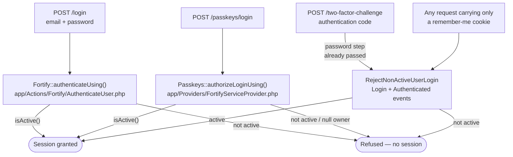
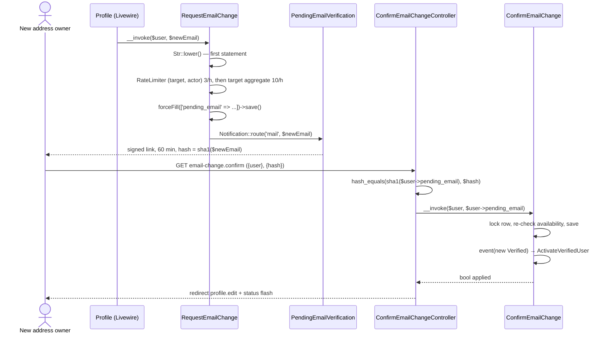
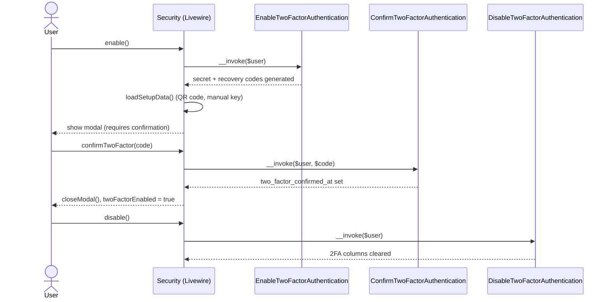

# Authentication

Cross-cutting concern — this is the single source of truth for how authentication, two-factor authentication, and passkeys work in this app. Other documents link here instead of re-explaining it.

## Table of Contents

- [Stack](#stack)
- [Enabled features](#enabled-features)
- [Registration & password reset](#registration--password-reset)
- [Account status and activation](#account-status-and-activation)
  - [A deleted account stops authenticating, by scope rather than by check](#a-deleted-account-stops-authenticating-by-scope-rather-than-by-check)
- [Sign-in: the account-status block](#sign-in-the-account-status-block)
  - [What the refusal does and does not disclose](#what-the-refusal-does-and-does-not-disclose)
  - [What is deliberately not covered](#what-is-deliberately-not-covered)
- [Pending email changes](#pending-email-changes)
- [Two-factor authentication flow](#two-factor-authentication-flow)
- [Passkeys](#passkeys)
- [Logout](#logout)
- [Where it lives](#where-it-lives)

## Stack

Authentication is handled by `laravel/fortify` (`^1.37.2`), configured in [`config/fortify.php`](../../config/fortify.php). Fortify owns the auth *routes and controllers*; this app supplies the *actions* and *Livewire UI*:

- `App\Actions\Fortify\CreateNewUser` implements `CreatesNewUsers`
- `App\Actions\Fortify\ResetUserPassword` implements `ResetsUserPasswords`
- `App\Models\User` implements `Laravel\Fortify\Contracts\PasskeyUser` and uses the `PasskeyAuthenticatable` and `TwoFactorAuthenticatable` traits

## Enabled features

From `config/fortify.php`:

```php
// config/fortify.php
Features::registration(),
Features::resetPasswords(),
Features::emailVerification(),
Features::twoFactorAuthentication([
    'confirm' => true,
    'confirmPassword' => true,
]),
Features::passkeys([
    'confirmPassword' => true,
]),
```

Both 2FA and passkeys require password re-confirmation before management (`confirmPassword` → the `password.confirm` middleware, applied on the `security.edit` route in `routes/settings.php`). 2FA additionally requires explicit confirmation (`confirm` → the user must submit a valid 6-digit code before it becomes active).

**Since task 0015a, Fortify's password-confirmation flow has a second consumer, and it is not an auth screen.** The Users backoffice screen requires a *recently* confirmed password before five privileged writes ("step-up authentication"), reading the same `auth.password_confirmed_at` session key against the same `config('auth.password_timeout')` — **no second timeout, no second confirmation flow, and no in-app password field.** Two consequences that belong to this page rather than to the authorization one:

- **`POST /user/confirm-password` (`password.confirm.store`) is now rate-limited by this app**, at 5/minute keyed by user id (falling back to IP), attached by [`App\Providers\FortifyServiceProvider::configurePasswordConfirmationRateLimiting()`](../../app/Providers/FortifyServiceProvider.php). Fortify's `routes.php` consults **no** `config('fortify.limiters.*')` key for this route — unlike `login`, `two-factor` and `passkeys` — so there is nothing to configure and the app appends the middleware to the already-registered route object from an `$this->app->booted()` callback. It shipped unthrottled and only became load-bearing when step-up made it the sole barrier in front of role/status/delete/promote/third-party-email changes. A throttled attempt is a bare **429** (Laravel's error page), not a worded inline message like `login`'s limiter produces.
- **The confirmation is session-scoped and does not survive a sign-out**, which is what makes it usable as a step-up control at all. Both logout paths here (`App\Livewire\Actions\Logout` and `App\Listeners\RejectNonActiveUserLogin`) call `Session::invalidate()`, which flushes the key — note that `SessionGuard::login()`'s `migrate(true)` regenerates the session **id** while keeping its data, so a logout that only called `Auth::logout()` would let the next user on that session inherit the previous one's confirmation. Neither path does; keep it that way.

What step-up protects, why it is an in-method check rather than route middleware, and why it is not a policy ability, belong to [architecture/authorization.md](authorization.md#step-up-authentication--the-third-layer) and [security/step-up-authentication.md](../security/step-up-authentication.md).

## Registration & password reset

Both actions validate with the shared traits in `app/Concerns/`, then mutate `User` directly — no service layer in between:

```php
// app/Actions/Fortify/CreateNewUser.php
public function create(array $input): User
{
    Validator::make($input, [
        ...$this->profileRules(),
        'password' => $this->passwordRules(),
    ])->validate();

    return User::create([
        'name' => $input['name'],
        'email' => $input['email'],
        'password' => $input['password'],
    ]);
}
```

```php
// app/Actions/Fortify/ResetUserPassword.php
public function reset(User $user, array $input): void
{
    Validator::make($input, [
        'password' => $this->passwordRules(),
    ])->validate();

    $wasUnverified = is_null($user->email_verified_at);

    $user->forceFill([
        'password' => $input['password'],
        ...($wasUnverified ? ['email_verified_at' => now()] : []),
    ])->save();

    if ($wasUnverified) {
        event(new Verified($user));
    }
}
```

The `$wasUnverified` branch is what makes this action double as the **invitation** path. Fortify's reset flow does not mark emails verified, so without it an invitee who set their password would stay `email_verified_at = null` forever — which would (a) leave them `Inactive` and therefore, since task 0007, permanently **unable to sign in at all** (see [Sign-in: the account-status block](#sign-in-the-account-status-block)), and (b) make them invisible to `RolePermissionSeeder`'s `whereNotNull('email_verified_at')` Super Admin lookup. An *already-verified* user doing a genuine forgot-password reset is untouched on both columns. The `Verified` event it fires is what performs the status transition — see [Account status and activation](#account-status-and-activation) below.

> The `save()` immediately above that `event(new Verified($user))` is load-bearing, and both this action and `ConfirmEmailChange` carry a comment saying so: `ActivateVerifiedUser` reads the pre-save `email_verified_at` out of `getPrevious()`, which the *next* dirty save would overwrite. Do not insert another `save()` between the write and the event.

Validation rules are centralized so every entry point (registration, password reset, profile update, in-settings password change) stays consistent:

- [`app/Concerns/ProfileValidationRules.php`](../../app/Concerns/ProfileValidationRules.php) — `name`/`email` rules, with a unique-email-ignoring-self variant for profile updates.
- [`app/Concerns/PasswordValidationRules.php`](../../app/Concerns/PasswordValidationRules.php) — `passwordRules()` (uses `Password::default()`) and `currentPasswordRules()` (uses the `current_password` rule).

### Two non-HTTP callers reuse this reset flow

Neither introduces a second password-setting mechanism: both mint a standard broker token and land the recipient on the existing `password.reset` route, where `ResetUserPassword` above runs unchanged.

| Caller | Token | Notification | Why |
| --- | --- | --- | --- |
| `RolePermissionSeeder::bootstrapSuperAdmin()` (provision branch) | `Password::broker()->sendResetLink([...])` | the framework's own `ResetPassword` | the operator claims the account through the normal **Forgot password** screen; no bespoke invite token, notification or route. See [authorization.md](authorization.md#super-admin-bootstrap) |
| [`App\Actions\Users\CreateUser`](../../app/Actions/Users/CreateUser.php) (task 0004) | `Password::broker()->createToken($user)` | [`App\Notifications\UserInvitation`](../../app/Notifications/UserInvitation.php) — **sent synchronously**, see below | an administrator creating a user needs *invitation* wording, not reset wording |

**`UserInvitation` does not implement `ShouldQueue`, and that is a security decision rather than a performance one** (task 0015, finding F9). It used to. The notification's constructor takes the broker token itself, so while it sat on the queue that token was serialized **in plaintext into a `jobs` row** — `QUEUE_CONNECTION=database` — where anyone with read access to the table held a working password-set link for a freshly created account. Sending synchronously matches Fortify's own `ResetPassword` and costs nothing operationally, since account creation is already an administrator-initiated, non-realtime action. Two things not to "tidy" here: `SerializesModels` stays (the notifiable is a model), and `CreateUser`'s `DB::afterCommit()` wrapper around the send is **unrelated** to queuing — it exists so a failed `syncRoles()` cannot mail an invitation for a rolled-back user, and it behaves identically for a synchronous send. `App\Notifications\PendingEmailVerification` **is** still queued, correctly: it carries no token, only a signed URL built at render time. **Rule: a notification whose constructor holds a credential must not be queued** — the queue is storage.

The split on that second row is deliberate and worth not undoing. `sendResetLink()` would have been the shorter call, but it bundles the framework's `ResetPassword` notification, whose wording can only be changed globally (`toMailUsing()`) — re-wording every genuine password reset in the app as a side effect. It is also subject to the 60-second `passwords.users.throttle`, which would silently no-op the second of two rapid account creations. Minting the token directly and attaching an own notification avoids both, while still producing a link to the same `password.reset` route.

An administrator-created account therefore starts with **a random unusable password, `email_verified_at = null`, and `pending_email = null`**: the address is the account's *initial* address, not a change, so the pending-email mechanism below does not apply to it. The invitation link is what proves the mailbox — completing it verifies the address and activates the account through the same `ResetUserPassword` → `Verified` → `ActivateVerifiedUser` chain as every other path.

> **Email addresses are canonically lowercase across the app**, now in three layers: `config/fortify.php` sets `'lowercase_usernames' => true` (registration, login, forgot-password); `App\Livewire\Settings\Profile` normalizes `$this->email` **before** `validate()` runs, so the uniqueness rule sees the value that will actually be stored; and `App\Actions\Users\RequestEmailChange` lowercases as its very first statement. `App\Models\User` additionally exposes a **read-only** lowercasing accessor on `email` — a consistency layer for rows that could already carry a mixed-case address, deliberately *not* a write mutator and no substitute for normalizing before validation (an accessor runs far too late for a uniqueness check). One consequence every test must respect: `$user->email` always returns lowercase, so an assertion about the *stored bytes* has to go through `$user->getRawOriginal('email')`.

## Account status and activation

Every account carries a `users.status`, cast to the backed string enum [`App\Enums\UserStatus`](../../app/Enums/UserStatus.php) (`Active` / `Inactive` / `Suspended`, whose `label()` resolves `__('users.statuses.*')` from `lang/en/users.php` and `lang/es/users.php`). The column defaults to `inactive` and is **not** mass-assignable — it is omitted from `User`'s `#[Fillable]`, so a profile form that posts a `status` field changes nothing.

The governing invariant is **no self-activation**: no account reaches `active` *by its own action* without its email being proven. Self-registration therefore lands on the column default (`inactive`), and the only automatic transition to `active` happens in one place — [`App\Listeners\ActivateVerifiedUser`](../../app/Listeners/ActivateVerifiedUser.php), wired to Laravel's `Illuminate\Auth\Events\Verified` event:

```php
// app/Providers/AppServiceProvider.php
protected function configureEventListeners(): void
{
    Event::listen(Verified::class, ActivateVerifiedUser::class);
}
```

```php
// app/Listeners/ActivateVerifiedUser.php
public function handle(Verified $event): void
{
    $user = $event->user;

    if (! $user instanceof User || $user->status !== UserStatus::Inactive) {
        return;
    }

    $previous = $user->getPrevious();

    $neverVerified = array_key_exists('email_verified_at', $previous) && is_null($previous['email_verified_at']);

    if (! $neverVerified) {
        return;
    }

    $user->status = UserStatus::Active;
    $user->save();
}
```

Three flows converge on this single listener rather than each re-implementing the rule — Fortify's own email verification, the invitation/reset path in `ResetUserPassword` (above), and the pending-email confirmation in `ConfirmEmailChange` (below):



**Three** guards in that listener are load-bearing and must survive any refactor. Since task 0007 they are not merely correctness details: `Inactive` now denies sign-in, so this listener is the only code in the app that can lift an administrator's block, and every guard below is a privilege-escalation control.

1. **`instanceof User`.** The `Verified` event's constructor has no native type hint, so a non-`User` authenticatable would otherwise reach `->status`.
2. **The `Inactive`-only condition.** This one protects `Suspended` (and makes the listener a no-op on an already-`Active` user) — it does **not**, on its own, stop a verification undoing an administrator's decision, because `Inactive` is equally a state an administrator can set from the Users editor. Getting that distinction wrong is exactly what guard 3 exists to fix.
3. **The `getPrevious()['email_verified_at']` never-verified check.** `Inactive` carries two meanings this schema does not distinguish — "has never proved their mailbox" (self-registration, invitation) and "an administrator turned this account off". Only the first is activation-worthy, and proof of mailbox control says nothing about the second. Without this check, a deactivated user could reactivate themselves with nothing but a still-valid pending-email link, which needs no session at all.

The pre-change value must come from **`getPrevious()`, never `getOriginal()`** — `Model::save()` ends in `finishSave()`, which calls `syncOriginal()` after every successful save, so by the time a listener runs `getOriginal()` already holds the value that was just written. The full derivation, the four constraints `getPrevious()` imposes (fail closed on an absent key, one dirty save between the write and the event, empty after an insert, lost by a queued listener), and the reason this is a security rule rather than a modelling nit are in [security/login-status-enforcement.md](../security/login-status-enforcement.md#status-is-now-an-access-control-state--every-inactive--active-transition-is-a-privilege-grant) — not repeated here.

> The invariant constrains **automatic** activation, not an administrator's authority. An administrator creating a user in the Users editor may deliberately set `Active` with the address still unverified; that is an authorized, human-audited act, not a self-activation.

`App\Models\User` does **not** implement `MustVerifyEmail` today (the import is commented out at the top of the file), so the `verified` middleware blocks nobody, on any route that carries it. Account usability is enforced by `status` at sign-in instead — see the next section.

### A deleted account stops authenticating, by scope rather than by check

Since task 0005, deleting a user soft-deletes the row (see [database/schema.md](../database/schema-users-auth.md#soft-deletes) for what that rewrites). Its effect on authentication is total and worth stating here, because **no code in `app/` refuses a deleted user's sign-in**: `Illuminate\Auth\EloquentUserProvider` resolves every credential lookup through `$model->newQuery()`, which applies the `SoftDeletingScope`. That one fact is why password login fails, an in-flight session stops authenticating on its next request, a remember-me cookie is inert, a password-reset or invitation link resolves no user, and the vendor passkey relation returns `null` for a trashed owner. Deletion is therefore an authentication control, not only a data state — treat any code that lifts the scope for a `User` accordingly. The rules that follow (including what must be added if a future login path stops going through the user provider) are in [security/soft-delete-patterns.md](../security/soft-delete-patterns.md#the-global-scope-is-the-sign-in-refusal--there-is-no-second-check).

## Sign-in: the account-status block

Since task 0007, `users.status` is an **authentication control**, not a label: only `Active` obtains a session. An `Inactive` or `Suspended` user is refused on every path that grants a *fresh* session, and is told the account is not active (`users.login.not_active`, one key for both statuses). Restoring the status to `Active` restores sign-in on the very next attempt — there is no cache to clear and no session to reset.

There is no single hook that covers this. Four vendor call sites grant a session, and enforcement is split across **three** points accordingly:



**1. `Fortify::authenticateUsing()` — email + password, including two-factor accounts.** [`App\Actions\Fortify\AuthenticateUser`](../../app/Actions/Fortify/AuthenticateUser.php) replaces `$guard->attempt()` for both Fortify pipes, so a two-factor account is refused *before* a challenge is ever offered and no `login.id` pending-challenge state is written:

```php
// app/Actions/Fortify/AuthenticateUser.php
if (! $user->isActive()) {
    throw ValidationException::withMessages([
        Fortify::username() => [__('users.login.not_active')],
    ]);
}

return $user;
```

Because it replaces `attempt()`, the action must redo everything `attempt()` did on the way to a `User` — it resolves and verifies credentials through the guard's own `UserProvider` (`retrieveByCredentials()` → `validateCredentials()` → `rehashPasswordIfRequired()`) rather than hand-rolling a `User::where()`. Two controls ride on that choice: the password rehash-on-login upgrade, and the `SoftDeletingScope` refusal described [above](#a-deleted-account-stops-authenticating-by-scope-rather-than-by-check), which lives entirely in the provider's query.

It is registered as an **instance**, which is not interchangeable with the class-string form used two lines above it:

```php
// app/Providers/FortifyServiceProvider.php
Fortify::resetUserPasswordsUsing(ResetUserPassword::class);
Fortify::createUsersUsing(CreateNewUser::class);
Fortify::authenticateUsing(app(AuthenticateUser::class));
```

Unlike the other two, `authenticateUsing()` stores the raw callable and later invokes it with `call_user_func($callback, $request)` — a bare class string is not a valid target there.

**2. `Passkeys::authorizeLoginUsing()` — passkey sign-in.** Passkey login has its own controller and never enters Fortify's pipeline, so point 1 does not reach it. This is the easiest of the three to ship a silent bypass on:

```php
// app/Providers/FortifyServiceProvider.php — configurePasskeys()
Passkeys::authorizeLoginUsing(
    fn (Request $request, ?User $user, Passkey $passkey): bool => $user !== null && ! $user->trashed() && $user->isActive()
);
```

The `?User` is required, not defensive style: `Passkeys::allowsLogin()` passes `$passkey->user` unchecked, and that `BelongsTo` is soft-delete-scoped, so it resolves `null` for a trashed owner. A non-nullable parameter turns a clean refusal into a `TypeError`.

**3. [`App\Listeners\RejectNonActiveUserLogin`](../../app/Listeners/RejectNonActiveUserLogin.php) — remember-me recall, and the mid-challenge race.** Registered on **two** events, alongside the activation listener:

```php
// app/Providers/AppServiceProvider.php
Event::listen(Login::class, RejectNonActiveUserLogin::class);
Event::listen(Authenticated::class, [RejectNonActiveUserLogin::class, 'handleAuthenticated']);
```

Two events, because one is not enough. `SessionGuard::login()` fires `Login` and then calls `setUser($user)` on the very next line, which resurrects a session the `Login` handler just logged out. So the `Login` handler is the real fix only for the recaller path (`SessionGuard::user()` fires `Login` last, with no `setUser()` after it, and the logout there also clears the recaller cookie and rotates `remember_token`); on every `$guard->login()` path it instead records the detected user's identifier on `request()->attributes`, and the `Authenticated` handler — which necessarily runs *inside* `setUser()` — performs the logout that sticks. That second hook is what closes the case of a user suspended *between* the password step and the two-factor code step, since Fortify's `TwoFactorAuthenticatedSessionController` resolves the challenged user from the session and never re-consults point 1.

One deliberate exemption: the `Login` handler skips a user with `wasRecentlyCreated === true`, so Fortify signing a freshly self-registered (and by design `Inactive`) account straight in still works. Registration is not sign-in, and every other path receives a model hydrated from an existing row, for which the flag is always `false`.

The mechanics behind all three — the vendor call-site map any *new* login mechanism must be checked against, why the refusal still counts toward the login rate limiter, why the `Authenticated` flag carries an identifier rather than a boolean, and why `forceLogout()` guards its `session()->invalidate()` — are documented once in [security/login-status-enforcement.md](../security/login-status-enforcement.md) and are not repeated here.

### What the refusal does and does not disclose

Telling a user the account is not active is a **deliberate, PRD-mandated disclosure**, kept narrow by two structural properties rather than by wording:

- **Credentials first, status second.** `AuthenticateUser` returns `null` for a bad email or password, which hands control back to Fortify's own failure path and produces the byte-identical `trans('auth.failed')` message an active account produces. The status message is reachable only by someone who already holds valid credentials.
- **The message names no status.** `users.login.not_active` is a single key covering both `Inactive` and `Suspended`, in [`lang/en/users.php`](../../lang/en/users.php) and [`lang/es/users.php`](../../lang/es/users.php) alike, and both files carry a comment saying it must stay that way.

### What is deliberately not covered

**An already-live session is not terminated.** Suspending a user prevents them obtaining a *new* session; a session they already hold survives until it expires. This is an accepted, human-confirmed scope boundary of task 0007, and it is why the `Authenticated` handler acts only when this same request's `Login` handler flagged the user — an ordinary subsequent request from a signed-in user fires `Authenticated` alone, and the listener is a no-op there. Terminating live sessions (per-request middleware, or deleting the user's `sessions` rows) is recorded as a follow-up story. The boundary is pinned by a test of its own — "an already-authenticated user who becomes non-active keeps their live session" in `tests/Feature/Auth/AuthenticationTest.php` — so a future change that leaks enforcement into per-request territory fails loudly rather than quietly breaking every `actingAs()`-based test.

## Pending email changes

Changing an email address **never** rewrites `users.email` on the spot. There are two callers today — the profile screen (`App\Livewire\Settings\Profile`) and, since task 0004, the administrative user editor via [`App\Actions\Users\UpdateUser`](../../app/Actions/Users/UpdateUser.php) — and they share **one** mechanism rather than each writing the column their own way. That holds in every direction: an administrator changing someone else's address, and an administrator changing their own, both go through it. The new address is parked in `users.pending_email` and a signed link goes to that address alone; only using the link applies it. This is the mechanism that closes the impersonation vector recorded in [errors-log.md](../errors-log.md): `users.email` **together with a non-null `email_verified_at`** now means the address has been proven, because no *change* to `users.email` can land without its own verification.



Real behavior worth knowing before touching any of it:

- **The link is address-bound, single-use, and expires in 60 minutes.** [`App\Notifications\PendingEmailVerification`](../../app/Notifications/PendingEmailVerification.php) (`ShouldQueue`, `SerializesModels`) builds it with `URL::temporarySignedRoute('email-change.confirm', now()->addMinutes(60), ['user' => $user->id, 'hash' => sha1($this->newEmail)])`. The `hash` is not decoration — it binds the link to one specific address, so replacing a pending address invalidates the outstanding link. 60 minutes matches the invitation/reset window (`passwords.users.expire`); `config/auth.php` is untouched.
- **Rate limiting lives in the action, not at the call site — and since task 0015 it is *two* limiters, not one.** Both throw the same `ValidationException` on the `email` field (`users.email_change.throttled`) **before** any write or send; without either, resubmitting a still-pending address (which passes validation every time, since the uniqueness rule ignores the caller's own row) drives unlimited mail at a third-party inbox.
  - **`'email-change:'.$user->getKey().':'.$actorKey` — 3 per hour, per (target, actor).** Checked first. The key used to name the *target* alone, which was correct while `Settings\Profile` was the only caller and target ≡ actor; task 0004's administrative editor made it a way for one administrator to spend a victim's own three attempts (finding F6). `$actorKey` is `Auth::id() ?? 'unauthenticated'` — never `$user->getKey()`, which would restore exactly that.
  - **`'email-change-target:'.$user->getKey()` — 10 per hour, aggregate**, preserving the inbox-flood ceiling the old key provided once the composite one stopped being a global cap. **Skipped entirely when the caller is the target themselves** (`$user->is(Auth::user())`): the aggregate caps *third-party* mail volume at one address, and letting administrator activity exhaust it would lock the target out of changing their own address — the very outcome the composite key exists to prevent. A self-service caller is therefore capped by the 3/hour composite limiter alone.
  The full reasoning, including why neither half of the fix works without the other and why checking the narrower limiter first is mandatory, is in [security/authorization-patterns.md](../security/authorization-patterns.md#a-rate-limit-keyed-on-the-target-alone-becomes-an-attack-on-the-target-the-moment-a-second-caller-exists). The confirmation route carries its own `throttle:6,1`.
- **Uniqueness spans both columns.** `App\Concerns\ProfileValidationRules::emailRules()` now adds `Rule::unique(User::class, 'pending_email')` alongside the `email` rule, so any screen reusing this trait cannot drift apart on what "this address is taken" means. Collisions that slip past validation and reach the unique index (SQLSTATE `23000`) are rethrown as a `ValidationException` on `email`, never a 500.
- **Refusals are redirects, not errors.** A tampered or expired link fails the `signed` middleware with a **403**; a still-validly-signed link whose address no longer matches (replayed, superseded, or cancelled) is refused one step later by the controller with a **redirect** to `profile.edit` carrying `users.email_change.refused`. Both refusal branches flash identical copy on purpose. `App\Livewire\Settings\Profile::mount()` reads that flashed `status` and surfaces it as a `Flux::toast()` (success or danger), matching how the rest of the Settings area reports feedback.
- **The confirmation route carries no `auth`.** What it proves is control of the mailbox, not a session — see [api/routes.md](../api/routes.md#app-owned-routes).

The security rules this flow established — the global `ValidateSignature`-before-`SubstituteBindings` middleware priority, why normalization must precede hashing, why `lockForUpdate()` plus an availability re-check still needs the unique index to have the last word, and why every refusal must be indistinguishable — are documented once in [security/signed-link-verification.md](../security/signed-link-verification.md) and are not repeated here.

### The action and its callers behave differently on a same-address submission — deliberately

This asymmetry is easy to mistake for a bug, so it is written down rather than rediscovered:

- **`RequestEmailChange` itself** treats a call whose address equals the user's current one as an **implicit cancel**: it clears any pending address and returns without sending anything. Anything calling the action directly hits this branch.
- **Neither real caller lets that branch run.** Both compare the submitted address against `getRawOriginal('email')` (lowercased on both sides) and call the action only when it genuinely differs — `App\Livewire\Settings\Profile` for the owner's own row, and `App\Actions\Users\UpdateUser` for the admin editor, whose guard reads:

```php
// app/Actions/Users/UpdateUser.php
$currentEmail = Str::lower((string) $user->getRawOriginal('email'));

if ($email !== $currentEmail) {
    $requestEmailChange($user, $email);
}
```

The profile screen's version of the same guard:

```php
// app/Livewire/Settings/Profile.php
if (Str::lower($validated['email']) !== Str::lower((string) $user->getRawOriginal('email'))) {
    $requestEmailChange($user, $validated['email']);
}

$this->email = $user->email;
```

Reason: on both forms the email field is always submitted, so a name-only save would resubmit the current stored address and silently cancel an unrelated pending change. Only the explicit Cancel control (`cancelEmailChange()`) may drop a pending change from the profile screen. The profile's trailing resync from `users.email` keeps the bound property from carrying a stale pending value into a later save.

> A related consequence on the admin editor: `UpdateUser` writes **name** (plus role and status, when the target is not the acting user) but never touches `email` or `email_verified_at` at all — those columns move only through `ConfirmEmailChange`. Editing another user's address leaves their account exactly as it was until the recipient uses the link.

## Two-factor authentication flow

Managed entirely from `App\Livewire\Settings\Security` ([`app/Livewire/Settings/Security.php`](../../app/Livewire/Settings/Security.php)), which composes four Fortify action classes injected per-method rather than one large service:



Notable real behavior (not aspirational):

- On `mount()`, if the feature requires confirmation but the user never completed it (`two_factor_confirmed_at` is null), the component proactively calls `DisableTwoFactorAuthentication` to clear the half-enabled state — see `app/Livewire/Settings/Security.php:79-82`.
- Recovery codes are managed by a separate component, [`app/Livewire/Settings/TwoFactor/RecoveryCodes.php`](../../app/Livewire/Settings/TwoFactor/RecoveryCodes.php), which decrypts `two_factor_recovery_codes` on mount and regenerates them via `Laravel\Fortify\Actions\GenerateNewRecoveryCodes`.
- `security.edit` (`routes/settings.php`) is gated by both `auth` and `verified` middleware groups plus `password.confirm` — see [api/routes.md](../api/routes.md).

## Passkeys

Passkey management (list, add, delete) lives in the same `Security` component, backed by `laravel/passkeys`:

```php
// app/Livewire/Settings/Security.php
public function deletePasskey(DeletePasskey $deletePasskey): void
{
    if (! $this->deletingPasskeyId) {
        return;
    }

    $user = Auth::user();
    $passkey = $user->passkeys()->findOrFail($this->deletingPasskeyId);

    $deletePasskey($user, $passkey);

    $this->closeDeleteModal();
    $this->loadPasskeys();
}
```

Passkeys are stored in the `passkeys` table (see [database/schema.md](../database/schema.md)). Discovery for password managers/OS integrations is exposed at a static route, not a Livewire component:

```php
// routes/settings.php
Route::get('.well-known/passkey-endpoints', function () {
    return response()->json([
        'enroll' => route('security.edit'),
        'manage' => route('security.edit'),
    ]);
})->name('well-known.passkeys');
```

## Logout

`App\Livewire\Actions\Logout` ([`app/Livewire/Actions/Logout.php`](../../app/Livewire/Actions/Logout.php)) is a single-purpose invokable action (not a Livewire component) — it guards, invalidates the session, and regenerates the CSRF token:

```php
// app/Livewire/Actions/Logout.php
public function __invoke(): Redirector|RedirectResponse
{
    Auth::guard('web')->logout();

    Session::invalidate();
    Session::regenerateToken();

    return redirect('/');
}
```

It's reused (not duplicated) by `DeleteUserForm::deleteUser()` before deleting the account:

```php
// app/Livewire/Settings/DeleteUserForm.php
public function deleteUser(Logout $logout): void
{
    $this->validate(['password' => $this->currentPasswordRules()]);

    tap(Auth::user(), $logout(...))->delete();

    $this->redirect('/', navigate: true);
}
```

## Where it lives

| Concern | Path |
| --- | --- |
| Fortify config | `config/fortify.php` |
| Register/reset actions | `app/Actions/Fortify/CreateNewUser.php`, `app/Actions/Fortify/ResetUserPassword.php` |
| Account status enum | `app/Enums/UserStatus.php`, plus `User::isActive()` in `app/Models/User.php` |
| Activation listener | `app/Listeners/ActivateVerifiedUser.php` (registered in `app/Providers/AppServiceProvider.php`) |
| Sign-in status check (password + 2FA) | `app/Actions/Fortify/AuthenticateUser.php` (registered in `app/Providers/FortifyServiceProvider.php::configureActions()`) |
| Sign-in status check (passkey) | `app/Providers/FortifyServiceProvider.php::configurePasskeys()` |
| Sign-in status check (remember-me, mid-challenge) | `app/Listeners/RejectNonActiveUserLogin.php` (registered on `Login` **and** `Authenticated` in `app/Providers/AppServiceProvider.php`) |
| Email-change actions | `app/Actions/Users/RequestEmailChange.php`, `app/Actions/Users/ConfirmEmailChange.php` |
| Email-change HTTP boundary | `app/Http/Controllers/ConfirmEmailChangeController.php`, route `email-change.confirm` in `routes/settings.php` |
| Email-change notification | `app/Notifications/PendingEmailVerification.php` |
| Status / sign-in / email-change copy | `lang/en/users.php`, `lang/es/users.php` |
| Profile settings UI | `app/Livewire/Settings/Profile.php`, `resources/views/livewire/settings/profile.blade.php` |
| Security settings UI | `app/Livewire/Settings/Security.php`, `resources/views/livewire/settings/security.blade.php` |
| Recovery codes UI | `app/Livewire/Settings/TwoFactor/RecoveryCodes.php` |
| Account deletion | `app/Livewire/Settings/DeleteUserForm.php` |
| Logout | `app/Livewire/Actions/Logout.php` |
| Shared validation | `app/Concerns/ProfileValidationRules.php`, `app/Concerns/PasswordValidationRules.php` |
| Password-confirmation freshness (step-up) | `app/Actions/Auth/EnsureRecentPasswordConfirmation.php`, `app/Exceptions/PasswordConfirmationRequiredException.php` |
| `password.confirm.store` rate limiter | `app/Providers/FortifyServiceProvider.php::configurePasswordConfirmationRateLimiting()` |
| 2FA columns migration | `database/migrations/2025_08_14_170933_add_two_factor_columns_to_users_table.php` |
| Status / pending-email migrations | `database/migrations/2026_08_11_175426_add_status_to_users_table.php`, `..._175427_add_pending_email_to_users_table.php` |
| Passkeys table migration | `database/migrations/2024_01_01_000000_create_passkeys_table.php` |
| Feature tests | `tests/Feature/Auth/**`, `tests/Feature/Actions/Auth/**`, `tests/Feature/Settings/SecurityTest.php`, `tests/Feature/Settings/EmailChangeTest.php` |
| Unit tests | `tests/Unit/Enums/UserStatusTest.php`, `tests/Unit/Listeners/ActivateVerifiedUserTest.php`, `tests/Unit/Models/UserTest.php`, `tests/Unit/Actions/Auth/**`, `tests/Unit/Exceptions/PasswordConfirmationRequiredExceptionTest.php` |

_Last updated: 2026-08-24 — Task 0015a (step-up authentication for privileged Users actions). **No authentication flow changed** — no new route, guard, action registration or `config/fortify.php` feature. What changed is that Fortify's password-confirmation flow acquired a **second consumer outside the auth screens**, and two facts about it belong to this page rather than to the authorization one: `POST /user/confirm-password` is now rate-limited **by this app** (5/min, keyed like Fortify's `login` limiter) because Fortify's `routes.php` consults no `config('fortify.limiters.*')` key for that route, so there was nothing to configure and nothing to make its absence loud; and the confirmation's session scoping — including why `SessionGuard::login()`'s `migrate(true)` would have let a session inherit the previous user's confirmation had either logout path skipped `Session::invalidate()` — is what makes the key usable as a step-up control at all. Added to **Enabled features**, beneath the existing `confirmPassword` paragraph, with four **Where it lives** additions. Verified as unchanged rather than assumed: the registration/reset flow, the account-status block and its three enforcement points, the pending-email mechanism and its two limiters (task 0015's, untouched here), the 2FA and passkey flows, and the logout section._

_Previously: 2026-08-24 — Task 0015 (Users CRUD security hardening), found by re-reading this page against the story's real diff rather than by its Definition of Done, which does not name this file. Three statements here were falsified. (1) The two-non-HTTP-callers table marked [`UserInvitation`](../../app/Notifications/UserInvitation.php) as `ShouldQueue`; it no longer is (finding F9 — the constructor holds a `Password::broker()` token, which a queued send serialized in plaintext into a `jobs` row), and a new paragraph records why, what must not be "tidied" alongside it (`SerializesModels`, and `CreateUser`'s unrelated `DB::afterCommit()`), and why `PendingEmailVerification` is still correctly queued (no credential in its constructor — the signed URL is built in `toMail()`). (2) The pending-email sequence diagram's `RateLimiter 3/hour per user` step. (3) The rate-limiting bullet, which described a single limiter keyed on the target and stated that "every present and future caller shares one budget per account" — precisely the property finding F6 removed. Both now describe the shipped two-limiter design, including the self-service exemption on the aggregate ceiling (re-audit finding F-A); the reasoning behind it lives in [security/authorization-patterns.md](../security/authorization-patterns.md#a-rate-limit-keyed-on-the-target-alone-becomes-an-attack-on-the-target-the-moment-a-second-caller-exists) and is pointed at rather than duplicated. Nothing about the authentication *flows* themselves changed in this story._

_Previously: 2026-08-17 — Task 0007 (non-active status blocks sign-in): added the **Sign-in: the account-status block** section covering all three enforcement points (`Fortify::authenticateUsing()` for password/2FA, `Passkeys::authorizeLoginUsing()` for passkeys, and the `Login`/`Authenticated` listener pair for remember-me and the mid-challenge race), what the refusal discloses, and the deliberate live-session scope boundary. Also corrected three stale statements this story invalidated: the "once the sign-in block story lands" future tense in the invitation note, the `ActivateVerifiedUser` code quote (which predated the `getPrevious()` guard), and the claim that the listener's `Inactive`-only condition is what stops a verification undoing an administrator's decision — it covers `Suspended`, and the never-verified check is what covers `Inactive`._

_Previously: 2026-08-14 — Task 0005: recorded that a soft-deleted account stops authenticating on every path, and that the refusal comes from the `SoftDeletingScope` in the user provider rather than from any check in `app/`._

_Previously: 2026-08-13 — Task 0004: documented the second non-HTTP caller of the reset flow (`CreateUser` + the `UserInvitation` notification, and why it mints its own token instead of calling `sendResetLink()`), and corrected the pending-email section, which still described the administrative user editor as hypothetical and claimed it would hit the action's implicit-cancel branch — it exists, and it guards against a same-address submission exactly as the profile screen does._
