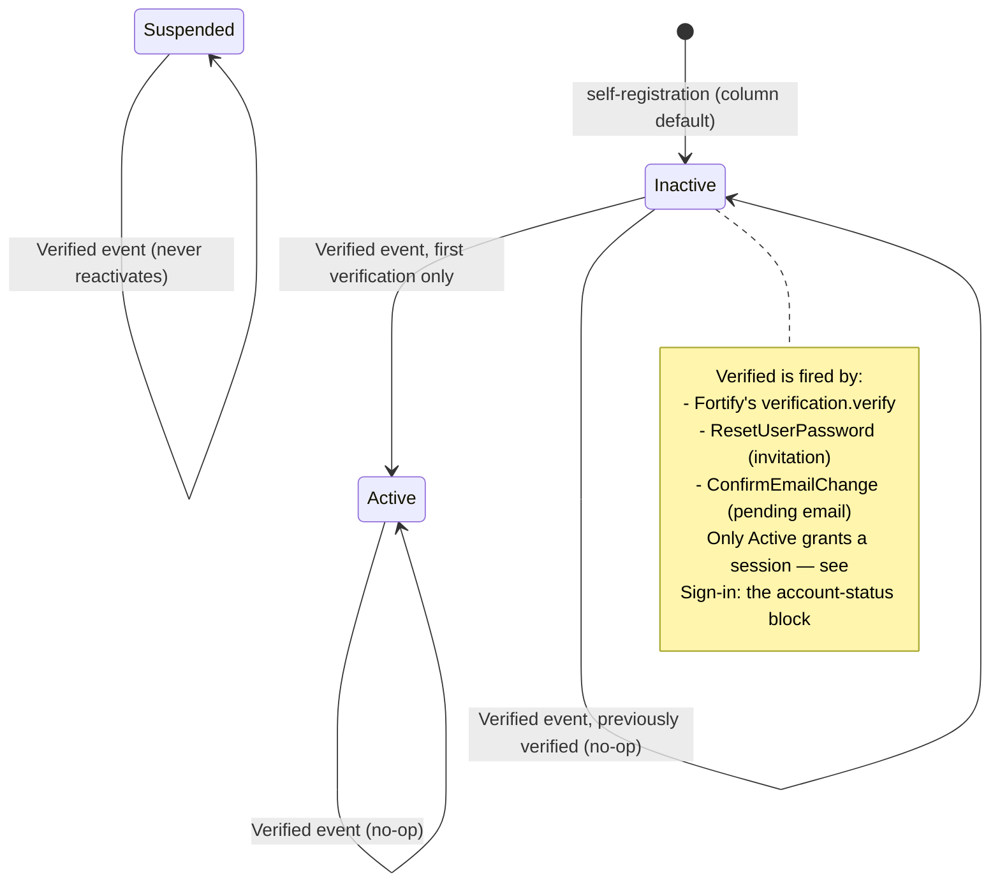

# Authentication — Features, registration, account status

> Part of [Authentication](../authentication.md). **Read this part when:** you touch enabled Fortify features, registration/password reset, or the account lifecycle (`users.status`, activation). The other parts are listed in the [hub](../authentication.md#table-of-contents).

## Stack

Authentication is handled by `laravel/fortify` (`^1.37.2`), configured in [`config/fortify.php`](../../../config/fortify.php). Fortify owns the auth *routes and controllers*; this app supplies the *actions* and *Livewire UI*:

- `App\Actions\Fortify\CreateNewUser` implements `CreatesNewUsers`
- `App\Actions\Fortify\ResetUserPassword` implements `ResetsUserPasswords`
- `App\Models\User` implements `Laravel\Fortify\Contracts\PasskeyUser` and uses the `PasskeyAuthenticatable` and `TwoFactorAuthenticatable` traits

## Enabled features

From `config/fortify.php`:

```php
// config/fortify.php
Features::registration(),
Features::resetPasswords(),
Features::emailVerification(),
Features::twoFactorAuthentication([
    'confirm' => true,
    'confirmPassword' => true,
]),
Features::passkeys([
    'confirmPassword' => true,
]),
```

Both 2FA and passkeys require password re-confirmation before management (`confirmPassword` → the `password.confirm` middleware, applied on the `security.edit` route in `routes/settings.php`). 2FA additionally requires explicit confirmation (`confirm` → the user must submit a valid 6-digit code before it becomes active).

**Since task 0015a, Fortify's password-confirmation flow has a second consumer, and it is not an auth screen.** The Users backoffice screen requires a *recently* confirmed password before five privileged writes ("step-up authentication"), reading the same `auth.password_confirmed_at` session key against the same `config('auth.password_timeout')` — **no second timeout, no second confirmation flow, and no in-app password field.** Two consequences that belong to this page rather than to the authorization one:

- **`POST /user/confirm-password` (`password.confirm.store`) is now rate-limited by this app**, at 5/minute keyed by user id (falling back to IP), attached by [`App\Providers\FortifyServiceProvider::configurePasswordConfirmationRateLimiting()`](../../../app/Providers/FortifyServiceProvider.php). Fortify's `routes.php` consults **no** `config('fortify.limiters.*')` key for this route — unlike `login`, `two-factor` and `passkeys` — so there is nothing to configure and the app appends the middleware to the already-registered route object from an `$this->app->booted()` callback. It shipped unthrottled and only became load-bearing when step-up made it the sole barrier in front of role/status/delete/promote/third-party-email changes. A throttled attempt is a bare **429** (Laravel's error page), not a worded inline message like `login`'s limiter produces.
- **The confirmation is session-scoped and does not survive a sign-out**, which is what makes it usable as a step-up control at all. Both logout paths here (`App\Livewire\Actions\Logout` and `App\Listeners\RejectNonActiveUserLogin`) call `Session::invalidate()`, which flushes the key — note that `SessionGuard::login()`'s `migrate(true)` regenerates the session **id** while keeping its data, so a logout that only called `Auth::logout()` would let the next user on that session inherit the previous one's confirmation. Neither path does; keep it that way.

What step-up protects, why it is an in-method check rather than route middleware, and why it is not a policy ability, belong to [architecture/authorization.md](../authorization/step-up-and-refusal-logging.md#step-up-authentication--the-third-layer) and [security/step-up-authentication.md](../../security/step-up-authentication.md).

## Registration & password reset

Both actions validate with the shared traits in `app/Concerns/`, then mutate `User` directly — no service layer in between:

```php
// app/Actions/Fortify/CreateNewUser.php
public function create(array $input): User
{
    Validator::make($input, [
        ...$this->profileRules(),
        'password' => $this->passwordRules(),
    ])->validate();

    return User::create([
        'name' => $input['name'],
        'email' => $input['email'],
        'password' => $input['password'],
    ]);
}
```

```php
// app/Actions/Fortify/ResetUserPassword.php
public function reset(User $user, array $input): void
{
    Validator::make($input, [
        'password' => $this->passwordRules(),
    ])->validate();

    $wasUnverified = is_null($user->email_verified_at);

    $user->forceFill([
        'password' => $input['password'],
        ...($wasUnverified ? ['email_verified_at' => now()] : []),
    ])->save();

    if ($wasUnverified) {
        event(new Verified($user));
    }
}
```

The `$wasUnverified` branch is what makes this action double as the **invitation** path. Fortify's reset flow does not mark emails verified, so without it an invitee who set their password would stay `email_verified_at = null` forever — which would (a) leave them `Inactive` and therefore, since task 0007, permanently **unable to sign in at all** (see [Sign-in: the account-status block](sign-in-block-and-email-change.md#sign-in-the-account-status-block)), and (b) make them invisible to `RolePermissionSeeder`'s `whereNotNull('email_verified_at')` Super Admin lookup. An *already-verified* user doing a genuine forgot-password reset is untouched on both columns. The `Verified` event it fires is what performs the status transition — see [Account status and activation](#account-status-and-activation) below.

> The `save()` immediately above that `event(new Verified($user))` is load-bearing, and both this action and `ConfirmEmailChange` carry a comment saying so: `ActivateVerifiedUser` reads the pre-save `email_verified_at` out of `getPrevious()`, which the *next* dirty save would overwrite. Do not insert another `save()` between the write and the event.

Validation rules are centralized so every entry point (registration, password reset, profile update, in-settings password change) stays consistent:

- [`app/Concerns/ProfileValidationRules.php`](../../../app/Concerns/ProfileValidationRules.php) — `name`/`email` rules, with a unique-email-ignoring-self variant for profile updates.
- [`app/Concerns/PasswordValidationRules.php`](../../../app/Concerns/PasswordValidationRules.php) — `passwordRules()` (uses `Password::default()`) and `currentPasswordRules()` (uses the `current_password` rule).

### Two non-HTTP callers reuse this reset flow

Neither introduces a second password-setting mechanism: both mint a standard broker token and land the recipient on the existing `password.reset` route, where `ResetUserPassword` above runs unchanged.

| Caller | Token | Notification | Why |
| --- | --- | --- | --- |
| `RolePermissionSeeder::bootstrapSuperAdmin()` (provision branch) | `Password::broker()->sendResetLink([...])` | the framework's own `ResetPassword` | the operator claims the account through the normal **Forgot password** screen; no bespoke invite token, notification or route. See [authorization.md](../authorization/overview-catalog-seeding.md#super-admin-bootstrap) |
| [`App\Actions\Users\CreateUser`](../../../app/Actions/Users/CreateUser.php) (task 0004) | `Password::broker()->createToken($user)` | [`App\Notifications\UserInvitation`](../../../app/Notifications/UserInvitation.php) — **sent synchronously**, see below | an administrator creating a user needs *invitation* wording, not reset wording |

**`UserInvitation` does not implement `ShouldQueue`, and that is a security decision rather than a performance one** (task 0015, finding F9). It used to. The notification's constructor takes the broker token itself, so while it sat on the queue that token was serialized **in plaintext into a `jobs` row** — `QUEUE_CONNECTION=database` — where anyone with read access to the table held a working password-set link for a freshly created account. Sending synchronously matches Fortify's own `ResetPassword` and costs nothing operationally, since account creation is already an administrator-initiated, non-realtime action. Two things not to "tidy" here: `SerializesModels` stays (the notifiable is a model), and `CreateUser`'s `DB::afterCommit()` wrapper around the send is **unrelated** to queuing — it exists so a failed `syncRoles()` cannot mail an invitation for a rolled-back user, and it behaves identically for a synchronous send. `App\Notifications\PendingEmailVerification` **is** still queued, correctly: it carries no token, only a signed URL built at render time. **Rule: a notification whose constructor holds a credential must not be queued** — the queue is storage.

The split on that second row is deliberate and worth not undoing. `sendResetLink()` would have been the shorter call, but it bundles the framework's `ResetPassword` notification, whose wording can only be changed globally (`toMailUsing()`) — re-wording every genuine password reset in the app as a side effect. It is also subject to the 60-second `passwords.users.throttle`, which would silently no-op the second of two rapid account creations. Minting the token directly and attaching an own notification avoids both, while still producing a link to the same `password.reset` route.

An administrator-created account therefore starts with **a random unusable password, `email_verified_at = null`, and `pending_email = null`**: the address is the account's *initial* address, not a change, so the pending-email mechanism below does not apply to it. The invitation link is what proves the mailbox — completing it verifies the address and activates the account through the same `ResetUserPassword` → `Verified` → `ActivateVerifiedUser` chain as every other path.

> **Email addresses are canonically lowercase across the app**, now in three layers: `config/fortify.php` sets `'lowercase_usernames' => true` (registration, login, forgot-password); `App\Livewire\Settings\Profile` normalizes `$this->email` **before** `validate()` runs, so the uniqueness rule sees the value that will actually be stored; and `App\Actions\Users\RequestEmailChange` lowercases as its very first statement. `App\Models\User` additionally exposes a **read-only** lowercasing accessor on `email` — a consistency layer for rows that could already carry a mixed-case address, deliberately *not* a write mutator and no substitute for normalizing before validation (an accessor runs far too late for a uniqueness check). One consequence every test must respect: `$user->email` always returns lowercase, so an assertion about the *stored bytes* has to go through `$user->getRawOriginal('email')`.

## Account status and activation

Every account carries a `users.status`, cast to the backed string enum [`App\Enums\UserStatus`](../../../app/Enums/UserStatus.php) (`Active` / `Inactive` / `Suspended`, whose `label()` resolves `__('users.statuses.*')` from `lang/en/users.php` and `lang/es/users.php`). The column defaults to `inactive` and is **not** mass-assignable — it is omitted from `User`'s `#[Fillable]`, so a profile form that posts a `status` field changes nothing.

The governing invariant is **no self-activation**: no account reaches `active` *by its own action* without its email being proven. Self-registration therefore lands on the column default (`inactive`), and the only automatic transition to `active` happens in one place — [`App\Listeners\ActivateVerifiedUser`](../../../app/Listeners/ActivateVerifiedUser.php), wired to Laravel's `Illuminate\Auth\Events\Verified` event by listener auto-discovery (its public `handle(Verified $event)`); it is not registered by hand, and delivering `Verified` to the same user twice leaves the account exactly as one delivery would.

```php
// app/Listeners/ActivateVerifiedUser.php
public function handle(Verified $event): void
{
    $user = $event->user;

    if (! $user instanceof User || $user->status !== UserStatus::Inactive) {
        return;
    }

    $previous = $user->getPrevious();

    $neverVerified = array_key_exists('email_verified_at', $previous) && is_null($previous['email_verified_at']);

    if (! $neverVerified) {
        return;
    }

    $user->status = UserStatus::Active;
    $user->save();
}
```

Three flows converge on this single listener rather than each re-implementing the rule — Fortify's own email verification, the invitation/reset path in `ResetUserPassword` (above), and the pending-email confirmation in `ConfirmEmailChange` (below):



**Three** guards in that listener are load-bearing and must survive any refactor. Since task 0007 they are not merely correctness details: `Inactive` now denies sign-in, so this listener is the only code in the app that can lift an administrator's block, and every guard below is a privilege-escalation control.

1. **`instanceof User`.** The `Verified` event's constructor has no native type hint, so a non-`User` authenticatable would otherwise reach `->status`.
2. **The `Inactive`-only condition.** This one protects `Suspended` (and makes the listener a no-op on an already-`Active` user) — it does **not**, on its own, stop a verification undoing an administrator's decision, because `Inactive` is equally a state an administrator can set from the Users editor. Getting that distinction wrong is exactly what guard 3 exists to fix.
3. **The `getPrevious()['email_verified_at']` never-verified check.** `Inactive` carries two meanings this schema does not distinguish — "has never proved their mailbox" (self-registration, invitation) and "an administrator turned this account off". Only the first is activation-worthy, and proof of mailbox control says nothing about the second. Without this check, a deactivated user could reactivate themselves with nothing but a still-valid pending-email link, which needs no session at all.

The pre-change value must come from **`getPrevious()`, never `getOriginal()`** — `Model::save()` ends in `finishSave()`, which calls `syncOriginal()` after every successful save, so by the time a listener runs `getOriginal()` already holds the value that was just written. The full derivation, the four constraints `getPrevious()` imposes (fail closed on an absent key, one dirty save between the write and the event, empty after an insert, lost by a queued listener), and the reason this is a security rule rather than a modelling nit are in [security/login-status-enforcement.md](../../security/login-status-enforcement.md#status-is-now-an-access-control-state--every-inactive--active-transition-is-a-privilege-grant) — not repeated here.

> The invariant constrains **automatic** activation, not an administrator's authority. An administrator creating a user in the Users editor may deliberately set `Active` with the address still unverified; that is an authorized, human-audited act, not a self-activation.

`App\Models\User` does **not** implement `MustVerifyEmail` today (the import is commented out at the top of the file), so the `verified` middleware blocks nobody, on any route that carries it. Account usability is enforced by `status` at sign-in instead — see the next section.

### A deleted account stops authenticating, by scope rather than by check

Since task 0005, deleting a user soft-deletes the row (see [database/schema.md](../../database/schema-users-auth.md#soft-deletes) for what that rewrites). Its effect on authentication is total and worth stating here, because **no code in `app/` refuses a deleted user's sign-in**: `Illuminate\Auth\EloquentUserProvider` resolves every credential lookup through `$model->newQuery()`, which applies the `SoftDeletingScope`. That one fact is why password login fails, an in-flight session stops authenticating on its next request, a remember-me cookie is inert, a password-reset or invitation link resolves no user, and the vendor passkey relation returns `null` for a trashed owner. Deletion is therefore an authentication control, not only a data state — treat any code that lifts the scope for a `User` accordingly. The rules that follow (including what must be added if a future login path stops going through the user provider) are in [security/soft-delete-patterns.md](../../security/soft-delete-patterns.md#the-global-scope-is-the-sign-in-refusal--there-is-no-second-check).
