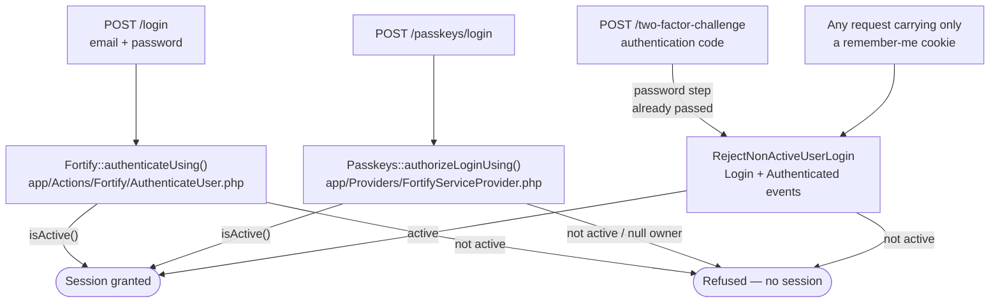
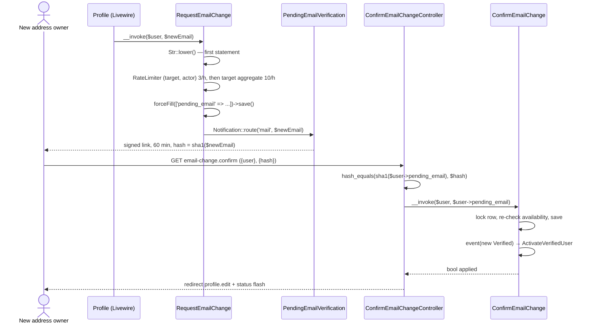

# Authentication — Sign-in block and pending email changes

> Part of [Authentication](../authentication.md). **Read this part when:** you touch the sign-in account-status block or the pending-email change mechanism. The other parts are listed in the [hub](../authentication.md#table-of-contents).

## Sign-in: the account-status block

Since task 0007, `users.status` is an **authentication control**, not a label: only `Active` obtains a session. An `Inactive` or `Suspended` user is refused on every path that grants a *fresh* session, and is told the account is not active (`users.login.not_active`, one key for both statuses). Restoring the status to `Active` restores sign-in on the very next attempt — there is no cache to clear and no session to reset.

There is no single hook that covers this. Four vendor call sites grant a session, and enforcement is split across **three** points accordingly:



**1. `Fortify::authenticateUsing()` — email + password, including two-factor accounts.** [`App\Actions\Fortify\AuthenticateUser`](../../../app/Actions/Fortify/AuthenticateUser.php) replaces `$guard->attempt()` for both Fortify pipes, so a two-factor account is refused *before* a challenge is ever offered and no `login.id` pending-challenge state is written:

```php
// app/Actions/Fortify/AuthenticateUser.php
if (! $user->isActive()) {
    throw ValidationException::withMessages([
        Fortify::username() => [__('users.login.not_active')],
    ]);
}

return $user;
```

Because it replaces `attempt()`, the action must redo everything `attempt()` did on the way to a `User` — it resolves and verifies credentials through the guard's own `UserProvider` (`retrieveByCredentials()` → `validateCredentials()` → `rehashPasswordIfRequired()`) rather than hand-rolling a `User::where()`. Two controls ride on that choice: the password rehash-on-login upgrade, and the `SoftDeletingScope` refusal described [above](features-registration-and-status.md#a-deleted-account-stops-authenticating-by-scope-rather-than-by-check), which lives entirely in the provider's query.

It is registered as an **instance**, which is not interchangeable with the class-string form used two lines above it:

```php
// app/Providers/FortifyServiceProvider.php
Fortify::resetUserPasswordsUsing(ResetUserPassword::class);
Fortify::createUsersUsing(CreateNewUser::class);
Fortify::authenticateUsing(app(AuthenticateUser::class));
```

Unlike the other two, `authenticateUsing()` stores the raw callable and later invokes it with `call_user_func($callback, $request)` — a bare class string is not a valid target there.

**2. `Passkeys::authorizeLoginUsing()` — passkey sign-in.** Passkey login has its own controller and never enters Fortify's pipeline, so point 1 does not reach it. This is the easiest of the three to ship a silent bypass on:

```php
// app/Providers/FortifyServiceProvider.php — configurePasskeys()
Passkeys::authorizeLoginUsing(
    fn (Request $request, ?User $user, Passkey $passkey): bool => $user !== null && ! $user->trashed() && $user->isActive()
);
```

The `?User` is required, not defensive style: `Passkeys::allowsLogin()` passes `$passkey->user` unchecked, and that `BelongsTo` is soft-delete-scoped, so it resolves `null` for a trashed owner. A non-nullable parameter turns a clean refusal into a `TypeError`.

**3. [`App\Listeners\RejectNonActiveUserLogin`](../../../app/Listeners/RejectNonActiveUserLogin.php) — remember-me recall, and the mid-challenge race.** Registered on **two** events, alongside the activation listener, and by discovery rather than by hand: Laravel auto-discovers the `Login` handler from `handle(Login $event)` and the `Authenticated` handler from `handleAuthenticated(Authenticated $event)`, so `AppServiceProvider` registers neither. The `handle*` method name is load-bearing — rename `handleAuthenticated` and the safety net is silently unregistered; `tests/Feature/Providers/EventListenerRegistrationTest.php` fails if either binding is lost or doubled.

Two events, because one is not enough. `SessionGuard::login()` fires `Login` and then calls `setUser($user)` on the very next line, which resurrects a session the `Login` handler just logged out. So the `Login` handler is the real fix only for the recaller path (`SessionGuard::user()` fires `Login` last, with no `setUser()` after it, and the logout there also clears the recaller cookie and rotates `remember_token`); on every `$guard->login()` path it instead records the detected user's identifier on `request()->attributes`, and the `Authenticated` handler — which necessarily runs *inside* `setUser()` — performs the logout that sticks. That second hook is what closes the case of a user suspended *between* the password step and the two-factor code step, since Fortify's `TwoFactorAuthenticatedSessionController` resolves the challenged user from the session and never re-consults point 1.

One deliberate exemption: the `Login` handler skips a user with `wasRecentlyCreated === true`, so Fortify signing a freshly self-registered (and by design `Inactive`) account straight in still works. Registration is not sign-in, and every other path receives a model hydrated from an existing row, for which the flag is always `false`.

The mechanics behind all three — the vendor call-site map any *new* login mechanism must be checked against, why the refusal still counts toward the login rate limiter, why the `Authenticated` flag carries an identifier rather than a boolean, and why `forceLogout()` guards its `session()->invalidate()` — are documented once in [security/login-status-enforcement.md](../../security/login-status-enforcement.md) and are not repeated here.

### What the refusal does and does not disclose

Telling a user the account is not active is a **deliberate, PRD-mandated disclosure**, kept narrow by two structural properties rather than by wording:

- **Credentials first, status second.** `AuthenticateUser` returns `null` for a bad email or password, which hands control back to Fortify's own failure path and produces the byte-identical `trans('auth.failed')` message an active account produces. The status message is reachable only by someone who already holds valid credentials.
- **The message names no status.** `users.login.not_active` is a single key covering both `Inactive` and `Suspended`, in [`lang/en/users.php`](../../../lang/en/users.php) and [`lang/es/users.php`](../../../lang/es/users.php) alike, and both files carry a comment saying it must stay that way.

### What is deliberately not covered

**An already-live session is not terminated.** Suspending a user prevents them obtaining a *new* session; a session they already hold survives until it expires. This is an accepted, human-confirmed scope boundary of task 0007, and it is why the `Authenticated` handler acts only when this same request's `Login` handler flagged the user — an ordinary subsequent request from a signed-in user fires `Authenticated` alone, and the listener is a no-op there. Terminating live sessions (per-request middleware, or deleting the user's `sessions` rows) is recorded as a follow-up story. The boundary is pinned by a test of its own — "an already-authenticated user who becomes non-active keeps their live session" in `tests/Feature/Auth/AuthenticationTest.php` — so a future change that leaks enforcement into per-request territory fails loudly rather than quietly breaking every `actingAs()`-based test.

## Pending email changes

Changing an email address **never** rewrites `users.email` on the spot. There are two callers today — the profile screen (`App\Livewire\Settings\Profile`) and, since task 0004, the administrative user editor via [`App\Actions\Users\UpdateUser`](../../../app/Actions/Users/UpdateUser.php) — and they share **one** mechanism rather than each writing the column their own way. That holds in every direction: an administrator changing someone else's address, and an administrator changing their own, both go through it. The new address is parked in `users.pending_email` and a signed link goes to that address alone; only using the link applies it. This is the mechanism that closes the impersonation vector recorded in [errors-log.md](../../errors-log.md): `users.email` **together with a non-null `email_verified_at`** now means the address has been proven, because no *change* to `users.email` can land without its own verification.



Real behavior worth knowing before touching any of it:

- **The link is address-bound, single-use, and expires in 60 minutes.** [`App\Notifications\PendingEmailVerification`](../../../app/Notifications/PendingEmailVerification.php) (`ShouldQueue`, `SerializesModels`) builds it with `URL::temporarySignedRoute('email-change.confirm', now()->addMinutes(60), ['user' => $user->id, 'hash' => sha1($this->newEmail)])`. The `hash` is not decoration — it binds the link to one specific address, so replacing a pending address invalidates the outstanding link. 60 minutes matches the invitation/reset window (`passwords.users.expire`); `config/auth.php` is untouched.
- **Rate limiting lives in the action, not at the call site — and since task 0015 it is *two* limiters, not one.** Both throw the same `ValidationException` on the `email` field (`users.email_change.throttled`) **before** any write or send; without either, resubmitting a still-pending address (which passes validation every time, since the uniqueness rule ignores the caller's own row) drives unlimited mail at a third-party inbox.
  - **`'email-change:'.$user->getKey().':'.$actorKey` — 3 per hour, per (target, actor).** Checked first. The key used to name the *target* alone, which was correct while `Settings\Profile` was the only caller and target ≡ actor; task 0004's administrative editor made it a way for one administrator to spend a victim's own three attempts (finding F6). `$actorKey` is `Auth::id() ?? 'unauthenticated'` — never `$user->getKey()`, which would restore exactly that.
  - **`'email-change-target:'.$user->getKey()` — 10 per hour, aggregate**, preserving the inbox-flood ceiling the old key provided once the composite one stopped being a global cap. **Skipped entirely when the caller is the target themselves** (`$user->is(Auth::user())`): the aggregate caps *third-party* mail volume at one address, and letting administrator activity exhaust it would lock the target out of changing their own address — the very outcome the composite key exists to prevent. A self-service caller is therefore capped by the 3/hour composite limiter alone.
  The full reasoning, including why neither half of the fix works without the other and why checking the narrower limiter first is mandatory, is in [security/authorization-patterns.md](../../security/authorization-patterns/payload-omission-and-registries.md#a-rate-limit-keyed-on-the-target-alone-becomes-an-attack-on-the-target-the-moment-a-second-caller-exists). The confirmation route carries its own `throttle:6,1`.
- **Uniqueness spans both columns.** `App\Concerns\ProfileValidationRules::emailRules()` now adds `Rule::unique(User::class, 'pending_email')` alongside the `email` rule, so any screen reusing this trait cannot drift apart on what "this address is taken" means. Collisions that slip past validation and reach the unique index (SQLSTATE `23000`) are rethrown as a `ValidationException` on `email`, never a 500.
- **Refusals are redirects, not errors.** A tampered or expired link fails the `signed` middleware with a **403**; a still-validly-signed link whose address no longer matches (replayed, superseded, or cancelled) is refused one step later by the controller with a **redirect** to `profile.edit` carrying `users.email_change.refused`. Both refusal branches flash identical copy on purpose. `App\Livewire\Settings\Profile::mount()` reads that flashed `status` and surfaces it as a `Flux::toast()` (success or danger), matching how the rest of the Settings area reports feedback.
- **The confirmation route carries no `auth`.** What it proves is control of the mailbox, not a session — see [api/routes.md](../../api/routes.md#app-owned-routes).

The security rules this flow established — the global `ValidateSignature`-before-`SubstituteBindings` middleware priority, why normalization must precede hashing, why `lockForUpdate()` plus an availability re-check still needs the unique index to have the last word, and why every refusal must be indistinguishable — are documented once in [security/signed-link-verification.md](../../security/signed-link-verification.md) and are not repeated here.

### The action and its callers behave differently on a same-address submission — deliberately

This asymmetry is easy to mistake for a bug, so it is written down rather than rediscovered:

- **`RequestEmailChange` itself** treats a call whose address equals the user's current one as an **implicit cancel**: it clears any pending address and returns without sending anything. Anything calling the action directly hits this branch.
- **Neither real caller lets that branch run.** Both compare the submitted address against `getRawOriginal('email')` (lowercased on both sides) and call the action only when it genuinely differs — `App\Livewire\Settings\Profile` for the owner's own row, and `App\Actions\Users\UpdateUser` for the admin editor, whose guard reads:

```php
// app/Actions/Users/UpdateUser.php
$currentEmail = Str::lower((string) $user->getRawOriginal('email'));

if ($email !== $currentEmail) {
    $requestEmailChange($user, $email);
}
```

The profile screen's version of the same guard:

```php
// app/Livewire/Settings/Profile.php
if (Str::lower($validated['email']) !== Str::lower((string) $user->getRawOriginal('email'))) {
    $requestEmailChange($user, $validated['email']);
}

$this->email = $user->email;
```

Reason: on both forms the email field is always submitted, so a name-only save would resubmit the current stored address and silently cancel an unrelated pending change. Only the explicit Cancel control (`cancelEmailChange()`) may drop a pending change from the profile screen. The profile's trailing resync from `users.email` keeps the bound property from carrying a stale pending value into a later save.

> A related consequence on the admin editor: `UpdateUser` writes **name** (plus role and status, when the target is not the acting user) but never touches `email` or `email_verified_at` at all — those columns move only through `ConfirmEmailChange`. Editing another user's address leaves their account exactly as it was until the recipient uses the link.
