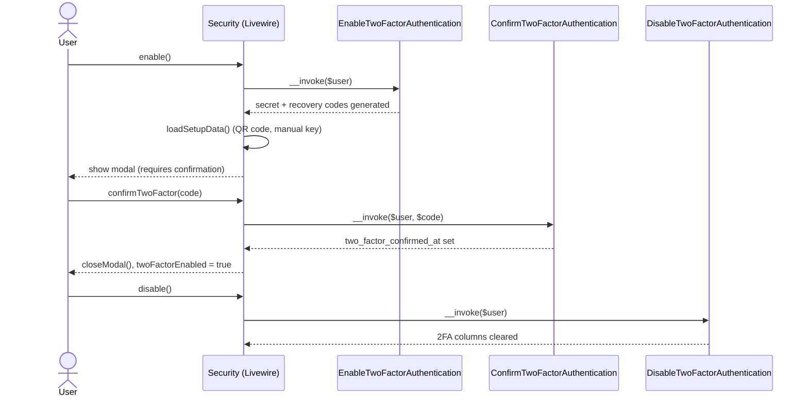

# Authentication — Two-factor, passkeys, logout, where it lives

> Part of [Authentication](../authentication.md). **Read this part when:** you touch two-factor authentication, passkeys, logout, or need the map of where auth code lives. The other parts are listed in the [hub](../authentication.md#table-of-contents).

## Two-factor authentication flow

Managed entirely from `App\Livewire\Settings\Security` ([`app/Livewire/Settings/Security.php`](../../../app/Livewire/Settings/Security.php)), which composes four Fortify action classes injected per-method rather than one large service:



Notable real behavior (not aspirational):

- On `mount()`, if the feature requires confirmation but the user never completed it (`two_factor_confirmed_at` is null), the component proactively calls `DisableTwoFactorAuthentication` to clear the half-enabled state — see `app/Livewire/Settings/Security.php:79-82`.
- Recovery codes are managed by a separate component, [`app/Livewire/Settings/TwoFactor/RecoveryCodes.php`](../../../app/Livewire/Settings/TwoFactor/RecoveryCodes.php), which decrypts `two_factor_recovery_codes` on mount and regenerates them via `Laravel\Fortify\Actions\GenerateNewRecoveryCodes`.
- `security.edit` (`routes/settings.php`) is gated by both `auth` and `verified` middleware groups plus `password.confirm` — see [api/routes.md](../../api/routes.md).

## Passkeys

Passkey management (list, add, delete) lives in the same `Security` component, backed by `laravel/passkeys`:

```php
// app/Livewire/Settings/Security.php
public function deletePasskey(DeletePasskey $deletePasskey): void
{
    if (! $this->deletingPasskeyId) {
        return;
    }

    $user = Auth::user();
    $passkey = $user->passkeys()->findOrFail($this->deletingPasskeyId);

    $deletePasskey($user, $passkey);

    $this->closeDeleteModal();
    $this->loadPasskeys();
}
```

Passkeys are stored in the `passkeys` table (see [database/schema.md](../../database/schema.md)). Discovery for password managers/OS integrations is exposed at a static route, not a Livewire component:

```php
// routes/settings.php
Route::get('.well-known/passkey-endpoints', function () {
    return response()->json([
        'enroll' => route('security.edit'),
        'manage' => route('security.edit'),
    ]);
})->name('well-known.passkeys');
```

## Logout

`App\Livewire\Actions\Logout` ([`app/Livewire/Actions/Logout.php`](../../../app/Livewire/Actions/Logout.php)) is a single-purpose invokable action (not a Livewire component) — it guards, invalidates the session, and regenerates the CSRF token:

```php
// app/Livewire/Actions/Logout.php
public function __invoke(): Redirector|RedirectResponse
{
    Auth::guard('web')->logout();

    Session::invalidate();
    Session::regenerateToken();

    return redirect('/');
}
```

It's reused (not duplicated) by `DeleteUserForm::deleteUser()` before deleting the account:

```php
// app/Livewire/Settings/DeleteUserForm.php
public function deleteUser(Logout $logout): void
{
    $this->validate(['password' => $this->currentPasswordRules()]);

    tap(Auth::user(), $logout(...))->delete();

    $this->redirect('/', navigate: true);
}
```

## Where it lives

| Concern | Path |
| --- | --- |
| Fortify config | `config/fortify.php` |
| Register/reset actions | `app/Actions/Fortify/CreateNewUser.php`, `app/Actions/Fortify/ResetUserPassword.php` |
| Account status enum | `app/Enums/UserStatus.php`, plus `User::isActive()` in `app/Models/User.php` |
| Activation listener | `app/Listeners/ActivateVerifiedUser.php` (auto-discovered from `app/Listeners`) |
| Sign-in status check (password + 2FA) | `app/Actions/Fortify/AuthenticateUser.php` (registered in `app/Providers/FortifyServiceProvider.php::configureActions()`) |
| Sign-in status check (passkey) | `app/Providers/FortifyServiceProvider.php::configurePasskeys()` |
| Sign-in status check (remember-me, mid-challenge) | `app/Listeners/RejectNonActiveUserLogin.php` (auto-discovered on `Login` **and** `Authenticated`) |
| Email-change actions | `app/Actions/Users/RequestEmailChange.php`, `app/Actions/Users/ConfirmEmailChange.php` |
| Email-change HTTP boundary | `app/Http/Controllers/ConfirmEmailChangeController.php`, route `email-change.confirm` in `routes/settings.php` |
| Email-change notification | `app/Notifications/PendingEmailVerification.php` |
| Status / sign-in / email-change copy | `lang/en/users.php`, `lang/es/users.php` |
| Profile settings UI | `app/Livewire/Settings/Profile.php`, `resources/views/livewire/settings/profile.blade.php` |
| Security settings UI | `app/Livewire/Settings/Security.php`, `resources/views/livewire/settings/security.blade.php` |
| Recovery codes UI | `app/Livewire/Settings/TwoFactor/RecoveryCodes.php` |
| Account deletion | `app/Livewire/Settings/DeleteUserForm.php` |
| Logout | `app/Livewire/Actions/Logout.php` |
| Shared validation | `app/Concerns/ProfileValidationRules.php`, `app/Concerns/PasswordValidationRules.php` |
| Password-confirmation freshness (step-up) | `app/Actions/Auth/EnsureRecentPasswordConfirmation.php`, `app/Exceptions/PasswordConfirmationRequiredException.php` |
| `password.confirm.store` rate limiter | `app/Providers/FortifyServiceProvider.php::configurePasswordConfirmationRateLimiting()` |
| 2FA columns migration | `database/migrations/2025_08_14_170933_add_two_factor_columns_to_users_table.php` |
| Status / pending-email migrations | `database/migrations/2026_08_11_175426_add_status_to_users_table.php`, `..._175427_add_pending_email_to_users_table.php` |
| Passkeys table migration | `database/migrations/2024_01_01_000000_create_passkeys_table.php` |
| Feature tests | `tests/Feature/Auth/**`, `tests/Feature/Actions/Auth/**`, `tests/Feature/Settings/SecurityTest.php`, `tests/Feature/Settings/EmailChangeTest.php` |
| Unit tests | `tests/Unit/Enums/UserStatusTest.php`, `tests/Unit/Listeners/ActivateVerifiedUserTest.php`, `tests/Unit/Models/UserTest.php`, `tests/Unit/Actions/Auth/**`, `tests/Unit/Exceptions/PasswordConfirmationRequiredExceptionTest.php` |

_Last updated: 2026-08-24 — Task 0015a (step-up authentication for privileged Users actions). **No authentication flow changed** — no new route, guard, action registration or `config/fortify.php` feature. What changed is that Fortify's password-confirmation flow acquired a **second consumer outside the auth screens**, and two facts about it belong to this page rather than to the authorization one: `POST /user/confirm-password` is now rate-limited **by this app** (5/min, keyed like Fortify's `login` limiter) because Fortify's `routes.php` consults no `config('fortify.limiters.*')` key for that route, so there was nothing to configure and nothing to make its absence loud; and the confirmation's session scoping — including why `SessionGuard::login()`'s `migrate(true)` would have let a session inherit the previous user's confirmation had either logout path skipped `Session::invalidate()` — is what makes the key usable as a step-up control at all. Added to **Enabled features**, beneath the existing `confirmPassword` paragraph, with four **Where it lives** additions. Verified as unchanged rather than assumed: the registration/reset flow, the account-status block and its three enforcement points, the pending-email mechanism and its two limiters (task 0015's, untouched here), the 2FA and passkey flows, and the logout section._

_Earlier revision notes: [architecture--authentication--two-factor-passkeys-logout-and-map.md](../../history/architecture--authentication--two-factor-passkeys-logout-and-map.md)._
