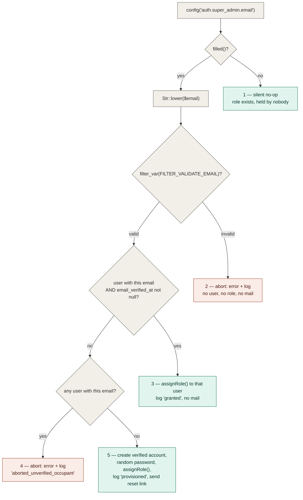
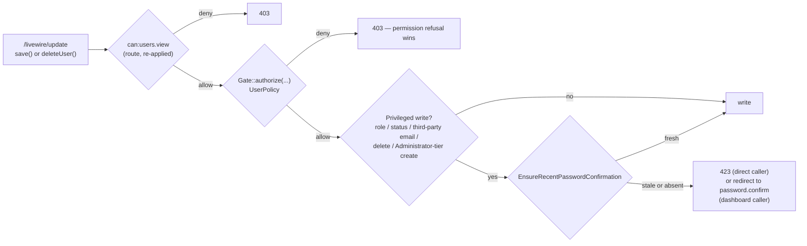

# Authorization

Cross-cutting concern — single source of truth for roles & permissions. Other documents link here instead of re-explaining it.

## Table of Contents

- [Stack](#stack)
- [Current state](#current-state)
- [Permission catalog](#permission-catalog)
- [Seeded roles and their grants](#seeded-roles-and-their-grants)
- [Seeding](#seeding)
- [Super Admin bootstrap](#super-admin-bootstrap)
- [The Super Admin bypass](#the-super-admin-bypass)
- [The Super Admin role's invariants](#the-super-admin-roles-invariants)
- [The Administrator tier's identity](#the-administrator-tiers-identity)
  - [The Administrator tier's immutability](#the-administrator-tiers-immutability-name-locked-undeletable-permissions-still-editable)
- [Middleware aliases](#middleware-aliases)
- [Policies](#policies)
  - [`SalesRegionPolicy` — the third policy](#salesregionpolicy--the-third-policy-and-the-first-with-no-target-branch)
  - [`MediaPolicy` — the fourth policy, and the first behind no route at all](#mediapolicy--the-fourth-policy-and-the-first-behind-no-route-at-all)
  - [`ProductPolicy` — the sixth policy, and the second built entirely for a screen that does not exist yet](#productpolicy--the-sixth-policy-and-the-second-built-entirely-for-a-screen-that-does-not-exist-yet)
  - [`ProductAttributeTypePolicy` — the seventh policy, and the first whose no-policy recommendation was reversed at Phase 2](#productattributetypepolicy--the-seventh-policy-and-the-first-whose-no-policy-recommendation-was-reversed-at-phase-2)
  - [`ShippingZonePolicy` — the eighth policy, and the one D-9 uses to reconcile the policy-vs-permission-check divergence with 0035](#shippingzonepolicy--the-eighth-policy-and-the-one-d-9-uses-to-reconcile-the-policy-vs-permission-check-divergence-with-0035)
  - [Product variant actions gate against the parent product, not a new policy](#product-variant-actions-gate-against-the-parent-product-not-a-new-policy)
  - [A routeless Livewire component has no per-request authorization backstop](#a-routeless-livewire-component-has-no-per-request-authorization-backstop)
- [Step-up authentication — the third layer](#step-up-authentication--the-third-layer)
- [Recording a refusal — what every gate owes the audit trail](#recording-a-refusal--what-every-gate-owes-the-audit-trail)
- [A domain invariant is not an authorization rule, and does not live here](#a-domain-invariant-is-not-an-authorization-rule-and-does-not-live-here)
- [Configuration](#configuration)
- [How to gate something](#how-to-gate-something)
  - [Gating a Livewire route: use `can:`, never `permission:`](#gating-a-livewire-route-use-can-never-permission)
  - [The copyable module-gate pattern, and the three alternatives rejected](#the-copyable-module-gate-pattern-and-the-three-alternatives-rejected)
  - [The second half of a module gate: the sidebar registry](#the-second-half-of-a-module-gate-the-sidebar-registry)
- [Where it lives](#where-it-lives)

## Stack

`spatie/laravel-permission` (`^8.3`) with the `HasRoles` trait on the `User` model:

```php
// app/Models/User.php
use Spatie\Permission\Traits\HasRoles;

class User extends Authenticatable implements PasskeyUser
{
    /** @use HasFactory<UserFactory> */
    use HasFactory, HasRoles, HasUuids, Notifiable, PasskeyAuthenticatable, TwoFactorAuthenticatable;
}
```

## Current state

The authorization foundation is **live and in real use**: roles and permissions are seeded, the package's middleware aliases are registered, a `Gate::before` hook grants the Super Admin role a blanket bypass, and — since task 0004 — the first gated route and the first policy exist.

- Two roles are seeded — `Super Admin` and `Administrator` — both on the `web` guard.
- A 42-permission catalog is seeded under the `<module-slug>.<action>` convention — 38 until story 0019 added the tenth module slug, `media`.
- `role`, `permission`, and `role_or_permission` are registered as middleware aliases in [`bootstrap/app.php`](../../bootstrap/app.php) and enforce server-side (403).
- `App\Providers\AppServiceProvider::configureAuthorization()` installs the Super Admin `Gate::before` bypass.
- **`users.index` (`GET /users`) is the first permission-gated route**, and it is gated with **`can:users.view`** rather than Spatie's `permission:` middleware — a Livewire-specific correctness requirement, not a style choice. See [How to gate something](#gating-a-livewire-route-use-can-never-permission).
- **[`App\Policies\UserPolicy`](../../app/Policies/UserPolicy.php) is the first policy** in the app, called from [`App\Livewire\Users\Index`](../../app/Livewire/Users/Index.php). See [Policies](#policies).
- **Since task 0008 the `Super Admin` role itself is a fixed point of the system** — categorically undeletable, unrenameable, un-re-permissionable and absent from every roles list — enforced on [`App\Models\Role`](../../app/Models/Role.php), the app's own role model, which is now the **only** role model class application code may use. See [The Super Admin role's invariants](#the-super-admin-roles-invariants).
- **Since task 0008a the Administrator tier has one identity and the tier's authorization lives in the actions**, not in the Livewire component: `App\Models\Role::isAdministratorRole()` is the single row-shaped predicate, and [`App\Actions\Users\CreateUser`](../../app/Actions/Users/CreateUser.php) / [`UpdateUser`](../../app/Actions/Users/UpdateUser.php) refuse an unprivileged caller on their own. See [The Administrator tier's identity](#the-administrator-tiers-identity).
- **Since task 0009 the *role* side of the Administrator tier is enforced too, and a third authorization category exists**: `RolePolicy` gained an Administrator-level branch on `update()`/`delete()`, a Super-Admin-only `grantAdministratorPermission` ability, and [`App\Actions\Roles\EnforceAdministratorPermissionGrant`](../../app/Actions/Roles/EnforceAdministratorPermissionGrant.php) — which enforces a **meta**-rule (who may *grant* a permission, as opposed to who may exercise it). See [`RolePolicy`](#rolepolicy--the-second-policy) and [Who may grant a permission](#who-may-grant-a-permission--the-meta-rule-layer).
- **Since task 0010 roles are managed from the application itself**, which changes three things at once. `roles.index` (`GET /roles`, gated `can:roles.manage`) is the **second** permission-gated route and [`App\Livewire\Roles\Index`](../../app/Livewire/Roles/Index.php) is `RolePolicy`'s **first call site** — so the policy stopped being a layer built ahead of its consumer. The `Administrator` role became **partially immutable** (name locked, never deletable, permission set still editable) now that code exists which could rename or delete it. And a second grant meta-rule shipped, [`App\Actions\Roles\EnforceGrantorPermissionScope`](../../app/Actions/Roles/EnforceGrantorPermissionScope.php), refusing a payload that newly grants a permission the actor does not hold. See [The Administrator tier's immutability](#the-administrator-tiers-immutability-name-locked-undeletable-permissions-still-editable) and [Who may grant a permission](#who-may-grant-a-permission--the-meta-rule-layer).

- **Since task 0013 the *navigation* is gated too, and it is gated by data rather than by Blade.** [`config/modules.php`](../../config/modules.php) is this repo's first declarative permission-driven UI registry: a sidebar entry renders only when the Gate grants that entry's configured ability, an emptied group renders no heading at all, and a later epic plugs its module in by appending one entry — no component change. Hiding a link is presentation only; the enforcement is still the route's `can:` gate (task 0012). See [The second half of a module gate](#the-second-half-of-a-module-gate-the-sidebar-registry).

- **Since task 0015a there is a *third* authorization layer, and it is not an ability.** Route middleware and policies both ask questions about the account; neither asks whether the person at the keyboard is still the account holder, which a hijacked or unattended session passes trivially. [`App\Actions\Auth\EnsureRecentPasswordConfirmation`](../../app/Actions/Auth/EnsureRecentPasswordConfirmation.php) requires a **recently confirmed password** before five specific writes on the Users screen — another user's role, status or email; a deletion; an Administrator-tier creation — reusing Laravel's own `password.confirm` session key and timeout rather than adding a second one. It is a direct throw rendering **423**, never a `Gate` check and never a `UserPolicy` ability, and it runs *after* every `Gate::authorize()` on its branch. See [Step-up authentication](#step-up-authentication--the-third-layer).

- **Since task 0015b every refusal on an admin screen is recorded, not only every success.** [`App\Actions\Auth\LogRefusedPrivilegedAttempt`](../../app/Actions/Auth/LogRefusedPrivilegedAttempt.php) writes one `Log::warning('Privileged action refused', …)` line for each authorization *and* rate-limit refusal across `App\Livewire\Users\Index`, `App\Livewire\Roles\Index` (and, since task 0017, `App\Livewire\SalesRegions\Index`) plus the domain actions behind them — same shape at both layers, so a non-dashboard caller inherits the trace. The refusal itself is untouched: same exception, status, message and timing. See [Recording a refusal](#recording-a-refusal--what-every-gate-owes-the-audit-trail), and note that a refusal on the Users screen produces one of **two** message strings.

- **Since task 0017 all three copyable patterns on this page have been exercised by a screen that was not there when they were written.** `sales-regions.index` (`GET /taxes/sales-regions`, gated `can:sales-regions.view`) is the **third** permission-gated route and [`App\Policies\SalesRegionPolicy`](../../app/Policies/SalesRegionPolicy.php) the **third** policy — both built by *following* [the module-gate pattern](#the-copyable-module-gate-pattern-and-the-three-alternatives-rejected) and [the refusal-logging recipe](#copyable-what-a-third-admin-screen-inherits) rather than by producing them, which is the first evidence either generalises. What the story genuinely adds is a **new kind of guard**: a **domain invariant** — a rule about the shape of the data ("exactly one Sales Region is the default, and it is always active") rather than about who may act. That guard's mechanics live in [security/model-instance-trust.md](../security/model-instance-trust.md), not here; what belongs on this page is [where it sits relative to authorization](#a-domain-invariant-is-not-an-authorization-rule-and-does-not-live-here). That story's one incomplete half — no `config/modules.php` entry, so the screen was reachable only by URI — was **closed by task 0018**, which added a `groups.taxes` group and an `items.sales_regions` entry and edited no component to do it: completing the set — 0017 exercised the module gate and the refusal-logging recipe, and 0018 exercises the third, [the sidebar registry](#the-second-half-of-a-module-gate-the-sidebar-registry), which is now the first of the three with proof that it really is extended by appending *data* rather than by editing a component.
- **Since story 0019 the catalog itself has grown for the first time, and a gated surface exists with no route behind it.** `media` is the **tenth** module slug — the first change to `RolePermissionSeeder::MODULES` since task 0002 wrote it — taking the catalog from 38 permissions to **42** and `Administrator`'s grants from 37 to **41**; what that amendment costs, and the one thing it silently breaks, are in [The `media` module](#the-media-module-and-what-a-catalog-amendment-costs). [`App\Policies\MediaPolicy`](../../app/Policies/MediaPolicy.php) is the **fourth** policy and the second with no target-dependent branch, and it defends a **modal-only** component: PRD §2.3 makes the media gallery something Products and Blog embed rather than a page, so there is no `GET /media`, no `can:` middleware and no sidebar entry — the in-component `Gate::authorize()` calls are the entire perimeter rather than the second of two layers. Story 0020 turned that observation into this page's **fourth copyable pattern**, off the back of a real Medium finding: [a routeless component has no per-request authorization backstop](#a-routeless-livewire-component-has-no-per-request-authorization-backstop), so `mount()`-only gating — correct on all three routed screens — leaves every later call unguarded here. See [`MediaPolicy`](#mediapolicy--the-fourth-policy-and-the-first-behind-no-route-at-all).

Still **ungated**: every route in [`routes/settings.php`](../../routes/settings.php) and the `dashboard` route, which carry only `auth` / `verified` / `password.confirm`. Those are per-user settings screens with no catalog permission behind them; the module screens of PRD Epics 2–5 will gate the same way `users.index` and `roles.index` do. The `dashboard` route's sidebar entry is correspondingly the one registry item that ships with an empty `permissions` list, and it is allow-listed by name in a test so a second cannot join it silently.

## Permission catalog

**Naming convention: `<module-slug>.<action>`**, dot notation, mirroring this repo's `<resource>.<action>` route-naming convention (see [conventions/naming.md](../conventions/naming.md#permission-names)).

The catalog is defined as public constants on the seeder so that every consumer reuses one definition instead of restating the strings:

```php
// database/seeders/RolePermissionSeeder.php
public const MODULES = [
    'users', 'products', 'sales-regions', 'shipping', 'payment-methods',
    'customers', 'orders', 'blog', 'store-languages',
];

public const ACTIONS = ['view', 'create', 'edit', 'delete'];

/**
 * Non-CRUD permissions that sit outside the module x action grid.
 *
 * @var array<int, string>
 */
public const ROLE_PERMISSIONS = ['roles.manage', 'roles.manage-administrators'];
```

Ten modules × four actions = **40**, plus the two role-management permissions = **42** total. (Nine modules and 38 total until story 0019 appended `media` to `MODULES` — see [The `media` module, and what a catalog amendment costs](#the-media-module-and-what-a-catalog-amendment-costs) below.)

| Module slug | Covers | Permissions |
| --- | --- | --- |
| `users` | user accounts | `users.view`, `users.create`, `users.edit`, `users.delete` |
| `products` | products, product categories and variants | `products.view`, `products.create`, `products.edit`, `products.delete` |
| `sales-regions` | sales regions & taxes | `sales-regions.*` (4) |
| `shipping` | shipping methods & rates | `shipping.*` (4) |
| `payment-methods` | payment methods | `payment-methods.*` (4) |
| `customers` | customers | `customers.*` (4) |
| `orders` | orders | `orders.*` (4) |
| `blog` | blog posts, categories and tags | `blog.*` (4) |
| `store-languages` | store languages / internationalization | `store-languages.*` (4) |
| `media` | the Shared Media Gallery — uploaded images and their `.webp`/`.avif` variants | `media.*` (4) |

Plus, outside the grid:

| Permission | Meaning |
| --- | --- |
| `roles.manage` | manage roles and their permission grants |
| `roles.manage-administrators` | manage administrator-level roles and users |

Granularity is deliberately **coarse per module**: `products.*` covers categories and variants, `blog.*` covers categories and tags — matching the PRD's module list rather than splitting sub-resources. `users.*` and `roles.*` are separate namespaces because the PRD gates them separately.

> **These strings are canonical.** They are the only permission names that exist in the database. Every call site must use them verbatim — `can('roles.manage-administrators')`, not a prose restatement — because `can()` / `hasPermissionTo()` against an unseeded name throws `PermissionDoesNotExist`. A story that needs a new permission adds it to `MODULES` / `ACTIONS` / `ROLE_PERMISSIONS` here, never as a string only its own code knows about.

### The `media` module, and what a catalog amendment costs

Story **0019** is the first story since **0002** wrote this catalog to change it, and it is worth reading as the reference case — because the paragraph directly above ("a story that needs a new permission adds it to `MODULES`") is a one-line instruction whose real cost is not one line.

**The production diff genuinely is one line plus a docblock word**: `'media'` appended to `RolePermissionSeeder::MODULES`, and *"The nine PRD modules"* → *"The ten PRD modules"*. Nothing else in `database/seeders/`, nothing in `config/permission.php`, and **no migration** — permissions are seeded *rows*, not schema, so `create_permission_tables` does not move. The seeder body needed no structural change either, and each reason is a property worth knowing before the next module lands:

- `allPermissionNames()` recomputes from the constants, so the four new names appear with no second edit.
- `Permission::firstOrCreate()` makes a re-seed idempotent: an already-seeded environment gains exactly four rows and duplicates nothing.
- `$administratorRole->syncPermissions(...)` re-syncs the **full** set, so an existing `Administrator` role really is extended on re-seed rather than left at its old grants. `tests/Feature/Seeders/RolePermissionSeederTest.php` now covers this as an explicit upgrade path (*"re-seeding an environment that predates the media module adds its four permissions idempotently"*), added by story 0019's Phase 5 review — the catalog had tests for being *created* and none for *growing*.
- Both `PermissionRegistrar::forgetCachedPermissions()` calls — the one inside the transaction and the one after it — already cover the new rows. **Do not touch either**; the post-commit one is what stops a concurrent worker caching the pre-`media` snapshot for Spatie's 24-hour TTL (see [security/authorization-patterns.md](../security/authorization-patterns.md#flush-the-permission-cache-after-the-transaction-commits-never-inside-it)).

**The cost is everywhere the old number was written down.** Fifteen assertions across two already-green test files hardcode 38/37, plus a test name and an inline module dataset — and story 0019's own first draft of that list was wrong on **every line number** and missed three sites entirely, caught at its Phase 2 review. Those counts are hardcoded on purpose: deriving them from `MODULES` would make the assertion `count(constants) === count(constants)`, which passes no matter what the seeder writes to the database. **A literal that must be edited deliberately is the tripwire, and re-grepping is how you find every copy of it:**

```bash
grep -rn "\b37\b\|\b38\b" tests/Feature/Seeders/   # before editing, and again before declaring done
grep -rn "\b38\b\|\b37\b" docs/                    # the same number is prose in eight documents
```

> ⚠️ **A new module slug does not come with a rendered label, and nothing fails when it is missing.** The Roles screen composes each matrix row's label as `__('roles.modules.'.str_replace('-','_',$module))` ([conventions/naming.md](../conventions/naming.md#translation-keys)), so a module with no leaf in `lang/{en,es}/roles.php`'s `modules` array renders its **raw key** — `roles.modules.media` — in the permission matrix. **This ⚠️ said until 2026-08-29 that `media` shipped without that leaf. It did not — the claim was false when written, and is corrected here rather than deleted** (`lang/en/roles.php` has `'media' => 'Media'` and `lang/es/roles.php` has `'media' => 'Medios'`, both present in story 0019's own tree and untouched since). It is the **second** false "verified" finding from that story's Phase 6 pass, alongside the refusal-logging one on [`MediaPolicy`](#mediapolicy--the-fourth-policy-and-the-first-behind-no-route-at-all) below; both were gaps the pass went looking for and reported without the gap existing, and [errors-log.md](../errors-log.md#one-docs-pass-reported-two-gaps-that-were-not-there-both-marked-verified--2026-08-29) owns why that happened twice. **The rule itself is unchanged and is why this paragraph stays**: a module with no leaf renders its raw key, nothing fails, and the seeder tests cannot see it because they assert names and counts rather than rendered copy — **so adding a module means adding its `roles.modules.<slug>` leaf to both locales in the same change.** `media` is the evidence that this is doable rather than the evidence that it gets missed.

**Deployment note:** an already-deployed environment does not gain `media.*` until `db:seed` is re-run. Seeding is already a documented required deployment step ([schema.md](../database/schema.md#roles-permissions-model_has_roles-model_has_permissions-role_has_permissions)) — but note what a *partial* upgrade looks like, since story 0019 recorded it as an accepted risk rather than fixing it: an environment that has run this story's migration and **not** re-seeded reaches `MediaPolicy::viewAny()`, which calls `hasPermissionTo('media.view')` against a name that does not exist yet, and throws `PermissionDoesNotExist` → a **500**, not a clean 403. That is the pre-existing shape every policy shares — six now, since story 0023's `ProductCategoryPolicy` and story 0024's `ProductPolicy` (see [`RolePolicy`](#rolepolicy--the-second-policy)'s own note) — not something `MediaPolicy` introduced.

## Seeded roles and their grants

| Role | Guard | Explicit permission rows | How it authorizes |
| --- | --- | --- | --- |
| `Administrator` | `web` | **41 of 42** — everything except `roles.manage-administrators` | normal Spatie grants |
| `Super Admin` | `web` | **0 of 42** | the [`Gate::before` bypass](#the-super-admin-bypass) |

`roles.manage-administrators` is seeded but held by **no role**: only the Super Admin can exercise it, and it does so through the bypass rather than through a grant.

The `Super Admin` role is created and then left alone — its permissions are never synced, granted, or revoked, not even with an empty `syncPermissions([])`. Its zero-permission state is a consequence of never being granted anything. `syncPermissions()` has exactly one call site in the seeder, on `Administrator`, so re-running repairs drift on that role only.

Since task 0008 that "left alone" is enforced rather than merely observed, and the seeder's own create call is the **one sanctioned exception** to the enforcement. Task 0010 made the same true of `Administrator`, so both roles are now created through a named, guard-bypassing factory method rather than a raw `firstOrCreate()`:

```php
// database/seeders/RolePermissionSeeder.php
// firstOrCreateSuperAdminRole() / firstOrCreateAdministratorRole() are the two
// sanctioned ways to bring these roles into existence -- both bypass the
// `creating` guard (App\Models\Role::boot()) that otherwise refuses any role
// acquiring either locked name (story 0008 F3 for Super Admin; story 0010
// Phase 4 finding F1 for Administrator), and both fail loudly on the
// case-insensitive collation collision documented on each method.
$superAdminRole = Role::firstOrCreateSuperAdminRole();

$administratorRole = Role::firstOrCreateAdministratorRole();
```

The two methods are deliberate mirror images — same `withoutEvents()` bypass, same byte-exact read-back of the persisted name, same `ImmutableRoleException` on a collision. **The asymmetry that remains is narrower than it used to be**: both *names* are now locked, but only the Super Admin role's *permission set* is. See [The Super Admin role's invariants](#the-super-admin-roles-invariants) and [The Administrator tier's immutability](#the-administrator-tiers-immutability-name-locked-undeletable-permissions-still-editable).

## Seeding

[`database/seeders/RolePermissionSeeder.php`](../../database/seeders/RolePermissionSeeder.php) is the **only** source of roles and permissions. The application is non-functional until it has run, so seeding is a **required deployment step**, not a developer convenience.

```bash
# production / any deploy — run the narrow, targeted form
php artisan db:seed --class=RolePermissionSeeder
```

Prefer that targeted invocation over a bare `php artisan db:seed`: `DatabaseSeeder` also creates a `test@example.com` fixture account, and the narrow form means no fixture seeder added later can reach production at all. The fixture itself is guarded by an explicit environment **allow-list**:

```php
// database/seeders/DatabaseSeeder.php
public function run(): void
{
    // N4 — allow-list, not "not production": staging/demo/qa are internet-reachable too.
    if (app()->environment(['local', 'testing'])) {
        User::factory()->create([
            'name' => 'Test User',
            'email' => 'test@example.com',
        ]);
    }

    $this->call(RolePermissionSeeder::class);
}
```

✅ Good — `app()->environment(['local', 'testing'])` is exact-match on `APP_ENV`, so `staging`, `demo`, `qa` and every future environment name are excluded by default.
❌ Bad — `if (! app()->isProduction())`, the deny-list form this replaced: it reads as equivalent but still creates a publicly-known credential everywhere that merely *isn't* named `production`. See [security/seeder-safety.md](../security/seeder-safety.md#never-put-development-only-accounts-in-an-unguarded-databaseseeder) for the full reasoning.

`$this->call(RolePermissionSeeder::class)` stays unconditional and runs in every environment, production included.

Two properties of the seeder are load-bearing:

- **Idempotent.** Roles and permissions are created with `firstOrCreate`, and `Administrator`'s grants are re-applied with `syncPermissions()`, so re-running converges: nothing is duplicated and a manually revoked permission is restored.
- **The permission cache is flushed twice.** `DatabaseSeeder` uses `WithoutModelEvents`, which suppresses the model-event-driven cache flush Spatie normally performs, so the seeder flushes explicitly — once *inside* the transaction before `syncPermissions()` (so the sync resolves the rows just inserted rather than a stale cache), and once *after* the transaction commits. Neither substitutes for the other; see [security/authorization-patterns.md](../security/authorization-patterns.md#flush-the-permission-cache-after-the-transaction-commits-never-inside-it) for why the post-commit flush cannot be dropped.

## Super Admin bootstrap

The `Super Admin` role is assignable **only** through the seeder or direct database access — nothing in the dashboard exposes it. Which user receives it is driven by one config value:

```php
// config/auth.php
'super_admin' => [
    'role' => RoleName::SuperAdmin->value,
    'email' => env('SUPER_ADMIN_EMAIL'),
],
```

`'role'` compiles in [`App\Enums\RoleName::SuperAdmin`](../../app/Enums/RoleName.php) rather than a bare string (task 0008), so the literal `'Super Admin'` is written in exactly one place in the codebase. The enum is **only** that default — nothing compares a role row against it; see [The Super Admin role's invariants](#the-super-admin-roles-invariants).

`SUPER_ADMIN_EMAIL` is read through `config()`, never `env()` outside `config/`, so `config:cache` is safe. The address is normalized with `Str::lower()` before anything else happens — every email address in this system is canonically lowercase, so `Admin@Example.com` and `admin@example.com` are the same address by definition.

`RolePermissionSeeder::bootstrapSuperAdmin()` then takes exactly one of five branches:



| # | Configured value | Outcome | What the operator does |
| --- | --- | --- | --- |
| 1 | unset or blank | total no-op — the role exists, assigned to nobody | set the variable and re-seed when ready |
| 2 | not a well-formed address | **abort**: console error naming the rejected value + `Log::warning` (`outcome: aborted_invalid_format`). No account, no grant, no mail | fix the value, re-run the seeder |
| 3 | matches a user whose `email_verified_at` is **not null** | that user is granted `Super Admin`; logged as `outcome: granted`. **No mail is sent** — the account already has an owner | nothing |
| 4 | matches a user that is **unverified** | **abort**: console error + `Log::warning` (`outcome: aborted_unverified_occupant`). No role granted to anyone, no second account inserted, no mail | have that account's owner verify their address, or free the address up, then re-run |
| 5 | matches no user at all | the account is **provisioned**: created with a cryptographically random password, `email_verified_at` forced, granted the role (`outcome: provisioned`), and a Fortify password-reset link emailed | claim the account via **Forgot password** using the emailed link |

Three rules this encodes:

- **Verification is proof of mailbox ownership, and the grant requires it.** The lookup itself carries `whereNotNull('email_verified_at')` — an unverified row is not a match. A row merely *carrying* the configured address proves nothing: self-registration is enabled, and `App\Livewire\Settings\Profile` lets any signed-in user move their account onto an arbitrary address. Without this condition, squatting on the address an operator intends to use later wins Super Admin on the next reseed. See [errors-log.md](../errors-log.md) for the incident that established this rule.
- **An abort degrades to "no grant", never to "no catalog".** Branches 2 and 4 `return` rather than throw. The bootstrap runs inside the seeder's `DB::transaction(...)`, so throwing would roll back the roles and the entire 42-permission catalog with it.
- **Every grant, provision and abort is written to the application log**, not only echoed to the console. `Seeder::$command` is `null` whenever the seeder runs outside an Artisan context, so console-only reporting can leave a privilege grant with no trace anywhere. Each entry carries `email`, `user_id` (where one exists) and a machine-readable `outcome` — and never the generated password.

The generated password is never printed, logged, returned, or stored anywhere but the hashed column; the account is unusable until the operator completes the reset. The reset itself reuses the app's existing Fortify broker (`Password::broker()->sendResetLink(...)`) — the same flow documented in [authentication.md](authentication.md#registration--password-reset) — with no bespoke invite token or route. A delivery failure is `report()`ed to error tracking and downgrades to a console warning; it never fails the seed, because losing the whole catalog to a misconfigured SMTP host would be the worse outcome.

Bootstrapping is idempotent: a provisioned account is created **verified**, so the next run matches branch 3 — no second account, no second reset email.

## The Super Admin bypass

```php
// app/Providers/AppServiceProvider.php
protected function configureAuthorization(): void
{
    Role::superAdminName();

    Gate::before(function (mixed $user, string $ability, array $arguments = []): ?bool {
        if (! $user instanceof User) {
            return null;
        }

        $target = $arguments[0] ?? null;
        if ($target instanceof Role && Role::isSuperAdminRoleRow($target)) {
            return null;
        }

        return $user->hasRole(Role::superAdminName(), 'web') ? true : null;
    });
}
```

(The real file carries five inline comments on these lines — F5/F6/F7 audit markers from task 0008, plus 0009's F4 and F-C — trimmed here; read the file for them.)

The closure returns `true` or `null` — **never `false`**, which would hard-deny every other user before their real permissions were consulted. The `instanceof User` guard and the explicit `'web'` guard each close a distinct failure mode; the vendor-source reasoning lives in [security/authorization-patterns.md](../security/authorization-patterns.md).

The bare `Role::superAdminName();` call on the first line is **not** dead code: it is a deliberate boot-time assertion that `auth.super_admin.role` is not misconfigured, added by task 0009 (Phase 5 finding F-C). See [One name, one resolution path](#one-name-one-resolution-path).

Two things changed here in task 0008:

- **The role name is resolved by [`Role::superAdminName()`](#one-name-one-resolution-path), not by an inlined `config()` expression.** The behaviour is identical (the method carries the same double fallback the inline expression did); what is gone is a *second* implementation of the resolution. The role that bypasses every permission check is now provably the same role that is protected and hidden, and the two cannot drift when `config('auth.super_admin.role')` is overridden.
- **The bypass now defers when the check's own target is the Super Admin role** (`return null` instead of `true`). Without this, a Super Admin actor's `Gate::authorize('delete', $superAdminRole)` was granted here before [`RolePolicy`](#rolepolicy--the-second-policy) was ever consulted, so the policy layer was not independently effective for that one actor. The model-level guards refused the mutation either way; this closes the policy-layer half.

And one more in task 0009 (Phase 4 finding F4):

- **That deferral now identifies its target with `Role::isSuperAdminRoleRow($target)`, not `$target->name`.** The attribute read was the *other half* of the residual `RolePolicy` carried: a partially-hydrated (`select('id')`) or mid-rename Super Admin role short-circuited the bypass to `true` here, while `RolePolicy::update()`/`delete()` — reached only when this closure defers — would have returned a categorical `false`. Two layers disagreeing on one row shape. Both now read the same `persistedName()`-backed helper, so the deferral and the policy branch cannot diverge. See [Known limitations](#known-limitations--what-is-not-closed), where this residual is now recorded as closed.

Consequence, deliberately accepted: apart from that one deferral, the bypass short-circuits `denies()` / `cannot()` and every Policy, which is what "the Super Admin bypasses permission checks entirely" means.

> **The deferral is keyed on the target, not on the ability — and task 0010 verified what that means in practice.** Any `RolePolicy` ability invoked against a Super Admin role *instance* is **denied by default for a Super Admin actor** when `RolePolicy` has no matching method, because the bypass has already stepped aside and `Gate` falls through to "no method, no grant". Fail-closed, and not a security concern — but a surprise if you expected the Super Admin to pass everything, so add the ability to `RolePolicy` explicitly rather than relying on the bypass.
>
> **It does not bite the two abilities task 0010 added.** `viewAny` and `create` are asked **class-level** — `Gate::authorize('viewAny', Role::class)` — and the deferral's condition is `$target instanceof Role`. A class *string* is not an instance, so the closure never defers for them and a Super Admin passes normally. Verified during that story's Phase 5 review rather than assumed. The rule generalizes: this deferral can only ever fire for an ability that carries a resolved `Role` row, which today means `update` and `delete`.

### Bypass coverage — what it does *not* cover

`Gate::before` fires only for authorization routed through Laravel's Gate. Spatie's own `HasRoles` methods query the user's relations directly and never consult the Gate:

| Check | Reaches `Gate::before`? | Why |
| --- | --- | --- |
| `$user->can('products.delete')` | ✅ yes | goes through the Gate |
| `$this->authorize('products.delete')` | ✅ yes | Gate |
| `@can('products.delete')` | ✅ yes | Gate |
| `permission:products.delete` middleware | ✅ yes | resolves via `canAny()` → Gate |
| `role_or_permission:Super Admin\|roles.manage` middleware | ✅ yes | resolves via `canAny()` → Gate |
| `role:Administrator` middleware | ❌ **no** | calls `hasAnyRole()` directly |
| `$user->hasRole('Administrator')` | ❌ **no** | direct model query |
| `$user->hasPermissionTo('products.delete')` | ❌ **no** | direct model query |
| `@role('Administrator')` | ❌ **no** | direct model query |

So a Super Admin **is refused (403)** by a route or Blade block gated on a bare role name, even though they bypass every permission. That is the specified behavior — pinned by a regression test in [`tests/Feature/Authorization/PermissionMiddlewareTest.php`](../../tests/Feature/Authorization/PermissionMiddlewareTest.php) — not a defect to be "fixed" by teaching the bypass about roles. Doing that would mean intercepting `hasRole()` itself, which breaks any legitimate "does this user literally hold role X" query the roles UI needs.

> **Hard convention — gate on permissions, never on role names.** Every route, middleware, component and Blade gate in this app must be keyed on a **permission** (`can:` / `permission:`). Where a role check is genuinely unavoidable, write `role_or_permission:Super Admin|<permission>` rather than bare `role:`, so the Super Admin is admitted by the role branch and everyone else by the permission branch. This applies to PRD Epics 2–5 as much as to Epic 1 — a bare `role:` gate is invisible until it silently locks the Super Admin out of a screen.

## The Super Admin role's invariants

Task 0008. The bypass above makes the `Super Admin` role the most privileged object in the system, and until this story it was an ordinary `roles` row: deletable, renameable, and offerable in any role dropdown. It is now a **fixed point** — categorically undeletable, unmodifiable in every direction, unacquirable by any other role, and invisible to roles-list queries.

All of it lives on one class, [`App\Models\Role`](../../app/Models/Role.php), which `extends Spatie\Permission\Models\Role`. A subclass is required because a scope, model events, and method overrides all need one; `config/permission.php` repoints the package at it:

```php
// config/permission.php
'models' => [
    'role' => Role::class,   // App\Models\Role, not Spatie\Permission\Models\Role
],
```

### One role model class in application code

**No application file may import `Spatie\Permission\Models\Role`.** The single legitimate exception is the `models.role` binding above, which is where the two classes are deliberately joined.

This is a correctness rule, not tidiness: the two are different Eloquent classes over the *same* `roles` table, and only `App\Models\Role` carries the guards below — so `Spatie\Permission\Models\Role::find($id)->delete()` is a live bypass of everything this section describes. It was also the real state of the code before 0008: `App\Livewire\Users\Index` imported the package class directly, which is why repointing `models.role` alone was not sufficient.

Enforced by two Pest architecture tests rather than by convention alone:

```php
// tests/Unit/ArchitectureTest.php
arch('no application code imports the raw Spatie role model directly')
    ->expect('App')
    ->not->toUse(Role::class)
    ->ignoring('App\Models\Role');

arch('no seeder imports the raw Spatie role model directly')
    ->expect('Database\Seeders')
    ->not->toUse(Role::class);
```

✅ Good — **two separate single-namespace rules.** ❌ Bad — the obvious-looking `expect(['App', 'Database\Seeders'])->not->toUse(...)`: Pest evaluates an array of targets **disjunctively**, passing as soon as any one target satisfies the rule, so a combined rule stays green while `Database\Seeders` alone violates it. That is how this test first shipped vacuous; the file records the verification.

`App\Models\Role` itself is `->ignoring()`'d — it legitimately extends the package class. Test files are deliberately out of scope: a test proving one of the [documented bypasses](#known-limitations--what-is-not-closed) legitimately needs the package class.

### One name, one resolution path

Everything below answers "is this the Super Admin role?" through a single `public static` method, never by re-deriving the config read and never by comparing against the enum:

```php
// app/Models/Role.php
public static function superAdminName(): string
{
    $name = config('auth.super_admin.role', RoleName::SuperAdmin->value) ?? RoleName::SuperAdmin->value;

    throw_if(
        Str::lower($name) === Str::lower(RoleName::Administrator->value),
        RuntimeException::class,
        'auth.super_admin.role cannot be configured to "'.RoleName::Administrator->value.'" -- '.
        'that name is reserved for the locked, uneditable Administrator tier.',
    );

    return $name;
}
```

Callers: the [`Gate::before` bypass](#the-super-admin-bypass), all three guard layers, `scopeSelectable()`, [`RolePolicy`](#rolepolicy--the-second-policy), [`UserValidationRules::roleRules()`](../../app/Concerns/UserValidationRules.php), and `RolePermissionSeeder`. Before 0008 the bypass read config while **three** other sites wrote the literal `'Super Admin'` independently — the seeder, `Index::roleOptions()` and `roleRules()` — so overriding `config('auth.super_admin.role')` split them apart. The sharpest case was `roleRules()`, whose `Rule::exists(...)->whereNot('name', 'Super Admin')` would have gone on excluding an ordinary role while **permitting** a forged submission to assign the real, config-resolved Super Admin role.

Four properties are load-bearing and must not be "simplified":

- **`public static`** — `RolePolicy` and `RolePermissionSeeder` are separate classes with no `Role` instance in hand, and must call this implementation rather than re-derive it.
- **Both fallbacks.** `config()`'s default covers a *missing* key; `??` covers a key that is *present but `null`* (an unset env var feeding the value, or a stale `bootstrap/cache/config.php`). Dropping the `??` would let the bypass still resolve `'Super Admin'` and grant it, while the guards, scope, policy and seeder all resolved `null` and therefore protected, hid and seeded **nothing**. See [security/authorization-patterns.md](../security/authorization-patterns.md#read-the-super-admin-role-name-with-a-literal-default).
- **The read happens in the method body**, i.e. at query/guard/policy time — never in a constructor or property initialiser, which could run before config is loaded.
- **The `throw_if` refusing a collision with the locked `Administrator` name** (task 0009, Phase 4 finding F6). The two protected tiers must never resolve to the *same* name, and only one of them is configurable, so the only way they can collide is an operator setting `auth.super_admin.role` to `Administrator`. Nothing else in the codebase would catch it: `RolePolicy` would stay fail-closed (its Super Admin branch runs first), but the `Gate::before` bypass would then hand unrestricted access to **every `Administrator` holder**. Two details are deliberate: the comparison is **case-insensitive**, wider than every other comparison in this file, because its job is catching an operator's typo rather than deciding role identity; and it is invoked **eagerly**, by the bare `Role::superAdminName();` at the top of [`AppServiceProvider::configureAuthorization()`](#the-super-admin-bypass) (Phase 5 finding F-C). This method sits on the hottest authorization path in the app — `Gate::before` runs it on nearly every check — so lazy detection would turn a deploy-time configuration mistake into an arbitrary user's request failing with a stack trace pointing at a policy instead of at the config key. Do not delete that call as dead code.

[`App\Enums\RoleName`](../../app/Enums/RoleName.php) holds both well-known role names, and **its two cases are resolved through deliberately different mechanisms** — the rule is per case, not per enum, and the enum's own class docblock states it that way:

| Case | What it is | How a guard reads it |
| --- | --- | --- |
| `SuperAdmin` | **only** the compiled-in default, here and in `config/auth.php`. The operator-configurable `auth.super_admin.role` key is the source of truth | never compared against directly — always resolved through `Role::superAdminName()` |
| `Administrator` | the **locked identity itself** — no config key exists and none may be added (task 0008a) | compared against directly, via `Role::isAdministratorRole()` and `RoleName::Administrator->value` |

The `SuperAdmin` half of that rule is what task 0008 exists to protect: comparing a role row against `RoleName::SuperAdmin` would re-introduce exactly the config-vs-literal split described above. The `Administrator` half is safe for the opposite reason — there is no config value that could disagree with the literal. Why the two tiers are asymmetric on purpose is in [The Administrator tier's identity](#the-administrator-tiers-identity).

### Three guard layers

Each catches a class of code path the others cannot. All three are needed.

| # | Layer | Catches | Why the others miss it |
| --- | --- | --- | --- |
| 1 | `creating` / `deleting` / `updating` listeners in `Role::boot()` | any Eloquent save or delete, including code that never touches `Gate` | the policy only fires for `authorize()` call sites |
| 2 | Overrides of `givePermissionTo()` / `syncPermissions()` / `revokePermissionTo()`, and `assignToModels()` / `removeFromModels()` / `syncModels()` | pivot mutations on `role_has_permissions` and `model_has_roles` | these fire **no model event at all** — layer 1 cannot see them |
| 3 | [`RolePolicy::update()` / `delete()`](#rolepolicy--the-second-policy) | dashboard call sites that `authorize()` | layers 1–2 only fire once a mutation is actually attempted, so without this a screen would have to provoke an exception to learn the answer |

Layers 1 and 2 refuse a **privilege** violation by throwing [`App\Exceptions\ImmutableRoleException`](../../app/Exceptions/ImmutableRoleException.php), which carries a `render()` returning **403** — converging on the same status layer 3's policy denial produces, so the outcome is indistinguishable to a caller regardless of which layer caught it. The one deliberate exception is task 0010's holder-count guard, which throws `RoleInUseException` → **409**: refusing to delete a role that is still in use is not an authorization decision, and flattening it into 403 would tell the actor they lack a permission they actually hold.

#### Layer 1: registration order is the whole point

The listeners are registered in an overridden `boot()`, **before** `parent::boot()`. Task 0010 added three more of them (two Administrator-tier guards and the holder-count guard) into the *same* method for exactly this reason — a second registration point would be a second, invisible ordering decision:

```php
// app/Models/Role.php
protected static function boot(): void
{
    static::creating(function (self $role): void {
        $role->guardAgainstAssumingSuperAdminName();
        $role->guardAgainstAssumingAdministratorName();
    });

    static::deleting(function (self $role): void {
        $role->guardAgainstSuperAdminMutation();
    });

    static::deleting(function (self $role): void {
        $role->guardAgainstAdministratorDeletion();
    });

    static::deleting(function (self $role): void {
        $role->guardAgainstHolders();
    });

    static::updating(function (self $role): void {
        $role->guardAgainstSuperAdminMutation();       // pre-mutation name: refuses editing the role AS IT IS today
        $role->guardAgainstAssumingSuperAdminName();    // post-mutation name: refuses renaming INTO the role's name
        $role->guardAgainstRenamingAdministrator();     // pre-mutation name: refuses renaming the role AS IT IS today
        $role->guardAgainstAssumingAdministratorName(); // post-mutation name: refuses renaming INTO the role's name
    });

    parent::boot();
}
```

`guardAgainstHolders()` is the odd one out: it protects **every** role, not a privileged tier. It refuses a delete while the role still has holders — reading `$this->users()->withTrashed()->exists()` fresh, never a cached relation or a `withCount()` attribute carried over from a listing query, and counting soft-deleted holders because the FK cascade on `model_has_roles` would otherwise destroy a trashed holder's grant with no error anywhere (task 0010 Phase 4 finding F3). It throws [`App\Exceptions\RoleInUseException`](../../app/Exceptions/RoleInUseException.php), which renders **409** rather than 403 — the request is well-formed and the actor is authorized; the role is simply still referenced.

❌ Bad — `booted()`, the idiomatic-looking choice (adapted to illustrate; deliberately not in the repo):

```php
// anti-pattern — do not register these in booted()
protected static function booted(): void
{
    static::deleting(fn (self $role) => $role->guardAgainstSuperAdminMutation());
}
```

`Spatie\Permission\Traits\HasPermissions::bootHasPermissions()` registers its **own** `deleting` listener, and trait boots run inside `Model::boot()` → `bootTraits()`, which `bootIfNotBooted()` calls **before** `static::booted()`. `fireModelEvent('deleting')` dispatches in registration order, so a `booted()` guard fires *after* the package's listener has already detached every `role_has_permissions` **and** every `model_has_roles` row for the role — and `Model::delete()` opens no transaction, so that detach **persists**. Net effect: the `roles` row survives (a naive "the role still exists" assertion passes) while the Super Admin role has silently lost all its permissions and all its holders.

Registering before `parent::boot()` puts these guards first, and each *throws* rather than returning `false`, halting the dispatch outright so the package's listener never runs. The test that proves it asserts the `role_has_permissions` and `model_has_roles` rows survive a refused delete — not merely that the `roles` row does. **This applies to every one of the four `deleting` listeners, not only the Super Admin one**: task 0010's holder-count and Administrator guards inherit the identical requirement, and `tests/Feature/Models/RoleTest.php` carries the same "the grants survived" assertion for the Administrator case.

#### The two identity helpers read different sources, and must never be merged

This is the subtlest part of the model, and a security re-audit found a working rename bypass in the first version of it.

| Helper | Reads | Answers |
| --- | --- | --- |
| `isSuperAdminRole()` | **persisted** identity only — `getOriginal('name')` when the column was hydrated, otherwise a database read-back | "was this row the Super Admin role *before* the mutation in flight?" |
| `guardAgainstAssumingSuperAdminName()` | the **in-memory / incoming** attribute | "is the name being *written* the Super Admin name?" |

They point in opposite directions on purpose. By the time `updating` fires, Eloquent has already staged the attacker's new name onto the in-memory attribute, so reading it for the first question makes a rename of the Super Admin role invisible to its own guard. And `isSuperAdminRole()` uses `array_key_exists('name', $this->getOriginal())` rather than `??`, because `getOriginal('name')` returns `null` for two different reasons — "never selected" and "selected but null" — that `??` cannot tell apart. The full rule, the executable bypass it came from, and why a test covering only the `guard_name` case passes on the vulnerable code, are in [security/authorization-patterns.md](../security/authorization-patterns.md#a-guard-that-reads-a-rows-protected-identity-must-distinguish-not-hydrated-from-hydrated-but-null).

`creating` and the second half of `updating` guard a *different* attack than the rest: a role **acquiring** the Super Admin name (`Role::create(['name' => 'Super Admin', ...])`, or a rename into it) would silently inherit the `Gate::before` bypass. `Role::firstOrCreateSuperAdminRole()` — used by [the seeder](#seeded-roles-and-their-grants) and nowhere else — is the one sanctioned exception, bypassing the `creating` guard via `withoutEvents()`.

### `selectable()` — the shared invisibility scope

```php
// app/Models/Role.php
public function scopeSelectable(Builder $query): Builder
{
    return $query->whereNot('name', self::superAdminName());
}
```

**Every roles list and role selector in the app must call it.** Two callers today: `App\Livewire\Users\Index::roleOptions()` (the role *selector*, which previously hardcoded `->whereNot('name', 'Super Admin')`) and, since task 0010, `App\Livewire\Roles\Index::roles()` (the roles *list*), which composes it with a `where('guard_name', 'web')` scope of its own. Story 0011's view consumes that same computed property rather than re-querying.

Two properties:

- **Exact match, never `LIKE`.** A custom role named `Super Admin Assistant` stays fully visible and manageable.
- **Local scope, never global.** A global scope would be inherited by `Role::findByName()` / `findById()` / `findOrCreate()` (all go through `static::query()`) and by `User`'s `roles()` relation, breaking the seeder, `assignRole('Super Admin')`, the permission cache hydration (`select()->with('roles')->get()`), and a Super Admin's own `hasRole()`. Hiding the role from lists must not hide it from authorization.

The cosmetic half is not the enforcement. A forged submission never reads the dropdown, so the server-side exclusion in [`UserValidationRules::roleRules()`](../../app/Concerns/UserValidationRules.php) — `Rule::exists('roles', 'id')->where('guard_name', 'web')->whereNot('name', Role::superAdminName())` — is what actually stops the Super Admin role being assigned from the Users screen.

### Known limitations — what is *not* closed

Enumerated deliberately rather than left as silent gaps. All of them require code already inside the application doing the thing; none is reachable from an external request. **Code review is the backstop for all of them.**

| Bypass | Why no application-layer mechanism closes it |
| --- | --- |
| `Role::where(...)->delete()`, `Role::query()->delete()`, raw `DB::table('roles')->update()/->delete()` | the query builder never instantiates a model, so no event and no override runs. Only a database trigger would close it — a migration, and out of this story's scope |
| `$role->permissions()->detach(...)`, and the exact analogue `$role->users()->detach(...)` | the overrides guard the *methods*; a parent model cannot guard a bare relation object it has already handed to the caller |
| `Permission::first()->removeRole('Super Admin')` | `Spatie\Permission\Models\Permission` also uses `HasRoles` and mutates the identical `role_has_permissions` pivot from the other side. `App\Models\Role`'s overrides cannot intercept a mutation issued by a different class |
| `saveQuietly()`, `deleteQuietly()`, `Role::withoutEvents(...)` | all three suppress model events wholesale. Worth naming explicitly because `firstOrCreateSuperAdminRole()` normalises `withoutEvents()` as an in-house pattern, making it likelier someone reaches for it elsewhere |
| A `Role::all()` written without `->selectable()` | the scope is a **convention**, not enforcement — the accepted cost of rejecting a global scope |
| Matching ignores `guard_name` | `superAdminName()`, `selectable()`, the guards and `isAdministratorRole()` / `isSuperAdminRoleRow()` all match on `name` alone, while the bypass is explicitly `web`-scoped. A same-named role on another guard is not *plantable* through `App\Models\Role` (the `creating` guard is guard-insensitive too), and grants no bypass if it exists — so this is a hygiene issue, not an escalation. For the two row-shaped helpers it is additionally fail-*closed* in both directions: a foreign-guard match only makes the check stricter, and Spatie's `ensureModelSharesGuard()` refuses assigning a foreign-guard role to a `web` user regardless. Guard-scoping all of them is deferred |

Two more, recorded because they are the ones a future story will actually walk into:

> **✅ Closed by task 0009 — the partial-hydration residual is gone; kept here as a record.** Through task 0008a, `RolePolicy`'s Super Admin branch and the `Gate::before` deferral both identified their target with the in-memory `$role->name` attribute rather than the persisted-identity-safe resolution the model guards use, so a partially-hydrated `Role` (e.g. `Role::query()->select('id')->find($id)`) or a mid-rename one evaded the **policy** layer and returned the actor's ordinary `roles.manage` answer instead of a categorical `false`. Task 0009 routed **both** sites through [`Role::isSuperAdminRoleRow()`](#the-administrator-tiers-identity), which reads `persistedName()` — so every identity question at every layer is now hydration-safe by construction, and the policy and the deferral cannot disagree about a row shape. `tests/Feature/Policies/RolePolicyTest.php` pins it with a retargeting test (an edit meant for one role, forged onto the Super Admin role, is refused and neither role is modified).
>
> The generalisable rule — separate "not hydrated" from "hydrated but null", and never read the in-memory attribute for a row's *protected* identity — is in [security/authorization-patterns.md](../security/authorization-patterns.md#a-guard-that-reads-a-rows-protected-identity-must-distinguish-not-hydrated-from-hydrated-but-null). Any new `RolePolicy` ability that identifies a tier must call one of the two `Role::is*` helpers; it must never re-derive the comparison.

> **⚠️ The update path and the delete path are still not symmetric about a Super Admin-holding target — but the gap is now narrower than it was.** Task 0008a gave `App\Actions\Users\UpdateUser` a **direct throw** (deliberately outside `Gate`) refusing any modification of a user who currently holds the Super Admin role, which binds a Super Admin *actor* too. `App\Livewire\Users\Index::deleteUser()` still has no equivalent **for another holder**: its only Super Admin-target exclusion is `UserPolicy::delete()`'s, which sits behind the `Gate::before` bypass — so a Super Admin actor can still delete *another* Super Admin holder. **The self-targeting half of this was closed by task 0015** (finding F11): `deleteUser()` now returns early, as a silent no-op that closes the confirmation modal, whenever the target `is()` the acting user — a direct identity check above the `Gate::authorize()` call, chosen over a `UserPolicy` rule for precisely the reason this ⚠️ exists. The remaining gap predates 0008a (stories 0005/0008) and was explicitly out of its scope; it is a candidate for a future task, recorded in that story's implementation record as **P2**. See [A rule that must bind a Super Admin actor cannot go through `Gate`](#a-rule-that-must-bind-a-super-admin-actor-cannot-go-through-gate).

## The Administrator tier's identity

Task 0008a, extended by task 0010. Where the section above makes the `Super Admin` **role** immutable, this one answers a narrower question that had five independent answers before 0008a landed: *is this role the Administrator tier?* The literal `'Administrator'` was written in `App\Livewire\Users\Index`, three times in `UserPolicy`, and in the seeder — so the tier's identity could be half-changed. It is now written **once**, and the authorization built on it moved out of the component and into the actions. Task 0010 then closed the gap that centralized identity left open: the row carrying that identity is now **immutable in name and undeletable**, because a screen that could rename or delete it finally exists.

### Why this tier is *not* config-driven, unlike the Super Admin one

The asymmetry with [`superAdminName()`](#one-name-one-resolution-path) is a decision, not an oversight, and re-adding symmetry would be a regression:

- `auth.super_admin.role` exists because the `Gate::before` bypass **already read a config key**. Leaving the guards on an independent literal meant an override could split them apart — the whole point of task 0008.
- The Administrator role's name is **locked and uneditable** by product decision (recorded across Epic 1's stories), so there is no second source that could disagree. `RoleName::Administrator` *is* the source of truth. Since task 0010 that lock is **enforced in code**, not merely asserted — see [the next subsection](#the-administrator-tiers-immutability-name-locked-undeletable-permissions-still-editable).

**Do not add `config('auth.administrator.role')`, an `'administrator'` block in `config/auth.php`, or an `administratorName()` resolver.** A config key is an override capability, and the locked-name decision rules one out. A content-scan test (`tests/Feature/Users/AdministratorRoleLiteralContentScanTest.php`) fails if one reappears, alongside asserting no `'Administrator'` / `'Super Admin'` literal survives in the guard path.

### The Administrator tier's immutability: name locked, undeletable, permissions still editable

Task 0010, Phase 4 finding **F1** (human-confirmed decision). Through task 0009, the Administrator tier had a centralized *identity* but a fully mutable *row*: nothing locked its name and nothing blocked its deletion, because until 0010 no application code could reach either operation. The roles-management screen is that code, and the audit demonstrated both paths live — a `roles.manage-administrators` holder could **rename** the seeded role (silently demoting it for every `isAdministratorRole()` check in the app: `UserPolicy`, `CreateUser`, `UpdateUser`), or **delete** it once it had no holders.

The protection is deliberately **narrower than the Super Admin role's**, and the difference is the whole point of the tier:

| Operation | `Super Admin` | `Administrator` |
| --- | --- | --- |
| Delete the row | ❌ refused | ❌ refused (`guardAgainstAdministratorDeletion()`) |
| Rename the row | ❌ refused | ❌ refused (`guardAgainstRenamingAdministrator()`) |
| Create/rename another role **into** the name | ❌ refused | ❌ refused (`guardAgainstAssumingAdministratorName()`) |
| `syncPermissions()` / `givePermissionTo()` / `revokePermissionTo()` | ❌ refused in every direction | ✅ **allowed** |
| Assign the role to a user | ❌ refused | ✅ allowed, gated by `roles.manage-administrators` |

The permission row is the load-bearing asymmetry: [`EnforceAdministratorPermissionGrant`](#who-may-grant-a-permission--the-meta-rule-layer) exists precisely so a Super-Admin-authorized actor **can** change what `Administrator` grants. That is why `guardAgainstAdministratorDeletion()` is its own guard rather than a branch folded into `guardAgainstSuperAdminMutation()` — the latter also blocks every permission-pivot mutation, which must stay open here.

Three implementation details that are easy to get wrong:

- **`guardAgainstRenamingAdministrator()` is scoped to `isDirty('name')`**, unlike the Super Admin mutation guard, which fires on any update. Without that scope it would refuse the ordinary saves that legitimately touch the row.
- **The rename guard reads the row's *persisted* name** (`isAdministratorRole()` → `persistedName()`), while `guardAgainstAssumingAdministratorName()` reads the *in-memory* one. Same "two helpers pointing in opposite directions" rule as the Super Admin pair — see [the two identity helpers](#the-two-identity-helpers-read-different-sources-and-must-never-be-merged).
- **`RolePolicy::delete()` diverges from `update()` for this tier.** `update()` gates the Administrator row on `roles.manage-administrators`; `delete()` refuses it **categorically**, like the Super Admin row, because it is never deletable at all. Do not "restore symmetry" between the two methods.

⚠️ **`RolePolicy::delete()`'s Administrator branch is unreachable for a Super Admin actor** (task 0010 Phase 4 round-2 finding N3). The `Gate::before` closure only defers when the ability's *target* is the **Super Admin** role, so for a Super Admin actor targeting the Administrator row it returns `true` unconditionally and the policy method never runs — the **model-event guard** is what actually refuses that delete. Both paths render 403, so the behaviour is correct; the consequence, **shipped and test-covered since task 0011**, is that the roles list's per-row `Gate::allows()` UI hint renders that one action enabled for that one actor. It is the same accepted enabled-then-refused drift already documented for the Users screen (see [`Gate::allows()` in a list query](#gateallows-in-a-list-query-is-a-ui-hint-not-a-layer)), and the general rule behind it is that [a rule which must bind a Super Admin actor cannot go through `Gate`](#a-rule-that-must-bind-a-super-admin-actor-cannot-go-through-gate).

The three actor tiers this produces on the `Administrator` row are pinned as a dataset in `tests/Feature/Roles/IndexUiTest.php`, and the middle one's two abilities deliberately **disagree** — do not "fix" the policy to make them symmetric:

| Actor | `canEdit` | `canDelete` | Why |
| --- | --- | --- | --- |
| plain `roles.manage` holder | `false` | `false` | `update()` requires `roles.manage-administrators`; `delete()` refuses categorically |
| `roles.manage-administrators` holder, not the Super Admin | **`true`** | **`false`** | `update()`'s tier branch passes; `delete()`'s categorical refusal has no permission escape hatch |
| Super Admin | `true` | `true` | `Gate::before` bypasses both — and the delete then 403s on click at the model guard (the drift above) |

The durable, generalizable rule this produced — an identity derived from a mutable column must be made immutable at the model layer as soon as code exists that can mutate it — is in [security/authorization-patterns.md](../security/authorization-patterns.md#an-identity-derived-from-a-mutable-column-must-be-locked-once-code-exists-that-can-mutate-it).

### One predicate, two shapes

```php
// app/Models/Role.php
public static function isAdministratorRole(self $role): bool
{
    return $role->persistedName() === RoleName::Administrator->value;
}

public static function isSuperAdminRoleRow(self $role): bool
{
    return $role->persistedName() === self::superAdminName();
}
```

| Input in hand | Read it as | Call sites |
| --- | --- | --- |
| a `Role` **row** | `Role::isAdministratorRole($role)` / `Role::isSuperAdminRoleRow($role)` | `CreateUser`, `UpdateUser`, and — since task 0009 — [`RolePolicy`](#rolepolicy--the-second-policy)'s two branches plus the [`Gate::before` deferral](#the-super-admin-bypass), all of which consume these helpers rather than defining a comparison of their own |
| a role **name string** | `RoleName::Administrator->value` / `Role::superAdminName()` | `UserPolicy`'s five `hasRole()` calls, `RolePermissionSeeder` |

Four properties are load-bearing:

- **`public static`, on the model.** `UserPolicy`, both user actions and (since 0009) `RolePolicy` and `AppServiceProvider` are separate classes with no shared base; a private policy-local helper would leave two independent comparisons for one concept, which is the duplication this story removed.
- **Exact `===`, never `LIKE`, `strcasecmp`, or a "contains" match.** `Administrador Regional`, a lowercase `administrator`, and a custom role holding *every* permission the seeded `Administrator` holds are all ordinary roles, freely assignable with `users.edit` alone. Administrator-level is defined by the role's name, not by its permission set — a deliberate, PRD-scoped limitation pinned by tests rather than left to accident.
- **They take a `Role`, so a name string cannot be passed by mistake.** An action holding a `string $roleId` resolves it with a full `Role::query()->find((int) $roleId)` — never a `select('id')`, and never the id-to-id comparison against a `where('name', …)->value('id')` lookup that `Index::administratorRoleId()` used to do (that method is deleted). A `null` row is not administrator-level; nothing can be promoted into a role that does not exist, and `syncRoles()` fails on its own afterwards.
- **Both read `persistedName()`, so a partially-hydrated row answers protectively.** That method is the extraction of what `isSuperAdminRole()` already did (see [the two identity helpers](#the-two-identity-helpers-read-different-sources-and-must-never-be-merged)), so there is one implementation of "read this row's real name". Consequences: `Role::query()->select('id')->find($id)` on the seeded Administrator role still answers `true`, and a row renamed *in memory* but not saved still answers by what is persisted — the rename-in-flight case resolves protectively. The alternative, documenting a "callers must fully hydrate" obligation, was rejected: unenforceable, invisible at the call site, and fails **open** when forgotten.

### The guard belongs to the action, not to the caller

Before this story the Administrator-level authorization lived only in `App\Livewire\Users\Index`, so a future API endpoint, Artisan command or queued job calling `CreateUser` / `UpdateUser` would have been completely ungated. Both actions now authorize **the whole operation** themselves, before any write:

| Action | Authorizes |
| --- | --- |
| `CreateUser` | `Gate::authorize('create', User::class)`; a direct throw if the submitted role is the Super Admin role; `Gate::authorize('promoteToAdministrator', User::class)` (class-level) if the submitted role is the Administrator role |
| `UpdateUser` | `$user->load('roles')`, then `Gate::authorize('update', $user)` unconditionally — including on a self-edit, so a name-only edit can no longer reach a write unauthorized. Then, for a non-self-edit: direct throws if the target *currently holds* or the submission *assigns* the Super Admin role, `promoteToAdministrator` / `downgrade` on an actual tier change, and `updateSensitiveAttributes` when the email or status actually changed |

The component keeps its own `Gate::authorize()` calls in `save()` / `deleteUser()` / `mount()` (see [Gate::authorize at the call site](#gateauthorize-at-the-call-site-not-only-at-the-route)) — that is now defence in depth rather than the only layer. What it no longer holds is a *second implementation* of the tier rules: `authorizeRoleChange()` and `administratorRoleId()` were deleted, not converted.

Four semantics survived the relocation unchanged and are pinned by tests, because each is easy to lose in transit: a **no-op** role re-save is neither a promotion nor a downgrade and needs no extra gate; the target's current role is read **fresh**, never from a possibly-stale cached relation; `updateSensitiveAttributes` fires only on an *actual* email or status change, compared against `getRawOriginal()` rather than the in-memory attribute; and **all authorization runs before the first write** — `UpdateUser`'s writes are additionally wrapped in `DB::transaction()`.

`UpdateUser` also **derives the self-edit guard itself** (`Auth::user()?->is($user) ?? false`) instead of accepting the `bool $applyRoleAndStatus` parameter the component used to pass. A caller-supplied self-lockout guard is only a guard while every caller computes it correctly; once the action is independently callable, `applyRoleAndStatus: true` on a self-targeting update is a one-argument bypass.

> **Known design consequence, verified non-reachable today.** These actions authorize against the *authenticated* user, and `Gate::authorize()` with no resolved user **denies** — fail-closed, and therefore safe. A genuinely unauthenticated caller (a seeder, a console command provisioning a first Administrator) cannot use them as-is and would need an explicit, deliberately-designed bypass rather than a quietly-relaxed guard. Nothing in `database/seeders/` or `app/Console/Commands/` calls either action today.

### A rule that must bind a Super Admin actor cannot go through `Gate`

The Super Admin refusals in both actions are **direct `throw new AuthorizationException(...)` statements, never `Gate::authorize()`** — and that is the single most important line to preserve if either action is ever refactored:

```php
// app/Actions/Users/UpdateUser.php — authorizeRoleAndStatusChange()
if ($currentRoles->contains(fn (Role $role): bool => Role::isSuperAdminRoleRow($role))) {
    throw new AuthorizationException('A Super Admin holder cannot be modified through this action.');
}

$submittedRole = Role::query()->find((int) $roleId);

if ($submittedRole !== null && Role::isSuperAdminRoleRow($submittedRole)) {
    throw new AuthorizationException('The Super Admin role cannot be assigned.');
}
```

[The `Gate::before` bypass](#the-super-admin-bypass) grants a Super Admin actor **before any policy method runs**, so routing either refusal through the Gate would make it inert for exactly the actor it most needs to bind. This is the same reasoning that puts the role model's own invariants in [layers 1 and 2](#three-guard-layers) rather than in `RolePolicy`. The general rule, with the ✅/❌ pair, is in [security/authorization-patterns.md](../security/authorization-patterns.md#a-rule-that-must-bind-a-super-admin-actor-must-be-a-direct-throw-not-a-gate-check).

Two consequences worth stating so neither is rediscovered as a surprise:

- **One dashboard behaviour changed deliberately.** Before 0008a, a Super Admin actor editing another Super Admin-holding user through the Users screen **succeeded** (`Gate::before` bypassed `UserPolicy::update()`'s exclusion and nothing else checked). It now throws. That is the intended outcome of the hardening, not a regression.
- **The delete path has one such guard now, and it covers only the self case.** Task 0015 gave `App\Livewire\Users\Index::deleteUser()` a direct `$target->is(Auth::user())` no-op — same reasoning, different rule: it binds a Super Admin actor because it is not a `Gate` question. `UserPolicy::delete()`'s Super Admin-*target* exclusion is still policy-level only, so a Super Admin actor can still delete **another** Super Admin holder. See the second ⚠️ in [Known limitations](#known-limitations--what-is-not-closed); the asymmetry is accepted and was out of 0008a's scope, not an oversight.

### The seeder writes the same name the guards read

Task 0008a moved this line off the `'Administrator'` literal and onto `RoleName::Administrator->value`, with a `throw_unless()` read-back beside it in the seeder. **Task 0010 relocated both onto the model**, because its own `creating` guard would otherwise have refused the seeder's `firstOrCreate()` outright — the seeder now calls a sanctioned factory method that carries the read-back internally:

```php
// database/seeders/RolePermissionSeeder.php
$administratorRole = Role::firstOrCreateAdministratorRole();
```

```php
// app/Models/Role.php
public static function firstOrCreateAdministratorRole(): self
{
    $role = static::withoutEvents(fn (): self => static::firstOrCreate(
        ['name' => RoleName::Administrator->value, 'guard_name' => 'web'],
    ));

    throw_unless(
        $role->getRawOriginal('name') === RoleName::Administrator->value,
        ImmutableRoleException::class,
        // ...
    );

    return $role;
}
```

The read-back is the compensating control for a real collation hazard, and it is why the seeder cannot simply write the enum value and move on: `roles.name` carries `utf8mb4_unicode_ci` (case- and accent-**insensitive**), so `firstOrCreate()` would silently **adopt** a pre-existing row named e.g. `administrator` and grant it all 41 Administrator permissions — while every identity check in the app is a byte-exact PHP comparison and would treat that same full-privilege row as an ordinary role, assignable with a bare `users.edit`. `Role::firstOrCreateSuperAdminRole()` is the exact mirror image, for the same reason.

Two consequences of the 0010 relocation worth stating, since both changed:

- **The exception type is now `ImmutableRoleException` on both paths**, not the `RuntimeException` the Administrator line used to throw. Both render 403.
- **`withoutEvents()` is now mandatory here**, not merely tidy. `guardAgainstAssumingAdministratorName()` refuses any role whose in-memory name is the Administrator name, and it does not — and must not — carry an exception for "but this one is the seeder". Suppressing events for the one sanctioned creation is how that exception is expressed, exactly as it already was for the Super Admin role.

The same collation is why the "a lowercase `administrator` role is an ordinary role" scenario cannot be exercised through role *creation* in this schema — the unique index refuses the row while the seeded `Administrator` exists. The `===` exactness is still tested, against a **not-yet-persisted** instance, because it is the correct guard if the collation is ever changed and because it is what makes the two read-back assertions meaningful.

## Middleware aliases

Registered in [`bootstrap/app.php`](../../bootstrap/app.php):

```php
// bootstrap/app.php
->withMiddleware(function (Middleware $middleware): void {
    $middleware->alias([
        'role' => RoleMiddleware::class,
        'permission' => PermissionMiddleware::class,
        'role_or_permission' => RoleOrPermissionMiddleware::class,
    ]);
})
```

| Alias | Class | Notes |
| --- | --- | --- |
| `permission` | `Spatie\Permission\Middleware\PermissionMiddleware` | the default choice — reaches the Gate, so the Super Admin passes |
| `role_or_permission` | `Spatie\Permission\Middleware\RoleOrPermissionMiddleware` | use when a role check is unavoidable |
| `role` | `Spatie\Permission\Middleware\RoleMiddleware` | registered for completeness; **does not** admit the Super Admin |

All three throw `UnauthorizedException` for an unauthenticated request, which renders as a bare 403 rather than a redirect to login — so a gated route must **also** carry `auth` (and `verified`, matching the existing groups in `routes/web.php`). See [security/authorization-patterns.md](../security/authorization-patterns.md#permission-and-role-middleware-are-not-a-substitute-for-auth).

## Policies

Permissions answer "may this actor do this *kind* of thing at all". A **policy** answers the question a permission cannot: "may this actor do it *to this particular record*". [`App\Policies\UserPolicy`](../../app/Policies/UserPolicy.php) (task 0004) is the first one in the app, and the template for the rest. There are **nine** today: `UserPolicy`, [`RolePolicy`](#rolepolicy--the-second-policy) (task 0008), [`SalesRegionPolicy`](#salesregionpolicy--the-third-policy-and-the-first-with-no-target-branch) (task 0017), [`MediaPolicy`](#mediapolicy--the-fourth-policy-and-the-first-behind-no-route-at-all) (story 0019), [`ProductCategoryPolicy`](#productcategorypolicy--the-fifth-policy-and-the-first-to-gain-its-call-site-in-a-later-story-than-the-one-that-created-it) (story 0023), [`ProductPolicy`](#productpolicy--the-sixth-policy-and-the-second-built-entirely-for-a-screen-that-does-not-exist-yet) (story 0024), [`ProductAttributeTypePolicy`](#productattributetypepolicy--the-seventh-policy-and-the-first-whose-no-policy-recommendation-was-reversed-at-phase-2) (story 0028), [`ShippingZonePolicy`](#shippingzonepolicy--the-eighth-policy-and-the-one-d-9-uses-to-reconcile-the-policy-vs-permission-check-divergence-with-0035) (story 0033) and [`ShippingRatePolicy`](#shippingratepolicy--the-ninth-policy-and-the-first-with-real-call-sites-from-day-one) (story 0036).

**Registration: none.** Laravel 13 auto-discovers `App\Policies\<Model>Policy` for `App\Models\<Model>`, so `UserPolicy` is wired to `User` — `RolePolicy` to `App\Models\Role`, `SalesRegionPolicy` to `App\Models\SalesRegion`, `MediaPolicy` to `App\Models\Media` — by naming alone. This repo has **no `AuthServiceProvider`**, and one should not be added to register a conventionally-named policy.

> Auto-discovery is also why nothing registers `RolePolicy` for the *package's* `Spatie\Permission\Models\Role`. `Gate::getPolicyFor()` walks the inheritance chain with `is_subclass_of`, which matches a **subclass of** a registered class — and the package class is the **parent** of `App\Models\Role`, not a child. A raw package instance would go unmatched with or without an explicit `Gate::policy()` line, so adding one buys nothing. That gap is closed by the [one-role-model convention and its `arch()` test](#one-role-model-class-in-application-code) instead.

### `UserPolicy` abilities

| Ability | Signature | Rule |
| --- | --- | --- |
| `viewAny` | `(User $actor)` | holds `users.view` |
| `create` | `(User $actor)` | holds `users.create` |
| `update` | `(User $actor, User $target)` | `false` if `$target` holds `Super Admin`; otherwise holds `users.edit` |
| `updateSensitiveAttributes` | `(User $actor, User $target)` | passes `update`, **and** — if `$target` holds `Administrator` — holds `roles.manage-administrators` |
| `promoteToAdministrator` | `(User $actor, ?User $target = null)` | holds `roles.manage-administrators` |
| `downgrade` | `(User $actor, User $target)` | `true` if `$target` does **not** hold `Administrator`; otherwise holds `roles.manage-administrators` |
| `delete` | `(User $actor, User $target)` | `false` if `$target` holds `Super Admin`; `false` if `$target` is already soft-deleted; holds `users.delete`, **plus** `roles.manage-administrators` when `$target` holds `Administrator` |

**Who calls what changed in task 0008a, and again in task 0015.** `viewAny` / `create` / `update` / `delete` are authorized by [`App\Livewire\Users\Index`](../../app/Livewire/Users/Index.php); `create` and `update` are *additionally* authorized inside the actions themselves. Two of the three tier-specific abilities — `promoteToAdministrator` and `downgrade` — are authorized **only** in [`CreateUser`](../../app/Actions/Users/CreateUser.php) / [`UpdateUser`](../../app/Actions/Users/UpdateUser.php), so a non-dashboard caller inherits them (see [The guard belongs to the action, not to the caller](#the-guard-belongs-to-the-action-not-to-the-caller)). **`updateSensitiveAttributes` is the exception since task 0015:** it is still enforced on the write path by `UpdateUser` — *conditionally*, once a status or email change is detected — and is **additionally** asked by the component's `openEditModal()`, *unconditionally*, because that method discloses the target's `pending_email` and `status` before any change has been decided. That is not the pattern task 0008a removed: the component asks the ability directly and branches only on `$target->is(Auth::user())`, an identity check, never on role membership — the tier branch lives inside the policy method itself. See [security/livewire-authorization.md](../security/livewire-authorization.md#the-shipped-disclosure-gates-and-why-the-disclosure-check-is-the-stronger-ability).

**The trashed-target refusal (task 0005) is the newest branch, and it guards a write rather than a read.** `delete()` returns `false` for a `$target->trashed()`, because [`App\Models\User::delete()`](../../app/Models/User.php) rewrites the row's email to a placeholder on the way out (see [database/schema.md](../database/schema.md#soft-deletes)) — so without this branch a `withTrashed()` call site could re-run that write against an already-trashed row. Note what it is *not*: being policy-level, it sits **behind** [the `Gate::before` bypass](#the-super-admin-bypass), so a `Super Admin` still reaches `delete` on a trashed target. That is accepted rather than a gap — the placeholder is derived from the immutable UUID, so the re-write is idempotent — and it is the general shape of every policy rule in this app: a `Gate::before` grant is decided before any policy method runs, so a rule that must bind the Super Admin too belongs in the model or action, not here. The rest of the Administrator-level delete/downgrade matrix is unchanged by 0005; the story only re-proved it under the new `SoftDeletes` global scope.

Four properties of this policy are load-bearing and generalize to every policy added later:

**1. The policy calls `hasPermissionTo()`, and that is correct here** — even though [the bypass table](#bypass-coverage--what-it-does-not-cover) marks `hasPermissionTo()` as *not* reaching `Gate::before`. A policy method is only ever reached *through* the Gate, and `Gate::before` runs first: a Super Admin is granted before `UserPolicy` is consulted at all, so the direct query inside it never runs for them. This is why `tests/Feature/Policies/UserPolicyTest.php` can assert a Super Admin passes every ability while holding **zero** permission rows.

> The "gate on permissions, never role names" convention still governs the **call sites** (`Gate::authorize(...)`, `can:` middleware). Inside a policy body, both `hasPermissionTo()` and `hasRole()` are appropriate — the latter for asking a literal question about the *target*, which is exactly what the Super Admin and Administrator exclusions do.

**2. `hasRole()` is always passed the guard, and the name is never a literal.** All five `hasRole()` calls in `UserPolicy` pass `'web'` explicitly, never the one-argument form, per [security/authorization-patterns.md](../security/authorization-patterns.md#always-pass-the-guard-to-hasrole--hasanyrole). Since task 0008a they also resolve the *name* through the two centralized identities rather than writing it inline — the config-driven one for the Super Admin tier, the locked enum case for the Administrator tier:

```php
// app/Policies/UserPolicy.php — update(); delete() carries the identical pair
if ($target->hasRole(Role::superAdminName(), 'web')) {
    return false;
}
// ... and, in updateSensitiveAttributes() / downgrade() / delete():
if (! $target->hasRole(RoleName::Administrator->value, 'web')) {
```

These are `hasRole()` checks against a **user**, not a `Role` row, which is why they read the name rather than calling `Role::isAdministratorRole()`. Both shapes compare against the same single literal, so they cannot drift — see [The Administrator tier's identity](#one-predicate-two-shapes).

**3. `promoteToAdministrator()`'s `$target` is nullable, and that is not decoration.** It is invoked two ways — with an instance on the edit path, and **class-level** on the create path, where no target exists yet:

```php
// app/Actions/Users/CreateUser.php — the create path
Gate::authorize('promoteToAdministrator', User::class);
```

`Gate::callPolicyMethod()` **drops the first argument when it is a class-string**, so the class-level call reaches the method with `$actor` alone. A non-nullable `User $target` parameter would throw `ArgumentCountError` at runtime rather than allowing or denying anything — and it would pass every instance-level test, failing only at that one call site.

**4. `updateSensitiveAttributes` exists because a rule keyed on the *operation* was incomplete.** The Administrator-level guard originally covered only the *role* change; a security audit (task 0004, finding F1) found that `status` and `email` reach the same effect without passing any guard — an actor holding `users.edit` but not `roles.manage-administrators` could suspend another Administrator, or seize their account by pointing its email at an address they control. The general rule this established, with the real ✅/❌ pair, is in [security/authorization-patterns.md](../security/authorization-patterns.md#an-ability-must-cover-every-attribute-that-achieves-its-effect-not-only-the-operation-it-is-named-after) — it is not repeated here.

### `RolePolicy` — the second policy

[`App\Policies\RolePolicy`](../../app/Policies/RolePolicy.php) (task 0008, extended by tasks 0009 and 0010) has **five** abilities, and since task 0010 it has a real call site: [`App\Livewire\Roles\Index`](../../app/Livewire/Roles/Index.php) authorizes against all five. It was built two stories ahead of that consumer, so the Super Admin refusal would be independently effective there from day one, and (since 0009) so the Administrator tier is protected on the *role* side the way 0008a protected it on the *user* side:

| Ability | Signature | Rule | Authorized from |
| --- | --- | --- | --- |
| `viewAny` | `(User $actor)` | holds `roles.manage` | `Roles\Index::mount()` |
| `create` | `(User $actor)` | holds `roles.manage` | `Roles\Index::openCreateModal()`, `saveRole()`'s create branch |
| `update` | `(User $actor, Role $role)` | `false` if `$role` is the Super Admin role; then, if `$role` is the seeded `Administrator` role, holds `roles.manage-administrators`; otherwise holds `roles.manage` | `Roles\Index::openEditModal()`, `saveRole()`'s edit branch |
| `delete` | `(User $actor, Role $role)` | `false` if `$role` is the Super Admin role **or** the seeded `Administrator` role; otherwise holds `roles.manage` | `Roles\Index::confirmDeleteRole()`, `deleteRole()` |
| `grantAdministratorPermission` | `(User $actor)` | holds the `Super Admin` role on the `web` guard — nothing else grants it | `Roles\Index::mount()`, via `Gate::allows()`; enforced in `EnforceAdministratorPermissionGrant` |

**`viewAny` and `create` take no `Role` argument, and that is why the component branches.** `Gate::authorize('update', Role::class)` would resolve the policy from the class string and then call `update($actor)` with **no** second argument — the class name finds the policy, it is not passed to the method — so the shipped `update(User $user, Role $role)` signature raises `ArgumentCountError` rather than denying. `saveRole()` therefore authorizes `create` on the create branch and `update` on the edit branch, mirroring `Users\Index::save()`.

```php
// app/Policies/RolePolicy.php
public function update(User $user, Role $role): bool
{
    if (Role::isSuperAdminRoleRow($role)) {
        return false;
    }

    return Role::isAdministratorRole($role)
        ? $user->hasPermissionTo(self::ADMINISTRATOR_LEVEL_PERMISSION)
        : $user->hasPermissionTo(self::ROLE_MANAGEMENT_PERMISSION);
}
```

Seven notes, the first three of which differ from `UserPolicy` above:

- **This is a complement to, not a substitute for, the model-level guards.** A policy only fires where someone calls `authorize()`; [layers 1 and 2](#three-guard-layers) catch the code paths that don't. Neither layer is redundant.
- **Unlike every `UserPolicy` rule, the Super Admin branch binds the Super Admin actor too** — because the bypass [defers when the target is the Super Admin role](#the-super-admin-bypass). Compare `UserPolicy::delete()`'s trashed-target refusal, which a Super Admin still sails past. The Administrator branch is the opposite: it *is* behind the bypass, which is exactly how a Super Admin edits the seeded `Administrator` role while holding zero permission rows — and, for `delete()`, why that method's categorical Administrator refusal never runs for that actor (finding N3; the model guard refuses instead — see [The Administrator tier's immutability](#the-administrator-tiers-immutability-name-locked-undeletable-permissions-still-editable)).
- **`delete()`'s Administrator branch is categorical; `update()`'s is permission-gated.** That divergence is task 0010's finding F1 and is deliberate: the row's permission set is editable, the row itself is not. Do not normalise the two methods back into the identical shape they used to share.
- **Branch order is load-bearing, and is pinned by a test.** The categorical Super Admin refusal runs **first and unconditionally**; the Administrator branch is appended below it. A rewrite that puts the tier branch first would let an actor holding `roles.manage-administrators` edit the Super Admin role. `RolePolicyTest` asserts precisely that ordering rather than only the two happy paths.
- **Both tier identities come from `App\Models\Role`, never from a comparison written here.** `Role::isSuperAdminRoleRow()` and `Role::isAdministratorRole()` are the [one predicate in two shapes](#one-predicate-two-shapes); the policy defines neither. A content-scan test (`tests/Feature/Users/AdministratorRoleLiteralContentScanTest.php`) covers this file and fails if a `'Administrator'` / `'Super Admin'` literal reappears in it.
- **The two permission names are class constants, not repeated literals.** `RolePolicy::ADMINISTRATOR_LEVEL_PERMISSION` (`roles.manage-administrators`) and `RolePolicy::ROLE_MANAGEMENT_PERMISSION` (`roles.manage`) are read by this policy, by `EnforceAdministratorPermissionGrant`, and by both classes' tests. Known, deliberately-deferred inconsistency (task 0009 Phase 4 finding **F5**, pre-existing): `UserPolicy` still writes the `roles.manage-administrators` literal at four call sites of its own. Point those at these constants when that cleanup happens — do not assume it already did.
- **"Administrator-level" is name-scoped by design and stays that way.** A custom role *granted* `roles.manage-administrators` does not itself become protected the way the seeded `Administrator` role is — only the literally-named seeded role is. This is the PRD's explicit scope (findings F15/F16 from task 0004's re-audit, reconfirmed by 0009), not an oversight; switching to permission-set-based matching needs a new product decision.

`RolePolicy` calls `hasPermissionTo(...)` directly, matching `UserPolicy`'s six call sites. Consequence, accepted knowingly: on a database with the permission tables migrated but **not seeded**, that throws `PermissionDoesNotExist` (→ 500) rather than denying (→ 403). Switching this one policy to `$user->can(...)` was rejected as a one-off deviation from the codebase's single established pattern for this check; the fix belongs in one pass across all **six** policies — `SalesRegionPolicy` (task 0017), `MediaPolicy` (story 0019), `ProductCategoryPolicy` (story 0023) and `ProductPolicy` (story 0024) all inherited the same shape, `MediaPolicy` with the consequence spelled out on its own section below.

### `SalesRegionPolicy` — the third policy, and the first with no target branch

[`App\Policies\SalesRegionPolicy`](../../app/Policies/SalesRegionPolicy.php) (task 0017) is the smallest policy in the app and the most instructive one to read *against* the other two, because almost everything it does **not** do is a recorded decision:

| Ability | Signature | Rule | Authorized from |
| --- | --- | --- | --- |
| `viewAny` | `(User $actor)` | holds `sales-regions.view` | `SalesRegions\Index::mount()` |
| `update` | `(User $actor, SalesRegion $target)` | holds `sales-regions.edit` — `$target` is **not** consulted | `SalesRegions\Index::{openEditModal,save,setDefault,setActive}()`, all three `App\Actions\SalesRegions\*` actions, and the per-row `Gate::allows()` hint |

Four notes:

- **Two abilities, not four, and the omission is deliberate.** `sales-regions.create` and `sales-regions.delete` were seeded by task 0002 and remain **unused**: the Sales Region catalog is fixed and seeded by [story 0016](../database/schema.md#sales_regions), so this screen has no create path and no delete path, and story 0018 adds none. Defining abilities nothing calls is untested surface. This follows `UserPolicy`'s own precedent of defining exactly the abilities its story uses — but it is the first time a story has declined to define an ability whose *permission string already exists*, so state it rather than assume the next reader infers it.
- **One permission tier gates every mutation, including the default swap.** There is no second, stricter tier the way `roles.manage-administrators` gates part of the Users screen. Changing which region is the tax default has real blast radius on every future rate resolution, and the second tier was genuinely considered — it was rejected because the seeded catalog holds no candidate string, and `hasPermissionTo()` against an unseeded name throws `PermissionDoesNotExist` at runtime. Inventing one is therefore a change to `RolePermissionSeeder`'s catalog, not a component detail. If the requirement becomes real, it is a catalog story.
- **`update()` ignores its `$target`, and it stays an instance method anyway.** There is no untouchable row in this domain — no `SalesRegion` equivalent of the Super Admin user or the seeded `Administrator` role — so the method has no branch at all. It keeps the `(User, SalesRegion)` signature so the per-row `Gate::allows('update', $region)` UI hint and a future target-dependent rule ask the *identical* method. The immediate payoff: this screen is the first whose `Gate::allows()` hint has **no accepted drift** from what a click actually does, because a rule that reads nothing about the target cannot disagree with itself. That is a property of today's policy body, not a guarantee — see the ⚠️ below. **Task 0018 is where that hint acquired a rendered consumer, and the claim survived it** — but with one distinction the screen makes visible for the first time and that is worth stating before someone reads it as drift: a row control on that screen can render `disabled` **while `canEdit` is `true`**. The current default's inline toggle and the set-default control on an already-default or inactive row are disabled for a **domain-invariant** reason (exactly one default, always active), not an authorization one — the boundary [A domain invariant is not an authorization rule](#a-domain-invariant-is-not-an-authorization-rule-and-does-not-live-here) draws, arriving in the UI. The disabled *set* is therefore a superset of the `Gate::allows()` hint by construction; the hint itself still agrees with the click in every case.
- **`hasPermissionTo()` inside the body is correct here for the same reason it is in the other two.** A policy method is only ever reached *through* the Gate, and `Gate::before` grants a Super Admin before the policy is consulted, which is why `tests/Feature/Policies/SalesRegionPolicyTest.php` can assert a Super Admin passes both abilities holding **zero** permission rows. The two permission names are `public const VIEW_PERMISSION` / `EDIT_PERMISSION` on the policy, following `RolePolicy`'s precedent rather than `UserPolicy`'s still-deferred literals (see [conventions/naming.md](../conventions/naming.md#permission-names)).

> ⚠️ **The day this policy gains a target-dependent branch, it must re-fetch the target.** Every `App\Actions\SalesRegions\*` action authorizes against the **caller-supplied** instance, *before* re-fetching the row under lock inside its own transaction — deliberately, since [a refusal must never open a transaction](#the-guard-belongs-to-the-action-not-to-the-caller). That is inert only while `update()` ignores `$target` entirely. A future branch reading a target attribute (say `$target->kind`) would be decided against a value a caller can forge in memory, while the action then writes the real, different row — the exact failure class [security/model-instance-trust.md](../security/model-instance-trust.md) exists for, reopened one layer up and outside the lock. Phase 4's re-audit recorded this as **R-3** on the policy method's own docblock rather than fixing it, because there is no rule to fix yet. The same ⚠️ applies to the drift-free `Gate::allows()` hint above: it is drift-free *because* the policy reads nothing.

### `MediaPolicy` — the fourth policy, and the first behind no route at all

[`App\Policies\MediaPolicy`](../../app/Policies/MediaPolicy.php) (story 0019) is the **second** policy with no target-dependent branch — `SalesRegionPolicy` was the first — and the first policy in this app whose model has **no route in front of it**.

| Ability | Signature | Rule | Authorized from |
| --- | --- | --- | --- |
| `viewAny` | `(User $actor)` | holds `media.view` | `Media\Gallery::mount()`, `::tiles()`, `::toggleSelect()`, `::confirmSelection()` |
| `create` | `(User $actor)` | holds `media.create` | `Media\Gallery::upload()` **and** `App\Actions\Media\StoreUploadedImage::__invoke()`; `::canCreate()` as a `Gate::allows()` UI hint |
| `update` | `(User $actor, Media $target)` | holds `media.edit` — `$target` is **not** consulted | `Media\Gallery::startEditing()`, `::updateMediaDetails()` **and** `App\Actions\Media\UpdateMediaDetails::__invoke()`; `::tiles()`'s per-row `canEdit` hint |
| `delete` | `(User $actor, Media $target)` | holds `media.delete` — `$target` is **not** consulted | nothing yet, and deliberately nothing planned |

> **Since story 0020 this table is four-of-four rather than two-of-four**, and `viewAny` is asked in four places rather than one. Both changes are the same finding — see [A routeless Livewire component has no per-request authorization backstop](#a-routeless-livewire-component-has-no-per-request-authorization-backstop) directly below.

Four things it establishes or inherits, each of which reads against one of the three policies above it:

- **There is no route, so the component's own gates are the *only* enforcement.** Every other gated screen in this app is defended twice — a `can:` route middleware *and* an in-component `Gate::authorize()` — which is why each of those sections says the middleware column "understates what protects it". Here the middleware column does not exist: PRD §2.3 makes the media gallery a **modal reused by Products and Blog**, so story 0019 ships no `GET /media`, no `config/modules.php` entry and no sidebar link (D10). What follows is not a new rule but the old one losing its backstop — [security/livewire-authorization.md](../security/livewire-authorization.md)'s *"gate every method that mutates or discloses"* is the whole perimeter, and `mount()`'s `Gate::authorize('viewAny', Media::class)` is load-bearing rather than defence in depth: it is what refuses a real HTTP actor, not merely what a direct `Livewire::test()` mount hits. **Anyone adding a method to `App\Livewire\Media\Gallery` is adding an unguarded entry point unless they gate it themselves.** Story 0020 is where that sentence stopped being advice and became a finding — [see below](#a-routeless-livewire-component-has-no-per-request-authorization-backstop).
- **`create` is asked twice, in two classes, on purpose.** `Gallery::upload()` authorizes and so does `StoreUploadedImage::__invoke()` — [the action-owns-the-rule convention](../conventions/base-standards.md#an-authorization-rule-belongs-to-the-action-not-to-one-of-its-callers) applied at Phase 1, the second story to get it right up front rather than at an audit (task 0017 was the first). The action's copy is what a future Products/Blog embed, an Artisan command or a queued job inherits; the component's is what fails fast, before validation and before a synchronous image decode. A reviewer deleting either has removed a layer.
- **Four abilities, two used — and this is a *different* decision from `SalesRegionPolicy`'s two-of-four.** `SalesRegionPolicy` declined to define `create`/`delete` because the catalog is fixed and no screen will ever create or delete a row. `MediaPolicy` defines all four: `update` had a **named, imminent consumer** — story 0020's inline tile editing, which has now shipped, so the "define an ability when you can name what will ask it" rule paid out inside one story rather than staying a bet — and `delete` is defined because leaving one action of a four-action module undefined is a worse asymmetry than an unused method. Read the two policies together and the rule is *define an ability when you can name what will ask it* — neither "always four" nor "only what this story uses". ⚠️ `delete` is the one with nothing behind it: **no story implements media deletion, and none should be added without a further decision**, because the referential question — what happens to a product or post pointing at a deleted image — cannot be settled before those tables exist. That is also why `media` carries no `deleted_at`; see [schema.md § `media`](../database/schema.md#media).
- **`hasPermissionTo()` in the body, `public const` for the names, no `$target` branch** — all three inherited unchanged from `RolePolicy`/`SalesRegionPolicy` rather than re-decided. `VIEW_PERMISSION` / `CREATE_PERMISSION` / `EDIT_PERMISSION` / `DELETE_PERMISSION` follow [naming.md](../conventions/naming.md#permission-names)'s "name a permission once on the class that owns the rule", which now makes `UserPolicy`'s repeated literals the sole outlier among **eight** policies — `App\Policies\ProductCategoryPolicy` (story 0023, and since story 0025 its **first and only** caller — see [`ProductCategoryPolicy`](#productcategorypolicy--the-fifth-policy-and-the-first-to-gain-its-call-site-in-a-later-story-than-the-one-that-created-it) below), `App\Policies\ProductPolicy` (story 0024, three of four abilities with a real call site — see [`ProductPolicy`](#productpolicy--the-sixth-policy-and-the-second-built-entirely-for-a-screen-that-does-not-exist-yet) below) and `App\Policies\ProductAttributeTypePolicy` (story 0028, all four abilities with a real call site from day one — see [`ProductAttributeTypePolicy`](#productattributetypepolicy--the-seventh-policy-and-the-first-whose-no-policy-recommendation-was-reversed-at-phase-2) below) are the fourth, fifth and sixth followers. `tests/Feature/Policies/MediaPolicyTest.php` asserts a Super Admin passes every ability while holding **zero** permission rows, via `Gate::before`.

> ✅ **This screen logs every refusal, and the ⚠️ that stood here until 2026-08-29 saying it did not was wrong on the day it was written.** Recorded rather than silently deleted, because the way it went wrong is the point. Story 0019's Phase 6 pass claimed *"`App\Actions\Auth\LogRefusedPrivilegedAttempt` appears nowhere in `app/Livewire/Media/` or `app/Actions/Media/` — verified by grep at this story's Phase 6, not assumed"*, and shipped that sentence in the same commit series as a `Gallery.php` that imports the class and calls it twice. The gap was real when the docs pass found it, the pass is what got it closed, and the fix was rebased into the *earlier* feature commit — so `git log` order made the doc look like the later, authoritative word. It was false for a whole story. See [errors-log.md](../errors-log.md#one-docs-pass-reported-two-gaps-that-were-not-there-both-marked-verified--2026-08-29). **The shipped state:** all six gated methods on `App\Livewire\Media\Gallery` (`mount()`, `tiles()`'s two throwing neighbours `toggleSelect()`/`confirmSelection()`, `startEditing()`, `updateMediaDetails()`, `upload()`) plus both actions (`StoreUploadedImage`, `UpdateMediaDetails`) route their refusal through the helper's throwing `authorize()`, per [the recipe](#recording-a-refusal--what-every-gate-owes-the-audit-trail). The generic `target_type`/`target_id` keys absorbed a fourth domain with no change to the line, exactly as task 0017 predicted. `tests/Feature/Media/RefusalLoggingTest.php` pins it.

> **`Media\Gallery::mount()` is the one `mount()` in this app that *does* log**, and the [exclusion list](#recording-a-refusal--what-every-gate-owes-the-audit-trail)'s own reasoning is why. The other three are excluded because their routes' `can:` middleware checks the identical ability and `can:` **is** on Livewire's `PersistentMiddleware` allow-list, so a `mount()` refusal is unreachable over HTTP and a log there would only ever fire from a test. This component has no route, so `mount()` is the *only* gate a real caller meets — the refusal the recipe exists to record.

> ⚠️ **`update()` and `delete()` ignore their `$target`, and `SalesRegionPolicy`'s re-fetch warning is now live for `update()`.** Since story 0020 it has three call sites, and two of them (`Gallery::startEditing()`, `Gallery::updateMediaDetails()`) authorize against a row they resolved themselves with `Media::query()->findOrFail($id)` immediately above the check — so the instance is server-fetched, not caller-supplied, and the warning is inert. The third, `App\Actions\Media\UpdateMediaDetails::__invoke(Media $media, …)`, takes the model **as a parameter**: safe only while `update()` reads nothing off `$target`. The day it grows a branch on a target attribute, that action is the site to fix, and [security/model-instance-trust.md](../security/model-instance-trust.md) is the page that says how. `delete()` still has no call site at all.

### `ProductCategoryPolicy` — the fifth policy, and the first to gain its call site in a later story than the one that created it

[`App\Policies\ProductCategoryPolicy`](../../app/Policies/ProductCategoryPolicy.php) was created by story 0023 with **zero call sites**, a deliberate hand-off recorded on [schema.md](../database/schema.md#product_categories) and [conventions/base-standards.md](../conventions/base-standards.md#directory-structure) — no route, no Livewire component, nothing to authorize against yet. Story 0025's [`App\Livewire\ProductCategories\Index`](../../app/Livewire/ProductCategories/Index.php) is that gap closed: it is `ProductCategoryPolicy`'s **first and only** caller, and all **four** of its abilities now have a real call site. **Corrected 2026-09-04 (story 0027)** — this sentence used to end *"unlike `ProductPolicy` below, whose `viewAny` still waits for story 0027"*; that story has since shipped and given `viewAny` its own call site (`Products\Index::mount()`), so the two sibling policies are the same shape again — see [`ProductPolicy`](#productpolicy--the-sixth-policy-and-the-second-built-entirely-for-a-screen-that-does-not-exist-yet) below.

| Ability | Signature | Rule | Authorized from |
| --- | --- | --- | --- |
| `viewAny` | `(User $actor)` | holds `products.view` | `ProductCategories\Index::mount()` |
| `create` | `(User $actor)` | holds `products.create` | `ProductCategories\Index::openCreateModal()`/`::save()` **and** `App\Actions\ProductCategories\CreateProductCategory::__invoke()`, its own first statement |
| `update` | `(User $actor, ProductCategory $target)` | holds `products.edit` — `$target` is **not** consulted | `ProductCategories\Index::openEditModal()`/`::save()` **and** `App\Actions\ProductCategories\RenameProductCategory::__invoke()`, its own first statement; `::loadProductCategories()`'s per-row `canEdit` hint |
| `delete` | `(User $actor, ProductCategory $target)` | holds `products.delete` — `$target` is **not** consulted | `ProductCategories\Index::confirmDelete()`/`::deleteProductCategory()` **and** `App\Actions\ProductCategories\DeleteProductCategory::__invoke()`, its own first statement; `::loadProductCategories()`'s per-row `canDelete` hint |

Four notes:

- **Gated at two layers, on purpose — the same shape `SalesRegions`/`Media`/`Products` already use, not a redundancy.** Each of the three actions authorizes the whole operation as its own first statement, through `App\Actions\Auth\LogRefusedPrivilegedAttempt::authorize(...)` with `targetType: 'product_category'` passed explicitly (`resolveTarget()` auto-resolves only `User` and `Role`), so a future Artisan command, queued job or REST controller inherits the identical refusal the dashboard gets. The component re-checks the same ability in every method that opens a modal or mutates (`openCreateModal`, `openEditModal`, `save`, `confirmDelete`, `deleteProductCategory`), which is what fails fast before a transaction opens and what keeps the per-row `canEdit`/`canDelete` hint honest — see [Gate::allows() in a list query is a UI hint, not a layer](#gateallows-in-a-list-query-is-a-ui-hint-not-a-layer). A reviewer deleting either layer has removed a layer, not a duplicate.
- **In `DeleteProductCategory` specifically, the authorization call runs *before* the in-use product count, and the order is load-bearing.** The in-use block ([schema.md § `product_categories`](../database/schema.md#product_categories)) is a domain invariant, not an authorization rule — it stays a `ValidationException`, not a `Gate` denial, exactly as [A domain invariant is not an authorization rule](#a-domain-invariant-is-not-an-authorization-rule-and-does-not-live-here) describes for `SalesRegionPolicy`'s default-region rule. But the count itself is data, and disclosing it to an actor who does not even hold `products.delete` would leak information the `Gate` refusal exists to withhold — so the `delete` gate must be asked, and must fail, before the count is ever computed. Reversing the order would turn a plain 403 into a business message ("this category is used by 12 products") available to anyone who can reach the method.
- **`hasPermissionTo()` in the body, `public const` for the names, no `$target` branch** — unchanged from `SalesRegionPolicy`/`MediaPolicy`/`ProductPolicy`, and already correctly documented as such since story 0023; nothing about that shape moved with this story.
- **`update()` and `delete()` both ignore `$target`, exactly as `ProductPolicy`'s do, and the same re-fetch warning applies.** `ProductCategories\Index` resolves a fresh `ProductCategory::findOrFail(...)` immediately before every authorize-then-act call — never a stored or earlier-hydrated instance — per [security/model-instance-trust.md](../security/model-instance-trust.md), so the day either method grows a branch on a target attribute, the instance it is asked against is already the safe one.

### `ProductPolicy` — the sixth policy, and the second built entirely for a screen that does not exist yet

[`App\Policies\ProductPolicy`](../../app/Policies/ProductPolicy.php) (story 0024) gates the same `products.*` permissions [`ProductCategoryPolicy`](#productcategorypolicy--the-fifth-policy-and-the-first-to-gain-its-call-site-in-a-later-story-than-the-one-that-created-it) (story 0023) already uses — a product category is a product sub-resource, so it shares the module rather than getting its own. **Story 0027 (products list + editor UI) closes the one gap this section used to describe**: all **four** abilities now have a real call site, and the two module policies are the same shape once more — a set of actions that self-authorize, plus a screen that re-checks the identical abilities as a second layer, exactly [`ProductCategoryPolicy`](#productcategorypolicy--the-fifth-policy-and-the-first-to-gain-its-call-site-in-a-later-story-than-the-one-that-created-it) already established for its own module.

| Ability | Signature | Rule | Authorized from |
| --- | --- | --- | --- |
| `viewAny` | `(User $actor)` | holds `products.view` | `App\Livewire\Products\Index::mount()`, its own first statement — story 0027, closing the gap this row used to describe as deferred |
| `create` | `(User $actor)` | holds `products.create` | `App\Actions\Products\CreateProduct::__invoke()`, its own first statement, **and** `App\Livewire\Products\Editor::mount()`/`::save()` (story 0027, when no `Product` is route-bound), through `LogRefusedPrivilegedAttempt->authorize()` rather than a bare `Gate::authorize()` — see [Recording a refusal](#recording-a-refusal--what-every-gate-owes-the-audit-trail) |
| `update` | `(User $actor, Product $target)` | holds `products.edit` — `$target` is **not** consulted | `App\Actions\Products\UpdateProduct::__invoke()`, its own first statement, **and** `Editor::mount()`/`::save()` (when a `Product` is route-bound) **and** `Products\Index::products()`'s per-row `canEdit` hint |
| `delete` | `(User $actor, Product $target)` | holds `products.delete` — `$target` is **not** consulted | `App\Actions\Products\DeleteProduct::__invoke()`, its own first statement, **and** `Products\Index::confirmDelete()`/`::deleteProduct()` **and** `Index::products()`'s per-row `canDelete` hint |

Seven notes (widened from six by story 0027's own two-layer closure):

- **All four abilities now have a real call site — this is `ProductCategoryPolicy`'s shape, not `MediaPolicy`'s two-of-four one.** `create`/`update`/`delete` were wired in from day one (0024's actions self-authorize); `viewAny` was the one ability still waiting, and story 0027's `Products\Index::mount()` is what discharges it — the same "define an ability when you can name what will ask it" reasoning [`MediaPolicy`](#mediapolicy--the-fourth-policy-and-the-first-behind-no-route-at-all) established while the wait was still open. **Corrected 2026-09-04 (story 0027) — the paragraph and table above previously described `viewAny` as "nothing yet — deferred to story 0027's list screen".** That framing is now stale by construction: story 0027 has shipped, so it is rewritten in place around the shipped call site rather than left describing a wait that is over. Unlike `create`/`update`/`delete`, `viewAny` has **only one** caller — `Products\Editor` never asks it, because its own route (`products.create`/`products.edit`) is gated on the coarser `products.view` at the middleware layer and the component asks the finer `create`/`update` abilities directly; there is no "list" concept inside the editor for `viewAny` to mean anything about.
- **The two-layer shape is `ProductCategoryPolicy`'s, applied to a screen split across two components rather than one.** `Products\Index` re-checks `viewAny` in `mount()` and `delete` in both `confirmDelete()` (the disclosure that opens the confirmation modal, matching [`ProductCategoryPolicy`](#productcategorypolicy--the-fifth-policy-and-the-first-to-gain-its-call-site-in-a-later-story-than-the-one-that-created-it)'s own `openEditModal`/`confirmDelete` precedent for asking *before* a target's row is disclosed) and `deleteProduct()`; `Products\Editor` re-checks `create`/`update` in both `mount()` and `save()`. Every one of these routes through `App\Actions\Auth\LogRefusedPrivilegedAttempt::authorize()` with `targetType: 'product'` passed explicitly, not a bare `Gate::authorize()` — see [Recording a refusal](#recording-a-refusal--what-every-gate-owes-the-audit-trail). A reviewer who deletes either the component's check or the action's has removed a layer, not a duplicate, per [the action-owns-the-rule convention](../conventions/base-standards.md#an-authorization-rule-belongs-to-the-action-not-to-one-of-its-callers).
- **`update()`/`delete()` ignoring `$target` means the per-row `canEdit`/`canDelete` hint has no accepted drift, the same property `ProductCategoryPolicy`'s hint already has.** `Products\Index::products()` writes `Gate::allows('update'|'delete', $product)` onto every row — the *same* methods `Editor`'s and `Index`'s own mutating calls authorize against — so a disabled row action can never disagree with what a click on it would do. See [Gate::allows() in a list query is a UI hint, not a layer](#gateallows-in-a-list-query-is-a-ui-hint-not-a-layer).
- **Each of the three used abilities is authorized by the action itself, before any transaction opens**, through `App\Actions\Auth\LogRefusedPrivilegedAttempt::authorize(...)` with `targetType: 'product'` passed explicitly (`resolveTarget()` auto-resolves only `User` and `Role`) — [the action-owns-the-rule convention](../conventions/base-standards.md#an-authorization-rule-belongs-to-the-action-not-to-one-of-its-callers) applied at Phase 1 for the third story running, after `SalesRegions` (task 0017) and `Media` (story 0019). A **fourth** action in the same folder, `App\Actions\Products\SyncProductGallery`, deliberately authorizes **nothing at all** — it is a collaborator invoked only by `CreateProduct`/`UpdateProduct` after they have already authorized the whole operation, the codebase's **third** shipped instance of that narrower pattern (`App\Actions\Media\GenerateImageConversions` and `App\Actions\Roles\EnforceGrantorPermissionScope` are the two prior ones); the full reasoning, including why a reflexive `update` check on it would wrongly refuse a correct `create`, lives in [conventions/base-standards.md](../conventions/base-standards.md#directory-structure) rather than duplicated here.
- **Story 0026 adds a fourth instance of that same narrower pattern, plus two unrelated no-Gate classes for two different reasons.** `App\Actions\Products\SyncProductSalesRegions` (the single writer of the new `product_sales_region` pivot, see [database/schema.md](../database/schema.md#product_sales_region)) matches `SyncProductGallery` structurally rather than `CreateProduct`/`UpdateProduct`/`DeleteProduct`: it has real callers (story 0027's not-yet-built save path) but authorizes nothing, because those callers already authorize the whole operation before calling it, enforced by a reachability test rather than a `Gate` call. Its two sibling new classes self-authorize nothing too, but not for that collaborator reason — each states its own in its docblock: `ResolveProductTaxRate` is a pure read of values already visible to anyone holding `products.view` or `sales-regions.view` and may run from a queued job with no acting user at all, and `SearchSalesRegions` (0027's region picker's options resolver) treats the catalog data it discloses — name, active state, has-children — as uniformly visible to any authenticated admin reaching it. This story ships no new permission, policy or route.
- **What must NOT go in this policy: a category-in-use-style "referenced by an order" guard.** Epic 3's orders will make a product's deletability depend on whether any order line references it, the identical shape [0024b](../../ai-spec/tasks/done/0024b-product-category-in-use-delete-guard.md) establishes for categories — and that guard belongs in `App\Actions\Products\DeleteProduct`, never in `delete()` here. A policy denial renders **403 "unauthorized"**, which would be a lie in that case: the actor genuinely holds `products.delete`, and the answer is still no for a reason that has nothing to do with permissions.
- **`hasPermissionTo()` in the body, `public const` for the names, no `$target` branch** — all three inherited unchanged from `SalesRegionPolicy`/`MediaPolicy` rather than re-decided. `VIEW_PERMISSION` / `CREATE_PERMISSION` / `EDIT_PERMISSION` / `DELETE_PERMISSION` follow [naming.md](../conventions/naming.md#permission-names)'s "name a permission once on the class that owns the rule" — `ProductCategoryPolicy` uses the identical four constant names gating the identical four permission strings, since both classes decide against the same `products.*` catalog; that is two policies agreeing on one module, not duplication to collapse. `UserPolicy` is now the sole outlier among **eight** policies, and [`ShippingZonePolicy`](#shippingzonepolicy--the-eighth-policy-and-the-one-d-9-uses-to-reconcile-the-policy-vs-permission-check-divergence-with-0035) (story 0033) is the convention's seventh follower.
- **`update()` and `delete()` both ignore `$target`, exactly as `SalesRegionPolicy::update()` does, and the same re-fetch warning applies.** There is no untouchable `Product` row in this domain today — the category-guard bullet above is the closest candidate, and it is deliberately kept out of the policy. The day either method grows a branch on a target attribute, that branch must be evaluated against a re-fetched row, not the caller-supplied instance the action authorizes against before its own `lockForUpdate()` (if any) — see [security/model-instance-trust.md](../security/model-instance-trust.md).

### `ProductAttributeTypePolicy` — the seventh policy, and the first whose no-policy recommendation was reversed at Phase 2

[`App\Policies\ProductAttributeTypePolicy`](../../app/Policies/ProductAttributeTypePolicy.php) (story 0028) gates the same `products.*` permissions [`ProductCategoryPolicy`](#productcategorypolicy--the-fifth-policy-and-the-first-to-gain-its-call-site-in-a-later-story-than-the-one-that-created-it) and [`ProductPolicy`](#productpolicy--the-sixth-policy-and-the-second-built-entirely-for-a-screen-that-does-not-exist-yet) already use — attribute types are a product sub-resource, and [architecture/authorization.md](#permission-catalog) already records `products` as covering "products, product categories **and variants**" at a deliberately **coarse per-module** grain, so no tenth permission-catalog slug was added and the catalog is still 42.

| Ability | Signature | Rule | Authorized from |
| --- | --- | --- | --- |
| `viewAny` | `(User $actor)` | holds `products.view` | `AttributeTypes\Index::mount()` |
| `create` | `(User $actor)` | holds `products.create` | `AttributeTypes\Index::openCreateModal()`/`::save()` **and** `App\Actions\Products\CreateProductAttributeType::__invoke()`, its own first statement |
| `update` | `(User $actor, ProductAttributeType $target)` | holds `products.edit` — `$target` is **not** consulted | `AttributeTypes\Index::openEditModal()`/`::save()` **and** `App\Actions\Products\UpdateProductAttributeType::__invoke()`, its own first statement; `::loadTypes()`'s per-row `canEdit` hint |
| `delete` | `(User $actor, ProductAttributeType $target)` | holds `products.delete` — `$target` is **not** consulted | `AttributeTypes\Index::confirmDelete()`/`::deleteType()` **and** `App\Actions\Products\DeleteProductAttributeType::__invoke()`, its own first statement; `::loadTypes()`'s per-row `canDelete` hint |

Five notes:

- **This is the first policy in the app whose "no policy needed" recommendation was reversed between Phase 1 and Phase 2, and the reversal is worth reading because the *reasoning* that produced the wrong call is a recurring shape.** The Three Amigos debate's original D6 argued a policy is only warranted when per-row rules exist (citing `UserPolicy`'s self-edit/Administrator-level branches) and concluded attribute types have none — that premise is correct, but the conclusion drawn from it was not, because `SalesRegionPolicy`, `MediaPolicy` and `ProductCategoryPolicy` **all already ship with no target-dependent branch at all**, and none of the three was ever considered dispensable on that account. "No per-row distinction" describes what a policy's method bodies look like on this `products.*` module, not a reason to skip writing the class — `update()`/`delete()`'s `$target` parameter is kept even though it is unused, so a future per-row rule needs no signature change, matching every sibling policy above. Phase 2's INVEST review caught the gap by citing the three real counter-examples rather than by re-deriving the rule from first principles — worth remembering the next time a "this domain has no target-dependent rule, so skip the policy" argument is made on this codebase: check whether an existing policy already disproves it before accepting the recommendation.
- **Gated at two layers, the identical shape `ProductCategoryPolicy` established and `Products`/`SalesRegions`/`Media` already use, not a redundancy.** All three actions self-authorize through `App\Actions\Auth\LogRefusedPrivilegedAttempt::authorize(...)` with `targetType: 'product_attribute_type'` passed explicitly (`resolveTarget()` auto-resolves only `User`/`Role`), as their own first statement — matching `App\Actions\ProductCategories\CreateProductCategory`'s verified shape exactly, applied at Phase 1 rather than found at a later audit. `App\Livewire\Products\AttributeTypes\Index` re-checks the same ability in every one of its six mutating/disclosing methods (`mount`, `openCreateModal`, `openEditModal`, `save`, `confirmDelete`, `deleteType`) as defence in depth, matching `ProductCategories\Index`'s identical five-method shape plus the disclosure-only `openEditModal()`, which reveals the type's whole value list and is gated for that reason alone.
- **`App\Actions\Products\SyncProductAttributeValues` deliberately authorizes NOTHING — this codebase's fifth shipped instance of "a collaborator invoked only by an already-authorized action needs no gate of its own"**, after `App\Actions\Media\GenerateImageConversions`, `App\Actions\Roles\EnforceGrantorPermissionScope`, `App\Actions\Products\SyncProductGallery` and `App\Actions\Products\SyncProductSalesRegions`. It is invoked only from inside `CreateProductAttributeType`'s and `UpdateProductAttributeType`'s already-authorized transaction, the identical structural reason its four predecessors state in their own docblocks — a reflexive `update` check on it would be wrong for the same reason it would be on `SyncProductGallery`: `CreateProductAttributeType` inserts a row and calls it inside the same transaction, so `update` would wrongly refuse an actor who legitimately holds only `products.create`. `tests/Feature/Products/SyncProductAttributeValuesTest.php` carries the matching reachability assertion (no other class under `app/` references it) rather than a `Gate` call, mirroring `ProductAuthorizationTest.php`'s coverage of `SyncProductGallery`.
- **`hasPermissionTo()` in the body, `public const` for the names, no `$target` branch** — the identical shape `SalesRegionPolicy`/`MediaPolicy`/`ProductCategoryPolicy`/`ProductPolicy` already use, per [naming.md](../conventions/naming.md#permission-names)'s "name a permission once on the class that owns the rule" convention, and the sixth follower of it.
- **`update()` and `delete()` both ignore `$target`, exactly as `ProductCategoryPolicy`'s do, and the same re-fetch warning applies.** `AttributeTypes\Index` resolves a fresh `ProductAttributeType::findOrFail(...)` immediately before every authorize-then-act call, never a stored or earlier-hydrated instance, per [security/model-instance-trust.md](../security/model-instance-trust.md) — so the day either method grows a branch on a target attribute, the instance it is asked against is already the safe one.

### `ShippingZonePolicy` — the eighth policy, and the one D-9 uses to reconcile the policy-vs-permission-check divergence with 0035

[`App\Policies\ShippingZonePolicy`](../../app/Policies/ShippingZonePolicy.php) (story 0033) gates the shipping zone catalog ([database/schema.md](../database/schema.md#shipping_zones)) on the already-seeded `shipping.*` module permissions — no new permission, no `RolePermissionSeeder` change. It is this app's first policy shipped **alongside a sibling story (0035, shipping carriers) that deliberately shipped no policy at all** for the same module family, and D-9 is the decision that reconciles the two rather than leaving the divergence unexplained.

| Ability | Signature | Rule | Authorized from |
| --- | --- | --- | --- |
| `viewAny` | `(User $actor)` | holds `shipping.view` | `App\Livewire\Shipping\Zones::mount()` (story 0034) and `routes/shipping.php`'s own `can:shipping.view` middleware |
| `create` | `(User $actor)` | holds `shipping.create` | `App\Actions\Shipping\CreateShippingZone::__invoke()`, its own first statement; and `Zones::save()`'s create branch (story 0034), as a second layer |
| `update` | `(User $actor, ShippingZone $target)` | holds `shipping.edit` — `$target` is **not** consulted | `App\Actions\Shipping\RenameShippingZone::__invoke()` and `App\Actions\Shipping\SyncShippingZoneGeography::__invoke()`, each its own first statement; and `Zones::openEditModal()`/`save()`'s edit branch (story 0034), as a second layer |
| `delete` | `(User $actor, ShippingZone $target)` | holds `shipping.delete` — `$target` is **not** consulted | `App\Actions\Shipping\DeleteShippingZone::__invoke()`, its own first statement; and `Zones::confirmDelete()` (story 0034), as a second layer |

**D-9, the reconciling rule the story's own task file proposes and this page now records as the decision:** *a policy is created when the story ships no caller, or when an ability carries a per-target rule; a bare permission check suffices only when the component is the sole enforcement point and the ability is uniform across targets.* Read against every policy on this page, it reconciles all of them without retconning any: task 0004 shipped `UserPolicy` because `update`/`delete` carry per-target rules (the Super Admin/Administrator branches); story 0023 shipped `ProductCategoryPolicy` with **zero call sites**, because nothing existed yet to be the sole enforcement point; story 0033 ships `ShippingZonePolicy` for the identical "no caller yet" reason (D-8: no route, no Livewire component); and story 0035 (shipping carriers) correctly ships **no** `ShippingCarrierPolicy`, because its toggle component is a real, routed enforcement point and its one ability (`toggle`) is uniform across every carrier row — the second half of the rule, satisfied.

> **Confirmed 2026-09-09 — story 0035 has now shipped, and the prediction above holds with one incidental correction.** There is no `ShippingCarrierPolicy` and never was one, exactly as D-9 predicted. What the paragraph's parenthetical "its one ability (`toggle`)" gets slightly wrong: the shipped code authorizes the seeded permission strings **directly** (`shipping.view` in `App\Livewire\Shipping\Index::mount()`, `shipping.edit` in [`App\Actions\Shipping\ToggleShippingCarrier`](../../app/Actions/Shipping/ToggleShippingCarrier.php) and `Index::toggleCarrier()` as a second layer) — there is no Gate ability literally named `toggle`, since a permission string is itself a valid Gate ability once `Spatie\Permission\PermissionRegistrar::registerPermissions()` registers it via `Gate::before()` (the same mechanism `can:shipping.view` route middleware already relies on). The substance of D-9 — one uniform, target-independent ability, a real routed enforcement point, no policy needed — is unaffected; only the incidental ability name was never real. `App\Models\ShippingCarrier` carries no relation and no per-row rule, so this remains the ninth policy this app still does not have (after [product variants](#product-variant-actions-gate-against-the-parent-product-not-a-new-policy)), for the identical reason.

**This policy's own history is a real, shipped instance of "a story's actions must self-authorize regardless of whether a caller exists yet" — corrected mid-story rather than designed in from Phase 1.** The story's own Phase 1 draft (D-9, as originally written) argued the opposite: since 0033 ships no component, its four actions could "deliberately self-authorize nothing (matching `App\Actions\Users\CreateUser`/`UpdateUser`)" and let the policy be the *only* authorization artifact. That citation was **false** — `CreateUser`/`UpdateUser` both self-authorize as their own first statement, per [The guard belongs to the action, not to the caller](#the-guard-belongs-to-the-action-not-to-the-caller) — and Phase 4's security audit (finding F-1) caught it before it shipped. All four actions in `app/Actions/Shipping/` now self-authorize against this policy through a constructor-injected `App\Actions\Auth\LogRefusedPrivilegedAttempt::authorize(...)`, `targetType: 'shipping_zone'` passed explicitly (`resolveTarget()` auto-resolves only `User`/`Role`), as their own first statement — the identical shape `App\Actions\ProductCategories\{Create,Rename,Delete}ProductCategory` (story 0025) already uses, not the shape the story's own first draft cited. `App\Actions\Shipping\SyncShippingZoneGeography` is the sharpest instance of why this matters: it is the action D-4 names as "the method most likely to ship ungated because it does not look like saving," and it now self-authorizes `update` exactly like `RenameShippingZone` — see [conventions/base-standards.md](../conventions/base-standards.md#an-authorization-rule-belongs-to-the-action-not-to-one-of-its-callers).

**D-8's "no route, no Livewire component" half is now history rather than current state — story 0034 is the consuming UI story the Definition-of-Done hand-off named, and it discharges every item on it.** [`App\Livewire\Shipping\Zones`](../../app/Livewire/Shipping/Zones.php) is `ShippingZonePolicy`'s first real UI call site: `mount()` authorizes `viewAny`, `openCreateModal()`/`save()`'s create branch authorize `create`, `openEditModal()`/`save()`'s edit branch authorize `update`, and `confirmDelete()`/`deleteZone()` each authorize `delete` — each a **second** layer on top of the actions' own self-authorization (Phase 4's fix above), matching this project's established "the component authorizing too is defence in depth, not duplication" convention. `deleteZone()`'s own gate was a Phase 5 code-review finding (M-2) rather than shipped from Phase 3 — the one method on this class that initially relied solely on `DeleteShippingZone`'s self-authorization and `confirmDelete()`'s earlier gate, closed so all six mutating/disclosing methods gate independently. `SyncShippingZoneGeography` — named in the paragraph above as "the method most likely to ship ungated because it does not look like saving" — is additionally kept off `Zones`' public method surface entirely: it is called only from inside `save()`'s already-authorized edit branch, never from a method a tampered `/livewire/update` payload could reach on its own. Deliberately **not** wrapped in a component-level `DB::transaction()` with the rename that precedes it (Phase 5 finding M-1: D-7 explicitly considered and rejected that wrapper as widening 0033's own chosen unit of atomicity — see [api/routes.md](../api/routes.md#shippingzonesindex--the-sixth-permission-gated-route)). The zone id feeding `Rule::unique()->ignore()` (via `shippingZoneNameRules()`) stays server-authoritative the same way `Users\Index`'s does: `$editingZoneId` is `#[Locked]` *and* re-read from the database (`ShippingZone::findOrFail($this->editingZoneId)`) in `openEditModal()` and again in `save()`, never trusted from the property alone — see [security/livewire-authorization.md](../security/livewire-authorization.md#locked-is-what-makes-ruleunique-ignore-safe-here).

**D-5 (story 0034): row actions gate on screen-level capability flags, not per-row `Gate::allows()` — the first policy on this page where that shape is the documented default rather than an exception.** `Zones` computes three `#[Computed]` flags once per render — `canCreate()` (`Gate::allows('create', ShippingZone::class)`), `canEdit()`/`canDelete()` (`Gate::allows('update'|'delete', new ShippingZone)`, an unsaved, query-free instance) — and the Blade view branches every row's edit/delete action, plus the "New zone" button, on those three flags rather than re-evaluating `Gate::allows()` per row. This is *not* the same shape `SalesRegionPolicy`/`ProductCategoryPolicy`/`ProductAttributeTypePolicy`'s screens use (`Gate::allows()` computed **per row**, stored as a `canEdit`/`canDelete` key on each list item) — it is a strictly cheaper equivalent, safe specifically because `ShippingZonePolicy::update()`/`delete()` ignore `$target` entirely (the same "no target-dependent branch" property those three policies already have), so a per-row evaluation and a single screen-level evaluation say exactly the same thing at N times the query cost. **Revisit trigger, recorded so it isn't missed:** the day `ShippingZonePolicy` gains a per-target rule (mirroring `UserPolicy`'s Super Admin/Administrator branches), this must move back to per-row evaluation like every other screen on this page — the disabled-branch markup itself is identical either way, so that change is confined to where the flag is computed, not to the view.

**D-1's in-use-by-a-rate-rule count guard does NOT go here, for the same two reasons `ProductCategoryPolicy`'s in-use guard doesn't go in `delete()` either.** It is a data precondition (a `ValidationException` naming a count), not an authorization rule, and a policy-level rule would be reachable by the Super Admin `Gate::before` bypass — defeating the whole point of a guard meant to stop *anyone*, including a Super Admin, from silently destroying rate-rule pricing configuration. See `App\Actions\Shipping\DeleteShippingZone`'s own docblock and story 0033's D-1 for the full reasoning; story 0036 extends that one action file rather than this policy.

**`hasPermissionTo()` in the body, `public const` for the names, no `$target` branch** — the identical shape every prior policy on this page uses, per [naming.md](../conventions/naming.md#permission-names)'s "name a permission once on the class that owns the rule" convention, and the **seventh** follower of it (`UserPolicy` remains the sole outlier among nine policies — see [`ShippingRatePolicy`](#shippingratepolicy--the-ninth-policy-and-the-first-with-real-call-sites-from-day-one) below for the eighth follower). `update()`/`delete()` ignoring `$target` gives the future per-row `Gate::allows()` UI hint the same "no accepted drift" property `SalesRegionPolicy`/`ProductCategoryPolicy`/`ProductPolicy`/`ProductAttributeTypePolicy` already have — a property of this policy body having no target-dependent branch, not a guarantee; see the ⚠️ under [`SalesRegionPolicy`](#salesregionpolicy--the-third-policy-and-the-first-with-no-target-branch) for what must change the day one is added.

### `ShippingRatePolicy` — the ninth policy, and the first with real call sites from day one

[`App\Policies\ShippingRatePolicy`](../../app/Policies/ShippingRatePolicy.php) (story 0036) gates the shipping rate catalog ([database/schema.md](../database/schema.md#shipping_rates)) on the already-seeded `shipping.*` module permissions — no new permission, no `RolePermissionSeeder` change. It matches [`ShippingZonePolicy`](#shippingzonepolicy--the-eighth-policy-and-the-one-d-9-uses-to-reconcile-the-policy-vs-permission-check-divergence-with-0035)'s exact shape (four abilities, no per-target rule, no `view`/`restore`/`forceDelete`), and it is the **first policy on this page whose write actions self-authorize against it from Phase 1 rather than being retrofitted at a Phase 4 audit** — `ShippingZonePolicy` needed that retrofit (see the correction above); this story wrote D-11's requirement into its own task file before implementation began, closing exactly the gap `ShippingZonePolicy`'s own Phase 4 finding F-1 raised one story earlier.

| Ability | Signature | Rule | Authorized from |
| --- | --- | --- | --- |
| `viewAny` | `(User $actor)` | holds `shipping.view` | Nothing yet — the one genuinely callerless ability in this story (see below) |
| `create` | `(User $actor)` | holds `shipping.create` | `App\Actions\Shipping\CreateShippingRate::__invoke()`, its own first statement |
| `update` | `(User $actor, ShippingRate $target)` | holds `shipping.edit` — `$target` is **not** consulted | `App\Actions\Shipping\UpdateShippingRate::__invoke()`, its own first statement |
| `delete` | `(User $actor, ShippingRate $target)` | holds `shipping.delete` — `$target` is **not** consulted | `App\Actions\Shipping\DeleteShippingRate::__invoke()`, its own first statement |

**Why this policy has real call sites despite the story shipping no route or component (D-10).** This app has always shipped a policy the moment either half of [D-9's reconciling rule](#shippingzonepolicy--the-eighth-policy-and-the-one-d-9-uses-to-reconcile-the-policy-vs-permission-check-divergence-with-0035) applies — no caller yet, or a per-target rule. Story 0036 satisfies the first half for `viewAny` only: `App\Actions\Shipping\ListShippingRatesByCarrier` is a plain, ungated query, and story [0037](../../ai-spec/tasks/done/0037-shipping-carriers-and-rates-ui.md) is `viewAny`'s named future consumer. But `create`/`update`/`delete` are different — with **no route and no Livewire component at all**, each write action is the *only* reachable enforcement point that will ever exist for it, so each self-authorizes as its own first statement, through a constructor-injected `App\Actions\Auth\LogRefusedPrivilegedAttempt::authorize(...)`, `targetType: 'shipping_rate'` passed explicitly (`resolveTarget()` auto-resolves only `User`/`Role`) — the identical shape `App\Actions\Shipping\{Create,Rename,Delete}ShippingZone` use today, applied here from the story's own Phase 1 plan rather than found missing at audit.

**D-5's in-use-by-a-rate-rule count guard does not go here either, for the identical two reasons `ShippingZonePolicy` states for its own delete ability.** It is a data precondition on the **zone** being deleted (`App\Actions\Shipping\DeleteShippingZone`), not an authorization rule on the rate, and — decisively — a policy-level rule is reachable through the Super Admin `Gate::before` bypass, which would defeat the guard's whole purpose of stopping *anyone*, Super Admin included, from silently destroying pricing configuration. `ShippingRatePolicy::delete()` therefore carries no guard of its own beyond the bare permission check: deleting a shipping *rate* blocks on nothing (D-5's own explicit statement, closing the misattribution its 2026-08-19 correction records from the other direction).

See [architecture/shipping.md](shipping.md#hand-off-this-domain-has-no-consumer-yet) for the full hand-off this leaves to story 0037 — `Gate::authorize('viewAny', ShippingRate::class)` before rendering the rate table, as defence in depth on top of the write actions' own already-shipped gates, never the only place any rule exists.

`VIEW_PERMISSION`/`CREATE_PERMISSION`/`EDIT_PERMISSION`/`DELETE_PERMISSION` are `public const` on the class, per [naming.md](../conventions/naming.md#permission-names)'s "name a permission once on the class that owns the rule" convention — the **eighth** follower of it (`UserPolicy` remains the sole outlier among nine policies).

### Product variant actions gate against the parent product, not a new policy

Story 0029 ships **no `ProductVariantPolicy`**, **no new permission-catalog slug**, and **no `RolePermissionSeeder` change** — a policy this app does not have, and a deliberate absence rather than a gap. (Not the same absence as [`ShippingZonePolicy`](#shippingzonepolicy--the-eighth-policy-and-the-one-d-9-uses-to-reconcile-the-policy-vs-permission-check-divergence-with-0035) or [`ShippingRatePolicy`](#shippingratepolicy--the-ninth-policy-and-the-first-with-real-call-sites-from-day-one) above, both real, shipped policies — this section is about a policy this app **still does not have**, and story 0036's own real ninth policy pushes what would be this hypothetical's ordinal to *tenth* rather than *ninth*, a running count this page no longer bothers to keep current for a class that will never exist — see [naming.md](../conventions/naming.md#traits-and-their-methods)'s own note on preferring a name over a fragile sequential ordinal.) [`App\Models\ProductVariant`](../../app/Models/ProductVariant.php) is a product sub-resource in the same sense `ProductCategory` and `ProductAttributeType` are: "may this actor manage this product's catalog entry" is the only authorization question that exists, and it has already been answered by [`ProductPolicy::update`](#productpolicy--the-sixth-policy-and-the-second-built-entirely-for-a-screen-that-does-not-exist-yet) — there is no per-row distinction between two variants of the same product for a variant-scoped policy to encode.

All three domain actions — [`CreateProductVariant`](../../app/Actions/Products/CreateProductVariant.php), [`UpdateProductVariant`](../../app/Actions/Products/UpdateProductVariant.php), [`DeleteProductVariant`](../../app/Actions/Products/DeleteProductVariant.php) — self-authorize `update` on the variant's **parent `Product`**, through `App\Actions\Auth\LogRefusedPrivilegedAttempt::authorize()` with `targetType: 'product'`/`targetId: $product->id` passed explicitly (`resolveTarget()` auto-resolves only `User`/`Role`), following [the action-owns-the-rule convention](../conventions/base-standards.md#an-authorization-rule-belongs-to-the-action-not-to-one-of-its-callers) at full strength:

| Action | Authorizes | Against | Ordering |
| --- | --- | --- | --- |
| `CreateProductVariant` | `update` on `Product` | the `Product` instance the caller passed in | first statement — before validation, before any transaction |
| `UpdateProductVariant` | `update` on `Product` | a **freshly re-fetched** `ProductVariant::query()->with('product')->whereKey(...)->firstOrFail()`'s `product` | first statement, after the re-fetch, before validation |
| `DeleteProductVariant` | `update` on `Product` | the same freshly re-fetched instance's `product` | first statement, after the re-fetch |

- **`UpdateProductVariant`/`DeleteProductVariant` re-fetch the whole variant row before authorizing, not merely `load('product')` on the caller-supplied instance** (Phase 4 finding F-8). `load('product')` alone re-reads the product but resolves *which* product from the caller's in-memory `product_id` — a plain public attribute on the instance handed in — so the row acted on and the row authorized against could come from two different sources if a caller staged a decoy. Re-fetching the whole `ProductVariant` by its key and reading `->product` off *that* instance makes the row authorized against and the row written/deleted the same one. See [security/derived-column-invariants.md](../security/derived-column-invariants.md#related-re-loading-a-relation-does-not-re-read-the-key-it-resolves-through) and [security/model-instance-trust.md](../security/model-instance-trust.md).
- **`CreateProductVariant` authorizes before validation runs, including before its own two-pass combination-array validation** — a caller who cannot manage the product should not get a validation error revealing anything about the attribute-value catalog, however small the disclosure.

**This is a real, shipped decision reversal, not an application of an existing pattern — worth recording precisely because the story's own Three Amigos debate got it wrong first.** The task file originally planned **no self-authorization inside the actions at all**, citing a stale, since-corrected claim about `App\Actions\Users\CreateUser`/`UpdateUser`'s own shape as precedent for "authorization belongs to the caller here." That premise was false by the time story 0029 was debated — task 0008a moved the Administrator-tier guard *out of* `Users\Index` and *into* `CreateUser`/`UpdateUser` specifically because leaving authorization to a caller left every non-dashboard caller (a future Artisan command, queued job, or REST controller) completely ungated; see [The guard belongs to the action, not to the caller](#the-guard-belongs-to-the-action-not-to-the-caller) above. Phase 2 review caught the stale citation and reversed the plan: all three variant actions now self-authorize, following the project's fully-established convention rather than reopening the gap 0008a closed. Story 0029 ships **no Livewire component and no route at all** (that is story 0031's), so today the actions' own gate is the *only* enforcement layer that exists — there is no second, component-level re-check to call a redundancy, and none should be added reflexively when 0031's screen lands: it is a genuine second layer there, matching every other module screen on this page, not a copy-paste of the action's own check.

> **Story 0029b's generator (`App\Actions\Products\GenerateProductVariantCombinations`) follows the identical rule — no `ProductVariantPolicy`, still — with one real difference in *when* the gate is asked, never in *what* it asks.** It self-authorizes `update` on the parent `Product`, through the same `LogRefusedPrivilegedAttempt::authorize()` call and against the same `ProductPolicy`, as its own **first** statement — before validation, before the value-set read, before the batch-cap check, before its own transaction opens (D-G0). The difference from its three siblings above is not a different rule, it is a different *cardinality*: the authorization question ("may this actor manage this product's catalog entry") is identical for every combination in a batch of up to `MAX_COMBINATIONS` (200), so asking it **once** answers it for the whole call, where asking it once per generated row would answer nothing new and cost N gate evaluations for nothing. It is also a disclosure control — asked before the cap and the empty-attribute-type checks, so a refused actor learns neither the attempted combination count nor which selected type is empty, the identical non-disclosure rule [0029a](#productattributetypepolicy--the-seventh-policy-and-the-first-whose-no-policy-recommendation-was-reversed-at-phase-2)'s in-use count already follows. `CreateProductVariant`'s own per-row gate still runs on **every** combination the generator creates and is not redundant with the generator's own upfront check — it is 0029's action-owns-the-rule guarantee holding for every caller including this one, cheap because Spatie's permission set is cached per-request, and it is what keeps `CreateProductVariant` independently safe should a future caller forget to gate first. There is deliberately **no "skip the gate" parameter** on `CreateProductVariant` to avoid this — that parameter would be a one-argument bypass, exactly the shape [base-standards.md](../conventions/base-standards.md#an-authorization-rule-belongs-to-the-action-not-to-one-of-its-callers) forbids.

> ✅ **Corrected 2026-09-06 (story 0031, the variant builder UI) — the paragraph beginning "Story 0029 ships no Livewire component and no route at all" above is no longer accurate about the enforcement picture, and is quoted in full rather than silently rewritten, per this project's audit-authored-page convention.** It used to end: *"today the actions' own gate is the **only** enforcement layer that exists — there is no second, component-level re-check to call a redundancy, and none should be added reflexively when 0031's screen lands: it is a genuine second layer there, matching every other module screen on this page, not a copy-paste of the action's own check."* Story 0031 is that screen, and it shipped the predicted second layer exactly as anticipated: `App\Livewire\Products\VariantBuilder`, nested inside `App\Livewire\Products\Editor` (0031 D-1, never its own route — see [api/routes.md](../api/routes.md#productsindex-productscreate-and-productsedit--the-fifth-permission-gated-route-family)), re-authorizes `update` on the parent `Product`, re-read fresh with `Product::findOrFail()` on every call, as the first statement of nine of its ten public methods (`openCreateForm`, `openEditForm`, `saveVariant`, `addCombinationRow`, `removeCombinationRow`, `confirmDelete`, `deleteVariant`, `revertToInheritedImage`, and the single Gallery instance's listener `setVariantImage`); the tenth, `mount()`, asks the coarser `viewAny` instead — the same ability the host route's own `can:products.view` middleware already enforces, matching `Products\Index::mount()`'s identical precedent. **One deliberate divergence from `Products\Index`/`Products\Editor`'s own shape on this page**: every one of these ten calls is a **bare** `Gate::authorize()`, not routed through `App\Actions\Auth\LogRefusedPrivilegedAttempt::authorize()` — the story's own D-10 pseudocode specifies the bare call and it shipped unchanged through Phase 5 code review and a clean `appsec-auditor` pass, so a refusal on this screen is not written to the refusal-audit log the way a refusal on `Products\Index`/`Editor` is. `$canManageVariants` — computed **once** in `mount()` from the identical `Gate::allows('update', $this->product())` every mutating method authorizes against — is the per-row/per-button UI hint every disabled action on the builder reads from, following [Gate::allows() in a list query is a UI hint, not a layer](#gateallows-in-a-list-query-is-a-ui-hint-not-a-layer) exactly as `ProductPolicy`'s existing callers already do; it cannot drift from what a click would do, for the same reason `update()`/`delete()` ignore `$target` (above). `ProductPolicy` therefore now has real call sites on a **third** screen (`Products\Index`, `Products\Editor`, and this nested child), still with **no fourth policy method** — every ability this screen asks is `viewAny`/`update`, both already defined.

### A routeless Livewire component has no per-request authorization backstop

Story 0020's Phase 4 **F-1** (Medium), and this page's fourth copyable pattern — the one a later epic meets the moment it builds a second shared modal. It is worth reading against [the module-gate pattern](#the-copyable-module-gate-pattern-and-the-three-alternatives-rejected) at the other end of this page, because it is that pattern's exact negative: everything the `can:` alias buys a routed screen has to be paid for by hand here.

**The rule, in one sentence: on a component with no route, `mount()`-only gating is not enough — every method that discloses or mutates must re-check on every call, because nothing re-checks between requests.**

**Why `mount()`-only *is* enough for the three routed screens, and why that is not transferable.** `users.index`, `roles.index` and `sales-regions.index` each carry a `can:<ability>` route middleware, and Laravel's `Authorize` **is** on Livewire's `PersistentMiddleware` allow-list ([security/livewire-authorization.md](../security/livewire-authorization.md#livewireupdate-is-a-second-entry-point-and-only-an-allow-listed-subset-of-route-middleware-follows-the-component-there)) — so it is re-applied on *every* `/livewire/update` round trip, not just the initial `GET`. A permission revoked mid-session stops that screen at the middleware layer on the actor's very next interaction, whatever the component itself does. `App\Livewire\Media\Gallery` has **no route to carry that middleware**, so Livewire replays only the **host page's** middleware — which says nothing about `media.*`. The component's `mount()` runs once, on the initial render; every subsequent call arrives with no authorization behind it at all.

❌ **Bad — the shipped first implementation, and it reads correct.** `mount()` gates; the disclosure and selection methods do not. A `media.view` holder opens the gallery, has the permission revoked, and keeps browsing and selecting the whole library for the life of the page:

```php
// as found by Phase 4 round 1 — do not copy
public function mount(LogRefusedPrivilegedAttempt $log): void
{
    $log->authorize('viewAny', Media::class);
}

#[Computed]
public function tiles(): array
{
    return Media::query()->search($this->search)->latest()->limit(60)->get()->map(...)->all();
}

public function toggleSelect(string $id): void { /* … */ }
public function confirmSelection(): void      { /* … */ }
```

✅ **Good — the shipped fix**, with the asymmetry that is the pattern's real content:

```php
// app/Livewire/Media/Gallery.php
#[Computed]
public function tiles(): array
{
    if (Gate::denies('viewAny', Media::class)) {
        return [];                      // fails CLOSED — never throws
    }
    // …
}

public function toggleSelect(string $id, LogRefusedPrivilegedAttempt $log): void
{
    $log->authorize('viewAny', Media::class);   // throws, and logs
    // …
}
```

**A render-path method fails closed; an action method throws.** `tiles()` is reached from `render()`, and an `AuthorizationException` there takes down the **host** page — the exact failure the `@can`-wrapped embed exists to prevent, arriving one layer lower. So it returns an empty array. `toggleSelect()` and `confirmSelection()` are explicit user actions with no such blast radius, so they throw and log like every other screen in this app. **Do not "unify" the two into one shape**: a throwing `tiles()` converts a revoked media permission into a 500 on the product editor, and a silently-empty `confirmSelection()` hands the consumer an empty selection with no refusal recorded anywhere.

Four things that generalise, for the next routeless component:

1. **Enumerate the methods, not the abilities.** The question is not "is this screen gated" but "can this *method* be called on its own over `/livewire/update`", and for a public method on a mounted component the answer is always yes. `cancel()` and `cancelEditing()` are the only two ungated methods here, and only because each writes nothing but the component's own form state.
2. **A `#[Computed]` property is a method.** `tiles()` looks like data and is an entry point — the whole library, re-queried per request, behind whatever `$search` the client last set.
3. **The disclosure gate may be *stronger* than its neighbours, and that is not an inconsistency to smooth out.** `startEditing()` asks `update` (`media.edit`) where `toggleSelect()` beside it asks `viewAny` (`media.view`), because its real effect is opening a **write form**, not disclosing a value the tile already renders — the same rule `Users\Index::openEditModal()` follows ([security/livewire-authorization.md](../security/livewire-authorization.md#the-shipped-disclosure-gates-and-why-the-disclosure-check-is-the-stronger-ability)). Phase 5's F-8 records it precisely so a reviewer does not "fix" it into a matching pair and weaken it.
4. **The consumer-side `@can` is a layer and never the gate.** It decides whether the child renders, which is what keeps a `media.view`-less actor out of a 403 on someone else's screen. It is not reachable from `/livewire/update` at all.

⚠️ **The three routed screens are safe under the *current* reading of their own routes, not permanently.** The `mount()`-exclusion reasoning in [Recording a refusal](#recording-a-refusal--what-every-gate-owes-the-audit-trail) and the sufficiency argument above both rest on the same premise: the route's `can:` ability is *identical* to the one `mount()` asks. Each of those components' docblocks already carries the tripwire — *if `viewAny()` ever gains a condition the route's ability does not check, this refusal becomes reachable over HTTP*. Story 0020 adds the second half of it: **and if a routed component is ever embedded as a routeless child, its route's gate stops applying to it entirely.**

> ✅ **Story 0021 is this pattern's second real instance, and it held on first contact — with one real finding, not zero.** [`App\Livewire\Components\WysiwygEditor`](../../app/Livewire/Components/WysiwygEditor.php) is itself routeless (it embeds `Gallery`, and is in turn embedded by a future host screen with no route of its own either) and its first implementation shipped with `openGallery()`/`insertImage()` **ungated** — the exact shape this section's ❌ names, rediscovered rather than avoided, and fixed the identical way: both now `Gate::authorize('viewAny', Media::class)` via `LogRefusedPrivilegedAttempt` as their own first statement (Phase 4 finding F-2), and `insertImage()` additionally re-derives the selected item from `Media::query()->find(...)` instead of trusting the client-supplied `url`/`title` — rule 1's "enumerate the methods" applied literally, since both are ordinary public methods with no `#[Computed]` involved. The one thing this instance adds beyond confirming the rule: **a routeless *child* of a routeless component compounds the exposure rather than merely repeating it** — `WysiwygEditor` has no route, and the `Gallery` it embeds has none either, so a future third-generation embed (a component nesting `WysiwygEditor`) inherits the obligation to gate its own methods with nothing upstream to fall back on at any layer. See [api/routes.md](../api/routes.md#applivewirecomponentswysiwygeditor--the-gallerys-first-real-consumer-and-the-second-routeless-gated-component) for the consumer contract this fix protects.

### Who may *grant* a permission — the meta-rule layer

Task 0009 introduced a category the two policies above do not cover. `roles.manage-administrators` answers "may this actor manage administrator-level roles and users". It does **not** answer "may this actor hand that ability to somebody else" — and deliberately so: holding a permission must never confer the right to grant it, or a single administrator-level holder could bootstrap an unbounded number of peers.

The rule has two halves, and only the second is a security control:

| Half | Where | What it does |
| --- | --- | --- |
| Visibility | `RolePolicy::grantAdministratorPermission` | `Gate::allows('grantAdministratorPermission', Role::class)` — asked once in `Roles\Index::mount()` and exposed as the `#[Locked] $canGrantAdministratorLevel` flag the roles view reads (task 0011) to decide whether to render the toggle **at all**: absent from the DOM, not merely disabled |
| Enforcement | [`App\Actions\Roles\EnforceAdministratorPermissionGrant`](../../app/Actions/Roles/EnforceAdministratorPermissionGrant.php) | refuses a save payload that *newly grants* the permission unless the actor passes that same ability, and **preserves** an existing grant a non-Super-Admin's payload merely omitted |

`grantAdministratorPermission` takes no target: it is a property of the actor, asked class-level (`Role::class`). It is also deliberately **not** gated by any permission — making it grantable would recreate the escalation it exists to prevent.

The action is where the non-obvious design sits, and all of it comes from that first half. Because the toggle is never rendered to a non-Super-Admin, and because `Role::syncPermissions()` **replaces a role's entire permission set**, a broad administrator editing an unrelated field of a role that legitimately holds `roles.manage-administrators` submits a payload that *omits* it — not as a decision, but because the field was never in their form. Reading that omission as a revoke would let any `roles.manage` holder strip a Super Admin's grant by saving an unrelated change:

```php
// app/Actions/Roles/EnforceAdministratorPermissionGrant.php — __invoke()
$wasGranted = in_array(RolePolicy::ADMINISTRATOR_LEVEL_PERMISSION, $currentNames, true);
$isSubmittedGranted = in_array(RolePolicy::ADMINISTRATOR_LEVEL_PERMISSION, $submittedNames, true);

if ($isSubmittedGranted && ! $wasGranted) {
    Gate::forUser($actor)->authorize('grantAdministratorPermission', Role::class);
}

if ($wasGranted && ! $isSubmittedGranted && Gate::forUser($actor)->denies('grantAdministratorPermission', Role::class)) {
    $submittedPermissions[] = RolePolicy::ADMINISTRATOR_LEVEL_PERMISSION;
}
```

Five properties, each of which a Phase 4 round put there:

- **It diffs before-vs-after; it does not test the payload alone.** Only a *genuine new grant* (absent before, present after) requires the ability. An omission is preserved rather than read as a revoke — **unless the actor can actually revoke it**, which keeps the Super Admin's own "remove it by omitting it" path working. Preserve-not-deny was a **human product decision** taken mid-audit, not a derivation: silently stripping and hard-refusing are both defensible, and the wrong one either loses a grant invisibly or blocks routine edits.
- **It reads the "before" state itself, from the `Role` instance, reloaded fresh** — `$role->load('permissions')`, never a caller-supplied array of current names and never a possibly-stale cached relation. A caller-supplied snapshot is the same class of hole one level up: asserting an untrue "before" makes any new grant look pre-existing.
- **`?Role $role` is nullable but has no default.** `null` means role *creation*, where nothing can currently be granted. A `= null` default would make a forgotten third argument at a future call site silently mean "nothing is currently granted" for what could be an existing, already-granted role.
- **The membership check normalises every shape the write itself accepts.** `syncPermissions()` takes names, ids, `Permission` instances, and arrays/Collections of any of those, flattening them via `HasPermissions::collectPermissions()`. `normalizeNames()` applies the *identical* flattening, so nothing can be invisible to the check while still being honoured by the sync that follows.
- **It throws rather than silently stripping a new-grant attempt**, matching Epic 1's "the action is denied server-side" and never returning HTTP 200 for a refused request.

> **✅ Resolved by task 0010 — the transformer-not-writer limitation was decided, not inherited (0009's Phase 4 finding F3 / Phase 5 finding F-E).** The action returns the permission list to sync rather than performing the sync, so a caller could drop the return value or sync a *different* role than the one it authorized against. Task 0010, which wired the first real call site, chose **option G2: keep the split.** Reopening a three-round-audited, already-closed class to save one statement was not worth it. The two safeguards it carries instead are implementation rules on `saveRole()`, pinned by review rather than by the type system: the return value is **always** assigned back before use, and the `$role` instance the authorization branch resolved (or the row just created) is the **same** instance passed to the action and later synced — never a second, independently-fetched one.

### The second grant meta-rule: you cannot grant what you do not hold

Task 0010's Phase 4 finding **F2** (High, human-confirmed decision) found a second, wider hole in the same place: `roles.manage` authorizes *managing roles*, and nothing stopped a holder of it from rewriting any role's permission set — **including their own role's** — to the full 42-permission catalog. Verified live during the audit against an actor holding two permissions.

[`App\Actions\Roles\EnforceGrantorPermissionScope`](../../app/Actions/Roles/EnforceGrantorPermissionScope.php) closes it, with the same shape as its sibling: same `(User $actor, array $submittedPermissionNames, ?Role $role)` signature, same "read the before-state from the model, never from the caller" rule, same `AuthorizationException` on refusal. Four properties are specific to it:

- **It diffs, then checks only the *newly granted* names against `$actor->getAllPermissions()`.** Revoking is never refused (see the asymmetry note below).
- **It excludes `roles.manage-administrators` from its own scope entirely** (`->reject(...)`), deferring that one permission to `EnforceAdministratorPermissionGrant`. Without the exclusion the two actions would contradict each other: this action's rule is "do you hold it?", and `RolePolicy::grantAdministratorPermission()`'s rule is that holding it never confers the right to grant it onward. **The exclusion is the mechanism, not the call order** — verified by running the two in reverse, which refuses identically.
- **A Super Admin actor is exempt outright.** They hold zero permission rows by design (the bypass is their authorization), so a literal "do you hold what you're granting" reading would refuse them from granting anything at all.
- **A grant-scope rule is one-directional by construction.** It restricts granting, not revoking, so a `roles.manage` holder can still strip permissions from a role they neither hold nor created — privilege *consolidation*, not escalation, and always repairable by a Super Admin. Accepted deliberately (round-2 finding N1). The actor's **own** access is protected separately, by `saveRole()`'s self-lockout guard, which refuses a save that would strip `roles.manage` from a role the actor currently holds.

⚠️ **The two actions treat an omission in opposite ways, and that is safe only because of a third file.** `EnforceAdministratorPermissionGrant` **preserves** an omitted-but-already-granted permission; `EnforceGrantorPermissionScope` **ignores** the omission and lets the sync revoke. The combination works because `Roles\Index::permissionOptions()` returns the **unfiltered** `web` catalog and the paired view renders essentially all of it, so nothing a role holds is ever invisibly absent from the payload. Filtering that catalog down to what the actor may grant would turn the second action into a silent-revoke bug.

Since task 0011 shipped the view, that "essentially" is load-bearing and worth stating exactly: [`resources/views/livewire/roles.blade.php`](../../resources/views/livewire/roles.blade.php) withholds **one** checkbox — `roles.manage-administrators`, for an actor failing `grantAdministratorPermission` — which is safe *only* because that is the one permission whose guard preserves an omission. Nothing else may be added to that filter without giving `EnforceGrantorPermissionScope` a matching preserve branch first. Both halves of the rule, with the shipped ✅ (a single `->reject()` before the `groupBy()`) and the ❌ per-item form it replaced, are in [security/authorization-patterns.md](../security/authorization-patterns.md#a-control-omitted-from-the-dom-is-safe-only-for-the-one-value-whose-guard-preserves-an-omission), alongside [the two-guards rule itself](../security/authorization-patterns.md#two-guards-on-one-payload-must-agree-on-what-an-omission-means).

The general rules this layer produced — preserve-don't-revoke on a partially-visible full-set sync, normalise every shape the downstream write accepts, and the two-guards-one-payload rule above — are in [security/authorization-patterns.md](../security/authorization-patterns.md#a-full-set-sync-behind-a-partially-visible-form-must-preserve-what-the-actor-cannot-see).

### `Gate::authorize` at the call site, not only at the route

`can:users.view` on the route proves only the **page-level** ability. Every method of `App\Livewire\Users\Index` that mutates re-authorizes as its **first statement** (`Gate::authorize('create', User::class)`, `Gate::authorize('update', $target)`, `Gate::authorize('delete', $target)`), and `mount()` re-checks `viewAny` on its own. That is mandatory rather than defensive: `Livewire::test()` and the `/livewire/update` endpoint both reach the component **without ever running route middleware**.

Since task 0008a the two write actions authorize `create` / `update` again on their own (see [The guard belongs to the action, not to the caller](#the-guard-belongs-to-the-action-not-to-the-caller)), which makes the component's calls genuine defence in depth rather than the only layer — but does **not** make them removable: `deleteUser()` calls no action at all, and a component that stopped authorizing would be relying on every future collaborator to do it instead. The full rule set — including which route middleware silently does *not* follow a component, and why `#[Locked]` is what keeps the authorized identity and the written identity the same — is in [security/livewire-authorization.md](../security/livewire-authorization.md).

[`App\Livewire\Roles\Index`](../../app/Livewire/Roles/Index.php) (task 0010) follows the identical shape and extends it in two ways worth copying on the next module screen:

- **The disclosure paths authorize too, not just the mutations.** `openEditModal()` and `confirmDeleteRole()` hand the client a role's name and permission set, so each resolves its target and `Gate::authorize()`s `update` / `delete` before writing anything to the component's public state. `openCreateModal()` authorizes `create` even though it neither mutates nor discloses — deliberately, so no reader has to work out which method is the one exception. **Task 0015 brought the older Users screen up to the same standard** (finding F7): its three openers had shipped with no check at all since task 0004, and now authorize `create` / `updateSensitiveAttributes` / `delete` respectively. Note the Users screen's edit opener asks a **stronger** ability than its own `save()` does, which is correct rather than inverted — the reasoning, and why `confirmDelete()` gets no self-row exemption while `openEditModal()` does, is in [security/livewire-authorization.md](../security/livewire-authorization.md#the-shipped-disclosure-gates-and-why-the-disclosure-check-is-the-stronger-ability).
- **Every role resolution is `where('guard_name', 'web')`-scoped**, matching the validation rules (task 0010 Phase 4 finding F5). Defence in depth rather than a live gap — this app defines only the `web` guard — but leaving resolution unscoped while validation is scoped would let a rename pass validation and then hit the composite unique index as a raw, unhandled `23000`.

### `Gate::allows()` in a list query is a UI hint, not a layer

A policy is also consulted **per row while rendering**, which is a different job from the mandatory checks above and must not be confused with them. `App\Livewire\Users\Index::loadUsers()` asks, once per user in the list, exactly what the guarded call it hints at asks:

```php
// app/Livewire/Users/Index.php — loadUsers()
'canEdit' => $user->is(Auth::user()) || Gate::allows('updateSensitiveAttributes', $user),
'canDelete' => Gate::allows('delete', $user),
```

The view renders that row's edit/delete action `disabled` when the flag is `false` (see [api/routes.md](../api/routes.md#usersindex--the-first-permission-gated-route)). Five things make this safe and worth copying on the next module screen:

- **The hint mirrors the call it guards, not the write further down.** Until task 0015 `canEdit` read `Gate::allows('update', $user)`, matching `save()`. It now matches **`openEditModal()`** instead — the same ability, and the same `$user->is(Auth::user())` identity idiom, because the edit button's first effect is to open that modal. Two consequences that are behaviour changes, not restatements: an **Administrator-holding other target** now renders `disabled` for an actor holding only `users.edit` (it used to render enabled and permit a rename), and the actor's **own** row always renders enabled regardless of permissions. Copy the principle rather than the ability: **ask what the click actually invokes.**
- **The same policy method decides both the hint and the outcome**, so the disabled state matches what a click would do for every actor/target combination but the two named below — a `Super Admin` target, an Administrator-holding target without `roles.manage-administrators`, an already-trashed target: each resolves `false` here for exactly the reason it would 403 there. Deriving the hint from a *re-stated* rule ("hide it when the actor lacks `users.edit`") is the anti-pattern this avoids; that copy goes stale the first time the policy grows a branch.
- **Two combinations have drifted, and both are known accepted gaps — because both are guarded by rules that deliberately live outside `Gate`.** This is the recurring cost of [the direct-throw pattern](#a-rule-that-must-bind-a-super-admin-actor-cannot-go-through-gate): a `Gate::allows()` hint is structurally blind to any rule the `Gate` does not decide.
  1. **`canEdit`, since task 0008a.** For a **Super Admin actor** viewing a **Super Admin-holding target**, `Gate::allows(…)` returns `true` (the bypass grants it), so the row renders enabled — but `UpdateUser`'s direct-throw guard refuses the save on click.
  2. **`canDelete`, since task 0015.** For any actor `UserPolicy::delete()` allows — a **Super Admin** (via the bypass), or a non-`Administrator` actor holding `users.delete` directly — **their own row** renders enabled, but `deleteUser()`'s self-delete guard makes the confirm click a no-op that just closes the modal. That guard is a direct `$target->is(Auth::user())` check placed *above* `Gate::authorize('delete', …)`, for the same reason `UpdateUser`'s Super Admin refusal is a direct throw: a `UserPolicy::delete()` rule would be undone by the `Gate::before` bypass for exactly the actor it most needs to bind. Do **not** "fix" the drift by moving it into the policy.
  Note the direction in both cases: always *enabled-then-refused* (or enabled-then-no-op), never disabled-then-permitted, so it costs a confusing click and never leaks an action. The no-op case is why `deleteUser()` closes the confirmation modal before returning (task 0015 Phase 5 finding A-1) — a silent guard still owes the user feedback.
- **It adds nothing to the security posture and must never be treated as if it did.** `save()` and `deleteUser()` still re-authorize independently as their first statement — unchanged by this — because the client can call either without the list ever having been rendered (see [the section above](#gateauthorize-at-the-call-site-not-only-at-the-route)). A disabled attribute is a courtesy to the user, not a control.
- **`Gate::allows()`, never `Gate::authorize()`.** Rendering a list must not throw on the rows the actor cannot touch; `allows()` returns a `bool` and `authorize()` raises `AuthorizationException`.
- **The per-row cost is bounded.** `UserPolicy` asks the *target* about roles (`hasRole(Role::superAdminName(), 'web')`), which the list's `with('roles')` eager load already satisfies in memory, and asks the *actor* about permissions, which `spatie/laravel-permission` serves from its 24-hour cache — so N rows do not mean N queries. Two notes specific to this list: `delete()`'s `trashed()` branch is unreachable from here (the `SoftDeletingScope` already excluded those rows), and a `Super Admin` actor sees every action enabled because [the bypass](#the-super-admin-bypass) grants before any policy method runs — which matches the mutating path in every case except the one named in the bullet above.

**Task 0011 copied it to the second module screen, which is what "worth copying" was meant to produce.** `App\Livewire\Roles\Index::roles()` appends the same two flags per row, against `RolePolicy` instead of `UserPolicy`:

```php
// app/Livewire/Roles/Index.php — roles()
->each(function (Role $role): void {
    $role->canEdit = Gate::allows('update', $role);
    $role->canDelete = Gate::allows('delete', $role);
});
```

Two differences from the Users screen worth knowing, neither of them a change to the rule:

- **The flags are appended as pseudo-attributes on the `Role` model, not projected into an array.** `Users\Index::loadUsers()` builds an `array<int, array{…}>`; `roles()` returns a real `EloquentCollection` because the view still needs `users_count` and the eager-loaded `permissions` relation off each row. `App\Models\Role` carries a `@property` docblock for both so Larastan resolves them.
- **This screen's accepted drift is on `canDelete`, not `canEdit`** — a Super Admin actor viewing the seeded `Administrator` row, per [the ⚠️ above](#the-administrator-tiers-immutability-name-locked-undeletable-permissions-still-editable). Same direction as the Users screen's (enabled-then-refused, never the reverse) and same cause (a categorical rule the `Gate::before` bypass sits in front of), on a different ability.

## Step-up authentication — the third layer

Task 0015a added a layer this page did not have. Route middleware and policies both answer questions about the **account**; neither answers a question about the **person**, and a hijacked, borrowed or simply unattended session passes both perfectly. Step-up authentication is the app's answer to that third question, and it is a distinct layer rather than a variation on the two above:

| Layer | Question it answers | Mechanism | Where it runs |
| --- | --- | --- | --- |
| Route middleware | *Are you signed in, and do you hold the ability at page level?* | `auth`, `verified`, `can:<permission>` | `routes/*.php`, per route |
| Policies | *May you do this to **this target**?* | `App\Policies\*`, via `Gate::authorize()` | first statement of each mutating/disclosing method, and inside the write actions |
| **Step-up** | ***Is the person at the keyboard still the account holder?*** | `App\Actions\Auth\EnsureRecentPasswordConfirmation` — a direct throw, not a `Gate` check | in-method, **after** every `Gate` call on the branch and above the first write |

The mechanical rules — the exact session key and comparison it reuses, the confirmed-safe vendor behaviour, and the two doors it still leaves open — live in [security/step-up-authentication.md](../security/step-up-authentication.md). This section is what the layer *is* and where it sits.

### What it protects, and what it deliberately does not

The layer is scoped to the five highest-value writes on the Users screen, and to nothing else in the app:

| Operation | Step-up required? | Enforced in |
| --- | --- | --- |
| Change **another** user's role | ✅ yes | `App\Actions\Users\UpdateUser` |
| Change **another** user's status | ✅ yes | `App\Actions\Users\UpdateUser` |
| Change **another** user's email | ✅ yes | `App\Actions\Users\UpdateUser` |
| Delete a user | ✅ yes | `App\Livewire\Users\Index::deleteUser()` |
| Create an **Administrator-tier** user | ✅ yes | `App\Actions\Users\CreateUser` |
| Change another user's **name only** | ❌ no | — |
| Any **self-edit** (own name, own email, or a submitted role/status that is silently no-op'd) | ❌ no | — |
| Create an **ordinary-role** user | ❌ no | — |
| Everything on the Roles screen, and every other screen | ❌ no | — |

The narrowness is the design, not an omission: an over-block is a usability regression that trains administrators to click through the prompt, which weakens the control. Two of those exemptions are worth stating explicitly because a reader will otherwise assume they are oversights.

- **A self-edit is exempt structurally, not by a second condition.** `UpdateUser::__invoke()` calls `authorizeRoleAndStatusChange()` only when `! $isSelfEdit`, and the step-up guard is the last statement of that method — so a self-service email change, and a self-edit that submits a different role (which this action already no-ops), reach no step-up check by construction. A future refactor that hoists the guard out of that method loses the exemption silently.
- **Ordinary-role creation is exempt.** `CreateUser` fires the guard only on the branch that already asked `promoteToAdministrator`. That branch was added by decision **D6** (Phase 4 finding F1) after the audit observed that a hijacked session denied the ability to *promote* an existing user could still **mint** a brand-new, independently-credentialed Administrator account with the invitation link mailed to an attacker-chosen address — a durable escalation that outlives the hijacked session.

### Why it is an in-method check and not route middleware

Not a preference — forced by vendor behaviour, and the same fork that produced [`can:` over `permission:`](#gating-a-livewire-route-use-can-never-permission). `password.confirm` resolves to `Illuminate\Auth\Middleware\RequirePassword`, which is **not** on Livewire 4's `PersistentMiddleware` allow-list. Putting `->middleware(['password.confirm'])` on `routes/users.php` would protect the initial `GET /users` and leave every `/livewire/update` round trip — which is where `save()` and `deleteUser()` actually run — unguarded, while additionally blocking a name-only edit the layer deliberately exempts.

`routes/users.php` is therefore **unchanged** by task 0015a, and so is `App\Policies\UserPolicy`. The `PersistentMiddleware` allow-list and this row's now-shipped worked example are in [security/livewire-authorization.md](../security/livewire-authorization.md#livewireupdate-is-a-second-entry-point-and-only-an-allow-listed-subset-of-route-middleware-follows-the-component-there).

### Why it is not a `UserPolicy` ability

Three independent reasons, each sufficient on its own:

1. **`Gate::before` would make it inert for the actor it most needs to bind.** The Super Admin bypass grants every ability before any policy method runs, so a `Gate`-mediated freshness rule would exempt the most privileged session in the app — the exact inversion. This is the same reasoning already recorded for [a rule that must bind a Super Admin actor](#a-rule-that-must-bind-a-super-admin-actor-cannot-go-through-gate), applied to a rule that is not an ability at all.
2. **Freshness is not a property of the actor/target pair.** Every policy method here answers "may *this actor* do *this* to *this target*". Whether a password was confirmed twenty minutes ago is a property of the **session**, identical for every target, and a policy is the wrong place to hang it.
3. **The refusal must be distinguishable from a permission refusal.** A policy failure is an `AuthorizationException` → 403, which reads as "you may not do this". Step-up refuses an actor who *does* hold the permission, so it throws `App\Exceptions\PasswordConfirmationRequiredException` rendering **423 Locked** — the status `RequirePassword` itself returns on its own JSON branch, so the app converges on the framework's choice rather than inventing one. It sits beside `ImmutableRoleException` (403) and `RoleInUseException` (409) in `app/Exceptions/`.

### Ordering: the permission refusal always wins

The single rule most easily inverted, and inverting it produces the opposite of the control's intent. **The guard runs strictly after every `Gate::authorize()` call on its branch, and still above the first write** — both are satisfiable at once because each guard sits above its action's `DB::transaction()`.



Putting the guard first would prompt an actor who may not perform the action at all to re-enter their password — a needless credential surface — and would disclose that the target row resolved and that every preceding check passed. **A branch with no preceding `Gate` call is not an exemption**: on an ordinary-to-ordinary role change neither `promoteToAdministrator` nor `downgrade` fires, but the role still changed, so the guard still must.

### Two callers, two refusal shapes

The same exception reaches two different audiences and is handled differently on purpose — these are not alternatives to pick between:

- **A direct caller** (a future API endpoint, an Artisan command, a direct-call test) lets `PasswordConfirmationRequiredException` propagate and gets its own **423** response.
- **The dashboard** catches it in `save()` / `deleteUser()`, logs `Log::warning('Step-up password confirmation required', ['actor_id' => …, 'action' => …, 'user_id' => …])` — a step-up refusal is the strongest available signal of a hijacked session, and was the one event on this screen invisible to the audit trail task 0015 established — then sets the intended URL back to `users.index` and issues `$this->redirect(route('password.confirm'))`. A returned `Redirector` would not navigate from a Livewire action method, and the POST to `/livewire/update` is not the GET that `RequirePassword::redirectGuest()` normally populates `url.intended` from.

### The UI hint reuses the guard's own predicate

Same rule as [`Gate::allows()` in a list query](#gateallows-in-a-list-query-is-a-ui-hint-not-a-layer), one layer over: the create/edit and delete modals warn *before* the administrator commits, and each notice is gated on `App\Livewire\Users\Index::requiresPasswordConfirmation()`, which calls `EnsureRecentPasswordConfirmation::isRecentlyConfirmed()` rather than re-deriving the comparison. The throwing `__invoke()` is a three-line wrapper around that same predicate, so there is exactly one comparison in the app and the hint cannot drift from the rule.

Two notices carry a **second** predicate beside it, and both exist because a notice that promises a prompt which never arrives is worse than no notice: the edit modal is additionally gated on `! isEditingOwnRow()` and the delete modal on `! isDeletingOwnRow()` (a self-delete silently no-ops rather than throwing — see the `canDelete` drift above), and the create-form notice on `isAdministratorRoleSelected()`, which mirrors `CreateUser`'s own `Role::isAdministratorRole()` branch. The notices carry no capability — a `flux:callout` with a `data-test` hook and **no password field**; re-confirmation happens on Fortify's own screen, because a second in-modal password form would be a second confirmation flow with its own throttling and failure modes.

> ⚠️ **The layer's own barrier needed a rate limit that Fortify does not ship.** Once step-up made `password.confirm.store` the sole gate in front of these five operations, an attacker holding a hijacked session could guess the account's password against it without limit — that route consults no `config('fortify.limiters.*')` key, so there was nothing to configure. `App\Providers\FortifyServiceProvider::configurePasswordConfirmationRateLimiting()` (decision **D8**, finding F3) appends `throttle:confirm-password` (5/min, keyed like Fortify's own `login` limiter) to the already-registered vendor route from an `$this->app->booted()` callback. **Any later story that adds a second step-up-gated screen inherits this endpoint as its barrier too** — check the limiter still fits before widening the layer.

> ⚠️ **What this layer does *not* cover, recorded rather than implied.** `settings/security` still relies on route middleware alone, so its own `/livewire/update` round trips are not re-checked; and `settings/profile` lets an actor change their own email with **no** step-up check at all — the same self-service change `UpdateUser`'s `$isSelfEdit` exemption leaves alone, but for a narrower reason there. Both are pre-existing, both are named residuals in [security/step-up-authentication.md](../security/step-up-authentication.md#-open-items-this-layer-still-does-not-close), and neither is closed by task 0015a.

## Recording a refusal — what every gate owes the audit trail

Task 0015b. The three layers above decide **whether** an attempt proceeds; none of them records that it did not. Until this story every refusal in this app was correct and completely invisible — an actor repeatedly probing an `Administrator`-holding target, or hammering a rate-limited action, left nothing behind, while the *successful* mutations sitting beside them had been writing `Log::info` audit lines since task 0015. **Gating a method and knowing when the gate fired are two different properties, and the second one has to be built.** This section is the copyable pattern; it sits alongside [the module-gate pattern](#the-copyable-module-gate-pattern-and-the-three-alternatives-rejected) and [the sidebar registry](#the-second-half-of-a-module-gate-the-sidebar-registry) as the third thing a later epic's admin screen inherits rather than re-invents.

All three admin screens and the eight domain actions behind them now write exactly one structured line per refusal (two screens and five actions as of task 0015b; the Sales Regions screen and its three actions joined in task 0017, following this section rather than extending it):

```php
// app/Actions/Auth/LogRefusedPrivilegedAttempt.php — log()
Log::warning('Privileged action refused', [
    'actor_id' => $actor?->id,
    'ability' => $ability,
    'target_type' => $targetType,
    'target_id' => $targetId,
]);
```

Four properties of that line, each a decision rather than a default:

- **`Log::warning`, not `Log::info`.** A refusal is an anomaly, not an outcome. Putting it at a different level from the success lines is what makes "show me every refused attempt" a level filter rather than a message-substring grep.
- **The keys are generic (`target_type` / `target_id`), not per-domain.** The two screens' existing success lines already disagree — `Log::info('Role saved', ['role_id' => …])` versus `Log::info('User deleted', ['user_id' => …])` — and the step-up warning uses `user_id` + `action` on top of that. Rather than add a fourth shape, one pair of keys covers users, roles and any later admin screen. The pre-existing success lines and the step-up lines are **unchanged**; this is the shape new refusal logging adopts, not a migration of what already ships. **Task 0017 is the first screen to arrive after this decision and it needed no new key**: `target_type: 'sales_region'`, `target_id: <uuid>` — proof the generic pair was worth choosing over a per-domain one. Note the one thing that generic pair does *not* do automatically: `LogRefusedPrivilegedAttempt::resolveTarget()` auto-resolves only `User` and `Role` Gate targets (0015b's own two domains), so every Sales Regions call site passes `targetType:` / `targetId:` explicitly. A fourth screen does the same until someone widens the resolver.
- **The message string is a constant, never interpolated.** Interpolating a value into the message rather than into the context array is exactly how that value evades a structured-log filter.
- **The line records who attempted what against what, and nothing else** — no password, no invitation token, no email-change hash, no session id, no request body. `tests/Feature/Users/RefusalLoggingTest.php` asserts this against the recorded **context array** rather than a rendered string, so an added key cannot slip past a substring check.

### One helper, two halves — the same shape as the step-up guard

`App\Actions\Auth\LogRefusedPrivilegedAttempt` is deliberately built like its folder-mate [`EnsureRecentPasswordConfirmation`](#step-up-authentication--the-third-layer): a **throwing wrapper** for the `Gate`-shaped sites and a **non-throwing recorder** for everything else, so the "record" half and the "refuse" half cannot drift apart.

✅ Good — the throwing half, and a call site. The wrapper's own `authorize()` is what throws, so the refusal keeps its exact class, message and status:

```php
// app/Actions/Auth/LogRefusedPrivilegedAttempt.php — authorize()
$gate = Gate::forUser($resolvedActor);

if ($gate->denies($ability, $gateTarget)) {
    [$resolvedType, $resolvedId] = $this->resolveTarget($gateTarget, $targetType, $targetId);

    $this->log($resolvedActor, $ability, $resolvedType, $resolvedId);
}

$gate->authorize($ability, $gateTarget);
```

```php
// app/Livewire/Users/Index.php — confirmDelete()
$logRefusedPrivilegedAttempt->authorize('delete', $target);
```

❌ Bad — the shape this replaced at every site, and the shape a reader will reach for when adding the fifteenth one (adapted to illustrate; deliberately not present in the repo):

```php
// anti-pattern — one hand-written copy of the rule per call site
try {
    Gate::authorize('delete', $target);
} catch (AuthorizationException $e) {
    Log::warning('Privileged action refused', [...]);
    throw $e;
}
```

Three things make the wrapper the right shape rather than a stylistic preference:

- **One implementation of the rule, not fourteen-plus.** Hand-written `try/catch` at every site is the copy-the-rule pattern [base-standards.md](../conventions/base-standards.md#an-authorization-rule-belongs-to-the-action-not-to-one-of-its-callers) forbids for the authorization rules themselves; the same reasoning binds their observability.
- **A `catch` around `Gate::authorize()` would over-attribute.** It also intercepts an `AuthorizationException` thrown by unrelated, nested authorization further down the call stack, and logs it under *this* ability. The `denies()`-then-`authorize()` shape evaluates the ability twice — an accepted, correctness-neutral cost, recorded in the class's own docblock so nobody "optimises" it back into a `catch`.
- **The actor is a parameter, not `Auth::user()`.** `EnforceAdministratorPermissionGrant` and `EnforceGrantorPermissionScope` authorize against a `User $actor` passed *into* them, precisely so a non-dashboard caller works; a bare `Auth::id()` would log `actor_id: null` for exactly the queued-job or Artisan caller the logging exists to serve. `$actor` defaults to `Auth::user()` only when omitted.

The non-throwing half is called immediately before an existing `throw` — a rate limiter, the self-lockout check, the holders-remaining check, or a direct `AuthorizationException` — never as a second, independent check that could disagree with it about whether the attempt was actually refused:

```php
// app/Livewire/Roles/Index.php — deleteRole()
if ($role->users_count > 0) {
    $logRefusedPrivilegedAttempt->log(Auth::user(), 'holders_remaining', 'role', $role->id);

    throw ValidationException::withMessages([
        'deletingRoleId' => trans_choice('roles.index.delete_blocked', $role->users_count, ['count' => $role->users_count]),
    ]);
}
```

For a non-`Gate` refusal the `ability` key carries a **short snake_case reason instead of an ability name**, chosen to be distinct from every real permission so a log filter cannot confuse the two: `create_rate_limited`, `email_change_rate_limited`, `email_change_aggregate_rate_limited`, `pending_email_conflict`, `assign_super_admin_role`, `super_admin_holder_protected`, `self_lockout`, `holders_remaining`, `grant_exceeds_scope`, and — from task 0017's two **domain-invariant** refusals — `default_must_be_active`, `default_deactivation_requires_replacement`.

**Logging is observation, never handling.** Every refusal still reaches the user with the same exception class, the same status, the same message and the same validation field it did before — a log line that swallowed the exception would turn a hardening story into a security regression. `tests/Feature/Users/ActionRefusalLoggingTest.php` asserts the throw *and* the log on the same call, so neither can be satisfied without the other.

### ⚠️ A refusal on these screens produces one of **two** message strings

The single most likely mistake a defender will make against this log. Filtering for `'Privileged action refused'` alone silently drops the strongest hijacked-session signal the app emits. The second string is written only by the **Users** screen (it is the step-up layer's, and step-up gates nothing else yet) — but a defender filters the app, not a screen, so the hazard is unchanged by the Roles and Sales Regions screens emitting just the one:

| Message | Written by | Question it answers | Context keys |
| --- | --- | --- | --- |
| `Privileged action refused` | `App\Actions\Auth\LogRefusedPrivilegedAttempt` (task 0015b) | *Does the actor hold the permission, or have they exhausted a rate limit?* | `actor_id`, `ability`, `target_type`, `target_id` |
| `Step-up password confirmation required` | `App\Livewire\Users\Index` directly (task 0015a) | *Is the session's password confirmation still fresh?* | `actor_id`, `action`, `user_id` |

The two were shipped by different stories and are **deliberately not folded together**: they answer different questions, and reconciling two independently-audited conventions into one is a larger edit to closed code than either story's purpose. Both are `Log::warning` on the default channel, so a level filter catches both; a *message* filter needs both strings. Adding a third **refusal** message string should be a conscious decision, made here — task 0017 added none, and did not need to. Note the mirror-image rule on the **success** side, where the pressure runs the other way: `Log::info` success lines are deliberately *per-operation*, so 0017 ships three (`'Sales region updated'` / `'Sales region default changed'` / `'Sales region active state changed'`) rather than one shared line, matching `Roles\Index`'s `'Role saved'` / `'Role deleted'` and `Users\Index`'s three. A refusal filter wants few strings; an audit trail wants enough to tell a rate edit from a default move apart.

### What is deliberately **not** logged

Three refusal shapes are excluded, each decided rather than missed:

- **Every component's `mount()`** — all three logging screens, since task 0017 followed this rule rather than re-deciding it. (**`App\Livewire\Media\Gallery::mount()` is the deliberate counter-case and it *does* log**, because the exclusion's own reasoning inverts for it: that component has no route, so nothing checks the ability ahead of `mount()` and its refusal is the only one a real caller can reach. This bullet said the opposite until 2026-08-29 — see [`MediaPolicy`](#mediapolicy--the-fourth-policy-and-the-first-behind-no-route-at-all).) `UserPolicy::viewAny()`, `RolePolicy::viewAny()` and `SalesRegionPolicy::viewAny()` check the identical abilities the routes' own `can:users.view` / `can:roles.manage` / `can:sales-regions.view` middleware enforces, and `can:` **is** on Livewire's `PersistentMiddleware` allow-list — so a real HTTP actor who would fail `mount()` is refused by the route first and never reaches the component. The check stays (defence in depth against a direct `Livewire::test()` mount); logging it would only ever fire from a test. Each docblock records the tripwire: *if `viewAny()` ever gains a condition the route's `can:` ability does not check, this refusal becomes reachable over HTTP and must be logged.* See [security/livewire-authorization.md](../security/livewire-authorization.md#gating-a-method-is-not-the-same-as-knowing-when-the-gate-fired).
- **The step-up refusal**, which already has its own line — see the table above.
- **`App\Models\Role`'s model-event guards** (`ImmutableRoleException` → 403, `RoleInUseException` → 409). These are deterministic state-based refusals: a caller cannot use them to probe permission boundaries, only real database state. Extending the pattern there is deferred rather than dropped.

### A shared action's rate-limit refusal needs a log ceiling

The one non-obvious constraint, and the story's own Phase 4 finding (F-1). `App\Actions\Users\RequestEmailChange` is called by the Users admin screen **and** by `App\Livewire\Settings\Profile::updateProfileInformation()` — self-service, `auth`-only, no permission gate. Instrumenting the action therefore instrumented a caller the story had explicitly declared out of scope, and `RateLimiter::attempt()` does not consume once exhausted: an unthrottled log call on that branch is an unbounded log-write primitive for **any authenticated user**, at zero cost to them.

The fix is a second, 1-attempt limiter gating **the log call only** — never the real limit, which is unchanged:

```php
// app/Actions/Users/RequestEmailChange.php
if (! RateLimiter::attempt($key, maxAttempts: 3, callback: fn (): bool => true, decaySeconds: 3600)) {
    if (RateLimiter::attempt('email-change-log:'.$key, maxAttempts: 1, callback: fn (): bool => true, decaySeconds: 3600)) {
        $this->logRefusedPrivilegedAttempt->log(Auth::user(), 'email_change_rate_limited', 'user', $user->id);
    }

    throw ValidationException::withMessages(['email' => trans('users.email_change.throttled')]);
}
```

Three rules generalise from it:

- **A distinct key prefix** (`email-change-log:`), so the ceiling's window can never collide with the real limiter's own key.
- **The ceiling key is as narrow as the refusal it describes.** All three log throttles key on `(target, actor)` — including the aggregate limiter's, whose own real key is target-only (Phase 5 finding R-3) — so a second administrator's refusal against a target a first administrator already triggered a log for is still recorded.
- **Gate the log, never the limit.** Over-logging under a race is the only failure direction; the ceiling sits *inside* the real refusal branch, so it has exactly one writer and cannot be poisoned to pre-suppress a genuine refusal.

`App\Actions\Users\CreateUser`'s rate-limit site is admin-only and needs no ceiling, but carries the identical shape anyway, so it cannot silently diverge if that action ever gains a second caller the way `RequestEmailChange` already has.

### Copyable: what a third admin screen inherits

> ✅ **The third screen shipped, and the recipe held.** Task 0017's Sales Regions screen followed all five steps below without needing a sixth, and without changing any of them. Two things it confirmed and one it added. Confirmed: the **generic `target_type`/`target_id` keys** absorbed a new domain with no schema change to the line, and step 4's equivalence test caught the shape drift it exists to catch. Added, and worth reading before writing step 1 for a fourth screen: `resolveTarget()` auto-resolves only `User` and `Role`, so every call site on a *new* domain must pass `targetType:` / `targetId:` explicitly — a fourth screen either does the same or widens the resolver, and the second is the better fix if a fifth is coming. The one step 0017 had no occasion to exercise is **step 3**: its actions have no rate limiter and no unprivileged second caller, so the log-ceiling rule remains proven only by `RequestEmailChange`.

1. Replace each `Gate::authorize($ability, $target)` with `$logRefusedPrivilegedAttempt->authorize($ability, $target)` — method-injected on a Livewire action method, constructor-injected in a domain action (see [code-style.md](../conventions/code-style.md#exception-an-actions-own-dependency-is-constructor-injected-when-the-method-signature-is-a-public-contract)).
2. For each non-`Gate` refusal, call `->log(...)` on the line immediately above the existing `throw`, with a snake_case reason distinct from any permission name.
3. Add a log ceiling to any rate-limit site the screen shares with an unprivileged caller.
4. Pin the shape with an **equivalence test** that captures a refusal from the new screen and one from an existing screen in a single `Log::spy()` session and set-equates their key sets — `tests/Feature/Roles/RefusalLoggingTest.php` and `tests/Feature/Users/ActionRefusalLoggingTest.php` do this screen-to-screen and action-to-action respectively. Asserting each screen's shape in isolation lets two conventions drift into existence.
5. Add a must-not-over-log test beside each: a permitted create/edit/delete still writes its single `Log::info` success line and **no** warning.

## A domain invariant is not an authorization rule, and does not live here

Task 0017 added a kind of guard this page had not carried before, and the boundary is worth stating once so a later story files its own rule in the right place. **The Sales Region catalog must hold exactly one default entry, and that entry must be active.** Two of the screen's refusals enforce it — promoting an inactive entry, and disabling the current default without naming an active replacement.

Read the two categories side by side:

| | An authorization rule | A domain invariant |
| --- | --- | --- |
| Question | *May **this actor** do this?* | *Would the **data** still be valid?* |
| Answer for a Super Admin | yes, via [the bypass](#the-super-admin-bypass) | **the same as for anyone else** — the catalog does not care who asked |
| Where it lives | a policy, a `can:` gate, or a direct throw in an action | inside the action's own transaction, under the row lock |
| Refusal shape | `AuthorizationException` → 403 | `ValidationException` → the form's error bag |

The consequences that follow are the reason this is not filed as "just another guard":

- **It cannot be a policy method or any `Gate`-mediated check.** `Gate::before` grants the Super Admin before a policy runs, and a Super Admin is exactly as capable of leaving the catalog with zero defaults as anyone else. This is the same reasoning as [a rule that must bind a Super Admin actor cannot go through `Gate`](#a-rule-that-must-bind-a-super-admin-actor-cannot-go-through-gate), reached from a different direction — there the rule was about privilege, here it is about data — and the two arrive at the same shape: a direct throw inside the action.
- **It runs strictly *after* authorization, never instead of it.** The actions authorize `update` first, outside the transaction, so a caller who may not touch the row is refused before any invariant is even evaluated — and a permission refusal is never disguised as a validation message. Same ordering rule as [step-up](#ordering-the-permission-refusal-always-wins).
- **Its subject must be re-read under lock**, which an authorization check's subject does not have to be: a permission is a property of the actor, while an invariant is a property of rows that another transaction can move underneath you. That is the whole content of [security/model-instance-trust.md](../security/model-instance-trust.md), and it is why both invariant-enforcing actions re-fetch every row they touch in one ordered `lockForUpdate()` query inside their own `DB::transaction(..., attempts: 3)`.
- **It is still logged like a refusal.** Both throws call `LogRefusedPrivilegedAttempt::log()` on the line above, with the snake_case reasons `default_must_be_active` / `default_deactivation_requires_replacement` — so "show me every refused attempt" catches an invariant refusal too, without the log implying an authorization decision was made. See [Recording a refusal](#recording-a-refusal--what-every-gate-owes-the-audit-trail).

The mechanics — the exploit paths, the lock ordering, the two re-audit rounds — belong to [security/model-instance-trust.md](../security/model-instance-trust.md) and are pointed at rather than duplicated here.

## Configuration

Teams support is **disabled** (single-tenant permission model):

```php
// config/permission.php
'teams' => false,
```

Table names are the package defaults:

| Config key | Table |
| --- | --- |
| `table_names.roles` | `roles` |
| `table_names.permissions` | `permissions` |
| `table_names.model_has_roles` | `model_has_roles` |
| `table_names.model_has_permissions` | `model_has_permissions` |
| `table_names.role_has_permissions` | `role_has_permissions` |

The polymorphic **morph key** is **not** the package default. Because `users.id` is a UUID (v7) string (see [ADR 0001](../decisions/0001-uuid-primary-keys.md)), the morph-key column on `model_has_roles` / `model_has_permissions` was renamed from the default `model_id` (bigint) to `model_uuid` (UUID-typed):

```php
// config/permission.php
'column_names' => [
    'model_morph_key' => 'model_uuid',
    // ...
],
```

This config change tells the package which column to *query*; the physical column was renamed/retyped by the alteration migration `database/migrations/2026_07_22_100004_convert_model_morph_key_to_uuid_in_permission_tables_table.php`. See [database/schema.md](../database/schema.md) for the column shapes.

Permission checks are cached for 24 hours (`config/permission.php`, `'cache'` section) on the `database` cache store, which is shared across every worker. The cache is flushed automatically whenever a role/permission changes through the package's own methods — **except** under `WithoutModelEvents`, which is why the seeder flushes explicitly (see [Seeding](#seeding)).

## How to gate something

✅ Good — the real, currently-gated route: a permission gate (so the Super Admin bypass applies), inside its area file's `auth` + `verified` group:

```php
// routes/users.php
Route::middleware(['auth', 'verified'])->group(function () {
    Route::livewire('users', UsersIndex::class)
        ->middleware(['can:users.view'])
        ->name('users.index');
});
```

❌ Bad — a bare role gate locks the Super Admin out, because `hasAnyRole()` never reaches the Gate (adapted from the route above to illustrate; not present in the repo):

```php
// anti-pattern — do not do this
Route::livewire('users', UsersIndex::class)->middleware(['role:Administrator']);
```

### Gating a Livewire route: use `can:`, never `permission:`

On a **`Route::livewire(...)` route the two are not interchangeable**, even though they express the same rule. Livewire re-applies route middleware to `/livewire/update` round-trips only for the classes hardcoded in `PersistentMiddleware::$persistentMiddleware`. That allow-list contains Laravel's `Illuminate\Auth\Middleware\Authorize` (which backs `can:`) but **not** Spatie's `PermissionMiddleware`:

```php
// ❌ anti-pattern on a Livewire route — protects only the initial GET /users;
// every save()/deleteUser() round-trip runs unauthorized at the route layer
Route::livewire('users', UsersIndex::class)->middleware(['permission:users.view']);
```

Spatie registers every permission as a Gate ability, so `can:users.view` carries exactly the same meaning — including the Super Admin bypass — and **is** re-applied on every action. This is why [`routes/users.php`](../../routes/users.php) carries an inline comment warning against the swap — it moved with the route declaration in task 0040, because it documents *this route*, not the file it happens to sit in — and why a later story must not "normalise" this route onto `permission:`. [`routes/roles.php`](../../routes/roles.php) (task 0010) carries the same comment above `roles.index`, naming the same reason and the same round-trip methods; **every future module route repeats it.** The verified allow-list, plus the three other middlewares that silently do not follow a component (`verified`, `password.confirm`, `throttle:`), are in [security/livewire-authorization.md](../security/livewire-authorization.md#livewireupdate-is-a-second-entry-point-and-only-an-allow-listed-subset-of-route-middleware-follows-the-component-there).

Route middleware is never the whole story for a Livewire screen regardless — see [`Gate::authorize` at the call site](#gateauthorize-at-the-call-site-not-only-at-the-route).

### The copyable module-gate pattern, and the three alternatives rejected

Task 0012 exists to make the shipped gates reusable rather than incidental: `users.index`, `roles.index` and — since task 0017 — `sales-regions.index` are the module routes today, and the remaining Products / Blog / Shipping screens (PRD Epics 2–4) each gate the same way. **Task 0017 is the pattern's first real test**, and it passed without amendment: [`routes/sales-regions.php`](../../routes/sales-regions.php) is `routes/roles.php` with three strings changed — the same `['auth', 'verified']` group, the same per-route `can:` alias string, the same aliased `Index` import, the same inline warning comment duplicated verbatim rather than cross-referenced. Nothing below needed to change to accommodate it. The pattern is exactly the route files quoted above — **one `can:<permission>` per route, written as the plain alias string, chained onto `Route::livewire(...)` inside the area file's existing `['auth', 'verified']` group** — in a new `routes/<area>.php` `require`d from `web.php` (see [conventions/base-standards.md](../conventions/base-standards.md#directory-structure)). Nothing else is needed: no alias to register, no provider change, no Super Admin special case.

Four properties of that shape, each verified at vendor source rather than assumed:

- **`can` needs no registration.** It is a framework default alias (`'can' => Illuminate\Auth\Middleware\Authorize::class`, in `Illuminate\Foundation\Configuration\Middleware`), and Spatie registers every seeded permission name as a Gate ability through `PermissionRegistrar::registerPermissions($gate)` (`register_permission_check_method => true` in [`config/permission.php`](../../config/permission.php)). The three Spatie aliases in [`bootstrap/app.php`](../../bootstrap/app.php) — see [Middleware aliases](#middleware-aliases) — are **not** consumed by a module gate, and a story that adds one consumes nothing from the seeding story either beyond the permission *name*.
- **The Super Admin needs no special case.** `Authorize::handle()` is a one-line `$this->gate->authorize(...)`, so [the bypass](#the-super-admin-bypass) runs ahead of the ability check and a Super Admin passes holding zero `role_has_permissions` rows.
- **`can:` gates exactly one ability, and there is no OR form.** `Authorize::handle($request, Closure $next, $ability, ...$models)` treats everything after the first argument as a **model binding**, not a second ability — so `permission:a|b`'s any-of syntax has no `can:` equivalent. A genuine any-of module gate needs either a single ability meaning "may reach this module" (what both shipped routes use) or a composite `Gate::define()` in a provider; the latter was considered for `users.index` and rejected, because it adds an out-of-scope `app/Providers/` change and an ability name outside [the seeded catalog](#permission-catalog).
- **A misspelled ability denies silently.** Spatie's `Gate::before` hook calls `checkPermissionTo()`, which catches `PermissionDoesNotExist` and returns `false` (`vendor/spatie/laravel-permission/src/Traits/HasPermissions.php`), so `can:userss.view` yields an ordinary 403 rather than an error naming the mistake — indistinguishable from a correct refusal. **Consequence: every module gate needs a positive test proving the right holder gets 200.** A negative-only suite passes just as happily against a typo, which is why [`tests/Feature/Authorization/ModuleRouteAccessTest.php`](../../tests/Feature/Authorization/ModuleRouteAccessTest.php) carries a 200 control beside each 403 rather than asserting refusals alone.

Three alternatives were considered and rejected. Recorded here so they are not re-proposed per module:

| Rejected | Why |
| --- | --- |
| **Spatie's `permission:<name>`** | Off Livewire's `PersistentMiddleware` allow-list, so it protects the initial `GET` only and every `/livewire/update` round-trip runs unauthorized at the route layer — [the subsection above](#gating-a-livewire-route-use-can-never-permission) in full. |
| **A group-level gate** — `Route::middleware(['auth', 'verified', 'can:…'])->group(...)` | Every module needs a *different* ability, so a blanket group forces sub-grouping by ability and moves each route's requirement away from its own declaration. Keep the single `['auth', 'verified']` group per area file and chain `can:` **per route**, exactly as `security.edit` chains `->middleware(['password.confirm'])` in [`routes/settings.php`](../../routes/settings.php). |
| **Laravel's `->can()` route sugar** — `Illuminate\Routing\Route::can()` | It builds the identical `'can:'.$ability` middleware string, so it adds no capability at all; using it would introduce a second syntax for one thing, against the plain alias string both shipped routes already carry. Same argument against writing the FQCN in place of the alias. |

> ⚠️ **A `.view`-shaped gate lets a role hold `create`/`edit`/`delete` on a module it cannot reach.** `users.index` gates on `users.view`, so a role granted `users.create` + `users.edit` + `users.delete` and *not* `users.view` gets a 403 on `/users`, with no warning anywhere and its three grants unreachable — this app has no route into a module that bypasses the module's own list screen. The refusal is fail-closed and so not a vulnerability (task 0012's Phase 4 audit recorded it as informational, not a finding), but it is the single most likely misconfiguration the [roles screen](../api/routes.md#rolesindex--the-second-permission-gated-route)'s permission matrix will produce, since that grid renders the four CRUD actions as four independent checkboxes with nothing coupling them. `roles.manage` does not have this shape — it is one ability covering its whole screen. **Task 0017 is the second route with this shape, and it sharpens the hazard rather than repeating it:** `sales-regions.index` gates on `sales-regions.view` while every mutation on that screen requires `sales-regions.edit`, so a role granted `sales-regions.edit` alone gets a 403 on `/taxes/sales-regions` and its grant is unreachable — and, unlike the Users screen, that role's *only* possible use of the module is behind the very screen it cannot open, since Sales Regions has no create or delete affordance at all. Still fail-closed, still not a vulnerability, still unwarned. Nothing validates the combination today; a story that wants to warn about it owns both the rule and the surface it warns on. **Since task 0013 the same misconfiguration is also silent in the navigation**: [the sidebar registry](#the-second-half-of-a-module-gate-the-sidebar-registry) gates the Users entry on `users.view` — the same single ability, deliberately and test-pinned — so such a role now sees no link at all rather than a link that 403s. That is the correct behaviour (a link the route would refuse must never render), and it makes the dead grants *less* discoverable, not more: the module simply is not there.

### The second half of a module gate: the sidebar registry

A `can:` gate refuses the request; it does not stop the sidebar advertising the link. Task 0013 closed
that half, and it did so with a **declarative registry** rather than per-module Blade conditionals — so
a later epic gates its module's navigation by appending data, never by editing a component. The three
files, all new in that story:

| File | Role |
| --- | --- |
| [`config/modules.php`](../../config/modules.php) | the registry itself — `groups` (heading/icon/expandable/`expanded_when`/`class`) and `items` (group, label key, icon, route name, `current_when`, `permissions`) |
| [`resources/views/components/sidebar-nav.blade.php`](../../resources/views/components/sidebar-nav.blade.php) | the one anonymous Blade component that reads it. `resources/views/layouts/app/sidebar.blade.php`'s `<flux:sidebar.nav>` block now contains nothing but `<x-sidebar-nav />`, so that file names no **module** route any more (it still names `dashboard` for the logo href, plus `profile.edit` / `logout` in the personal user menu, which module permissions never gate) |
| [`lang/en/navigation.php`](../../lang/en/navigation.php), [`lang/es/navigation.php`](../../lang/es/navigation.php) | the copy; the registry stores the translation **key**, never the string |

**Adding a module is one registry entry plus its translation leaf in each locale** — two more if it also
needs a new group. No component change, no provider change, no new folder.

> ✅ **Task 0018 is the first module added after this pattern was written, and it cost exactly what the
> paragraph above promises.** The Sales Regions screen's whole navigation change is **two array literals**
> in `config/modules.php` (a new `taxes` group plus an `items.sales_regions` entry, 15 lines between them)
> and one leaf per file in `lang/{en,es}/navigation.php`.
> [`sidebar-nav.blade.php`](../../resources/views/components/sidebar-nav.blade.php) and
> `resources/views/layouts/app/sidebar.blade.php` are **untouched** — verified against the diff
> (`git diff --stat` over `resources/views/components/` and `resources/views/layouts/` returns nothing),
> not assumed. Three things it establishes that the first three entries could
> not, because all three were single lowercase words in groups that already existed:
>
> - **A multi-word item key is `snake_case`, and the same identifier does three jobs.** `sales_regions` is
>   simultaneously the config key, the `navigation.items.sales_regions` translation leaf, and the rendered
>   `data-test="sidebar-link-sales_regions"` hook — so a test selecting the entry, the config declaring it
>   and the copy naming it cannot drift apart. This is [naming.md](../conventions/naming.md#translation-keys)'s
>   registry-key rule, which named this exact case prospectively; 0018 is where it stops being a
>   hypothetical. Note the entry's three kebab-case **values** — `sales-regions.view`, `sales-regions.index`,
>   `sales-regions.*` — stay kebab, because a permission name, a route name and a route pattern are not
>   registry keys.
> - **Adding a *group* is data too.** `taxes` is the first group added since 0013 and the first that is
>   non-`expandable` while carrying an `icon` (`receipt-percent`) — a combination neither `platform`
>   (no icon) nor `settings` (expandable) exercised. Its `expandable => false` is a one-entry decision
>   recorded in the config's own inline comment, to revisit when a second Taxes screen ships.
> - **The two generic drift guards picked the entry up for free.** Both of 0013's Phase-4 tests iterate
>   `config('modules.items')` rather than naming entries, so the registry↔route cross-check needed **no
>   edit at all** — a fact worth stating because the story's own plan initially assumed the opposite and
>   would have hand-written a redundant copy of a check that already generalises. What genuinely had to be
>   added is the per-entry coverage those tests cannot supply: the holder sees both hooks, a role holding
>   the related-but-different `sales-regions.edit` sees **neither** (the "never advertise a link the route
>   would refuse" case), and the Taxes group vanishes heading-and-all for a role without the ability.

> ✅ **Story 0027 (products list + editor UI) is the fifth entry in a row that costs only data** — after
> 0013's own three, 0018's `sales_regions` and 0025's `product_categories`. `items.products` lands in the
> existing `groups.platform` group (beside `product_categories`, per D-15's own placement note), with
> `permissions` exactly `['products.view']` — the same single ability `routes/products.php`'s `can:`
> middleware enforces on all three of `products.index`/`.create`/`.edit`. Neither `sidebar-nav.blade.php`
> nor `resources/views/layouts/app/sidebar.blade.php` is touched (verified against the diff), and both
> generic Phase-4 drift guards picked the entry up with no edit, exactly as 0018's block above
> established — `tests/Feature/Navigation/SidebarModuleGatingTest.php` adds only the per-entry coverage
> those generic checks cannot supply (a `products.view` holder sees the entry; a role holding only the
> related-but-different `products.edit` sees neither hook).

```php
// config/modules.php — the shape every later epic copies
'roles' => [
    'group' => 'settings',
    'label' => 'navigation.items.roles',
    'icon' => 'shield-check',
    'route' => 'roles.index',
    'current_when' => 'roles.*',
    'permissions' => ['roles.manage'],
],
```

Six rules come with it, each load-bearing:

- **`permissions` must be *exactly* the ability the route's own `can:` middleware enforces** — never a
  broader or related set. `users` is `['users.view']` because `routes/users.php` gates on exactly
  `can:users.view`. A registry entry listing `users.create` as well would render the link for a role the
  route then 403s, breaking the story's central criterion: *never advertise a link the route would
  refuse*. The two gates stay independent — one ability per module, resolved separately — and
  `tests/Feature/Navigation/SidebarModuleGatingTest.php` pins each entry against its route's real
  middleware mechanically, so the registry cannot silently drift from the route. The gate itself remains
  the route's; hiding a link is presentation only, and the enforcement evidence is task 0012's suite.
- **Visibility is resolved through `Gate::any()`, never `hasAnyPermission()`.** This is a correctness
  fork, not a style choice: `Gate::any()` runs the full `before`-callback chain, so it traverses the
  identical mechanism `can:` middleware does and inherits [the Super Admin bypass](#the-super-admin-bypass)
  with no sidebar-local special case. `hasAnyPermission()` is a `HasPermissions` trait method that queries
  the model's own relations and never reaches the Gate — and since the Super Admin holds **zero**
  permission rows by design, a sidebar built on it would show the Super Admin an empty menu, the exact
  inverse of the requirement. Same trap as the `hasPermissionTo()` ❌ [below](#in-php-and-blade).
- **`permissions: []` means "always visible" and must be branched on explicitly**, never handed to
  `Gate::any()`. `Gate::any([])` returns `false` — there is nothing to iterate to `true` — so the naive
  form would hide the ungated Dashboard entry from everyone. The component reads
  `empty($item['permissions']) || Gate::any($item['permissions'])`, and *that* `empty()` is why an
  ungated entry must also be allow-listed in a test: see
  [security/authorization-patterns.md](../security/authorization-patterns.md#a-registry-that-means-ungated-by-absence-fails-open-silently),
  which owns the fail-open rule and both shipped guard tests. Read it before adding an entry with an
  empty `permissions`.
- **Filter first, group second.** `collect(config('modules.items'))->filter(...)->groupBy('group', preserveKeys: true)`
  structurally cannot produce a bucket with zero members, so a group whose every item was filtered out
  is simply absent from the grouped collection and its `<flux:sidebar.group>` never renders. That is what
  makes an emptied group's **heading disappear entirely** rather than render above nothing — a property
  of the data flow, not of a conditional someone has to remember to write. `preserveKeys: true` is
  mandatory: without it each bucket is reindexed `0, 1, 2…` and the `data-test` hooks below become
  `sidebar-link-0`.
- **Every rendered item carries `data-test="sidebar-link-{key}"` and every rendered group
  `data-test="sidebar-group-{key}"`,** keyed by the registry key. Absence assertions must target those
  hooks: `assertDontSee('Settings')` collides with the personal-account Settings item in the user-menu
  dropdown on the same page, and `assertDontSee('Users')` with the page title.
- **A new entry is placed by the PRD's navigation design, never by what is cheapest to append.** Added
  2026-09-07 as a forward-looking rule, ahead of [story 0080](../../ai-spec/tasks/done/0080-sidebar-navigation-grouping-and-nesting.md)'s
  own implementation, so no module shipping in the meantime would repeat the mistake. **That
  implementation has since landed and story 0080 has closed** (moved to `ai-spec/tasks/done/`), so this
  rule now describes the shipped schema rather than a plan. Before adding a registry entry, check
  [the PRD's dashboard mockup](../PRD/PRD.md#design-reference--the-dashboard-shell) and the real
  `groups`/`clusters`/`items` shape in [`config/modules.php`](../../config/modules.php) itself for which
  top-level group the new module belongs under — a flat top-level item is a decision to justify, never the
  default reached for because it needs no new group. **And when the new entry is a sub-resource of an
  already-shipped module** (a second screen belonging to the same conceptual module — e.g. a
  type/category/attribute editor for an existing catalog) **it is nested under that module's own cluster,
  via the item's `cluster` key, rather than added as a flat sibling.** The registry is now three flat
  sibling arrays rather than two — `groups`, `clusters`, `items` — with `clusters` purely presentational
  (no `route`, no `permissions` of its own; its expand/current state derives from its visible children's
  `current_when` values, never a separately-maintained pattern):

  ```php
  // config/modules.php — the real, shipped shape (abbreviated)
  'groups' => [
      'store' => ['heading' => 'navigation.groups.store', 'icon' => 'building-storefront', 'expandable' => false, 'expanded_when' => null, 'class' => null],
      'settings' => ['heading' => 'navigation.groups.settings', 'icon' => 'cog-6-tooth', 'expandable' => true, 'expanded_when' => 'roles.*', 'class' => null],
      // no 'content' entry yet (that is story 0060's, or whichever Blog story ships first, to add)
  ],
  'clusters' => [
      'products' => ['group' => 'store', 'label' => 'navigation.clusters.products', 'icon' => 'cube'],
      'store_settings' => ['group' => 'store', 'label' => 'navigation.clusters.store_settings', 'icon' => 'adjustments-horizontal'],
  ],
  'items' => [
      'dashboard' => ['group' => null, 'cluster' => null, /* ... */ 'permissions' => []],
      'users' => ['group' => null, 'cluster' => null, /* ... */ 'permissions' => ['users.view']],
      'roles' => ['group' => 'settings', 'cluster' => null, /* ... */ 'permissions' => ['roles.manage']],
      'sales_regions' => ['group' => null, 'cluster' => 'store_settings', /* ... */ 'permissions' => ['sales-regions.view']],
      'product_categories' => ['group' => null, 'cluster' => 'products', /* ... */ 'permissions' => ['products.view']],
      'products' => ['group' => null, 'cluster' => 'products', /* ... */ 'permissions' => ['products.view']],
      'product_attribute_types' => ['group' => null, 'cluster' => 'products', /* ... */ 'permissions' => ['products.view']],
  ],
  ```

  Each item carries two mutually exclusive, independently-nullable keys: both `group` and `cluster` `null`
  is a bare top-level item with no wrapping element (`dashboard`/`users`); `group` set and `cluster` `null`
  is a direct child of that group, unchanged from the original 0013 shape (`roles`); `group` `null` and
  `cluster` set nests the item inside that cluster, which itself renders inside the cluster's own `group`
  (`sales_regions`, `product_categories`, `products`, `product_attribute_types` — all four moved into a
  cluster by story 0080's own restructuring). **The flat `platform` and `taxes` groups this rule's original
  2026-09-07 wording named, and the three ✅ notes above celebrating a "no template change" landing in
  `platform`, no longer exist** — both were retired (not merely emptied) once every member moved into one
  of `store`'s two clusters, per the story's own D-4. Read those three ✅ notes as a historical record of
  what shipped at the time, not as the registry's current shape.

> ⚠️ **Two hazards a later epic will meet first, both currently unexercised.** (1) **`Gate::any()` is
> OR, and nothing in the registry says so.** Every entry today holds a single ability, so the combinator
> is invisible; the first entry needing two will silently get *any-of* semantics when *all-of* may have
> been intended. If a module needs all-of, it needs either a single ability meaning "may reach this
> module" (the shape both shipped routes use) or an explicit combinator key — and the `can:`-side
> constraint that [there is no `permission:a|b` OR form](#the-copyable-module-gate-pattern-and-the-three-alternatives-rejected)
> applies to the route half either way, so the two halves must be designed together. (2) **A `group` key
> that names no entry in `groups` drops the item silently.** `groupBy()` resolves the missing/typo'd key
> through `data_get()` to `''`, and the render loop iterates `config('modules.groups')`, so the orphan
> bucket is never visited. It fails **closed** — the link vanishes rather than leaking — but it produces
> no warning, so a mistyped `group` reads as "my module never shipped". Since story 0080 a `cluster` key
> naming no entry in `clusters` (or a cluster whose own `group` names no entry in `groups`) fails the same
> way — silently closed, no warning — which is why the story added a dedicated drift-guard test asserting
> every item's non-null `cluster` exists in `config('modules.clusters')` and every cluster's `group` exists
> in `config('modules.groups')`, rather than relying on the render loop's own fail-closed behaviour alone.

### In PHP and Blade

```php
$user->can('products.delete');        // ✅ Gate — Super Admin passes
$user->hasPermissionTo('products.delete'); // ❌ direct query — Super Admin fails
```

The one place `hasPermissionTo()` is correct is **inside a policy body**, which is only ever reached through the Gate — see [Policies](#policies).

## Where it lives

| Concern | Path |
| --- | --- |
| Package config, incl. the `models.role` → `App\Models\Role` binding | `config/permission.php` |
| Super Admin role name & bootstrap address | `config/auth.php` (`auth.super_admin.*`), `.env` (`SUPER_ADMIN_EMAIL`) |
| The literal `'Super Admin'` (compiled-in default only) **and** `'Administrator'` (the locked identity itself) | `app/Enums/RoleName.php` |
| Role model, `superAdminName()`, `isAdministratorRole()` / `isSuperAdminRoleRow()` / `persistedName()`, the two `firstOrCreate*Role()` factories, the six guards and `selectable()` | `app/Models/Role.php` |
| Administrator-tier and Super Admin-tier authorization on the write paths | `app/Actions/Users/CreateUser.php`, `app/Actions/Users/UpdateUser.php` |
| The "who may *grant* administrator-level permission" meta-rule | `app/Actions/Roles/EnforceAdministratorPermissionGrant.php` (enforcement), `app/Policies/RolePolicy.php` (`grantAdministratorPermission`, the visibility contract) |
| The "you cannot grant what you do not hold" meta-rule | `app/Actions/Roles/EnforceGrantorPermissionScope.php` |
| Role name / permission-id validation rules, both `web`-guard-scoped | `app/Concerns/RoleValidationRules.php` |
| The guards' 403-rendering exception | `app/Exceptions/ImmutableRoleException.php` |
| The holder-count guard's 409-rendering exception | `app/Exceptions/RoleInUseException.php` |
| The step-up freshness check (the single implementation, throwing and non-throwing) | `app/Actions/Auth/EnsureRecentPasswordConfirmation.php` |
| The step-up guard's 423-rendering exception | `app/Exceptions/PasswordConfirmationRequiredException.php` |
| The step-up guard's call sites | `app/Actions/Users/UpdateUser.php` (role/status/third-party email), `app/Actions/Users/CreateUser.php` (Administrator-tier creation), `app/Livewire/Users/Index.php` (`deleteUser()`) |
| The rate limiter on `password.confirm.store` | `app/Providers/FortifyServiceProvider.php` (`configurePasswordConfirmationRateLimiting()`) |
| The step-up modal notices' copy | `lang/en/users.php`, `lang/es/users.php` (`users.index.step_up_notice_*`) |
| The refusal-logging helper (the single implementation, throwing and non-throwing) | `app/Actions/Auth/LogRefusedPrivilegedAttempt.php` |
| The refusal-logging call sites | `app/Livewire/Users/Index.php`, `app/Livewire/Roles/Index.php`, `app/Livewire/SalesRegions/Index.php`, `app/Actions/Users/{CreateUser,UpdateUser,RequestEmailChange}.php`, `app/Actions/Roles/{EnforceAdministratorPermissionGrant,EnforceGrantorPermissionScope}.php`, `app/Actions/SalesRegions/{UpdateSalesRegion,SetDefaultSalesRegion,SetSalesRegionActive}.php` |
| The step-up refusal's own, separately-shaped log line | `app/Livewire/Users/Index.php` (`Log::warning('Step-up password confirmation required', …)`, task 0015a) |
| Refusal-logging tests, incl. the two shape-equivalence tests | `tests/Feature/Users/RefusalLoggingTest.php`, `tests/Feature/Roles/RefusalLoggingTest.php`, `tests/Feature/Users/ActionRefusalLoggingTest.php`, `tests/Feature/Roles/ActionRefusalLoggingTest.php` |
| Migration | `database/migrations/2026_07_12_181045_create_permission_tables.php` |
| Catalog & role seeding | `database/seeders/RolePermissionSeeder.php` |
| Seeder call order & fixture guard | `database/seeders/DatabaseSeeder.php` |
| Middleware aliases | `bootstrap/app.php` |
| Super Admin bypass | `app/Providers/AppServiceProvider.php` |
| Trait usage | `app/Models/User.php` |
| Policies | `app/Policies/UserPolicy.php`, `app/Policies/RolePolicy.php`, `app/Policies/SalesRegionPolicy.php`, `app/Policies/MediaPolicy.php` (auto-discovered; no provider registration) |
| The one gated surface with **no** route behind it | `app/Livewire/Media/Gallery.php` (`mount()` + `upload()`), `app/Actions/Media/StoreUploadedImage.php` |
| The one-role-model `arch()` rules | `tests/Unit/ArchitectureTest.php` |
| The gated routes (six, not three — this row undercounted before story 0027's pass; the three added since are `product-categories.php`/`sales-regions.php`'s own sibling additions, left uncorrected until touched by a pass that needed them) | `routes/users.php` (`users.index`, `can:users.view`), `routes/roles.php` (`roles.index`, `can:roles.manage`), `routes/sales-regions.php` (`sales-regions.index`, `can:sales-regions.view`), `routes/product-categories.php` (`product-categories.index`, `can:products.view`), `routes/products.php` (`products.index`/`.create`/`.edit`, all `can:products.view`) |
| The Sales Regions **domain invariant** (exactly one default, always active) and its two refusals | `app/Actions/SalesRegions/SetDefaultSalesRegion.php` (`is_default`, the only writer), `app/Actions/SalesRegions/SetSalesRegionActive.php` (`is_active`, the only writer) |
| Sales Regions validation rules, incl. the active-only replacement-default rule | `app/Concerns/SalesRegionValidationRules.php` |
| Sales Regions domain-error copy (the two invariant refusals) and validation attribute names | `lang/en/sales-regions.php`, `lang/es/sales-regions.php` |
| The sidebar module registry, and the one component that reads it | `config/modules.php`, `resources/views/components/sidebar-nav.blade.php` (mounted as `<x-sidebar-nav />` from `resources/views/layouts/app/sidebar.blade.php`) |
| Sidebar navigation copy | `lang/en/navigation.php`, `lang/es/navigation.php` |
| Per-action `Gate::authorize` call sites, and the per-row `Gate::allows` UI hint | `app/Livewire/Users/Index.php`, `app/Livewire/Roles/Index.php`, `app/Livewire/SalesRegions/Index.php` |
| Roles-screen copy (the holder-count refusal and the self-lockout refusal) | `lang/en/roles.php`, `lang/es/roles.php` |
| Tests | `tests/Feature/Seeders/`, `tests/Feature/Authorization/`, `tests/Feature/Policies/`, `tests/Feature/Users/`, `tests/Feature/Roles/`, `tests/Feature/SalesRegions/`, `tests/Feature/Models/RoleTest.php`, `tests/Feature/Actions/Auth/`, `tests/Unit/Actions/Auth/`, `tests/Unit/Exceptions/` |
| Security rules derived from this foundation | [`docs/security/`](../security/README.md) |

_Last updated: 2026-09-10 — Story 0036 (Shipping rate rules — backend). Added [`ShippingRatePolicy` — the ninth policy, and the first with real call sites from day one](#shippingratepolicy--the-ninth-policy-and-the-first-with-real-call-sites-from-day-one): four abilities gating the already-seeded `shipping.*` permissions, no target-dependent branch, and — unlike every prior "no caller yet" policy on this page — real call sites on `create`/`update`/`delete` from Phase 1 rather than a Phase 4 retrofit, since this story's D-11 wrote the self-authorization requirement into its own task file before implementation began. `viewAny` remains the one genuinely callerless ability, with story 0037 named as its future consumer. Updated the "sole outlier among **N** policies" bullets to nine and corrected `ProductVariantPolicy`'s own absent-policy ordinal (a real ninth policy now exists, so a hypothetical `ProductVariantPolicy` would be the tenth, not ninth, absent one). Folded this footer's four-block `_Previously:` chain (accumulated since the 2026-09-07 collapse) into this single line, per [contracts.md](../contracts.md#doc-growth-management-rule)'s doc-growth-management rule — every fact those blocks recorded that still matters is already stated in the body's own per-section history; see git history for the full prior chain if needed.
