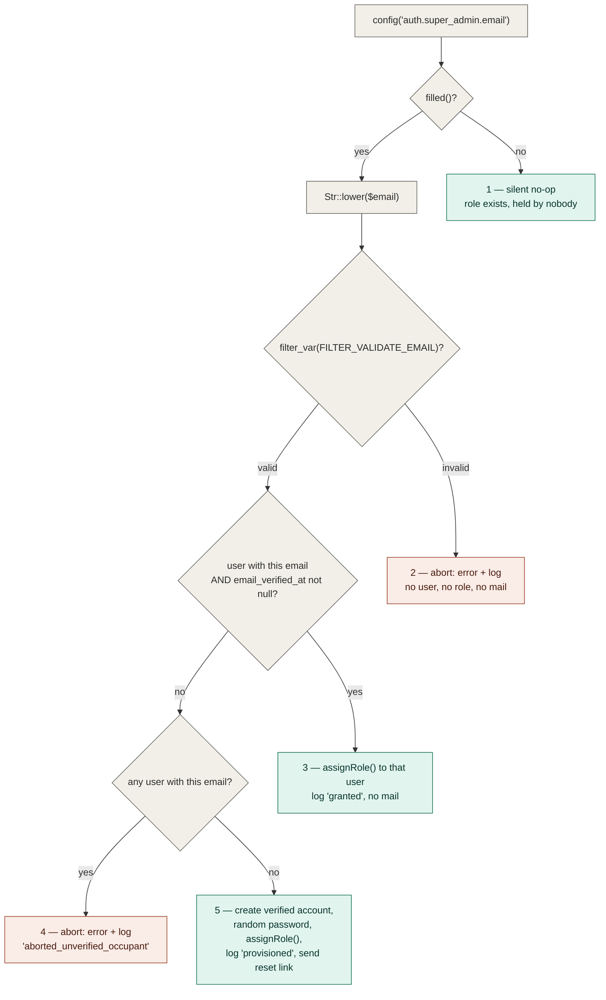

# Authorization — Overview, permission catalog and seeding

> Part of [Authorization](../authorization.md). **Read this part when:** you need the stack, the current authorization state, the permission catalog, the seeded roles and their grants, how they are seeded, or the Super Admin bootstrap. The other parts are listed in the [hub](../authorization.md#table-of-contents).

## Stack

`spatie/laravel-permission` (`^8.3`) with the `HasRoles` trait on the `User` model:

```php
// app/Models/User.php
use Spatie\Permission\Traits\HasRoles;

class User extends Authenticatable implements PasskeyUser
{
    /** @use HasFactory<UserFactory> */
    use HasFactory, HasRoles, HasUuids, Notifiable, PasskeyAuthenticatable, TwoFactorAuthenticatable;
}
```

## Current state

The authorization foundation is **live and in real use**: roles and permissions are seeded, the package's middleware aliases are registered, a `Gate::before` hook grants the Super Admin role a blanket bypass, and — since task 0004 — the first gated route and the first policy exist.

- Two roles are seeded — `Super Admin` and `Administrator` — both on the `web` guard.
- A 43-permission catalog is seeded under the `<module-slug>.<action>` convention — 38 until story 0019 added the tenth module slug, `media`, and 42 until story 0051 added `orders.refund`, the catalog's first non-CRUD permission on a non-`roles` module.
- `role`, `permission`, and `role_or_permission` are registered as middleware aliases in [`bootstrap/app.php`](../../../bootstrap/app.php) and enforce server-side (403).
- `App\Providers\AppServiceProvider::configureAuthorization()` installs the Super Admin `Gate::before` bypass.
- **`users.index` (`GET /users`) is the first permission-gated route**, and it is gated with **`can:users.view`** rather than Spatie's `permission:` middleware — a Livewire-specific correctness requirement, not a style choice. See [How to gate something](how-to-gate.md#gating-a-livewire-route-use-can-never-permission).
- **[`App\Policies\UserPolicy`](../../../app/Policies/UserPolicy.php) is the first policy** in the app, called from [`App\Livewire\Users\Index`](../../../app/Livewire/Users/Index.php). See [Policies](policies-users-roles.md#policies).
- **Since task 0008 the `Super Admin` role itself is a fixed point of the system** — categorically undeletable, unrenameable, un-re-permissionable and absent from every roles list — enforced on [`App\Models\Role`](../../../app/Models/Role.php), the app's own role model, which is now the **only** role model class application code may use. See [The Super Admin role's invariants](super-admin.md#the-super-admin-roles-invariants).
- **Since task 0008a the Administrator tier has one identity and the tier's authorization lives in the actions**, not in the Livewire component: `App\Models\Role::isAdministratorRole()` is the single row-shaped predicate, and [`App\Actions\Users\CreateUser`](../../../app/Actions/Users/CreateUser.php) / [`UpdateUser`](../../../app/Actions/Users/UpdateUser.php) refuse an unprivileged caller on their own. See [The Administrator tier's identity](administrator-tier.md#the-administrator-tiers-identity).
- **Since task 0009 the *role* side of the Administrator tier is enforced too, and a third authorization category exists**: `RolePolicy` gained an Administrator-level branch on `update()`/`delete()`, a Super-Admin-only `grantAdministratorPermission` ability, and [`App\Actions\Roles\EnforceAdministratorPermissionGrant`](../../../app/Actions/Roles/EnforceAdministratorPermissionGrant.php) — which enforces a **meta**-rule (who may *grant* a permission, as opposed to who may exercise it). See [`RolePolicy`](policies-users-roles.md#rolepolicy--the-second-policy) and [Who may grant a permission](grant-meta-rules-and-ui-hints.md#who-may-grant-a-permission--the-meta-rule-layer).
- **Since task 0010 roles are managed from the application itself**, which changes three things at once. `roles.index` (`GET /roles`, gated `can:roles.manage`) is the **second** permission-gated route and [`App\Livewire\Roles\Index`](../../../app/Livewire/Roles/Index.php) is `RolePolicy`'s **first call site** — so the policy stopped being a layer built ahead of its consumer. The `Administrator` role became **partially immutable** (name locked, never deletable, permission set still editable) now that code exists which could rename or delete it. And a second grant meta-rule shipped, [`App\Actions\Roles\EnforceGrantorPermissionScope`](../../../app/Actions/Roles/EnforceGrantorPermissionScope.php), refusing a payload that newly grants a permission the actor does not hold. See [The Administrator tier's immutability](administrator-tier.md#the-administrator-tiers-immutability-name-locked-undeletable-permissions-still-editable) and [Who may grant a permission](grant-meta-rules-and-ui-hints.md#who-may-grant-a-permission--the-meta-rule-layer).

- **Since task 0013 the *navigation* is gated too, and it is gated by data rather than by Blade.** [`config/modules.php`](../../../config/modules.php) is this repo's first declarative permission-driven UI registry: a sidebar entry renders only when the Gate grants that entry's configured ability, an emptied group renders no heading at all, and a later epic plugs its module in by appending one entry — no component change. Hiding a link is presentation only; the enforcement is still the route's `can:` gate (task 0012). See [The second half of a module gate](how-to-gate.md#the-second-half-of-a-module-gate-the-sidebar-registry).

- **Since task 0015a there is a *third* authorization layer, and it is not an ability.** Route middleware and policies both ask questions about the account; neither asks whether the person at the keyboard is still the account holder, which a hijacked or unattended session passes trivially. [`App\Actions\Auth\EnsureRecentPasswordConfirmation`](../../../app/Actions/Auth/EnsureRecentPasswordConfirmation.php) requires a **recently confirmed password** before five specific writes on the Users screen — another user's role, status or email; a deletion; an Administrator-tier creation — reusing Laravel's own `password.confirm` session key and timeout rather than adding a second one. It is a direct throw rendering **423**, never a `Gate` check and never a `UserPolicy` ability, and it runs *after* every `Gate::authorize()` on its branch. See [Step-up authentication](step-up-and-refusal-logging.md#step-up-authentication--the-third-layer).

- **Since task 0015b every refusal on an admin screen is recorded, not only every success.** [`App\Actions\Auth\LogRefusedPrivilegedAttempt`](../../../app/Actions/Auth/LogRefusedPrivilegedAttempt.php) writes one `Log::warning('Privileged action refused', …)` line for each authorization *and* rate-limit refusal across `App\Livewire\Users\Index`, `App\Livewire\Roles\Index` (and, since task 0017, `App\Livewire\SalesRegions\Index`) plus the domain actions behind them — same shape at both layers, so a non-dashboard caller inherits the trace. The refusal itself is untouched: same exception, status, message and timing. See [Recording a refusal](step-up-and-refusal-logging.md#recording-a-refusal--what-every-gate-owes-the-audit-trail), and note that a refusal on the Users screen produces one of **two** message strings.

- **Since task 0017 all three copyable patterns on this page have been exercised by a screen that was not there when they were written.** `sales-regions.index` (`GET /taxes/sales-regions`, gated `can:sales-regions.view`) is the **third** permission-gated route and [`App\Policies\SalesRegionPolicy`](../../../app/Policies/SalesRegionPolicy.php) the **third** policy — both built by *following* [the module-gate pattern](how-to-gate.md#the-copyable-module-gate-pattern-and-the-three-alternatives-rejected) and [the refusal-logging recipe](step-up-and-refusal-logging.md#copyable-what-a-third-admin-screen-inherits) rather than by producing them, which is the first evidence either generalises. What the story genuinely adds is a **new kind of guard**: a **domain invariant** — a rule about the shape of the data ("exactly one Sales Region is the default, and it is always active") rather than about who may act. That guard's mechanics live in [security/model-instance-trust.md](../../security/model-instance-trust.md), not here; what belongs on this page is [where it sits relative to authorization](domain-invariants.md#a-domain-invariant-is-not-an-authorization-rule-and-does-not-live-here). That story's one incomplete half — no `config/modules.php` entry, so the screen was reachable only by URI — was **closed by task 0018**, which added a `groups.taxes` group and an `items.sales_regions` entry and edited no component to do it: completing the set — 0017 exercised the module gate and the refusal-logging recipe, and 0018 exercises the third, [the sidebar registry](how-to-gate.md#the-second-half-of-a-module-gate-the-sidebar-registry), which is now the first of the three with proof that it really is extended by appending *data* rather than by editing a component.
- **Since story 0019 the catalog itself has grown for the first time, and a gated surface exists with no route behind it.** `media` is the **tenth** module slug — the first change to `RolePermissionSeeder::MODULES` since task 0002 wrote it — taking the catalog from 38 permissions to **42** and `Administrator`'s grants from 37 to **41**; what that amendment costs, and the one thing it silently breaks, are in [The `media` module](#the-media-module-and-what-a-catalog-amendment-costs). [`App\Policies\MediaPolicy`](../../../app/Policies/MediaPolicy.php) is the **fourth** policy and the second with no target-dependent branch, and it defends a **modal-only** component: PRD §2.3 makes the media gallery something Products and Blog embed rather than a page, so there is no `GET /media`, no `can:` middleware and no sidebar entry — the in-component `Gate::authorize()` calls are the entire perimeter rather than the second of two layers. Story 0020 turned that observation into this page's **fourth copyable pattern**, off the back of a real Medium finding: [a routeless component has no per-request authorization backstop](policies-variants-and-routeless.md#a-routeless-livewire-component-has-no-per-request-authorization-backstop), so `mount()`-only gating — correct on all three routed screens — leaves every later call unguarded here. See [`MediaPolicy`](policies-sales-media-categories.md#mediapolicy--the-fourth-policy-and-the-first-behind-no-route-at-all).

- **Since story 0051 the catalog carries its first non-CRUD permission on a module that is not `roles`.** `orders.refund` is added via a new `RolePermissionSeeder::ORDER_PERMISSIONS` constant, mirroring `ROLE_PERMISSIONS`'s own shape — `RolePermissionSeeder::MODULES` and `::ACTIONS` are untouched, so this is not an eleventh module slug the way `media` was a tenth. [`App\Actions\Orders\RecordRefund`](../../../app/Actions/Orders/RecordRefund.php) gates on it with a bare `Gate::authorize('orders.refund')` — deliberately **not** an `OrderPolicy` ability, since refusing a refund by the order's *payment state* is a `ValidationException`, not a 403, and expressing that as a policy method would make it inert for a Super Admin actor via `Gate::before` (see [A rule that must bind a Super Admin actor cannot go through `Gate`](administrator-tier.md#a-rule-that-must-bind-a-super-admin-actor-cannot-go-through-gate)). The reusable fact this establishes: a module may carry an ability outside the four-verb grid, added via its own seeder constant, without needing a new module slug — and on the Roles screen it renders in the [separately-rendered non-CRUD list](#permission-catalog), never in the module x action matrix, the identical rendering path `roles.manage`/`roles.manage-administrators` already use.

Still **ungated**: every route in [`routes/settings.php`](../../../routes/settings.php) and the `dashboard` route, which carry only `auth` / `verified` / `password.confirm`. Those are per-user settings screens with no catalog permission behind them; the module screens of PRD Epics 2–5 will gate the same way `users.index` and `roles.index` do. The `dashboard` route's sidebar entry is correspondingly the one registry item that ships with an empty `permissions` list, and it is allow-listed by name in a test so a second cannot join it silently.

## Permission catalog

**Naming convention: `<module-slug>.<action>`**, dot notation, mirroring this repo's `<resource>.<action>` route-naming convention (see [conventions/naming.md](../../conventions/naming/routes-and-permissions.md#permission-names)).

The catalog is defined as public constants on the seeder so that every consumer reuses one definition instead of restating the strings:

```php
// database/seeders/RolePermissionSeeder.php
public const MODULES = [
    'users', 'products', 'sales-regions', 'shipping', 'payment-methods',
    'customers', 'orders', 'blog', 'store-languages',
];

public const ACTIONS = ['view', 'create', 'edit', 'delete'];

/**
 * Non-CRUD permissions that sit outside the module x action grid.
 *
 * @var array<int, string>
 */
public const ROLE_PERMISSIONS = ['roles.manage', 'roles.manage-administrators'];

/**
 * Non-CRUD permissions on the orders module that sit outside the module x action grid.
 *
 * @var array<int, string>
 */
public const ORDER_PERMISSIONS = ['orders.refund'];
```

Ten modules × four actions = **40**, plus the two role-management permissions and the one order-refund permission = **43** total. (Nine modules and 38 total until story 0019 appended `media` to `MODULES`; 42 total until story 0051 added `ORDER_PERMISSIONS` — see [The `media` module, and what a catalog amendment costs](#the-media-module-and-what-a-catalog-amendment-costs) below.)

| Module slug | Covers | Permissions |
| --- | --- | --- |
| `users` | user accounts | `users.view`, `users.create`, `users.edit`, `users.delete` |
| `products` | products, product categories and variants | `products.view`, `products.create`, `products.edit`, `products.delete` |
| `sales-regions` | sales regions & taxes | `sales-regions.*` (4) |
| `shipping` | shipping methods & rates | `shipping.*` (4) |
| `payment-methods` | payment methods | `payment-methods.*` (4) |
| `customers` | customers | `customers.*` (4) |
| `orders` | orders | `orders.*` (4) |
| `blog` | blog posts, categories and tags | `blog.*` (4) |
| `store-languages` | store languages / internationalization | `store-languages.*` (4) |
| `media` | the Shared Media Gallery — uploaded images and their `.webp`/`.avif` variants | `media.*` (4) |

Plus, outside the grid:

| Permission | Meaning |
| --- | --- |
| `roles.manage` | manage roles and their permission grants |
| `roles.manage-administrators` | manage administrator-level roles and users |
| `orders.refund` | record a refund against an order's line items (story 0051) |

Granularity is deliberately **coarse per module**: `products.*` covers categories and variants, `blog.*` covers categories and tags — matching the PRD's module list rather than splitting sub-resources. `users.*` and `roles.*` are separate namespaces because the PRD gates them separately. `orders.refund` sits alongside the two `roles.*` non-CRUD entries rather than inside `orders.*`'s own four-verb row above — it is a *module's* own non-CRUD ability, added via its own `ORDER_PERMISSIONS` constant rather than a new module slug or a new `ACTIONS` verb (story 0051, D-3).

> **These strings are canonical.** They are the only permission names that exist in the database. Every call site must use them verbatim — `can('roles.manage-administrators')`, not a prose restatement — because `can()` / `hasPermissionTo()` against an unseeded name throws `PermissionDoesNotExist`. A story that needs a new permission adds it to `MODULES` / `ACTIONS` / `ROLE_PERMISSIONS` here, never as a string only its own code knows about.

### The `media` module, and what a catalog amendment costs

Story **0019** is the first story since **0002** wrote this catalog to change it, and it is worth reading as the reference case — because the paragraph directly above ("a story that needs a new permission adds it to `MODULES`") is a one-line instruction whose real cost is not one line.

**The production diff genuinely is one line plus a docblock word**: `'media'` appended to `RolePermissionSeeder::MODULES`, and *"The nine PRD modules"* → *"The ten PRD modules"*. Nothing else in `database/seeders/`, nothing in `config/permission.php`, and **no migration** — permissions are seeded *rows*, not schema, so `create_permission_tables` does not move. The seeder body needed no structural change either, and each reason is a property worth knowing before the next module lands:

- `allPermissionNames()` recomputes from the constants, so the four new names appear with no second edit.
- `Permission::firstOrCreate()` makes a re-seed idempotent: an already-seeded environment gains exactly four rows and duplicates nothing.
- `$administratorRole->syncPermissions(...)` re-syncs the **full** set, so an existing `Administrator` role really is extended on re-seed rather than left at its old grants. `tests/Feature/Seeders/RolePermissionSeederTest.php` now covers this as an explicit upgrade path (*"re-seeding an environment that predates the media module adds its four permissions idempotently"*), added by story 0019's Phase 5 review — the catalog had tests for being *created* and none for *growing*.
- Both `PermissionRegistrar::forgetCachedPermissions()` calls — the one inside the transaction and the one after it — already cover the new rows. **Do not touch either**; the post-commit one is what stops a concurrent worker caching the pre-`media` snapshot for Spatie's 24-hour TTL (see [security/authorization-patterns.md](../../security/authorization-patterns/bypass-cache-and-guards.md#flush-the-permission-cache-after-the-transaction-commits-never-inside-it)).

**The cost is everywhere the old number was written down.** Fifteen assertions across two already-green test files hardcode 38/37, plus a test name and an inline module dataset — and story 0019's own first draft of that list was wrong on **every line number** and missed three sites entirely, caught at its Phase 2 review. Those counts are hardcoded on purpose: deriving them from `MODULES` would make the assertion `count(constants) === count(constants)`, which passes no matter what the seeder writes to the database. **A literal that must be edited deliberately is the tripwire, and re-grepping is how you find every copy of it:**

```bash
grep -rn "\b37\b\|\b38\b" tests/Feature/Seeders/   # before editing, and again before declaring done
grep -rn "\b38\b\|\b37\b" docs/                    # the same number is prose in eight documents
```

> ⚠️ **A new module slug does not come with a rendered label, and nothing fails when it is missing.** The Roles screen composes each matrix row's label as `__('roles.modules.'.str_replace('-','_',$module))` ([conventions/naming.md](../../conventions/naming/translation-keys-and-booleans.md#translation-keys)), so a module with no leaf in `lang/{en,es}/roles.php`'s `modules` array renders its **raw key** — `roles.modules.media` — in the permission matrix. **This ⚠️ said until 2026-08-29 that `media` shipped without that leaf. It did not — the claim was false when written, and is corrected here rather than deleted** (`lang/en/roles.php` has `'media' => 'Media'` and `lang/es/roles.php` has `'media' => 'Medios'`, both present in story 0019's own tree and untouched since). It is the **second** false "verified" finding from that story's Phase 6 pass, alongside the refusal-logging one on [`MediaPolicy`](policies-sales-media-categories.md#mediapolicy--the-fourth-policy-and-the-first-behind-no-route-at-all) below; both were gaps the pass went looking for and reported without the gap existing, and [errors-log.md](../../errors-log/2026-08-28-to-2026-08-31.md#one-docs-pass-reported-two-gaps-that-were-not-there-both-marked-verified--2026-08-29) owns why that happened twice. **The rule itself is unchanged and is why this paragraph stays**: a module with no leaf renders its raw key, nothing fails, and the seeder tests cannot see it because they assert names and counts rather than rendered copy — **so adding a module means adding its `roles.modules.<slug>` leaf to both locales in the same change.** `media` is the evidence that this is doable rather than the evidence that it gets missed.

**Deployment note:** an already-deployed environment does not gain `media.*` until `db:seed` is re-run. Seeding is already a documented required deployment step ([schema.md](../../database/schema-users-auth.md#roles-permissions-model_has_roles-model_has_permissions-role_has_permissions)) — but note what a *partial* upgrade looks like, since story 0019 recorded it as an accepted risk rather than fixing it: an environment that has run this story's migration and **not** re-seeded reaches `MediaPolicy::viewAny()`, which calls `hasPermissionTo('media.view')` against a name that does not exist yet, and throws `PermissionDoesNotExist` → a **500**, not a clean 403. That is the pre-existing shape every policy shares — six now, since story 0023's `ProductCategoryPolicy` and story 0024's `ProductPolicy` (see [`RolePolicy`](policies-users-roles.md#rolepolicy--the-second-policy)'s own note) — not something `MediaPolicy` introduced.

## Seeded roles and their grants

| Role | Guard | Explicit permission rows | How it authorizes |
| --- | --- | --- | --- |
| `Administrator` | `web` | **42 of 43** — everything except `roles.manage-administrators` | normal Spatie grants |
| `Super Admin` | `web` | **0 of 43** | the [`Gate::before` bypass](super-admin.md#the-super-admin-bypass) |

`roles.manage-administrators` is seeded but held by **no role**: only the Super Admin can exercise it, and it does so through the bypass rather than through a grant.

The `Super Admin` role is created and then left alone — its permissions are never synced, granted, or revoked, not even with an empty `syncPermissions([])`. Its zero-permission state is a consequence of never being granted anything. `syncPermissions()` has exactly one call site in the seeder, on `Administrator`, so re-running repairs drift on that role only.

Since task 0008 that "left alone" is enforced rather than merely observed, and the seeder's own create call is the **one sanctioned exception** to the enforcement. Task 0010 made the same true of `Administrator`, so both roles are now created through a named, guard-bypassing factory method rather than a raw `firstOrCreate()`:

```php
// database/seeders/RolePermissionSeeder.php
// firstOrCreateSuperAdminRole() / firstOrCreateAdministratorRole() are the two
// sanctioned ways to bring these roles into existence -- both bypass the
// `creating` guard (App\Models\Role::boot()) that otherwise refuses any role
// acquiring either locked name (story 0008 F3 for Super Admin; story 0010
// Phase 4 finding F1 for Administrator), and both fail loudly on the
// case-insensitive collation collision documented on each method.
$superAdminRole = Role::firstOrCreateSuperAdminRole();

$administratorRole = Role::firstOrCreateAdministratorRole();
```

The two methods are deliberate mirror images — same `withoutEvents()` bypass, same byte-exact read-back of the persisted name, same `ImmutableRoleException` on a collision. **The asymmetry that remains is narrower than it used to be**: both *names* are now locked, but only the Super Admin role's *permission set* is. See [The Super Admin role's invariants](super-admin.md#the-super-admin-roles-invariants) and [The Administrator tier's immutability](administrator-tier.md#the-administrator-tiers-immutability-name-locked-undeletable-permissions-still-editable).

## Seeding

[`database/seeders/RolePermissionSeeder.php`](../../../database/seeders/RolePermissionSeeder.php) is the **only** source of roles and permissions. The application is non-functional until it has run, so seeding is a **required deployment step**, not a developer convenience.

```bash
# production / any deploy — run the narrow, targeted form
php artisan db:seed --class=RolePermissionSeeder
```

Prefer that targeted invocation over a bare `php artisan db:seed`: `DatabaseSeeder` also creates a `test@example.com` fixture account, and the narrow form means no fixture seeder added later can reach production at all. The fixture itself is guarded by an explicit environment **allow-list**:

```php
// database/seeders/DatabaseSeeder.php
public function run(): void
{
    // N4 — allow-list, not "not production": staging/demo/qa are internet-reachable too.
    if (app()->environment(['local', 'testing'])) {
        User::factory()->create([
            'name' => 'Test User',
            'email' => 'test@example.com',
        ]);
    }

    $this->call(RolePermissionSeeder::class);
}
```

✅ Good — `app()->environment(['local', 'testing'])` is exact-match on `APP_ENV`, so `staging`, `demo`, `qa` and every future environment name are excluded by default.
❌ Bad — `if (! app()->isProduction())`, the deny-list form this replaced: it reads as equivalent but still creates a publicly-known credential everywhere that merely *isn't* named `production`. See [security/seeder-safety.md](../../security/seeder-safety.md#never-put-development-only-accounts-in-an-unguarded-databaseseeder) for the full reasoning.

`$this->call(RolePermissionSeeder::class)` stays unconditional and runs in every environment, production included.

Two properties of the seeder are load-bearing:

- **Idempotent.** Roles and permissions are created with `firstOrCreate`, and `Administrator`'s grants are re-applied with `syncPermissions()`, so re-running converges: nothing is duplicated and a manually revoked permission is restored.
- **The permission cache is flushed twice.** `DatabaseSeeder` uses `WithoutModelEvents`, which suppresses the model-event-driven cache flush Spatie normally performs, so the seeder flushes explicitly — once *inside* the transaction before `syncPermissions()` (so the sync resolves the rows just inserted rather than a stale cache), and once *after* the transaction commits. Neither substitutes for the other; see [security/authorization-patterns.md](../../security/authorization-patterns/bypass-cache-and-guards.md#flush-the-permission-cache-after-the-transaction-commits-never-inside-it) for why the post-commit flush cannot be dropped.

## Super Admin bootstrap

The `Super Admin` role is assignable **only** through the seeder or direct database access — nothing in the dashboard exposes it. Which user receives it is driven by one config value:

```php
// config/auth.php
'super_admin' => [
    'role' => RoleName::SuperAdmin->value,
    'email' => env('SUPER_ADMIN_EMAIL'),
],
```

`'role'` compiles in [`App\Enums\RoleName::SuperAdmin`](../../../app/Enums/RoleName.php) rather than a bare string (task 0008), so the literal `'Super Admin'` is written in exactly one place in the codebase. The enum is **only** that default — nothing compares a role row against it; see [The Super Admin role's invariants](super-admin.md#the-super-admin-roles-invariants).

`SUPER_ADMIN_EMAIL` is read through `config()`, never `env()` outside `config/`, so `config:cache` is safe. The address is normalized with `Str::lower()` before anything else happens — every email address in this system is canonically lowercase, so `Admin@Example.com` and `admin@example.com` are the same address by definition.

`RolePermissionSeeder::bootstrapSuperAdmin()` then takes exactly one of five branches:



| # | Configured value | Outcome | What the operator does |
| --- | --- | --- | --- |
| 1 | unset or blank | total no-op — the role exists, assigned to nobody | set the variable and re-seed when ready |
| 2 | not a well-formed address | **abort**: console error naming the rejected value + `Log::warning` (`outcome: aborted_invalid_format`). No account, no grant, no mail | fix the value, re-run the seeder |
| 3 | matches a user whose `email_verified_at` is **not null** | that user is granted `Super Admin`; logged as `outcome: granted`. **No mail is sent** — the account already has an owner | nothing |
| 4 | matches a user that is **unverified** | **abort**: console error + `Log::warning` (`outcome: aborted_unverified_occupant`). No role granted to anyone, no second account inserted, no mail | have that account's owner verify their address, or free the address up, then re-run |
| 5 | matches no user at all | the account is **provisioned**: created with a cryptographically random password, `email_verified_at` forced, granted the role (`outcome: provisioned`), and a Fortify password-reset link emailed | claim the account via **Forgot password** using the emailed link |

Three rules this encodes:

- **Verification is proof of mailbox ownership, and the grant requires it.** The lookup itself carries `whereNotNull('email_verified_at')` — an unverified row is not a match. A row merely *carrying* the configured address proves nothing: self-registration is enabled, and `App\Livewire\Settings\Profile` lets any signed-in user move their account onto an arbitrary address. Without this condition, squatting on the address an operator intends to use later wins Super Admin on the next reseed. See [errors-log.md](../../errors-log.md) for the incident that established this rule.
- **An abort degrades to "no grant", never to "no catalog".** Branches 2 and 4 `return` rather than throw. The bootstrap runs inside the seeder's `DB::transaction(...)`, so throwing would roll back the roles and the entire 43-permission catalog with it.
- **Every grant, provision and abort is written to the application log**, not only echoed to the console. `Seeder::$command` is `null` whenever the seeder runs outside an Artisan context, so console-only reporting can leave a privilege grant with no trace anywhere. Each entry carries `email`, `user_id` (where one exists) and a machine-readable `outcome` — and never the generated password.

The generated password is never printed, logged, returned, or stored anywhere but the hashed column; the account is unusable until the operator completes the reset. The reset itself reuses the app's existing Fortify broker (`Password::broker()->sendResetLink(...)`) — the same flow documented in [authentication.md](../authentication/features-registration-and-status.md#registration--password-reset) — with no bespoke invite token or route. A delivery failure is `report()`ed to error tracking and downgrades to a console warning; it never fails the seed, because losing the whole catalog to a misconfigured SMTP host would be the worse outcome.

Bootstrapping is idempotent: a provisioned account is created **verified**, so the next run matches branch 3 — no second account, no second reset email.
