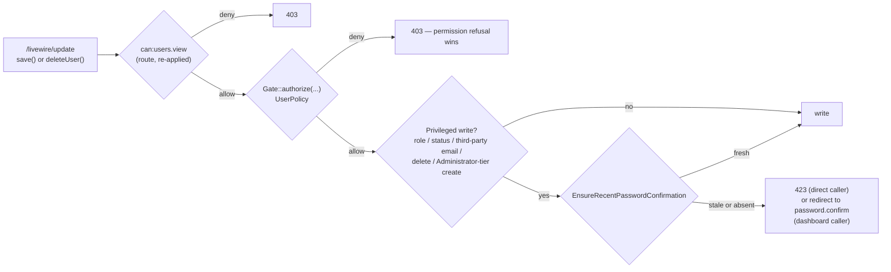

# Authorization — Step-up authentication and refusal logging

> Part of [Authorization](../authorization.md). **Read this part when:** you touch password-confirmation step-up guards or `LogRefusedPrivilegedAttempt` refusal logging. The other parts are listed in the [hub](../authorization.md#table-of-contents).

## Step-up authentication — the third layer

Task 0015a added a layer this page did not have. Route middleware and policies both answer questions about the **account**; neither answers a question about the **person**, and a hijacked, borrowed or simply unattended session passes both perfectly. Step-up authentication is the app's answer to that third question, and it is a distinct layer rather than a variation on the two above:

| Layer | Question it answers | Mechanism | Where it runs |
| --- | --- | --- | --- |
| Route middleware | *Are you signed in, and do you hold the ability at page level?* | `auth`, `verified`, `can:<permission>` | `routes/*.php`, per route |
| Policies | *May you do this to **this target**?* | `App\Policies\*`, via `Gate::authorize()` | first statement of each mutating/disclosing method, and inside the write actions |
| **Step-up** | ***Is the person at the keyboard still the account holder?*** | `App\Actions\Auth\EnsureRecentPasswordConfirmation` — a direct throw, not a `Gate` check | in-method, **after** every `Gate` call on the branch and above the first write |

The mechanical rules — the exact session key and comparison it reuses, the confirmed-safe vendor behaviour, and the two doors it still leaves open — live in [security/step-up-authentication.md](../../security/step-up-authentication.md). This section is what the layer *is* and where it sits.

### What it protects, and what it deliberately does not

The layer is scoped to the five highest-value writes on the Users screen, and to nothing else in the app:

| Operation | Step-up required? | Enforced in |
| --- | --- | --- |
| Change **another** user's role | ✅ yes | `App\Actions\Users\UpdateUser` |
| Change **another** user's status | ✅ yes | `App\Actions\Users\UpdateUser` |
| Change **another** user's email | ✅ yes | `App\Actions\Users\UpdateUser` |
| Delete a user | ✅ yes | `App\Livewire\Users\Index::deleteUser()` |
| Create an **Administrator-tier** user | ✅ yes | `App\Actions\Users\CreateUser` |
| Change another user's **name only** | ❌ no | — |
| Any **self-edit** (own name, own email, or a submitted role/status that is silently no-op'd) | ❌ no | — |
| Create an **ordinary-role** user | ❌ no | — |
| Everything on the Roles screen, and every other screen | ❌ no | — |

The narrowness is the design, not an omission: an over-block is a usability regression that trains administrators to click through the prompt, which weakens the control. Two of those exemptions are worth stating explicitly because a reader will otherwise assume they are oversights.

- **A self-edit is exempt structurally, not by a second condition.** `UpdateUser::__invoke()` calls `authorizeRoleAndStatusChange()` only when `! $isSelfEdit`, and the step-up guard is the last statement of that method — so a self-service email change, and a self-edit that submits a different role (which this action already no-ops), reach no step-up check by construction. A future refactor that hoists the guard out of that method loses the exemption silently.
- **Ordinary-role creation is exempt.** `CreateUser` fires the guard only on the branch that already asked `promoteToAdministrator`. That branch was added by decision **D6** (Phase 4 finding F1) after the audit observed that a hijacked session denied the ability to *promote* an existing user could still **mint** a brand-new, independently-credentialed Administrator account with the invitation link mailed to an attacker-chosen address — a durable escalation that outlives the hijacked session.

### Why it is an in-method check and not route middleware

Not a preference — forced by vendor behaviour, and the same fork that produced [`can:` over `permission:`](how-to-gate.md#gating-a-livewire-route-use-can-never-permission). `password.confirm` resolves to `Illuminate\Auth\Middleware\RequirePassword`, which is **not** on Livewire 4's `PersistentMiddleware` allow-list. Putting `->middleware(['password.confirm'])` on `routes/users.php` would protect the initial `GET /users` and leave every `/livewire/update` round trip — which is where `save()` and `deleteUser()` actually run — unguarded, while additionally blocking a name-only edit the layer deliberately exempts.

`routes/users.php` is therefore **unchanged** by task 0015a, and so is `App\Policies\UserPolicy`. The `PersistentMiddleware` allow-list and this row's now-shipped worked example are in [security/livewire-authorization.md](../../security/livewire-authorization/entry-point-and-method-gates.md#livewireupdate-is-a-second-entry-point-and-only-an-allow-listed-subset-of-route-middleware-follows-the-component-there).

### Why it is not a `UserPolicy` ability

Three independent reasons, each sufficient on its own:

1. **`Gate::before` would make it inert for the actor it most needs to bind.** The Super Admin bypass grants every ability before any policy method runs, so a `Gate`-mediated freshness rule would exempt the most privileged session in the app — the exact inversion. This is the same reasoning already recorded for [a rule that must bind a Super Admin actor](administrator-tier.md#a-rule-that-must-bind-a-super-admin-actor-cannot-go-through-gate), applied to a rule that is not an ability at all.
2. **Freshness is not a property of the actor/target pair.** Every policy method here answers "may *this actor* do *this* to *this target*". Whether a password was confirmed twenty minutes ago is a property of the **session**, identical for every target, and a policy is the wrong place to hang it.
3. **The refusal must be distinguishable from a permission refusal.** A policy failure is an `AuthorizationException` → 403, which reads as "you may not do this". Step-up refuses an actor who *does* hold the permission, so it throws `App\Exceptions\PasswordConfirmationRequiredException` rendering **423 Locked** — the status `RequirePassword` itself returns on its own JSON branch, so the app converges on the framework's choice rather than inventing one. It sits beside `ImmutableRoleException` (403) and `RoleInUseException` (409) in `app/Exceptions/`.

### Ordering: the permission refusal always wins

The single rule most easily inverted, and inverting it produces the opposite of the control's intent. **The guard runs strictly after every `Gate::authorize()` call on its branch, and still above the first write** — both are satisfiable at once because each guard sits above its action's `DB::transaction()`.



Putting the guard first would prompt an actor who may not perform the action at all to re-enter their password — a needless credential surface — and would disclose that the target row resolved and that every preceding check passed. **A branch with no preceding `Gate` call is not an exemption**: on an ordinary-to-ordinary role change neither `promoteToAdministrator` nor `downgrade` fires, but the role still changed, so the guard still must.

### Two callers, two refusal shapes

The same exception reaches two different audiences and is handled differently on purpose — these are not alternatives to pick between:

- **A direct caller** (a future API endpoint, an Artisan command, a direct-call test) lets `PasswordConfirmationRequiredException` propagate and gets its own **423** response.
- **The dashboard** catches it in `save()` / `deleteUser()`, logs `Log::warning('Step-up password confirmation required', ['actor_id' => …, 'action' => …, 'user_id' => …])` — a step-up refusal is the strongest available signal of a hijacked session, and was the one event on this screen invisible to the audit trail task 0015 established — then sets the intended URL back to `users.index` and issues `$this->redirect(route('password.confirm'))`. A returned `Redirector` would not navigate from a Livewire action method, and the POST to `/livewire/update` is not the GET that `RequirePassword::redirectGuest()` normally populates `url.intended` from.

### The UI hint reuses the guard's own predicate

Same rule as [`Gate::allows()` in a list query](grant-meta-rules-and-ui-hints.md#gateallows-in-a-list-query-is-a-ui-hint-not-a-layer), one layer over: the create/edit and delete modals warn *before* the administrator commits, and each notice is gated on `App\Livewire\Users\Index::requiresPasswordConfirmation()`, which calls `EnsureRecentPasswordConfirmation::isRecentlyConfirmed()` rather than re-deriving the comparison. The throwing `__invoke()` is a three-line wrapper around that same predicate, so there is exactly one comparison in the app and the hint cannot drift from the rule.

Two notices carry a **second** predicate beside it, and both exist because a notice that promises a prompt which never arrives is worse than no notice: the edit modal is additionally gated on `! isEditingOwnRow()` and the delete modal on `! isDeletingOwnRow()` (a self-delete silently no-ops rather than throwing — see the `canDelete` drift above), and the create-form notice on `isAdministratorRoleSelected()`, which mirrors `CreateUser`'s own `Role::isAdministratorRole()` branch. The notices carry no capability — a `flux:callout` with a `data-test` hook and **no password field**; re-confirmation happens on Fortify's own screen, because a second in-modal password form would be a second confirmation flow with its own throttling and failure modes.

> ⚠️ **The layer's own barrier needed a rate limit that Fortify does not ship.** Once step-up made `password.confirm.store` the sole gate in front of these five operations, an attacker holding a hijacked session could guess the account's password against it without limit — that route consults no `config('fortify.limiters.*')` key, so there was nothing to configure. `App\Providers\FortifyServiceProvider::configurePasswordConfirmationRateLimiting()` (decision **D8**, finding F3) appends `throttle:confirm-password` (5/min, keyed like Fortify's own `login` limiter) to the already-registered vendor route from an `$this->app->booted()` callback. **Any later story that adds a second step-up-gated screen inherits this endpoint as its barrier too** — check the limiter still fits before widening the layer.

> ⚠️ **What this layer does *not* cover, recorded rather than implied.** `settings/security` still relies on route middleware alone, so its own `/livewire/update` round trips are not re-checked; and `settings/profile` lets an actor change their own email with **no** step-up check at all — the same self-service change `UpdateUser`'s `$isSelfEdit` exemption leaves alone, but for a narrower reason there. Both are pre-existing, both are named residuals in [security/step-up-authentication.md](../../security/step-up-authentication.md#-open-items-this-layer-still-does-not-close), and neither is closed by task 0015a.

> ✅ **The Customers screen (story 0044) does not adopt this layer at all, and that is a stated
> non-application recorded in the story's own D-7 — not a gap this page merely failed to mention.** None
> of the five step-up-gated Users operations in the table above has a Customers counterpart: a customer
> holds no role and no account status (there is no `customers.status` column, and the only lifecycle state
> is `deleted_at`), `customers.email` is contact data with no login, reset token, session or passkey keyed
> to it — unlike `users.email`, changing it takes over nothing — and deleting a customer removes a passive
> record from a list while preserving it (0042), revoking access from nobody. There is also no
> Administrator-tier concept for a customer to be created into. Since the layer's whole reason for existing
> is to ask "is the person at the keyboard still the account holder" about a **privileged write against an
> actor**, and a `Customer` row is never an actor, the layer would have nothing to bind — adding a password
> prompt in front of routine contact-data entry would be a pure usability regression bought with no
> security gain. `App\Livewire\Customers\Index` adds no call site for `EnsureRecentPasswordConfirmation`
> anywhere, and none of its methods redirects to `route('password.confirm')`. If a later story ever puts a
> privileged capability on a customer record, that story adds step-up and must knowingly reverse this
> decision — see [api/customers.md](../../api/customers.md#customersindex--the-ninth-permission-gated-route).

## Recording a refusal — what every gate owes the audit trail

Task 0015b. The three layers above decide **whether** an attempt proceeds; none of them records that it did not. Until this story every refusal in this app was correct and completely invisible — an actor repeatedly probing an `Administrator`-holding target, or hammering a rate-limited action, left nothing behind, while the *successful* mutations sitting beside them had been writing `Log::info` audit lines since task 0015. **Gating a method and knowing when the gate fired are two different properties, and the second one has to be built.** This section is the copyable pattern; it sits alongside [the module-gate pattern](how-to-gate.md#the-copyable-module-gate-pattern-and-the-three-alternatives-rejected) and [the sidebar registry](how-to-gate.md#the-second-half-of-a-module-gate-the-sidebar-registry) as the third thing a later epic's admin screen inherits rather than re-invents.

All three admin screens and the eight domain actions behind them now write exactly one structured line per refusal (two screens and five actions as of task 0015b; the Sales Regions screen and its three actions joined in task 0017, following this section rather than extending it):

```php
// app/Actions/Auth/LogRefusedPrivilegedAttempt.php — log()
Log::warning('Privileged action refused', [
    'actor_id' => $actor?->id,
    'ability' => $ability,
    'target_type' => $targetType,
    'target_id' => $targetId,
]);
```

Four properties of that line, each a decision rather than a default:

- **`Log::warning`, not `Log::info`.** A refusal is an anomaly, not an outcome. Putting it at a different level from the success lines is what makes "show me every refused attempt" a level filter rather than a message-substring grep.
- **The keys are generic (`target_type` / `target_id`), not per-domain.** The two screens' existing success lines already disagree — `Log::info('Role saved', ['role_id' => …])` versus `Log::info('User deleted', ['user_id' => …])` — and the step-up warning uses `user_id` + `action` on top of that. Rather than add a fourth shape, one pair of keys covers users, roles and any later admin screen. The pre-existing success lines and the step-up lines are **unchanged**; this is the shape new refusal logging adopts, not a migration of what already ships. **Task 0017 is the first screen to arrive after this decision and it needed no new key**: `target_type: 'sales_region'`, `target_id: <uuid>` — proof the generic pair was worth choosing over a per-domain one. Note the one thing that generic pair does *not* do automatically: `LogRefusedPrivilegedAttempt::resolveTarget()` auto-resolves only `User` and `Role` Gate targets (0015b's own two domains), so every Sales Regions call site passes `targetType:` / `targetId:` explicitly. A fourth screen does the same until someone widens the resolver.
- **The message string is a constant, never interpolated.** Interpolating a value into the message rather than into the context array is exactly how that value evades a structured-log filter.
- **The line records who attempted what against what, and nothing else** — no password, no invitation token, no email-change hash, no session id, no request body. `tests/Feature/Users/RefusalLoggingTest.php` asserts this against the recorded **context array** rather than a rendered string, so an added key cannot slip past a substring check.

### One helper, two halves — the same shape as the step-up guard

`App\Actions\Auth\LogRefusedPrivilegedAttempt` is deliberately built like its folder-mate [`EnsureRecentPasswordConfirmation`](#step-up-authentication--the-third-layer): a **throwing wrapper** for the `Gate`-shaped sites and a **non-throwing recorder** for everything else, so the "record" half and the "refuse" half cannot drift apart.

✅ Good — the throwing half, and a call site. The wrapper's own `authorize()` is what throws, so the refusal keeps its exact class, message and status:

```php
// app/Actions/Auth/LogRefusedPrivilegedAttempt.php — authorize()
$gate = Gate::forUser($resolvedActor);

if ($gate->denies($ability, $gateTarget)) {
    [$resolvedType, $resolvedId] = $this->resolveTarget($gateTarget, $targetType, $targetId);

    $this->log($resolvedActor, $ability, $resolvedType, $resolvedId);
}

$gate->authorize($ability, $gateTarget);
```

```php
// app/Livewire/Users/Index.php — confirmDelete()
$logRefusedPrivilegedAttempt->authorize('delete', $target);
```

❌ Bad — the shape this replaced at every site, and the shape a reader will reach for when adding the fifteenth one (adapted to illustrate; deliberately not present in the repo):

```php
// anti-pattern — one hand-written copy of the rule per call site
try {
    Gate::authorize('delete', $target);
} catch (AuthorizationException $e) {
    Log::warning('Privileged action refused', [...]);
    throw $e;
}
```

Three things make the wrapper the right shape rather than a stylistic preference:

- **One implementation of the rule, not fourteen-plus.** Hand-written `try/catch` at every site is the copy-the-rule pattern [base-standards.md](../../conventions/directory-structure/controllers-and-authorization-rule.md#an-authorization-rule-belongs-to-the-action-not-to-one-of-its-callers) forbids for the authorization rules themselves; the same reasoning binds their observability.
- **A `catch` around `Gate::authorize()` would over-attribute.** It also intercepts an `AuthorizationException` thrown by unrelated, nested authorization further down the call stack, and logs it under *this* ability. The `denies()`-then-`authorize()` shape evaluates the ability twice — an accepted, correctness-neutral cost, recorded in the class's own docblock so nobody "optimises" it back into a `catch`.
- **The actor is a parameter, not `Auth::user()`.** `EnforceAdministratorPermissionGrant` and `EnforceGrantorPermissionScope` authorize against a `User $actor` passed *into* them, precisely so a non-dashboard caller works; a bare `Auth::id()` would log `actor_id: null` for exactly the queued-job or Artisan caller the logging exists to serve. `$actor` defaults to `Auth::user()` only when omitted.

The non-throwing half is called immediately before an existing `throw` — a rate limiter, the self-lockout check, the holders-remaining check, or a direct `AuthorizationException` — never as a second, independent check that could disagree with it about whether the attempt was actually refused:

```php
// app/Livewire/Roles/Index.php — deleteRole()
if ($role->users_count > 0) {
    $logRefusedPrivilegedAttempt->log(Auth::user(), 'holders_remaining', 'role', $role->id);

    throw ValidationException::withMessages([
        'deletingRoleId' => trans_choice('roles.index.delete_blocked', $role->users_count, ['count' => $role->users_count]),
    ]);
}
```

For a non-`Gate` refusal the `ability` key carries a **short snake_case reason instead of an ability name**, chosen to be distinct from every real permission so a log filter cannot confuse the two: `create_rate_limited`, `email_change_rate_limited`, `email_change_aggregate_rate_limited`, `pending_email_conflict`, `assign_super_admin_role`, `super_admin_holder_protected`, `self_lockout`, `holders_remaining`, `grant_exceeds_scope`, and — from task 0017's two **domain-invariant** refusals — `default_must_be_active`, `default_deactivation_requires_replacement` — and, from story 0061, `category_still_in_use` (a blog category still referenced by a post, trashed ones included).

**Logging is observation, never handling.** Every refusal still reaches the user with the same exception class, the same status, the same message and the same validation field it did before — a log line that swallowed the exception would turn a hardening story into a security regression. `tests/Feature/Users/ActionRefusalLoggingTest.php` asserts the throw *and* the log on the same call, so neither can be satisfied without the other.

### ⚠️ A refusal on these screens produces one of **two** message strings

The single most likely mistake a defender will make against this log. Filtering for `'Privileged action refused'` alone silently drops the strongest hijacked-session signal the app emits. The second string is written only by the **Users** screen (it is the step-up layer's, and step-up gates nothing else yet) — but a defender filters the app, not a screen, so the hazard is unchanged by the Roles and Sales Regions screens emitting just the one:

| Message | Written by | Question it answers | Context keys |
| --- | --- | --- | --- |
| `Privileged action refused` | `App\Actions\Auth\LogRefusedPrivilegedAttempt` (task 0015b) | *Does the actor hold the permission, or have they exhausted a rate limit?* | `actor_id`, `ability`, `target_type`, `target_id` |
| `Step-up password confirmation required` | `App\Livewire\Users\Index` directly (task 0015a) | *Is the session's password confirmation still fresh?* | `actor_id`, `action`, `user_id` |

The two were shipped by different stories and are **deliberately not folded together**: they answer different questions, and reconciling two independently-audited conventions into one is a larger edit to closed code than either story's purpose. Both are `Log::warning` on the default channel, so a level filter catches both; a *message* filter needs both strings. Adding a third **refusal** message string should be a conscious decision, made here — task 0017 added none, and did not need to. Note the mirror-image rule on the **success** side, where the pressure runs the other way: `Log::info` success lines are deliberately *per-operation*, so 0017 ships three (`'Sales region updated'` / `'Sales region default changed'` / `'Sales region active state changed'`) rather than one shared line, matching `Roles\Index`'s `'Role saved'` / `'Role deleted'` and `Users\Index`'s three. A refusal filter wants few strings; an audit trail wants enough to tell a rate edit from a default move apart.

### What is deliberately **not** logged

Three refusal shapes are excluded, each decided rather than missed:

- **Every component's `mount()`** — all three logging screens, since task 0017 followed this rule rather than re-deciding it. (**`App\Livewire\Media\Gallery::mount()` is the deliberate counter-case and it *does* log**, because the exclusion's own reasoning inverts for it: that component has no route, so nothing checks the ability ahead of `mount()` and its refusal is the only one a real caller can reach. This bullet said the opposite until 2026-08-29 — see [`MediaPolicy`](policies-sales-media-categories.md#mediapolicy--the-fourth-policy-and-the-first-behind-no-route-at-all).) `UserPolicy::viewAny()`, `RolePolicy::viewAny()` and `SalesRegionPolicy::viewAny()` check the identical abilities the routes' own `can:users.view` / `can:roles.manage` / `can:sales-regions.view` middleware enforces, and `can:` **is** on Livewire's `PersistentMiddleware` allow-list — so a real HTTP actor who would fail `mount()` is refused by the route first and never reaches the component. The check stays (defence in depth against a direct `Livewire::test()` mount); logging it would only ever fire from a test. Each docblock records the tripwire: *if `viewAny()` ever gains a condition the route's `can:` ability does not check, this refusal becomes reachable over HTTP and must be logged.* See [security/livewire-authorization.md](../../security/livewire-authorization/entry-point-and-method-gates.md#gating-a-method-is-not-the-same-as-knowing-when-the-gate-fired).
- **The step-up refusal**, which already has its own line — see the table above.
- **`App\Models\Role`'s model-event guards** (`ImmutableRoleException` → 403, `RoleInUseException` → 409). These are deterministic state-based refusals: a caller cannot use them to probe permission boundaries, only real database state. Extending the pattern there is deferred rather than dropped.

  > ✅ **Story 0048 is that extension, and it makes a different call than this bullet's own "deferred" framing predicted.** `App\Exceptions\OrderNotEditableException` (409) is a state-based refusal in the identical sense — `Role`'s guards refuse on account of the row's own database state, not the actor — but `AddOrderItem`/`RemoveOrderItem`/`UpdateOrderItemQuantity` all call `LogRefusedPrivilegedAttempt::log()` immediately before the throw (Phase 4 finding F-6), so it does **not** join this bullet's exclusion list. The two state-based refusals in this app disagree on whether to log, and that is a decision each one makes on its own facts, not a rule this section states once for both: `Role`'s guards were judged not worth a log line (task 0010, never revisited); Orders' hard block was judged worth one from Phase 1, because a hijacked or over-privileged session repeatedly probing a `Shipped` order's editability is exactly the audit-trail signal this project's refusal-logging convention exists to capture. See [Order editability](domain-invariants.md#order-editability--the-second-state-based-refusal-and-the-shape-three-more-stories-copy) below.

### A shared action's rate-limit refusal needs a log ceiling

The one non-obvious constraint, and the story's own Phase 4 finding (F-1). `App\Actions\Users\RequestEmailChange` is called by the Users admin screen **and** by `App\Livewire\Settings\Profile::updateProfileInformation()` — self-service, `auth`-only, no permission gate. Instrumenting the action therefore instrumented a caller the story had explicitly declared out of scope, and `RateLimiter::attempt()` does not consume once exhausted: an unthrottled log call on that branch is an unbounded log-write primitive for **any authenticated user**, at zero cost to them.

The fix is a second, 1-attempt limiter gating **the log call only** — never the real limit, which is unchanged:

```php
// app/Actions/Users/RequestEmailChange.php
if (! RateLimiter::attempt($key, maxAttempts: 3, callback: fn (): bool => true, decaySeconds: 3600)) {
    if (RateLimiter::attempt('email-change-log:'.$key, maxAttempts: 1, callback: fn (): bool => true, decaySeconds: 3600)) {
        $this->logRefusedPrivilegedAttempt->log(Auth::user(), 'email_change_rate_limited', 'user', $user->id);
    }

    throw ValidationException::withMessages(['email' => trans('users.email_change.throttled')]);
}
```

Three rules generalise from it:

- **A distinct key prefix** (`email-change-log:`), so the ceiling's window can never collide with the real limiter's own key.
- **The ceiling key is as narrow as the refusal it describes.** All three log throttles key on `(target, actor)` — including the aggregate limiter's, whose own real key is target-only (Phase 5 finding R-3) — so a second administrator's refusal against a target a first administrator already triggered a log for is still recorded.
- **Gate the log, never the limit.** Over-logging under a race is the only failure direction; the ceiling sits *inside* the real refusal branch, so it has exactly one writer and cannot be poisoned to pre-suppress a genuine refusal.

`App\Actions\Users\CreateUser`'s rate-limit site is admin-only and needs no ceiling, but carries the identical shape anyway, so it cannot silently diverge if that action ever gains a second caller the way `RequestEmailChange` already has.

### Copyable: what a third admin screen inherits

> ✅ **The third screen shipped, and the recipe held.** Task 0017's Sales Regions screen followed all five steps below without needing a sixth, and without changing any of them. Two things it confirmed and one it added. Confirmed: the **generic `target_type`/`target_id` keys** absorbed a new domain with no schema change to the line, and step 4's equivalence test caught the shape drift it exists to catch. Added, and worth reading before writing step 1 for a fourth screen: `resolveTarget()` auto-resolves only `User` and `Role`, so every call site on a *new* domain must pass `targetType:` / `targetId:` explicitly — a fourth screen either does the same or widens the resolver, and the second is the better fix if a fifth is coming. The one step 0017 had no occasion to exercise is **step 3**: its actions have no rate limiter and no unprivileged second caller, so the log-ceiling rule remains proven only by `RequestEmailChange`.

1. Replace each `Gate::authorize($ability, $target)` with `$logRefusedPrivilegedAttempt->authorize($ability, $target)` — method-injected on a Livewire action method, constructor-injected in a domain action (see [code-style.md](../../conventions/code-style.md#exception-an-actions-own-dependency-is-constructor-injected-when-the-method-signature-is-a-public-contract)).
2. For each non-`Gate` refusal, call `->log(...)` on the line immediately above the existing `throw`, with a snake_case reason distinct from any permission name.
3. Add a log ceiling to any rate-limit site the screen shares with an unprivileged caller.
4. Pin the shape with an **equivalence test** that captures a refusal from the new screen and one from an existing screen in a single `Log::spy()` session and set-equates their key sets — `tests/Feature/Roles/RefusalLoggingTest.php` and `tests/Feature/Users/ActionRefusalLoggingTest.php` do this screen-to-screen and action-to-action respectively. Asserting each screen's shape in isolation lets two conventions drift into existence.
5. Add a must-not-over-log test beside each: a permitted create/edit/delete still writes its single `Log::info` success line and **no** warning.
