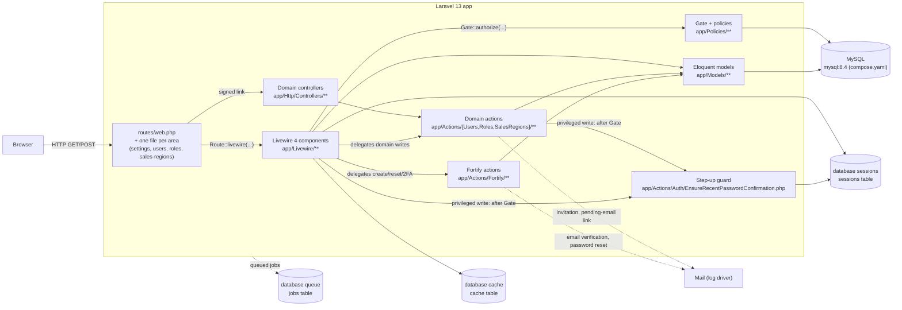

# Architecture Overview

## Table of Contents

- [What this application is](#what-this-application-is)
- [Request lifecycle](#request-lifecycle)
- [Runtime dependencies](#runtime-dependencies)
- [Cross-cutting concerns](#cross-cutting-concerns)
- [Deployment note](#deployment-note)
- [Where things live](#where-things-live)

## What this application is

`arospe` (Composer package `laravel/livewire-starter-kit`) is a Laravel 13 + Livewire 4 monolith built on the official Laravel Livewire starter kit. There is no separate frontend SPA and no REST API yet — Livewire components render server-driven UI directly.

Two concerns are layered on top of the starter kit baseline:

- **Authentication** via `laravel/fortify` (registration, login, password reset, email verification, 2FA, passkeys). See [Authentication](authentication.md).
- **Authorization** via `spatie/laravel-permission` (roles & permissions): two seeded roles, a 42-permission catalog, the `role`/`permission`/`role_or_permission` middleware aliases registered in [`bootstrap/app.php`](../../bootstrap/app.php), a `Gate::before` Super Admin bypass installed by `AppServiceProvider`, three permission-gated module routes (`users.index`, `roles.index`, `sales-regions.index`) and **four** policies (`UserPolicy`, `RolePolicy`, `SalesRegionPolicy`, `MediaPolicy` — the fourth defends a component with no route at all, see below), plus — as of task 0008 — the `Super Admin` role's own immutability/invisibility invariants on `App\Models\Role`. See [Authorization](authorization.md).

**The domain layer has started.** `app/Models/` holds four classes and they are three different kinds of thing: `User` (Epic 1's domain model), `SalesRegion` and `Media` (tasks 0016 and 0019 — the first two Epic 2 domain models), and `Role`, which is not a domain model at all but a `spatie/laravel-permission` subclass carrying the Super Admin role's invariants (see [Authorization](authorization.md#the-super-admin-roles-invariants)). The layering the rest of the app follows was established around `User` and is now on its fourth area: single-purpose invokable **domain actions** — [`app/Actions/Users/`](../../app/Actions/Users), [`app/Actions/Roles/`](../../app/Actions/Roles), [`app/Actions/SalesRegions/`](../../app/Actions/SalesRegions), [`app/Actions/Media/`](../../app/Actions/Media) — that own the write logic and authorize their own operation, with Livewire components and controllers as thin callers, and a **policy** per model deciding who may invoke them.

**One entry point does not start at a route, and it is the first.** `App\Livewire\Media\Gallery` (story 0019) is a **modal** that Products and Blog will embed rather than a page ([PRD §2.3](../PRD/PRD.md)), so it has no route, no `can:` middleware and no sidebar entry — it is reached only over Livewire's own `/livewire/update` endpoint after some *other* page renders it. That is a **shorter** path through the diagram below, not a new one: it simply enters at the `Livewire 4 components` node instead of at `Routes`, and every layer after that is unchanged. The consequence is an authorization one and is documented as such — with no route middleware in front of it, the component's own `Gate::authorize()` calls are the entire perimeter (see [Authorization](authorization.md#mediapolicy--the-fourth-policy-and-the-first-behind-no-route-at-all)). This document will grow a `architecture/<module>.md` file per module as the domain layer gets big enough to need one; nothing yet does.

## Request lifecycle

- Web entry points are declared in [`routes/web.php`](../../routes/web.php), which itself holds only `home` and `dashboard` and `require`s one file per functional area — [`routes/settings.php`](../../routes/settings.php), [`routes/users.php`](../../routes/users.php), [`routes/roles.php`](../../routes/roles.php) and [`routes/sales-regions.php`](../../routes/sales-regions.php); there is no `routes/api.php` in this app yet.
- **A Livewire action is a second entry point that skips most route middleware.** `POST /livewire/update` does not re-run the component's route middleware except for an allow-listed subset, which is why `users.index` gates with `can:` (on the allow-list) rather than `permission:` (not), and why the component re-authorizes through the Gate on every mutating method rather than trusting the route. See [security/livewire-authorization.md](../security/livewire-authorization.md).
- **Since task 0015a, five privileged Users writes pass a third check after the Gate.** `App\Actions\Auth\EnsureRecentPasswordConfirmation` reads the session for a password confirmation no older than `config('auth.password_timeout')` and refuses with a 423 (or, on the dashboard path, a redirect to `password.confirm`). It answers a question neither middleware nor a policy asks — *is the person at the keyboard still the account holder* — and it is an in-method check for the same allow-list reason as the bullet above: `password.confirm` does not follow a component to `/livewire/update`. See [authorization.md](authorization.md#step-up-authentication--the-third-layer).
- Fortify-owned routes (login, register, password reset, 2FA challenge, `.well-known/passkey-endpoints`) are registered by the `FortifyServiceProvider` from `config/fortify.php`, not by hand-written controllers.
- Session, cache, and queue all use the `database` driver (`SESSION_DRIVER`, `CACHE_STORE`, `QUEUE_CONNECTION` in `.env`), backed by the `sessions`, `cache`, and `jobs` tables created in `database/migrations/0001_01_01_000000_create_users_table.php` and `0001_01_01_000001_create_cache_table.php` / `0001_01_01_000002_create_jobs_table.php`.
- `MAIL_MAILER=log` in `.env` — outgoing mail (email verification, password reset) is written to the log, not actually delivered, in this environment.

## Runtime dependencies

| Concern | Driver (from `.env`) |
| --- | --- |
| Database | `mysql` |
| Session | `database` |
| Cache | `database` |
| Queue | `database` |
| Broadcasting | `log` |
| Mail | `log` |

No external services (S3, Redis, third-party APIs) are configured in this environment. When one is added, add it to this table and to the flowchart above.

## Cross-cutting concerns

Documented once, linked everywhere else — do not duplicate these explanations in other files:

- **Authentication, 2FA, passkeys** → [architecture/authentication.md](authentication.md)
- **Roles & permissions** → [architecture/authorization.md](authorization.md)
- **Database schema** → [database/schema.md](../database/schema.md)
- **Route/component contracts** → [api/routes.md](../api/routes.md)
- **Security rules from audits** → [security/README.md](../security/README.md)

## Deployment note

`php artisan db:seed --class=RolePermissionSeeder` is a **required** step on every deploy, not a developer convenience: `RolePermissionSeeder` is the only source of the roles and permissions the app authorizes against. Prefer that targeted form over a bare `db:seed` — see [authorization.md](authorization.md#seeding).

## Where things live

| Layer | Path |
| --- | --- |
| Routes | `routes/web.php`, plus the per-area files it requires: `routes/settings.php`, `routes/users.php`, `routes/roles.php`, `routes/sales-regions.php` |
| Livewire components | `app/Livewire/**` |
| Domain controllers | `app/Http/Controllers/**` (HTTP boundary in front of an action) |
| Fortify actions | `app/Actions/Fortify/**` |
| Domain actions | `app/Actions/Users/**`, `app/Actions/Roles/**`, `app/Actions/SalesRegions/**`, `app/Actions/Media/**` |
| Cross-cutting auth-state actions | `app/Actions/Auth/**` — the step-up freshness guard and the refusal audit line; not a module area and not Fortify's, see [conventions/base-standards.md](../conventions/base-standards.md#directory-structure) |
| Policies | `app/Policies/**` (auto-discovered by name) |
| Domain exceptions that render their own response | `app/Exceptions/**` (`ImmutableRoleException` → 403, `RoleInUseException` → 409, `PasswordConfirmationRequiredException` → 423) |
| Notifications | `app/Notifications/**` |
| Shared validation rules | `app/Concerns/**` (e.g. [`ProfileValidationRules`](../../app/Concerns/ProfileValidationRules.php), [`PasswordValidationRules`](../../app/Concerns/PasswordValidationRules.php), [`UserValidationRules`](../../app/Concerns/UserValidationRules.php), [`RoleValidationRules`](../../app/Concerns/RoleValidationRules.php), [`SalesRegionValidationRules`](../../app/Concerns/SalesRegionValidationRules.php), [`MediaValidationRules`](../../app/Concerns/MediaValidationRules.php)) |
| Models | `app/Models/**` |
| Views | `resources/views/livewire/**`, `resources/views/layouts/**`, `resources/views/components/**` (all anonymous — this repo has no `app/View/`) |
| Declarative UI registry | `config/modules.php` — the permission-gated sidebar, read by `resources/views/components/sidebar-nav.blade.php`; see [authorization.md](authorization.md#the-second-half-of-a-module-gate-the-sidebar-registry) |
| Uploaded files | `storage/app/public/media/**`, served through the `public/storage` symlink `composer.json`'s `setup` script creates (`storage:link`, added by story 0019 — the first story to put user-visible files there). Paths are recorded on `media` rows; see [database/schema.md](../database/schema-products.md#media) |
| Migrations | `database/migrations/**` |
| Seeders | `database/seeders/**` (`RolePermissionSeeder` is deploy-critical — see above) |
| Middleware aliases & exception rendering | `bootstrap/app.php` |

_Last updated: 2026-08-27 — Story 0019 (Media Library upload and conversions — backend): **no new lifecycle step, and for once the interesting fact is a lifecycle path that is *shorter* than the drawn one.** `App\Livewire\Media\Gallery` is a modal Products and Blog will embed rather than a page, so it has no route and enters at the `Livewire 4 components` node instead of at `Routes` — every layer after that is unchanged, which is why the diagram is untouched; the consequence (with no route middleware, the component's own gates are the whole perimeter) is an authorization fact and lives on [authorization.md](authorization.md#mediapolicy--the-fourth-policy-and-the-first-behind-no-route-at-all). Corrected four enumerations that this story falsified, three of them the same under-count shape the task-0017 entry below had to fix a story earlier: the Authorization bullet's permission count (38 → **42**) and its policy list (three → **four**), the domain-layer paragraph (`app/Models/` holds four classes, and the action layering is on its **fourth** area), and two **Where things live** rows (`Domain actions` and `Shared validation rules`). Added one row rather than editing one: **Uploaded files**, `storage/app/public/media/**` — this is the first story whose runtime state is partly *not* in the database, and the `public/storage` symlink `composer.json`'s `setup` script now creates is what makes it reachable. No route mechanism, controller, config driver or runtime dependency changed._

_Previously: 2026-08-26 — Task 0017 (Sales Region tax configuration — backend): a third module area, and **no lifecycle change** — the request path for this screen is the one already drawn (route → Livewire component → Gate/policy → domain action → model → DB), which is the point of a copyable pattern. What did change is that four **diagram node labels had gone stale by enumerating** rather than naming a layer, so each is now the layer with examples instead of an out-of-date list: `Routes` named three of four route files, `Gate + policies` named one of three policies, `Domain actions` one of three action folders, and `Eloquent models` one of three models. Same for the entry-points bullet beneath it (which omitted `routes/roles.php` as well as the new file) and three **Where things live** rows (Routes, Domain actions, and Shared validation rules — which had never listed `RoleValidationRules` either). **The stalest thing on this page was not this story's**: the second paragraph still opened *"The domain layer beyond `App\Models\User` does not exist yet"* and described `app/Models/` as `User.php` plus `Role.php` — falsified by task 0016, whose own Phase 6 pass corrected the identical sentence in [database/schema.md](../database/schema.md#notes) and missed this copy of it. Found by re-reading the page against the tree rather than by the change→doc mapping, which is the [bare-negative-claim](../errors-log-archive.md#a-docs-this-app-has-no-x-yet-claim-outlived-the-x-by-two-tasks--2026-08-13) failure mode arriving one story late. Also refreshed the Authorization bullet, which still said "the first permission-gated route and the first policy". No route mechanism, controller, config driver or runtime dependency changed._

_Previously: 2026-08-24 — Task 0015b (log refused privileged attempts): one correction, no new node. The **Where things live** row for `app/Actions/Auth/**` said "today the step-up freshness guard" — accurate when written one story earlier, an under-count as soon as `LogRefusedPrivilegedAttempt` landed in the same folder. The **request-lifecycle diagram is deliberately unchanged**: refusal logging adds no step to the lifecycle and no branch to it — it is a side effect of the `Gate` node that was already there, and every refusal still reaches the caller with the same exception, status, message and timing. No route, controller, model, config driver or runtime dependency changed either._

_Previously: 2026-08-24 — Task 0015a (step-up authentication for privileged Users actions): the first story since task 0004 to change the **request-lifecycle diagram**, because it adds a real step to it rather than a rule inside an existing one — a `Step-up guard` node reached by both the Livewire component and the domain actions, *after* the Gate and reading the session, plus the bullet explaining what it answers that neither middleware nor a policy asks. Added two **Where things live** rows: `app/Actions/Auth/**` (a cross-cutting concern folder, not a module area — the distinction is owned by [base-standards.md](../conventions/base-standards.md#directory-structure)), and `app/Exceptions/**`, which this table had never listed at all despite holding three response-rendering domain exceptions since task 0008 — found by re-reading the table against the tree rather than by the change→doc mapping. No route, controller, model or runtime dependency changed._

_Previously: 2026-08-22 — Task 0013 (module/sidebar access gating — UI): added a **Declarative UI registry** row to "Where things live" for [`config/modules.php`](../../config/modules.php) and the one component that reads it — a real layer rather than a config tweak, since it is what decides which module screens a signed-in user is offered. Widened the **Views** row for `resources/views/components/**` (verified: every Blade component in this repo is anonymous; there is no `app/View/`). Also corrected two rows this story did not touch but that were stale, found by re-reading the table rather than by the change→doc mapping: **Routes** omitted `routes/roles.php` (added by task 0010) and **Domain actions** omitted `app/Actions/Roles/**` (task 0009). No lifecycle change — this story adds no route, controller, action or model, and the flowchart is unaffected._

_Previously: 2026-08-20 — Task 0040: the route layer is no longer two files. `users.index` moved out of `routes/web.php` into its own `routes/users.php`, required from `web.php` the way `settings.php` is, so `web.php` now declares only `home` and `dashboard`. Updated the three places that enumerated the route files as exactly `web.php` + `settings.php`: the flowchart's entry-point node, the entry-points bullet below it, and the "Where things live" Routes row. No lifecycle change — the arrows out of that node are identical._

_Previously: 2026-08-18 — Task 0008: corrected the stale "`app/Models/` contains only `User.php`" claim — `App\Models\Role` now exists (a `spatie/laravel-permission` subclass carrying the Super Admin role's invariants, not a domain model) — and added that story's invariants to the Authorization bullet._

_Previously: 2026-08-13 — Task 0004: the request-lifecycle diagram had gone stale by omission — added the domain-controller, domain-action (`app/Actions/Users/**`) and Gate/policy layers that tasks 0003 and 0004 introduced, noted that a Livewire action is a second entry point that skips most route middleware, and extended "Where things live" to match._
