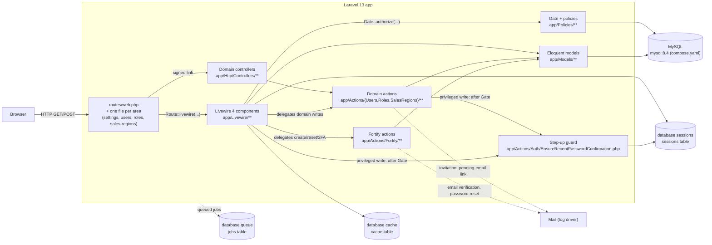

# Architecture Overview

## Table of Contents

- [What this application is](#what-this-application-is)
- [Request lifecycle](#request-lifecycle)
- [Runtime dependencies](#runtime-dependencies)
- [Cross-cutting concerns](#cross-cutting-concerns)
- [Deployment note](#deployment-note)
- [Where things live](#where-things-live)

## What this application is

`arospe` (Composer package `laravel/livewire-starter-kit`) is a Laravel 13 + Livewire 4 monolith built on the official Laravel Livewire starter kit. There is no separate frontend SPA and no REST API yet — Livewire components render server-driven UI directly.

Two concerns are layered on top of the starter kit baseline:

- **Authentication** via `laravel/fortify` (registration, login, password reset, email verification, 2FA, passkeys). See [Authentication](authentication.md).
- **Authorization** via `spatie/laravel-permission` (roles & permissions): two seeded roles, a 42-permission catalog, the `role`/`permission`/`role_or_permission` middleware aliases registered in [`bootstrap/app.php`](../../bootstrap/app.php), a `Gate::before` Super Admin bypass installed by `AppServiceProvider`, three permission-gated module routes (`users.index`, `roles.index`, `sales-regions.index`) and **four** policies (`UserPolicy`, `RolePolicy`, `SalesRegionPolicy`, `MediaPolicy` — the fourth defends a component with no route at all, see below), plus — as of task 0008 — the `Super Admin` role's own immutability/invisibility invariants on `App\Models\Role`. See [Authorization](authorization.md).

**The domain layer has started.** `app/Models/` holds four classes and they are three different kinds of thing: `User` (Epic 1's domain model), `SalesRegion` and `Media` (tasks 0016 and 0019 — the first two Epic 2 domain models), and `Role`, which is not a domain model at all but a `spatie/laravel-permission` subclass carrying the Super Admin role's invariants (see [Authorization](authorization.md#the-super-admin-roles-invariants)). The layering the rest of the app follows was established around `User` and is now on its fourth area: single-purpose invokable **domain actions** — [`app/Actions/Users/`](../../app/Actions/Users), [`app/Actions/Roles/`](../../app/Actions/Roles), [`app/Actions/SalesRegions/`](../../app/Actions/SalesRegions), [`app/Actions/Media/`](../../app/Actions/Media) — that own the write logic and authorize their own operation, with Livewire components and controllers as thin callers, and a **policy** per model deciding who may invoke them.

**One entry point does not start at a route, and it is the first.** `App\Livewire\Media\Gallery` (story 0019) is a **modal** that Products and Blog will embed rather than a page ([PRD §2.3](../PRD/PRD.md)), so it has no route, no `can:` middleware and no sidebar entry — it is reached only over Livewire's own `/livewire/update` endpoint after some *other* page renders it. That is a **shorter** path through the diagram below, not a new one: it simply enters at the `Livewire 4 components` node instead of at `Routes`, and every layer after that is unchanged. The consequence is an authorization one and is documented as such — with no route middleware in front of it, the component's own `Gate::authorize()` calls are the entire perimeter (see [Authorization](authorization.md#mediapolicy--the-fourth-policy-and-the-first-behind-no-route-at-all)). This document will grow a `architecture/<module>.md` file per module as the domain layer gets big enough to need one; nothing yet does.

## Request lifecycle

- Web entry points are declared in [`routes/web.php`](../../routes/web.php), which itself holds only `home` and `dashboard` and `require`s one file per functional area — [`routes/settings.php`](../../routes/settings.php), [`routes/users.php`](../../routes/users.php), [`routes/roles.php`](../../routes/roles.php) and [`routes/sales-regions.php`](../../routes/sales-regions.php); there is no `routes/api.php` in this app yet.
- **A Livewire action is a second entry point that skips most route middleware.** `POST /livewire/update` does not re-run the component's route middleware except for an allow-listed subset, which is why `users.index` gates with `can:` (on the allow-list) rather than `permission:` (not), and why the component re-authorizes through the Gate on every mutating method rather than trusting the route. See [security/livewire-authorization.md](../security/livewire-authorization.md).
- **Since task 0015a, five privileged Users writes pass a third check after the Gate.** `App\Actions\Auth\EnsureRecentPasswordConfirmation` reads the session for a password confirmation no older than `config('auth.password_timeout')` and refuses with a 423 (or, on the dashboard path, a redirect to `password.confirm`). It answers a question neither middleware nor a policy asks — *is the person at the keyboard still the account holder* — and it is an in-method check for the same allow-list reason as the bullet above: `password.confirm` does not follow a component to `/livewire/update`. See [authorization.md](authorization.md#step-up-authentication--the-third-layer).
- Fortify-owned routes (login, register, password reset, 2FA challenge, `.well-known/passkey-endpoints`) are registered by the `FortifyServiceProvider` from `config/fortify.php`, not by hand-written controllers.
- Session, cache, and queue all use the `database` driver (`SESSION_DRIVER`, `CACHE_STORE`, `QUEUE_CONNECTION` in `.env`), backed by the `sessions`, `cache`, and `jobs` tables created in `database/migrations/0001_01_01_000000_create_users_table.php` and `0001_01_01_000001_create_cache_table.php` / `0001_01_01_000002_create_jobs_table.php`.
- `MAIL_MAILER=log` in `.env` — outgoing mail (email verification, password reset) is written to the log, not actually delivered, in this environment.

## Runtime dependencies

| Concern | Driver (from `.env`) |
| --- | --- |
| Database | `mysql` |
| Session | `database` |
| Cache | `database` |
| Queue | `database` |
| Broadcasting | `log` |
| Mail | `log` |

No external services (S3, Redis, third-party APIs) are configured in this environment. When one is added, add it to this table and to the flowchart above.

## Cross-cutting concerns

Documented once, linked everywhere else — do not duplicate these explanations in other files:

- **Authentication, 2FA, passkeys** → [architecture/authentication.md](authentication.md)
- **Roles & permissions** → [architecture/authorization.md](authorization.md)
- **Database schema** → [database/schema.md](../database/schema.md)
- **Route/component contracts** → [api/routes.md](../api/routes.md)
- **Security rules from audits** → [security/README.md](../security/README.md)

## Deployment note

`php artisan db:seed --class=RolePermissionSeeder` is a **required** step on every deploy, not a developer convenience: `RolePermissionSeeder` is the only source of the roles and permissions the app authorizes against. Prefer that targeted form over a bare `db:seed` — see [authorization.md](authorization.md#seeding).

## Where things live

| Layer | Path |
| --- | --- |
| Routes | `routes/web.php`, plus the per-area files it requires: `routes/settings.php`, `routes/users.php`, `routes/roles.php`, `routes/sales-regions.php` |
| Livewire components | `app/Livewire/**` |
| Domain controllers | `app/Http/Controllers/**` (HTTP boundary in front of an action) |
| Fortify actions | `app/Actions/Fortify/**` |
| Domain actions | `app/Actions/Users/**`, `app/Actions/Roles/**`, `app/Actions/SalesRegions/**`, `app/Actions/Media/**` |
| Cross-cutting auth-state actions | `app/Actions/Auth/**` — the step-up freshness guard and the refusal audit line; not a module area and not Fortify's, see [conventions/base-standards.md](../conventions/directory-structure.md#directory-structure) |
| Policies | `app/Policies/**` (auto-discovered by name) |
| Domain exceptions that render their own response | `app/Exceptions/**` (`ImmutableRoleException` → 403, `RoleInUseException` → 409, `PasswordConfirmationRequiredException` → 423, `OrderNotEditableException` → 409 since story 0048 — four, not three; see [authorization.md](authorization.md#order-editability--the-second-state-based-refusal-and-the-shape-three-more-stories-copy)) |
| Notifications | `app/Notifications/**` |
| Shared validation rules | `app/Concerns/**` (e.g. [`ProfileValidationRules`](../../app/Concerns/ProfileValidationRules.php), [`PasswordValidationRules`](../../app/Concerns/PasswordValidationRules.php), [`UserValidationRules`](../../app/Concerns/UserValidationRules.php), [`RoleValidationRules`](../../app/Concerns/RoleValidationRules.php), [`SalesRegionValidationRules`](../../app/Concerns/SalesRegionValidationRules.php), [`MediaValidationRules`](../../app/Concerns/MediaValidationRules.php)) |
| Models | `app/Models/**` |
| Views | `resources/views/livewire/**`, `resources/views/layouts/**`, `resources/views/components/**` (all anonymous — this repo has no `app/View/`) |
| Declarative UI registry | `config/modules.php` — the permission-gated sidebar, read by `resources/views/components/sidebar-nav.blade.php`; see [authorization.md](authorization.md#the-second-half-of-a-module-gate-the-sidebar-registry) |
| Uploaded files | `storage/app/public/media/**`, served through the `public/storage` symlink `composer.json`'s `setup` script creates (`storage:link`, added by story 0019 — the first story to put user-visible files there). Paths are recorded on `media` rows; see [database/schema.md](../database/schema-products.md#media) |
| Migrations | `database/migrations/**` |
| Seeders | `database/seeders/**` (`RolePermissionSeeder` is deploy-critical — see above) |
| Middleware aliases & exception rendering | `bootstrap/app.php` |

_Last updated: 2026-09-16 — Story 0048 (Order line-item editing backend). Corrected the **Where things live** `Domain exceptions that render their own response` row, a bare "three domain exceptions" count this story falsifies: added `OrderNotEditableException → 409`, the fourth. No lifecycle, route, controller or runtime-dependency change — this table row is the only edit; the rest of this page's Orders-era staleness (no `Actions/Orders/` row, no `OrderPolicy` mention) is pre-existing and out of this story's scope.

_Previously: 2026-08-27 through 2026-08-13 — Stories 0019, 0017, 0015b, 0015a, 0013, task 0040, task 0008 and task 0004 each corrected or extended this page's request-lifecycle diagram and "Where things live" table as their own domain landed (Media's shorter lifecycle path with no route; Sales Regions' fourth module area and several under-counted enumerations; refusal logging's `app/Actions/Auth/**` under-count; step-up authentication's new `Step-up guard` node and the first two rows for `app/Actions/Auth/**`/`app/Exceptions/**`; the declarative UI registry row for `config/modules.php`; the route layer's `users.index` extraction into its own file; `App\Models\Role`'s first appearance; and the original domain-controller/domain-action/Gate-policy layers). Folded into this single line per [contracts.md](contracts.md#doc-growth-management-rule)'s doc-growth-management rule — no content changed or lost; see git history for the full prior chain if needed._
