# Database Schema

## Table of Contents

- [ER diagram](#er-diagram)
- [Domain tables](#domain-tables)
- [Notes](#notes)

## ER diagram

Connection: `mysql` (`DB_CONNECTION=mysql` in `.env`, served by the `mysql:8.4` container in [`compose.yaml`](../../compose.yaml)). **Every table in the database is diagrammed, including standalone tables with no relationships** — its entity block appears with no relationship line until a later story's FK gives it one. That covers the framework's infrastructure tables (`cache`, `cache_locks`, `jobs`, `job_batches`, `failed_jobs`, `password_reset_tokens`, `migrations`), which are documented in [Infrastructure tables](schema-users-auth.md#infrastructure-tables); check with `SHOW TABLES` against the diagram when adding a table.

```mermaid
erDiagram
    USERS ||--o{ PASSKEYS : owns
    USERS ||--o{ SESSIONS : has
    USERS ||--o{ MODEL_HAS_ROLES : "assigned via (polymorphic)"
    USERS ||--o{ MODEL_HAS_PERMISSIONS : "assigned via (polymorphic)"
    USERS ||--o{ NOTIFICATIONS : "notifiable (polymorphic)"
    MODEL_HAS_ROLES }o--|| ROLES : role_id
    MODEL_HAS_PERMISSIONS }o--|| PERMISSIONS : permission_id
    ROLE_HAS_PERMISSIONS }o--|| ROLES : role_id
    ROLE_HAS_PERMISSIONS }o--|| PERMISSIONS : permission_id
    SALES_REGIONS ||--o{ SALES_REGIONS : "parent_id (fiscal territory of)"
    USERS ||--o{ MEDIA : "uploaded_by (nullable)"
    PRODUCT_CATEGORIES ||--o{ PRODUCTS : product_category_id
    MEDIA ||--o{ PRODUCTS : "featured_media_id (nullable)"
    PRODUCT_MEDIA }o--|| PRODUCTS : product_id
    PRODUCT_MEDIA }o--|| MEDIA : media_id
    PRODUCT_SALES_REGION }o--|| PRODUCTS : product_id
    PRODUCT_SALES_REGION }o--|| SALES_REGIONS : sales_region_id
    PRODUCT_ATTRIBUTE_TYPES ||--o{ PRODUCT_ATTRIBUTE_VALUES : product_attribute_type_id
    PRODUCTS ||--o{ PRODUCT_VARIANTS : product_id
    MEDIA ||--o{ PRODUCT_VARIANTS : "featured_media_id (nullable)"
    PRODUCT_VARIANTS ||--o{ PRODUCT_VARIANT_VALUES : product_variant_id
    PRODUCT_ATTRIBUTE_VALUES ||--o{ PRODUCT_VARIANT_VALUES : product_attribute_value_id
    GEOGRAPHY_ENTRIES ||--o{ GEOGRAPHY_ENTRIES : "parent_id (nested under)"
    SHIPPING_ZONES ||--o{ SHIPPING_ZONE_GEOGRAPHY_ENTRY : shipping_zone_id
    GEOGRAPHY_ENTRIES ||--o{ SHIPPING_ZONE_GEOGRAPHY_ENTRY : geography_entry_id
    SHIPPING_CARRIERS ||--o{ SHIPPING_RATES : shipping_carrier_id
    SHIPPING_ZONES ||--o{ SHIPPING_RATES : shipping_zone_id
    CUSTOMERS ||--o{ ORDERS : customer_id
    PAYMENT_METHODS ||--o{ ORDERS : payment_method_id
    SALES_REGIONS ||--o{ ORDERS : "sales_region_id (nullable)"
    SHIPPING_RATES ||--o{ ORDERS : "shipping_rate_id (nullable)"
    ORDERS ||--o{ ORDER_ITEMS : order_id
    PRODUCTS ||--o{ ORDER_ITEMS : "product_id (nullable)"
    PRODUCT_VARIANTS ||--o{ ORDER_ITEMS : "product_variant_id (nullable)"
    REFUNDS }o--|| ORDER_ITEMS : order_item_id
    REFUNDS }o--|| USERS : refunded_by

    USERS {
        uuid id PK
        string name
        string email UK
        string pending_email UK
        timestamp email_verified_at
        string status
        string password
        text two_factor_secret
        text two_factor_recovery_codes
        timestamp two_factor_confirmed_at
        string remember_token
        timestamp deleted_at
    }
    PASSKEYS {
        bigint id PK
        uuid user_id FK
        string name
        string credential_id UK
        json credential
        timestamp last_used_at
    }
    SESSIONS {
        string id PK
        uuid user_id FK
        string ip_address
        text user_agent
        longtext payload
        int last_activity
    }
    ROLES {
        bigint id PK
        string name
        string guard_name
    }
    PERMISSIONS {
        bigint id PK
        string name
        string guard_name
    }
    MODEL_HAS_ROLES {
        bigint role_id FK
        string model_type
        uuid model_uuid
    }
    MODEL_HAS_PERMISSIONS {
        bigint permission_id FK
        string model_type
        uuid model_uuid
    }
    ROLE_HAS_PERMISSIONS {
        bigint permission_id FK
        bigint role_id FK
    }
    SALES_REGIONS {
        uuid id PK
        string slug UK
        string code
        string name
        string description
        decimal rate
        string kind
        uuid parent_id FK
        boolean is_default
        boolean is_active
        smallint sort_order
    }
    MEDIA {
        uuid id PK
        string title
        text description
        string path UK
        string webp_path
        string avif_path
        smallint width
        smallint height
        int size_bytes
        uuid uploaded_by FK
    }
    PRODUCT_CATEGORIES {
        uuid id PK
        string name UK
    }
    PRODUCTS {
        uuid id PK
        uuid product_category_id FK
        string name
        string sku UK
        string type
        string status
        decimal price
        int stock
        text description
        uuid featured_media_id FK
    }
    PRODUCT_MEDIA {
        uuid product_id FK
        uuid media_id FK
        int position
    }
    PRODUCT_SALES_REGION {
        uuid product_id FK
        uuid sales_region_id FK
    }
    PRODUCT_ATTRIBUTE_TYPES {
        uuid id PK
        string name UK
        int position
    }
    PRODUCT_ATTRIBUTE_VALUES {
        uuid id PK
        uuid product_attribute_type_id FK
        string value
        int position
    }
    PRODUCT_VARIANTS {
        uuid id PK
        uuid product_id FK
        char combination_hash
        string sku UK
        decimal price
        int stock
        uuid featured_media_id FK
        int position
    }
    PRODUCT_VARIANT_VALUES {
        uuid product_variant_id FK
        uuid product_attribute_value_id FK
    }
    GEOGRAPHY_ENTRIES {
        bigint id PK
        string level
        bigint parent_id FK
        string name
        string normalized_name
        string ine_code UK
        string iso_alpha2 UK
        string province_name
    }
    SHIPPING_ZONES {
        uuid id PK
        string name UK
    }
    SHIPPING_ZONE_GEOGRAPHY_ENTRY {
        uuid shipping_zone_id FK
        bigint geography_entry_id FK
    }
    SHIPPING_CARRIERS {
        uuid id PK
        string code UK
        string name
        string description
        boolean is_active
    }
    SHIPPING_RATES {
        uuid id PK
        string name
        uuid shipping_carrier_id FK
        uuid shipping_zone_id FK
        decimal min_weight_kg
        decimal max_weight_kg
        decimal price
        string delivery_estimate
    }
    CUSTOMERS {
        uuid id PK
        string name
        string email UK
        string phone
        string shipping_address_line1
        string shipping_address_line2
        string shipping_city
        string shipping_postal_code
        string shipping_province
        string shipping_country
        string billing_address_line1
        string billing_address_line2
        string billing_city
        string billing_postal_code
        string billing_province
        string billing_country
        timestamp deleted_at
    }
    PAYMENT_METHODS {
        uuid id PK
        string code UK
        string iban
    }
    ORDERS {
        uuid id PK
        string order_number UK
        uuid customer_id FK
        string status
        string payment_status
        uuid sales_region_id FK
        uuid shipping_rate_id FK
        uuid payment_method_id FK
        decimal tax_rate
        decimal subtotal
        decimal tax_amount
        decimal shipping_amount
        decimal total
        decimal refunded_amount
        boolean flagged_for_review
        string ip_address
        string ip_derived_country
        string flag_reason
        string shipping_address_line1
        string shipping_address_line2
        string shipping_city
        string shipping_postal_code
        string shipping_province
        string shipping_country
        string billing_address_line1
        string billing_address_line2
        string billing_city
        string billing_postal_code
        string billing_province
        string billing_country
    }
    ORDER_ITEMS {
        uuid id PK
        uuid order_id FK
        uuid product_id FK
        uuid product_variant_id FK
        string product_name
        string product_sku
        int quantity
        decimal unit_price
        decimal line_total
        int refunded_quantity
    }
    REFUNDS {
        uuid id PK
        uuid order_item_id FK
        int quantity
        decimal amount
        uuid refunded_by FK
        text reason
    }
    NOTIFICATIONS {
        uuid id PK
        string type
        string notifiable_type
        uuid notifiable_id
        text data
        timestamp read_at
    }
    BLOG_CATEGORIES {
        uuid id PK
        string name
        string normalized_name UK
    }
    BLOG_TAGS {
        uuid id PK
        string name
        string normalized_name UK
    }
    PASSWORD_RESET_TOKENS {
        string email PK
        string token
        timestamp created_at
    }
    CACHE {
        string key PK
        mediumtext value
        bigint expiration
    }
    CACHE_LOCKS {
        string key PK
        string owner
        bigint expiration
    }
    JOBS {
        bigint id PK
        string queue
        longtext payload
        smallint attempts
        int reserved_at
        int available_at
        int created_at
    }
    JOB_BATCHES {
        string id PK
        string name
        int total_jobs
        int pending_jobs
        int failed_jobs
        longtext failed_job_ids
        mediumtext options
        int cancelled_at
        int created_at
        int finished_at
    }
    FAILED_JOBS {
        bigint id PK
        string uuid UK
        string connection
        string queue
        longtext payload
        longtext exception
        timestamp failed_at
    }
    MIGRATIONS {
        int id PK
        string migration
        int batch
    }
```

> The `model_has_roles` / `model_has_permissions` relationships to `USERS` are **polymorphic** (`model_type` + `model_uuid`, from `spatie/laravel-permission`) — `User` is the only morphable model in the codebase today. The morph key column is `model_uuid` (UUID-typed), renamed from the package default `model_id` (bigint) when `users.id` became a UUID — see [architecture/authorization.md](../architecture/authorization.md), which is also where the seeded roles, the permission catalog and how they are checked are documented.

## Domain tables

Split by domain into separate files, per [contracts.md](../contracts/token-and-doc-rules.md#doc-growth-management-rule)'s doc growth management rule — this file had grown past the 150k-character size this project treats as a hard limit. **Read only the table anchor your task actually needs, not the whole domain file** — this is the [Token-Efficient Reading and Dispatch Rule](../contracts/token-and-doc-rules.md#token-efficient-reading-and-dispatch-rule) applied at table granularity: the ER diagram above already tells you which columns/relationships a table has, so open a domain file only to read the *prose* around one specific table (invariants, derived columns, why a column is nullable, etc.).

- **[Users & Auth](schema-users-auth.md)** — read if the task touches [`users`](schema-users-auth.md#users), [`passkeys`](schema-users-auth.md#passkeys), the `spatie/laravel-permission` tables ([`roles`/`permissions`/`model_has_roles`/`model_has_permissions`/`role_has_permissions`](schema-users-auth.md#roles-permissions-model_has_roles-model_has_permissions-role_has_permissions)), or the [infrastructure tables](schema-users-auth.md#infrastructure-tables) tied to authentication (`password_reset_tokens`, `sessions`, `cache`, `jobs`).
- **[Products & Taxes](schema-products.md)** — read if the task touches [`sales_regions`](schema-products/sales-regions-and-media.md#sales_regions), [`media`](schema-products/sales-regions-and-media.md#media), [`product_categories`](schema-products/categories-and-products.md#product_categories), [`products`](schema-products/categories-and-products.md#products), [`product_media`](schema-products/gallery-and-region-pivots.md#product_media), [`product_sales_region`](schema-products/gallery-and-region-pivots.md#product_sales_region), [`product_attribute_types`](schema-products/attribute-types-and-values.md#product_attribute_types), [`product_attribute_values`](schema-products/attribute-types-and-values.md#product_attribute_values), [`product_variants`](schema-products/variants.md#product_variants), or [`product_variant_values`](schema-products/variants.md#product_variant_values). Example: a task about products only needs the [`products`](schema-products/categories-and-products.md#products) anchor (plus [`product_media`](schema-products/gallery-and-region-pivots.md#product_media)/[`product_sales_region`](schema-products/gallery-and-region-pivots.md#product_sales_region) if it also touches the gallery or region assignment) — not the rest of the file.
- **[Shipping](schema-shipping.md)** — read if the task touches [`geography_entries`](schema-shipping/geography-entries.md#geography_entries) (the shipping geography catalog, physically independent of `sales_regions`), [`shipping_zones`](schema-shipping/zones.md#shipping_zones), [`shipping_zone_geography_entry`](schema-shipping/zones.md#shipping_zone_geography_entry), [`shipping_carriers`](schema-shipping/carriers-and-rates.md#shipping_carriers), or [`shipping_rates`](schema-shipping/carriers-and-rates.md#shipping_rates).
- **[Payment Methods, Customers & Notifications](schema-other.md)** — read if the task touches [`payment_methods`](schema-other/payment-methods.md#payment_methods), [`customers`](schema-other/customers.md#customers), or [`notifications`](schema-other/notifications.md#notifications).
- **[Orders](schema-orders.md)** — read if the task touches [`orders`](schema-orders/orders.md#orders), [`order_items`](schema-orders/items-and-refunds.md#order_items), or [`refunds`](schema-orders/items-and-refunds.md#refunds): the price-at-time-of-order and address-snapshot invariants, `order_number` generation, the three-way delete-behaviour rule these tables exercise together, [why `orders.subtotal`/`.tax_amount`/`.total` are derived and *re-derived* rather than write-once, and `order_items.unit_price` is immutable after insert](schema-orders/snapshots-totals-and-rules.md#totals-are-derived-and-re-derived-not-write-once) (story 0048), and — since story 0051 — the refund event log `order_items.refunded_quantity`/`orders.refunded_amount` are derived from.
- **[Blog](schema-blog.md)** — read if the task touches [`blog_categories`](schema-blog.md#blog_categories) (the blog taxonomy, physically independent of `product_categories`): the `normalized_name` unique key and why `name` carries none, the `Str::ascii()` expansion ceiling, the hard delete, and the in-use delete guard hand-off to story 0061; or [`blog_tags`](schema-blog.md#blog_tags) (a second standalone taxonomy sharing nothing with either category table): the same stored-key shape at `name` 100 with the folded length bounded in validation, the two name-rule methods (`FindOrCreateBlogTag` validates format only), the unconditional delete, and the `cascadeOnDelete()` contract story 0061's pivot must honour.

## Notes

- `app/Models/` holds twenty classes (`ls app/Models/*.php`, recounted rather than incremented blind): `User` (Epic 1); eighteen Epic 2/3/4 domain models — `SalesRegion`, `Media`, `ProductCategory`, `BlogCategory` (story 0058, [schema-blog.md](schema-blog.md)), `BlogTag` (story 0059, same file), `Product`, `ProductAttributeType`, `ProductAttributeValue`, `ProductVariant`, `GeographyEntry` (the only `bigint`-PK model in this app), `ShippingZone`, `ShippingCarrier`, `ShippingRate`, `PaymentMethod`, `Customer`, `Order`, `OrderItem` (story 0045) and `Refund` (story 0051, [schema-orders.md](schema-orders.md)); and `Role`, a `spatie/laravel-permission` subclass over the package's own `roles` table — no column, no migration of its own (see [architecture/authorization.md](../architecture/authorization/super-admin.md#the-super-admin-roles-invariants)). **Four pivot tables have no model class at all** — `product_media`, `product_sales_region`, `product_variant_values`, `shipping_zone_geography_entry` — reached only through the owning models' `BelongsToMany`, the same shape the vendored `role_has_permissions`/`model_has_roles` pivots use.
- For migration authoring conventions (naming, `down()` requirements, real examples), see [database/migrations.md](migrations.md).
- **UUID (v7) primary keys.** Each table's PK type (`uuid` vs `bigint`) is already visible directly in the ER diagram above, and each per-domain schema file states its own table's status against [ADR 0001](../decisions/0001-uuid-primary-keys.md) at the point that table is documented — so this section no longer restates a consolidated status list. The ADR is the single source of truth for the policy and its full history: which entities it covers, the one named `bigint` exception (`geography_entries`), and every amendment since. The model-side convention (`HasUuids`, `@property string $id`, no restated `$keyType`/`$incrementing`) is in [conventions/base-standards.md](../conventions/base-standards/stack-and-model-conventions.md#uuid-primary-keys); the migration-side pattern is in [database/migrations.md](migrations/uuid-primary-keys.md#uuid-primary-keys).

_Last updated: 2026-09-24 — Story 0059 (Blog tags — backend). Added `BLOG_TAGS` to the ER diagram as a standalone entity block (story 0061's `blog_post_tag` pivot will add its first relationship line), widened the **Domain tables** [Blog](schema-blog.md) bullet to name [`blog_tags`](schema-blog.md#blog_tags), and recounted the **Notes** model-class inventory to twenty (`ls app/Models/*.php`). Every application table is diagrammed, relationships or not — since story 0058._

_Earlier revision notes: [database--schema.md](../history/database--schema.md)._
