# Database Schema

## Table of Contents

- [ER diagram](#er-diagram)
- [Domain tables](#domain-tables)
- [Infrastructure tables](#infrastructure-tables)
- [Notes](#notes)

## ER diagram

Connection: `mysql` (`DB_CONNECTION=mysql` in `.env`, served by the `mysql:8.4` container in [`compose.yaml`](../../compose.yaml)). Only tables that carry a meaningful relationship are diagrammed; purely infrastructural tables (`cache`, `jobs`, `password_reset_tokens`) are listed in [Infrastructure tables](#infrastructure-tables) instead, since they have no foreign keys.

```mermaid
erDiagram
    USERS ||--o{ PASSKEYS : owns
    USERS ||--o{ SESSIONS : has
    USERS ||--o{ MODEL_HAS_ROLES : "assigned via (polymorphic)"
    USERS ||--o{ MODEL_HAS_PERMISSIONS : "assigned via (polymorphic)"
    USERS ||--o{ NOTIFICATIONS : "notifiable (polymorphic)"
    MODEL_HAS_ROLES }o--|| ROLES : role_id
    MODEL_HAS_PERMISSIONS }o--|| PERMISSIONS : permission_id
    ROLE_HAS_PERMISSIONS }o--|| ROLES : role_id
    ROLE_HAS_PERMISSIONS }o--|| PERMISSIONS : permission_id
    SALES_REGIONS ||--o{ SALES_REGIONS : "parent_id (fiscal territory of)"
    USERS ||--o{ MEDIA : "uploaded_by (nullable)"
    PRODUCT_CATEGORIES ||--o{ PRODUCTS : product_category_id
    MEDIA ||--o{ PRODUCTS : "featured_media_id (nullable)"
    PRODUCT_MEDIA }o--|| PRODUCTS : product_id
    PRODUCT_MEDIA }o--|| MEDIA : media_id
    PRODUCT_SALES_REGION }o--|| PRODUCTS : product_id
    PRODUCT_SALES_REGION }o--|| SALES_REGIONS : sales_region_id
    PRODUCT_ATTRIBUTE_TYPES ||--o{ PRODUCT_ATTRIBUTE_VALUES : product_attribute_type_id
    PRODUCTS ||--o{ PRODUCT_VARIANTS : product_id
    MEDIA ||--o{ PRODUCT_VARIANTS : "featured_media_id (nullable)"
    PRODUCT_VARIANTS ||--o{ PRODUCT_VARIANT_VALUES : product_variant_id
    PRODUCT_ATTRIBUTE_VALUES ||--o{ PRODUCT_VARIANT_VALUES : product_attribute_value_id
    GEOGRAPHY_ENTRIES ||--o{ GEOGRAPHY_ENTRIES : "parent_id (nested under)"
    SHIPPING_ZONES ||--o{ SHIPPING_ZONE_GEOGRAPHY_ENTRY : shipping_zone_id
    GEOGRAPHY_ENTRIES ||--o{ SHIPPING_ZONE_GEOGRAPHY_ENTRY : geography_entry_id
    SHIPPING_CARRIERS ||--o{ SHIPPING_RATES : shipping_carrier_id
    SHIPPING_ZONES ||--o{ SHIPPING_RATES : shipping_zone_id

    USERS {
        uuid id PK
        string name
        string email UK
        string pending_email UK
        timestamp email_verified_at
        string status
        string password
        text two_factor_secret
        text two_factor_recovery_codes
        timestamp two_factor_confirmed_at
        string remember_token
        timestamp deleted_at
    }
    PASSKEYS {
        bigint id PK
        uuid user_id FK
        string name
        string credential_id UK
        json credential
        timestamp last_used_at
    }
    SESSIONS {
        string id PK
        uuid user_id FK
        string ip_address
        text user_agent
        longtext payload
        int last_activity
    }
    ROLES {
        bigint id PK
        string name
        string guard_name
    }
    PERMISSIONS {
        bigint id PK
        string name
        string guard_name
    }
    MODEL_HAS_ROLES {
        bigint role_id FK
        string model_type
        uuid model_uuid
    }
    MODEL_HAS_PERMISSIONS {
        bigint permission_id FK
        string model_type
        uuid model_uuid
    }
    ROLE_HAS_PERMISSIONS {
        bigint permission_id FK
        bigint role_id FK
    }
    SALES_REGIONS {
        uuid id PK
        string slug UK
        string code
        string name
        string description
        decimal rate
        string kind
        uuid parent_id FK
        boolean is_default
        boolean is_active
        smallint sort_order
    }
    MEDIA {
        uuid id PK
        string title
        text description
        string path UK
        string webp_path
        string avif_path
        smallint width
        smallint height
        int size_bytes
        uuid uploaded_by FK
    }
    PRODUCT_CATEGORIES {
        uuid id PK
        string name UK
    }
    PRODUCTS {
        uuid id PK
        uuid product_category_id FK
        string name
        string sku UK
        string type
        string status
        decimal price
        int stock
        text description
        uuid featured_media_id FK
    }
    PRODUCT_MEDIA {
        uuid product_id FK
        uuid media_id FK
        int position
    }
    PRODUCT_SALES_REGION {
        uuid product_id FK
        uuid sales_region_id FK
    }
    PRODUCT_ATTRIBUTE_TYPES {
        uuid id PK
        string name UK
        int position
    }
    PRODUCT_ATTRIBUTE_VALUES {
        uuid id PK
        uuid product_attribute_type_id FK
        string value
        int position
    }
    PRODUCT_VARIANTS {
        uuid id PK
        uuid product_id FK
        char combination_hash
        string sku UK
        decimal price
        int stock
        uuid featured_media_id FK
        int position
    }
    PRODUCT_VARIANT_VALUES {
        uuid product_variant_id FK
        uuid product_attribute_value_id FK
    }
    GEOGRAPHY_ENTRIES {
        bigint id PK
        string level
        bigint parent_id FK
        string name
        string normalized_name
        string ine_code UK
        string iso_alpha2 UK
        string province_name
    }
    SHIPPING_ZONES {
        uuid id PK
        string name UK
    }
    SHIPPING_ZONE_GEOGRAPHY_ENTRY {
        uuid shipping_zone_id FK
        bigint geography_entry_id FK
    }
    SHIPPING_CARRIERS {
        uuid id PK
        string code UK
        string name
        string description
        boolean is_active
    }
    SHIPPING_RATES {
        uuid id PK
        string name
        uuid shipping_carrier_id FK
        uuid shipping_zone_id FK
        decimal min_weight_kg
        decimal max_weight_kg
        decimal price
        string delivery_estimate
    }
    NOTIFICATIONS {
        uuid id PK
        string type
        string notifiable_type
        uuid notifiable_id
        text data
        timestamp read_at
    }
```



> The `model_has_roles` / `model_has_permissions` relationships to `USERS` are **polymorphic** (`model_type` + `model_uuid`, from `spatie/laravel-permission`) — `User` is the only morphable model in the codebase today. The morph key column is `model_uuid` (UUID-typed), renamed from the package default `model_id` (bigint) when `users.id` became a UUID — see [architecture/authorization.md](../architecture/authorization.md), which is also where the seeded roles, the permission catalog and how they are checked are documented.

## Domain tables

### `users`

Source: `database/migrations/0001_01_01_000000_create_users_table.php` + `database/migrations/2025_08_14_170933_add_two_factor_columns_to_users_table.php`, with the primary key converted to UUID by `database/migrations/2026_07_22_100001_convert_id_to_uuid_in_users_table.php` … `2026_07_22_100005_finalize_uuid_primary_key_on_users_table.php` (5 alteration migrations layered on top — the historical `create_*` files were not touched; see [migrations.md](migrations.md#uuid-primary-keys)), and the account-state columns added by `database/migrations/2026_08_11_175426_add_status_to_users_table.php` and `database/migrations/2026_08_11_175427_add_pending_email_to_users_table.php`, plus the soft-delete column added by `database/migrations/2026_08_14_183432_add_soft_deletes_to_users_table.php`.

Model: [`App\Models\User`](../../app/Models/User.php).

Columns are listed in real physical order (verified with `php artisan db:table users`):

| Column | Type | Notes |
| --- | --- | --- |
| `id` | uuid (v7) PK | `CHAR(36)`; generated by `HasUuids` — see [ADR 0001](../decisions/0001-uuid-primary-keys.md) |
| `name` | string | |
| `email` | string, unique | canonically lowercase; a *change* to this column only lands once its verification link is used — see [architecture/authentication.md](../architecture/authentication.md#pending-email-changes) |
| `pending_email` | string, nullable, unique | the address a pending email change is waiting on; **not** mass-assignable (omitted from `#[Fillable]`), written only via `forceFill()` by `App\Actions\Users\RequestEmailChange` / `ConfirmEmailChange` |
| `email_verified_at` | timestamp, nullable | proof of mailbox control; set by Fortify's verification, by completing the invitation/reset flow, and by confirming a pending email change. It is **no longer** nulled on an email change — the address does not move until it is verified |
| `status` | `VARCHAR(20)`, default `inactive` | cast to [`App\Enums\UserStatus`](../../app/Enums/UserStatus.php) (`active` / `inactive` / `suspended`); **not** mass-assignable. Since task 0007 this column is an **authentication control**, not a label — only `active` obtains a session, on every sign-in path. See [architecture/authentication.md](../architecture/authentication.md#account-status-and-activation) and [the sign-in block](../architecture/authentication.md#sign-in-the-account-status-block) |
| `password` | string | hashed cast, `Hidden` |
| `two_factor_secret` | text, nullable | encrypted, `Hidden` |
| `two_factor_recovery_codes` | text, nullable | encrypted JSON, `Hidden` |
| `two_factor_confirmed_at` | timestamp, nullable | |
| `remember_token` | string, nullable | `Hidden` |
| `deleted_at` | timestamp, nullable | added `after('updated_at')`, so it is physically the last column; the `SoftDeletes` marker — see [Soft deletes](#soft-deletes) below |

Two notes on the account-state columns, both deliberate:

- **`status` carries no index.** Not a selectivity argument — a narrow secondary index genuinely would be chosen for `COUNT(*) WHERE status = 'active'` given this table's unusually fat clustered index (`CHAR(36)` PK + two `TEXT` columns). The reason is cardinality: a backoffice `users` table is 10²–10³ rows, so both queries resolve in a sub-millisecond clustered scan while an index costs a write on every insert/update. If one is ever added it must be composite `(deleted_at, status)`, never plain `status`, because the `SoftDeletingScope` puts `deleted_at IS NULL` into every one of those queries. Task 0007 does not change this reasoning: the sign-in block reads `status` off a row already fetched by the `email` unique index, so it adds no `WHERE status = …` query to the hot path.
- **`pending_email` is `unique` and nullable on purpose.** Both MySQL and SQLite allow unlimited `NULL`s in a unique index, so the constraint only binds rows actually holding a pending address — making "two accounts cannot be waiting on the same address" a database invariant rather than a validation-only one. It is the last-word guard behind the application checks documented in [security/signed-link-verification.md](../security/signed-link-verification.md#a-pre-flight-check-is-not-a-race-guard--re-check-under-a-lock-and-let-the-unique-index-have-the-last-word).

Relations: `hasMany` → `passkeys` (via `PasskeyAuthenticatable`), `hasMany` → `sessions` (informal, via `user_id`), polymorphic `morphToMany` → `roles`/`permissions` (via `HasRoles`; roles and permissions are seeded and in active use — see [authorization.md](../architecture/authorization.md)).

#### Soft deletes

`App\Models\User` is the only model in this codebase using `Illuminate\Database\Eloquent\SoftDeletes` (task 0005). Deleting a user is an `UPDATE` that stamps `deleted_at`, never a `DELETE`, so **every relation physically survives** — `passkeys` rows included, because the `cascadeOnDelete()` FK only fires on a real `DELETE`, and `model_has_roles` / `model_has_permissions` rows too, because Spatie's detach-on-delete hook opts out for soft deletes. The trashed row then disappears from every query built on `User::query()` / `newQuery()`, which is what removes it from the users list, from route-model binding, and from every authentication lookup at once.

Deleting also **rewrites the row's identifying columns**, which is the part that matters at schema level: `App\Models\User::delete()` is overridden to obfuscate the address before the soft delete, in one transaction:

```php
// app/Models/User.php
return DB::transaction(function (): bool {
    $originalEmail = $this->getRawOriginal('email');

    DB::table('password_reset_tokens')
        ->whereIn('email', array_unique([$originalEmail, Str::lower($originalEmail)]))
        ->delete();

    $this->forceFill([
        'email' => "deleted+{$this->id}@deleted.invalid",
        'email_verified_at' => null,
        'pending_email' => null,
    ])->saveQuietly();

    return (bool) parent::delete();
});
```

Consequences to know before writing a query against `users`:

- **The original address is gone, not archived.** This app has no audit-log table; freeing the address for reuse was chosen deliberately over retaining it. `deleted+{id}@deleted.invalid` is anchored to the immutable UUID `id` (`.invalid` is RFC 2606-reserved, so it can never collide with a registrable address), which makes it deterministic and greppable back to the `passkeys` / `sessions` rows it left behind.
- **Both unique addresses are released**: `email` is replaced and `pending_email` is nulled, so a new user can immediately take either — and any outstanding pending-email confirmation link stops working, since [`ConfirmEmailChange`](../../app/Actions/Users/ConfirmEmailChange.php) aborts when `pending_email` no longer matches the address the signature is bound to.
- **`password_reset_tokens` rows keyed by the old address are deleted in the same transaction.** That table is keyed by the email *string* with no FK, so recycling the address without revoking the token would hand the deleted user's still-valid reset link to whoever claims the address next. The full reasoning, and why the query normalises case explicitly instead of relying on the connection collation, is in [security/soft-delete-patterns.md](../security/soft-delete-patterns.md#freeing-an-identifier-means-revoking-everything-keyed-by-its-string-not-just-the-row).
- **Never bulk-delete `users` through the query builder.** `User::where(...)->delete()` bypasses the model entirely, so it skips all of the above — leaving live addresses on trashed rows and their reset tokens valid. Every call site in this repo uses instance `->delete()`; see [conventions/base-standards.md](../conventions/base-standards.md#deleting-a-user-goes-through-the-model-not-the-query-builder).
- **A restored user keeps the placeholder address.** `SoftDeletes::restore()` exists on the model for free but has no call site anywhere in the app; a restore flow would have to re-enter the address through the pending-email flow, and re-grant roles as an explicit decision (see the same security page).

Two index decisions were made deliberately here and are **not** oversights:

- **No index on `deleted_at`.** On MySQL 8.4 at this table's size, `deleted_at IS NULL` matches the large majority of rows, so the optimizer would very likely scan anyway while every insert and delete pays to maintain the index. If one is ever needed, the right shape is the composite `(deleted_at, status)` described in the `status` note above — never a standalone `deleted_at`.
- **No change to the `email` unique index.** Obfuscation frees the address without touching the constraint. A composite unique on `(email, deleted_at)` was considered and **rejected as unsafe on MySQL**: `NULL <> NULL` for uniqueness purposes, so all active users (`deleted_at IS NULL`) would stop being constrained against sharing an address — a regression on the exact invariant that has to hold. Note the flip side, verified during the audit: `Rule::unique(User::class)` does **not** apply the soft-delete scope, so validation still sees trashed rows and a live user cannot claim a tombstone address.

> **Done (Epic 1) — current state.** `users.id` is a **UUID (v7)** string primary key generated by the `HasUuids` trait, per [ADR 0001 — UUID primary keys](../decisions/0001-uuid-primary-keys.md). This was a breaking alteration-with-backfill (not a fresh `create_table`) that cascaded to `passkeys.user_id`, `sessions.user_id` (both retyped to UUID), and `spatie/laravel-permission`'s polymorphic morph key (renamed `model_id` → `model_uuid`, retyped to `uuid`). The other six UUID entities from ADR 0001 (Epic 2/4) are **still future** — see [Notes](#notes).

### `passkeys`

Source: `database/migrations/2024_01_01_000000_create_passkeys_table.php`. Provided by `laravel/passkeys`, consumed through `PasskeyAuthenticatable` on `User`.

| Column | Type | Notes |
| --- | --- | --- |
| `id` | bigint PK | passkey's own PK stays `bigint` — only the FK changed |
| `user_id` | uuid FK → `users.id` | `CHAR(36)`; `cascadeOnDelete()`, FK re-added by the finalize migration once both sides are UUID |
| `name` | string | user-chosen label |
| `credential_id` | string, unique | WebAuthn credential ID |
| `credential` | json | full WebAuthn credential payload |
| `last_used_at` | timestamp, nullable | |

### `roles`, `permissions`, `model_has_roles`, `model_has_permissions`, `role_has_permissions`

Source: `database/migrations/2026_07_12_181045_create_permission_tables.php` (`spatie/laravel-permission`, teams disabled — see [config/permission.php](../../config/permission.php)). Column shapes follow the package defaults; see the migration file for the exact `Schema::create` calls, including the composite primary keys on the pivot tables.

Models: `permissions` is the package's own `Spatie\Permission\Models\Permission`; `roles` is [`App\Models\Role`](../../app/Models/Role.php) since task 0008 (`config/permission.php`'s `models.role` binding), a subclass adding the Super Admin role's immutability guards and the `selectable()` scope — **no schema change, no migration, and no new column**. Application code must never reach the `roles` table through the package class, which carries none of those guards; see [architecture/authorization.md](../architecture/authorization.md#one-role-model-class-in-application-code).

**Both privilege tiers are identified by `roles.name`, and that identity is resolved on the model — never by a query written at a call site.** Task 0008a added `Role::isAdministratorRole(self $role)` and `Role::isSuperAdminRoleRow(self $role)`, both `public static`, both delegating to a private `persistedName()` extracted from the pre-existing Super Admin guard. Again **no schema change**. Two consequences that matter when writing a query against this table:

- **`persistedName()` may issue its own `SELECT`.** For an existing row whose `name` column was never hydrated it reads the name back from the database rather than trusting the in-memory attribute, so a partially-hydrated `Role` still answers correctly. Resolve a role with a plain `Role::query()->find($id)` (full `select *`) at the call site anyway — the helper survives a `select('id')`, but the call site should not create the situation.
- **A tier check never reads `guard_name`.** Both helpers match on `name` alone, deliberately; see [architecture/authorization.md](../architecture/authorization.md#known-limitations--what-is-not-closed) for why that is fail-closed in both directions.

`roles` carries `unique(name, guard_name)`, which is what makes name-based identification of the Super Admin role safe at row level — but it is *not* what prevents a role acquiring that name, since the index only forbids a duplicate of an already-occupied pair. See [security/authorization-patterns.md](../security/authorization-patterns.md#confirmed-safe-role-name-collision-is-closed-by-a-creationrename-guard-not-by-the-database-alone).

**`roles.name` is compared case-insensitively by the database and byte-exactly by PHP, and the seeder has to reconcile the two.** The column carries `utf8mb4_unicode_ci` (`config/database.php`), so the unique index treats `administrator` and `Administrator` as the same value while every identity check in the app is a `===`. `firstOrCreate()` would therefore silently **adopt** a colliding row instead of creating the intended one, so both seeded-role creation paths read the persisted name back and throw `ImmutableRoleException` when it does not match byte-for-byte — `Role::firstOrCreateSuperAdminRole()` and, since task 0010, its exact mirror image `Role::firstOrCreateAdministratorRole()`. Both are `withoutEvents()` factory methods on the model, and `RolePermissionSeeder` calls nothing else: a raw `firstOrCreate()` on either name is now refused by the model's own `creating` guard. See [architecture/authorization.md](../architecture/authorization.md#the-seeder-writes-the-same-name-the-guards-read).

**Since task 0010 a `roles` row can also be refused deletion for a non-privilege reason.** `App\Models\Role`'s `deleting` guards now include a holder-count check (`users()->withTrashed()->exists()`), so any role — protected tier or ordinary custom role — is undeletable while `model_has_roles` still references it, and the refusal is a 409 rather than a 403. Soft-deleted holders count: the FK cascade on `model_has_roles` would otherwise destroy a trashed user's grant with no error anywhere. Same schema, no migration and no new column; see [architecture/authorization.md](../architecture/authorization.md#layer-1-registration-order-is-the-whole-point).

**Populated by [`database/seeders/RolePermissionSeeder.php`](../../database/seeders/RolePermissionSeeder.php)**, which is the only source of this data — the app is non-functional until it has run, so seeding is a required deployment step:

| Table | Seeded rows | Notes |
| --- | --- | --- |
| `roles` | 2 | `Super Admin`, `Administrator`, both `guard_name = web` — plus any custom role created from the [Roles screen](../api/routes.md#rolesindex--the-second-permission-gated-route), which the seeder neither creates nor touches |
| `permissions` | 42 | 10 modules × 4 CRUD actions, plus `roles.manage` and `roles.manage-administrators` — 38 until story 0019 added the `media` module |
| `role_has_permissions` | 41 | `Administrator` holds everything except `roles.manage-administrators`; `Super Admin` holds none — 37 until story 0019 |
| `model_has_roles` | 0 or 1 | one row only when `SUPER_ADMIN_EMAIL` resolves to a user (see the bootstrap branches in [authorization.md](../architecture/authorization.md#super-admin-bootstrap)) |
| `model_has_permissions` | 0 | no permission is granted directly to a user; grants are role-level only |

The names, the grants and the `Gate::before` bypass that lets `Super Admin` pass without any `role_has_permissions` row are documented in [architecture/authorization.md](../architecture/authorization.md).

### `sales_regions`

Source: `database/migrations/2026_08_19_204256_create_sales_regions_table.php` (task 0016) — the repo's **first greenfield UUID `create_*` migration**, and the first table of the Products/Taxes domain ([PRD Epic 2 §2.1](../PRD/PRD.md)). A tax rule *is* a Sales Region row: there is no separate tax table.

Model: [`App\Models\SalesRegion`](../../app/Models/SalesRegion.php). Columns in real physical order (verified with `php artisan db:table sales_regions`):

| Column | Type | Notes |
| --- | --- | --- |
| `id` | uuid (v7) PK | `CHAR(36)`; generated by `HasUuids`. Not one of [ADR 0001](../decisions/0001-uuid-primary-keys.md)'s seven entities — see [Notes](#notes) |
| `slug` | `VARCHAR(64)`, unique | the seeder's **immutable identity key**, never `code`; not mass-assignable. Uniqueness here is a correctness constraint, not a performance one |
| `code` | `VARCHAR(10)`, nullable | administrator-editable display/fiscal chip (`ES`, `ES-CN`). Explicitly length-capped for the same reason as `users.status` — a bare `string()` is `VARCHAR(255)` for a 2–6 character token |
| `name` | `VARCHAR(150)` | canonical name, in Spanish; seeder-owned and **not** mass-assignable. Deliberately not `TEXT` — see the fat-clustered-index note on `users` above |
| `description` | `VARCHAR(255)`, nullable | administrator-editable |
| `rate` | `DECIMAL(6,3)`, nullable | **never `float`** — this value feeds order tax arithmetic and binary floating point cannot hold `21.00` exactly. `NULL` means *not configured*; `0.000` is a legitimate 0% rate, so the two cannot share a representation. `(6,3)` holds `100.000` exactly and accommodates 3-decimal non-EU rates. No `->unsigned()` (deprecated on `DECIMAL` since MySQL 8.0.17); negative-rate rejection is validation's job, not the column's |
| `kind` | `VARCHAR(20)`, **no default** | cast to [`App\Enums\SalesRegionKind`](../../app/Enums/SalesRegionKind.php) (`country` / `fiscal_territory`). `string` + a PHP backed enum over a native MySQL `enum`, the same precedent as `users.status`. No default on purpose: every row is written explicitly, and a default would let a mis-seeded row pass as a `Country` |
| `parent_id` | uuid FK → `sales_regions.id`, nullable | self-referencing, `restrictOnDelete()` — see [The two-tier tree](#the-two-tier-tree-and-its-invariant) below |
| `is_default` | boolean, default `false` | exactly one row carries it after seeding; **no database constraint enforces that** — see the index notes below |
| `is_active` | boolean, default `false` | the catalog's soft state; rows are deactivated, never deleted |
| `sort_order` | `SMALLINT UNSIGNED`, default `0` | Spain's territories are listed in **fiscal** order (Península, Baleares, Canarias, Ceuta, Melilla), which is neither alphabetical nor recoverable from any other column |

**No `SoftDeletes`, deliberately.** `is_active` *is* the soft state, and a `deleted_at` would actively fight the seeder: a trashed row is invisible to the seeder's lookup, so the next re-seed would insert a duplicate.

#### The two-tier tree and its invariant

The catalog is an adjacency list that is **exactly one level deep by domain definition**: ~249 top-level ISO countries, and beneath the `es` ("España") row its five fiscal territories. `kind === FiscalTerritory` if and only if `parent_id IS NOT NULL` — an invariant the enum's docblock states and the seeder enforces (it aborts rather than write a territory with a null parent; see [security/seeder-safety.md](../security/seeder-safety.md#a-catalog-seeder-must-fail-loudly-rather-than-commit-a-structurally-invalid-catalog)). Nothing in the database enforces the depth limit, so a query may assume two tiers only because the seeder is the sole writer of `parent_id` (it is omitted from `#[Fillable]`).

`restrictOnDelete()`, not `cascadeOnDelete()`: cascading would let deleting the "España" row silently destroy five administrator-configured tax rates. `constrained('sales_regions')` is passed the table name explicitly — Laravel would otherwise infer a `parents` table from the column name.

#### Seeded state, and which columns a re-seed may touch

Populated by [`database/seeders/SalesRegionSeeder.php`](../../database/seeders/SalesRegionSeeder.php) from the bundled fixture [`database/data/iso-3166-countries.json`](../../database/data/iso-3166-countries.json) (249 identity-only entries) plus the seeder's own `SPAIN_TERRITORIES` constant. Like the permission catalog, this is **required application data**: it is seeded unconditionally, outside `DatabaseSeeder`'s `['local', 'testing']` fixture gate, and composed into `ProductionSeeder` so a production runbook names one class forever.

| Rows | `kind` | `is_active` | `rate` |
| --- | --- | --- | --- |
| ~248 ISO countries | `country` | `false` | `NULL` |
| España (`es`) | `country` | `true` | `NULL` — a disclosure node, not independently rateable |
| Península, Baleares, Canarias, Ceuta, Melilla | `fiscal_territory` | `true` | configured |

≈254 rows, of which 6 are active and exactly one (`es-peninsula`, `SalesRegionSeeder::DEFAULT_SLUG`) carries `is_default`. **Reference the seeder's `DEFAULT_SLUG` / `SPAIN_SLUG` constants rather than restating the literal strings** — the same convention `RolePermissionSeeder::MODULES` established.

The columns split into two sets with **opposite re-seed behaviour**, and this split is the table's most load-bearing property:

| Set | Columns | Re-seed behaviour |
| --- | --- | --- |
| **Seeder-owned** | `slug`, `name`, `parent_id`, `kind`, `sort_order` | **always refreshed** — overwriting `name` is how a corrected canonical name ("Turkey" → "Türkiye") reaches an already-deployed install |
| **Administrator-configurable** | `code`, `description`, `rate`, `is_active`, `is_default` | **written only on insert; never touched on update** |

So `upsert()` / `updateOrCreate()` with a full payload are forbidden against this table: the reflexive "idempotent seeder" shape would reset every administrator-configured rate, code and flag on the next deploy. The mass-assignment guard behind it is the usual one — `#[Fillable(['code', 'description', 'rate'])]`, everything else written by `forceFill()` from the seeder alone. Why `is_active` is omitted *because* `is_default` is, and why the seeder's idempotency key is byte-exact in PHP while `slug`'s `utf8mb4_unicode_ci` collation is not, are in [security/seeder-safety.md](../security/seeder-safety.md#confirmed-safe-split-seeder-owned-from-administrator-configurable-columns-upsert-is-the-wrong-default).

#### Indexes — one present by choice, one by requirement, four omitted

`php artisan db:table sales_regions` shows exactly three: `primary` on `id`, `sales_regions_slug_unique`, and `sales_regions_parent_id_foreign`. That is the intended list.

- **`slug` UNIQUE** is the seeder's idempotency key and the resolution key a future tax lookup will use.
- **The FK index on `parent_id` is InnoDB's requirement, not a discretionary choice** — and the migration therefore does **not** write an explicit `$table->index('parent_id')`. This diverges from `create_passkeys_table`'s explicit `$table->index('user_id')` on purpose; see [migrations.md](migrations.md#an-fk-column-does-not-also-get-an-explicit-index-here).
- **Omitted on `code`** — nothing joins or filters on it, and a UNIQUE would create a real re-seed failure mode now that `code` is administrator-editable: the seeder writes `ES` while an administrator has moved `ES` elsewhere, and the seed aborts mid-transaction with an opaque `23000`.
- **Omitted on `is_default`, `is_active`, `kind` and `name`** — cardinality, not selectivity, the same reasoning applied to `users.status` above. A boolean over 254 near-read-only rows is the worst possible index candidate.
- **No UNIQUE on `(parent_id, name)`** — `slug` already forbids a duplicate entity, and a unique index over a utf8mb4 `name` would make the invariant depend on collation ("España" vs. "Espana").

> ⚠️ **Nothing in the database enforces at-most-one `is_default`.** MySQL 8.4 has no partial indexes, but a `STORED` generated column (`CASE WHEN is_default THEN 1 END`) plus a UNIQUE on it does enforce it, since unique indexes ignore `NULL`s. It was deliberately **not** adopted here — it would force the "clear old, set new" update into a strict ordering — and is left for the story that enforces the single-default invariant. Today the property holds only because the seeder's default write is repair-only (it fires solely when no row is flagged at all) and `is_default` is not mass-assignable.

### `media`

Source: `database/migrations/2026_08_27_120000_create_media_table.php` (story 0019) — the Shared Media Gallery ([PRD §2.3](../PRD/PRD.md)), and the first table in this app whose rows **point at files on disk**. One row is one uploaded image *and* its two mandatory conversions; there is no separate conversions table.

Model: [`App\Models\Media`](../../app/Models/Media.php), which declares `#[Table('media')]` explicitly. That is not decoration: `Str::plural('Media')` returns `'Media'` unchanged, so Eloquent's convention arrives at the table name `media` **accidentally** rather than by pluralising anything. Declare it rather than rely on that.

Columns in real physical order (verified with `php artisan db:table media`):

| Column | Type | Notes |
| --- | --- | --- |
| `id` | uuid (v7) PK | `CHAR(36)`; generated by `HasUuids`. The **second** UUID entity beyond [ADR 0001](../decisions/0001-uuid-primary-keys.md)'s original seven — see [Amendment 1](../decisions/0001-uuid-primary-keys.md#amendment-1-2026-08-27--the-scope-is-the-policy-not-the-list-of-seven), which story 0019 added and which closes the deferral task 0016 opened |
| `title` | `VARCHAR(255)` | user-supplied, required, searched |
| `description` | `TEXT`, nullable | user-supplied, optional per PRD, searched. `TEXT` rather than a capped `VARCHAR` because it is free-form prose with no natural ceiling and is never indexed |
| `path` | `VARCHAR(255)`, **unique** | the kept original, relative to the `public` disk root (`storage/app/public`). See the index notes below for what the UNIQUE is and is not for |
| `webp_path` | `VARCHAR(255)` | the `.webp` conversion. `NOT NULL` **is** the schema-level statement of PRD §2.3 AC 4 — an image without both variants cannot be represented |
| `avif_path` | `VARCHAR(255)` | the `.avif` conversion, same |
| `width` | `SMALLINT UNSIGNED` | captured at upload, when the image is already decoded and it is free. Impossible to backfill later without re-reading every file. `SMALLINT`'s 65,535 ceiling comfortably exceeds `MediaValidationRules::MAX_DIMENSION` (4,000) |
| `height` | `SMALLINT UNSIGNED` | same |
| `size_bytes` | `INT UNSIGNED` | the **original's** size, not the variants'. 4 GB ceiling ≫ the 8 MB upload limit |
| `uploaded_by` | uuid FK → `users.id`, nullable | `foreignUuid(...)->nullable()->constrained('users')->nullOnDelete()`. Read the soft-delete note below before relying on either half of that |
| `timestamps` | | `created_at` is the gallery's intended default sort key (newest first) |

**Three explicit path columns, not a JSON blob and not a child table.** PRD §2.3 fixes the variant set at exactly two, mandatory, for every image, so three columns make "an image always has both variants" a readable, `NOT NULL`-constrainable property, queryable with no JSON extraction and no join on every gallery tile. A `conversions` JSON column buys flexibility this phase has no use for at the cost of not being able to declare the variants required; a `media_conversions` child table is correct only if the format set were open-ended. **Do not derive the variant paths at read time** ("same basename, swap the extension") — storing them explicitly is what lets a future re-encode change the naming scheme without a data migration, and what makes a missing or orphaned variant detectable at all.

Two columns were considered and **deliberately omitted**, recorded so each is a decision rather than an oversight: a `disk` column (cloud storage is explicitly out of scope this phase; adding it later is a one-line migration with a `'public'` backfill) and a `mime_type` column (derivable from the original's extension, which validation constrains to three values).

**No `SoftDeletes`, and no `deleted_at`.** Media deletion is out of scope: the interesting question — what happens to a product or blog post referencing a deleted image — cannot be answered before those tables exist (PRD Epics 2 and 4). Deferring is the cheap direction, since adding `SoftDeletes` later is additive while removing it once call sites depend on it is not. `media.delete` is nevertheless seeded, which is this catalog's normal state; see [architecture/authorization.md](../architecture/authorization.md#mediapolicy--the-fourth-policy-and-the-first-behind-no-route-at-all).

#### `uploaded_by` and the soft-delete interaction — read this before "fixing" the FK

`users` **is** soft-deleted, so `nullOnDelete()` will essentially **never fire**: a user delete is an `UPDATE` stamping `deleted_at`, not a `DELETE`. The real runtime behaviour is that `media.uploaded_by` stays populated and `Media::uploadedBy()` resolves to `null`, because the `SoftDeletingScope` hides the trashed row — unless a call site opts into `withTrashed()`. The constraint is retained as correct-by-construction protection against a genuine hard delete, **not** as the mechanism anything relies on. So: a `null` from `uploadedBy()` means either "no uploader recorded" or "the uploader is trashed", and the two are distinguishable only by reading the raw column.

The column is also **not mass-assignable**, along with `path`, `webp_path`, `avif_path`, `width`, `height` and `size_bytes` — seven server-derived columns against a three-column `#[Fillable(['title', 'description'])]`. That makes `Media` this repo's most lopsided example of the omission-as-guard convention; see [conventions/base-standards.md](../conventions/base-standards.md#model-conventions).

#### Indexes — three, and four omissions

`php artisan db:table media` reports exactly three: `primary` on `id`, `media_path_unique`, and `media_uploaded_by_foreign`. That is the intended list, and note the migration writes **two** of them — the third is InnoDB's own, auto-created for the FK, which is why there is no explicit `$table->index('uploaded_by')` here (the same rule `create_sales_regions_table` follows; see [migrations.md](migrations.md#an-fk-column-does-not-also-get-an-explicit-index-here)).

- **`path` UNIQUE is a last-word guard, not the primary defence.** The stored basename is a 40-character random string, so a collision is already implausible; the constraint is what makes "two rows can never point at the same file" a *database* invariant rather than a convention — the same reasoning [`users.pending_email`](#users) records.
- **No index on `title` or `description`, and no `FULLTEXT`.** Search is a deliberate `LIKE '%term%'` scan (`App\Models\Media::search()`), and a leading-wildcard `LIKE` cannot use a B-tree anyway. At this table's realistic size — a backoffice media library is 10²–10³ rows — the scan resolves in well under a millisecond, while `FULLTEXT` costs a write on every insert **and changes match semantics**: its word-boundary and minimum-token-length rules would make a partial term stop matching, which a user typing part of a filename experiences as "search is broken". Note this is a **scale** judgement, not a portability one: this app's tests run on MySQL, so `FULLTEXT` genuinely would work.
- **No index on `uploaded_by` beyond the FK's own.** Nothing filters on it today; add one with the feature that needs it.
- **No index on `created_at`** despite it being the intended sort key, for the same cardinality reason as everything above.

> ⚠️ **The search scope escapes its own wildcards, and a caller must not re-implement it.** `Media::search($term)` runs `addcslashes($term, '%_\\')` before interpolation, so an administrator searching for `50%` gets a literal match rather than a wildcard. An empty term is a deliberate no-op that leaves the query unfiltered — it returns the **full library**, never an empty set. Any second query written against `title`/`description` must reuse this scope rather than hand-rolling a `LIKE`.

> ⚠️ **Rows here name files that `storage:link` must have made reachable.** `media` is the first table in this app whose contents are only half in the database; the other half is `storage/app/public`, served through the `public/storage` symlink. `composer.json`'s `setup` script gained `@php artisan storage:link` in this story precisely because it had never needed to run before — a fresh clone that skips it stores files correctly and serves every one of them as a 404, with nothing in the schema or the tests able to detect it.

### `product_categories`

Source: `database/migrations/2026_09_01_084836_create_product_categories_table.php` (story 0023) — the third Epic 2 domain table, after [`sales_regions`](#sales_regions) and [`media`](#media). At the time it shipped it was a **standalone catalog with no relationships to anything else at all** — no FK in, no FK out — and per this file's own [ER-diagram rule](#er-diagram) it earned no entity in the mermaid diagram. **That changed the same day, with story 0024**: `products.product_category_id` is a `NOT NULL` FK into this table, so `product_categories` now carries a real relationship and appears in the diagram above (`PRODUCT_CATEGORIES ||--o{ PRODUCTS`). Nothing about this table's own columns, indexes or behaviour changed — see [`products`](#products) below for the FK side.

Model: [`App\Models\ProductCategory`](../../app/Models/ProductCategory.php). Columns in real physical order (verified against `information_schema.COLUMNS`, the same physical-order discipline `php artisan db:table` gives every other table here):

| Column | Type | Notes |
| --- | --- | --- |
| `id` | uuid (v7) PK | `CHAR(36)`; generated by `HasUuids`. One of [ADR 0001](../decisions/0001-uuid-primary-keys.md)'s **original seven** named entities — the first Epic 2 table to land that needed **no** ADR amendment, unlike `sales_regions` and `media`, neither of which the ADR named |
| `name` | `VARCHAR(255)`, **unique** | the entity's only mutable field; a bare `string()`, matching `users.name`/`users.email` rather than a narrower indexed length — the same precedent `sales_regions`'s columns cite, considered and rejected here too |
| `created_at` | timestamp, nullable | |
| `updated_at` | timestamp, nullable | |

**No `SoftDeletes`, deliberately.** A lookup-table row has none of the reasons `users` soft-deletes for (identity retention, freeing an authentication identifier, relations that must survive a delete), and `Rule::unique()` does **not** apply the soft-delete scope (see [the `users` note above](#users)) — so a trashed "Footwear" would squat its name forever unless every uniqueness check were made trashed-aware. Delete is a hard `DELETE`, through the model instance per [conventions/base-standards.md](../conventions/base-standards.md#deleting-a-user-goes-through-the-model-not-the-query-builder)'s instance-not-builder convention.

**No seeded state — this table starts empty, unlike `sales_regions` (~254 rows) or the permission tables.** There is no `ProductCategorySeeder`; the only way a row exists is through [`App\Actions\ProductCategories\CreateProductCategory`](../../app/Actions/ProductCategories/CreateProductCategory.php), and this story ships no caller for it outside its own tests.

**Name uniqueness is enforced in two layers, and the database index is deliberately the *lesser* of them.** `name`'s `utf8mb4_unicode_ci` collation is case- **and** accent-insensitive, so the `UNIQUE(name)` index alone would refuse a "Footwear"/"footwear" or "Niño"/"Nino" pair — but only as a raw `23000` `QueryException` with no field-level message. The authoritative check is a normalised comparison in PHP, via the shared `App\Actions\NormalizeForSearch` (story 0022's D13) inside `App\Concerns\ProductCategoryValidationRules::uniqueNormalisedName()`, which refuses the same pair cleanly as a `ValidationException` on `name` before the database is ever asked; the index remains purely a **race**-condition backstop for two concurrent creates that both pass validation — the identical relationship [`users.pending_email`](#users) already establishes for its own unique column. Both `CreateProductCategory` and `RenameProductCategory` convert a `23000` into that same `ValidationException` shape, mirroring [`CreateUser`](../../app/Actions/Users/CreateUser.php)'s handling of `email`.

**Indexes — exactly two, both present by requirement rather than choice.** `primary` on `id`, and `product_categories_name_unique`, verified directly against `information_schema`/`SHOW INDEX`. No index on `created_at`/`updated_at` — this is a near-empty lookup table, not a high-write one, the same cardinality reasoning `users.status` and `sales_regions`'s several omitted columns already establish.

✅ **Corrected 2026-09-03 (story 0025) — `CreateProductCategory`, `RenameProductCategory` and `DeleteProductCategory` now authorize their own operation.** This cell previously read: *"None of `CreateProductCategory`, `RenameProductCategory` or `DeleteProductCategory` authorize their own operation — a deliberate, recorded gap. `App\Policies\ProductCategoryPolicy` exists and is fully tested (`viewAny`/`create`/`update`/`delete`, gating on the already-seeded `products.view`/`create`/`edit`/`delete`) but has **zero call sites** until the not-yet-built UI story (0025) wires in `Gate::authorize()` before every action call."* That gap is closed: each of the three actions constructor-injects `App\Actions\Auth\LogRefusedPrivilegedAttempt` and calls `->authorize()` as its own first statement — the identical self-authorizing shape `App\Actions\Products\CreateProduct`/`UpdateProduct`/`DeleteProduct` already use — so `ProductCategoryPolicy` now has its first real call site, and a future Artisan command, queued job or REST controller inherits the same refusal the dashboard gets. `App\Livewire\ProductCategories\Index` (story 0025) is the first and only caller of these actions and additionally re-checks the same abilities in its own `openCreateModal()`/`openEditModal()`/`save()`/`confirmDelete()`/`deleteProductCategory()`, defence in depth on top of the actions' own gates rather than a substitute for them. See [conventions/base-standards.md](../conventions/base-standards.md#an-authorization-rule-belongs-to-the-action-not-to-one-of-its-callers). **Unaffected by the in-use delete block below** — that block is a domain invariant, not an authorization rule; see the ⚠️ inside that block for why, and note that in `DeleteProductCategory` specifically the new authorization call runs **before** the in-use count check, never after — a reversed order would leak the product count to an actor who does not even hold `products.delete`.

✅ **Since story 0024b, deleting a category still referenced by any product is hard-refused, with a message naming the exact count — no confirm-and-proceed path at any privilege level.** `App\Models\ProductCategory::products(): HasMany` is the one new relation this story adds, keyed on `products.product_category_id`; `App\Actions\ProductCategories\DeleteProductCategory` counts `$productCategory->products()->count()` through it before attempting the delete and, when the count is greater than zero, throws a `ValidationException` keyed on `productCategoryId` carrying `trans_choice('products.categories.delete_blocked', $count, ['count' => $count])` — see [conventions/naming.md](../conventions/naming.md#translation-keys) for the `trans_choice()` form this key uses. A `deleteOrFail()`-based backstop catches the specific MySQL error **1451** (row is referenced) from a race between the count and the `DELETE` and converts it to the identical exception, re-counting inside the catch — narrowed to 1451 rather than the whole `23000` class because `products.product_category_id` is the *only* restricting FK anywhere in this schema referencing `product_categories`, verified by a dedicated schema drift-guard test. This is the message-carrying counterpart of `products.product_category_id`'s own `restrictOnDelete()` FK documented in [`products`](#products) below — the FK is the database invariant that holds even if the application check is ever bypassed by a query-builder delete; this is what makes a normal call site fail cleanly with a real message instead of surfacing a raw `23000`.

### `products`

Source: `database/migrations/2026_09_01_142007_create_products_table.php` (story 0024) — the fourth Epic 2 domain table, and the first with a **required** FK into another Epic 2 table (`product_categories`) alongside an **optional** one into `media`. Covers [PRD §2.2](../PRD/PRD.md#22-products)'s core product fields; sales-region assignment (story 0026) and variants (0028–0031) are later tables.

Model: [`App\Models\Product`](../../app/Models/Product.php). Columns in real physical order (verified with `php artisan db:table products`):

| Column | Type | Notes |
| --- | --- | --- |
| `id` | uuid (v7) PK | `CHAR(36)`; generated by `HasUuids`. One of [ADR 0001](../decisions/0001-uuid-primary-keys.md)'s **original seven** named entities ("Products") — like `product_categories` before it, this needed **no** ADR amendment; see [Amendment 3](../decisions/0001-uuid-primary-keys.md#amendment-3-2026-09-01--products-is-the-second-of-the-original-seven-to-ship) |
| `product_category_id` | uuid FK → `product_categories.id`, **NOT NULL** | `restrictOnDelete()` — a category cannot be deleted while any product references it. The 0023-shipped `products.*` FK is genuinely enforced only by this table; 0023 itself has no FK in or out. **Corrected 2026-09-02 (story 0024b)** — this cell previously stated the clean, message-carrying refusal was "[0024b](../../ai-spec/tasks/done/0024b-product-category-in-use-delete-guard.md)'s retrofit to `DeleteProductCategory`, **not yet shipped as of this story**"; that is false the moment 0024b merges. `DeleteProductCategory` now hard-refuses the delete with a message naming the exact count — see [`product_categories`](#product_categories) below for the mechanism |
| `name` | `VARCHAR(255)` | a bare `string()`, matching `users.name`/`product_categories.name` rather than a narrower indexed length |
| `sku` | `VARCHAR(64)`, **unique** | the stock-keeping-unit identifier, global and unscoped (two products may not share one, and scoping it to a category would defeat its purpose). Canonicalised in PHP (`Str::upper(trim($sku))`) before both validation and persistence, so the stored value and the index always compare like-for-like — see the ⚠️ below |
| `type` | `VARCHAR(20)`, **no default** | cast to [`App\Enums\ProductType`](../../app/Enums/ProductType.php) (`physical` / `virtual`). Deliberately **no** `DEFAULT` clause, unlike every other enum-backed column in this schema (`users.status`, `sales_regions.kind`, `products.status` below) — physical and virtual are equally wrong guesses, so an omitted `type` must fail loudly (`1364` under this connection's `'strict' => true`) rather than silently guess. Safe only because the table starts empty; an `ALTER TABLE ADD COLUMN NOT NULL` against a populated table would need the conditional-backfill shape [migrations.md](migrations.md#when-the-new-columns-default-is-wrong-for-existing-rows-backfill-in-the-same-up) documents instead |
| `status` | `VARCHAR(20)`, default `draft` | cast to [`App\Enums\ProductStatus`](../../app/Enums/ProductStatus.php) — **exactly two persisted cases**, `active` / `draft`. See [Out-of-stock is computed, never stored](#out-of-stock-is-computed-never-stored) below |
| `price` | `DECIMAL(10,2)`, **NOT NULL** | **never `float`** — feeds tax arithmetic and future order-line snapshots. Unlike `sales_regions.rate`, not nullable: a product has no "unconfigured" price state, and `0.00` (a free item) must stay expressible. No `->unsigned()` (deprecated on `DECIMAL` since MySQL 8.0.17, ignored by SQLite); `'min:0'` in validation is the enforcement. Precision 10 (ceiling €99,999,999.99) is a *failure-mode* choice — `decimal(8,2)`'s €999,999.99 cliff would surface as a MySQL `22003` rather than a validation message |
| `stock` | `INT`, **signed**, default `0` | *not* `unsignedInteger` — a future stock decrement below zero (Epic 3) would otherwise become a MySQL `1264 Out of range` 500 instead of a business decision, and SQLite ignores `UNSIGNED` entirely. `NOT NULL` with default `0` is load-bearing for the out-of-stock badge: `Product::isOutOfStock()` is `stock <= 0`, and a `NULL` would make that undecidable |
| `description` | `MEDIUMTEXT`, nullable | **not** `TEXT`, deliberately: Laravel's `max:` validation rule counts *characters* (`mb_strlen`) while `TEXT` caps at 65,535 *bytes*, so a `max:65535` rule against a `TEXT` column is a silent `22001` the moment accented or markup content grows past the byte ceiling. `MEDIUMTEXT` (16 MB) makes the validation rule the binding limit instead. **Sanitized on write** — see the ✅ below |
| `featured_media_id` | uuid FK → `media.id`, nullable | `foreignUuid(...)->nullable()->constrained('media')->restrictOnDelete()`. `constrained('media')` is mandatory, not stylistic: Laravel would otherwise infer a `featured_media` table from the column name. Independent of the gallery (see [`product_media`](#product_media) below) — nothing prevents this pointing at a media row absent from the product's own gallery, by design |
| `created_at` / `updated_at` | timestamp, nullable | |

**No `SoftDeletes`, deliberately** — the same reasoning [`product_categories`](#product_categories) already gives (`Rule::unique()` does not apply the soft-delete scope, verified on `users`, so a trashed product would permanently squat its SKU), plus one specific to this table: a hard delete is what lets story 0029's future `product_variants.product_id` `cascadeOnDelete()` actually cascade — a soft delete never fires a cascade, which would leave variants live against a trashed parent. A future order line that must survive a product's deletion snapshots `name`/`sku`/`price` onto itself rather than depending on the product still existing; PRD §3.2 already requires that snapshot regardless, since a product's price changes without being deleted.

#### Out-of-stock is computed, never stored

`ProductStatus` has **exactly two** persisted cases. "Agotado" (out of stock) is a third, **display-only** state — [`App\Enums\ProductDisplayStatus`](../../app/Enums/ProductDisplayStatus.php), returned by `Product::displayStatus()` — derived from `stock` at read time and never written to any column:

```php
// app/Models/Product.php
public function displayStatus(): ProductDisplayStatus
{
    if ($this->status === ProductStatus::Active && $this->isOutOfStock()) {
        return ProductDisplayStatus::OutOfStock;
    }

    return ProductDisplayStatus::from($this->status->value);
}
```

The override applies to `Active` only — a `Draft` product with zero stock still reads as `Draft`, because publication state and stock availability are orthogonal axes a single column cannot hold without losing information (a sold-out Draft restocking would otherwise have no way to know whether to return to `active` or `draft`). Storing it would also mean every code path that ever writes `stock` — Epic 3's orders and 0029's variants both will — would have to rewrite `status` inside the same transaction or the two diverge permanently, and `WHERE status = 'active'` would silently need to become `WHERE status IN ('active', 'agotado')` everywhere.

Four structural layers make an out-of-stock value unsettable, with no convention doing the load-bearing work: the enum has no such case; `Rule::enum(ProductStatus::class)` refuses a forged payload value rather than filtering it; `CreateProduct`/`UpdateProduct` both resolve their `?string $status` parameter through `ProductStatus::from($status)` (never a cast on a typed parameter — both actions accept a plain nullable string, exactly what validation needs to check first), so a caller reaching that line with anything other than `null` or one of the two real backing values throws `ValueError` rather than silently persisting a third one; and the model cast throws the identical `ValueError` on a hand-written bad database value read back later. A raw `DB::table('products')->insert(['status' => 'agotado', ...])` **does** succeed at the database layer — a plain `VARCHAR` accepts any string — which is the one honest characterization of how thin the DDL-level guarantee is on its own; the enforcement is entirely application-level, at these four layers together.

#### Indexes — four, all present by requirement rather than choice

`php artisan db:table products` reports exactly four: `primary` on `id`, `products_product_category_id_foreign`, `products_featured_media_id_foreign`, and `products_sku_unique`. That is the intended list — no `$table->index('product_category_id')` or `$table->index('featured_media_id')` was hand-written; both FK indexes are InnoDB's own, auto-created for the constraint, per [migrations.md](migrations.md#an-fk-column-does-not-also-get-an-explicit-index-here)'s existing rule (this is that rule's **third** confirming instance, after `sales_regions` and `media`). No index on `type`, `status`, `name` or `created_at`, for the same cardinality reasoning `users.status` and `sales_regions`'s omitted columns already establish.

> ⚠️ **`sku`'s `UNIQUE` compares like-for-like on both engines only because the value is canonicalised before it ever reaches the index.** Unlike [`product_categories.name`](#product_categories) — a human-facing display label that cannot be upper-cased without becoming unreadable, and therefore needs `App\Actions\NormalizeForSearch`'s accent-folding comparison in PHP as its authoritative guard — a SKU is a machine identifier with no accent, case or whitespace significance by design (`regex:/^[A-Z0-9][A-Z0-9._\/-]*$/` after upper-casing), so `Str::upper(trim($sku))` deletes the collation problem instead of working around it. The `UNIQUE` index is still only the **race-condition backstop** behind `Rule::unique()`, not the primary defence — `CreateProduct`/`UpdateProduct` catch the resulting `QueryException` and convert exactly MySQL error code **1062** (not the whole `23000` SQLSTATE class) into a `ValidationException` on `sku`, because this transaction also carries FK writes (`product_category_id`, `featured_media_id`, every `product_media` row) that must never be misreported as "the SKU is taken".
>
> ⚠️ **A duplicate SKU namespace is coming with story 0029's `product_variants` table, and this table's `UNIQUE` alone will not close it.** [PRD §2.2](../PRD/PRD.md#22-products)'s duplicate-SKU scenario names both "another product" and "a variant" — a second, independent `UNIQUE` on `product_variants.sku` would give the two tables separate namespaces, satisfying neither example. 0029 must reuse this table's canonicalisation rather than re-derive its own uniqueness mechanism.
>
> ✅ **Corrected 2026-09-02 (story 0024a) — `description` is sanitized on write, not left unsanitized "as of this story" as this blockquote previously stated.** [`App\Actions\Products\SanitizeProductDescription`](../../app/Actions/Products/SanitizeProductDescription.php) — an allow-list HTML sanitizer built on `symfony/html-sanitizer`, configured entirely by [`config/html-sanitizer.php`](../../config/html-sanitizer.php) — is invoked as the first thing done to `$description` in both [`CreateProduct`](../../app/Actions/Products/CreateProduct.php) and [`UpdateProduct`](../../app/Actions/Products/UpdateProduct.php), **before** `Validator::make()` runs, so `productDescriptionRules()`'s `max:65535` rule measures the stored value rather than markup about to be dropped. The allow-list is exactly the WYSIWYG toolbar's own tag set (`strong`/`b`, `em`/`i`, `u`, `h2`, `ul`/`ol`/`li`, `a[href]` limited to `http`/`https`/`mailto`, `img[src,alt]` limited to `http`/`https`, `p`, `br`); every genuinely dangerous element (`script`, `iframe`, `form`, `svg`, `object`, `input`, …) is explicitly **dropped** — tag and text content both removed — rather than left to the library's `block` default, which only strips a tag and keeps its text. See [security/html-sanitization.md](../security/html-sanitization.md) for the full mechanism, the finding that made the drop-list necessary, and the idempotence caveat three later stories (0076, 0077, 0079) depend on. The previously-cited interim risk — no sanitizer existed between story 0024's closure and this one — is retired; two narrower residuals remain **by design** and are recorded on that page rather than here: a future writer that bypasses `CreateProduct`/`UpdateProduct` re-opens the hole, and the allow-list itself is now the control a later change to it must be reviewed as carefully as any other.

### `product_media`

Source: `database/migrations/2026_09_01_142008_create_product_media_table.php` (story 0024) — the ordered gallery pivot between `products` and `media`. Name declared explicitly (`Str::plural`/basename inference would otherwise produce `media_product`, alphabetising both sides' snake-cased names); the stated name reads correctly for the only direction anything traverses ("this product's gallery").

Columns in real physical order (verified with `php artisan db:table product_media`):

| Column | Type | Notes |
| --- | --- | --- |
| `product_id` | uuid FK → `products.id` | `cascadeOnDelete()` — deleting a product removes its own gallery rows. Leading column of the composite primary key below, since every real query is `WHERE product_id = ? ORDER BY position` |
| `media_id` | uuid FK → `media.id` | `constrained('media')->restrictOnDelete()` — see the ⚠️ below |
| `position` | `INT UNSIGNED`, default `0` | the caller's **0-based array index** at the time of the last `SyncProductGallery` sync — see the ⚠️ below. No `timestamps()`: nothing reads them, and this phase has no audit-trail requirement |

**No surrogate `id`; composite primary key `(product_id, media_id)`.** Nothing FKs into a pivot row, so a surrogate key buys nothing and costs a second index — the same shape the vendored `spatie/laravel-permission` pivot tables (`role_has_permissions`, `model_has_roles`) already use in this schema. The composite PK doubles as the "an image cannot appear twice in one product's gallery" invariant.

**No `SoftDeletes`, no `deleted_at`** — a pivot row has no independent identity to retain.

#### `featured_media_id` and this pivot's media FK are deliberately symmetric — and the inverse case of `media.uploaded_by`

Both `products.featured_media_id` and this table's `media_id` are `restrictOnDelete()`: **an image cannot be deleted while any product references it, as its featured image or via the gallery**, matching this project's house pattern for "you cannot delete something in use" ([0024b](../../ai-spec/tasks/done/0024b-product-category-in-use-delete-guard.md) implements the identical rule for categories). `nullOnDelete()` was rejected for the featured image and never available on the pivot column at all, since it is half the primary key.

This is the **exact inverse** of the trap [`media.uploaded_by`](#uploaded_by-and-the-soft-delete-interaction--read-this-before-fixing-the-fk) records: that FK's `nullOnDelete()` essentially never fires, because `users` is soft-deleted and a soft delete is an `UPDATE`. `media` carries **no `deleted_at`**, so when a future media-deletion story implements a real `DELETE`, these two FKs genuinely **will** fire — the same clause shape (`nullOnDelete()` vs. `restrictOnDelete()`) behaves oppositely depending on whether the referenced table is soft-deleted, which is exactly why `tests/Feature/Products/ProductMediaTest.php` drives both FKs with a **raw** `DB::table('media')->delete()` today: no application path deletes media yet, so this is the only executable proof either constraint exists. A future media-delete story must count references across `products.featured_media_id`, `product_media` and (0029) variants before it can ship a working delete at all — a `23000` on every referenced image is the accepted, deliberate cost of choosing `restrictOnDelete()` here.

#### `position` is written only by `App\Actions\Products\SyncProductGallery`, as the caller's array index

`SyncProductGallery` is the **single writer** of this column and of `products.featured_media_id` — no Livewire component, controller, or sibling action writes either, and a reachability test (`tests/Feature/Products/ProductAuthorizationTest.php`) asserts no class under `app/` other than `App\Actions\Products\CreateProduct`/`UpdateProduct` references it. Its contract, in full: the caller passes the **complete, authoritative** ordered gallery on every call (never a delta — ids present are the gallery, ids absent are detached), and `position` is rewritten as the 0-based array index for **every surviving row on every call**, never `MAX(position) + 1`. That full rewrite — not an append-only assignment — is what makes a gallery reorder expressible as an ordinary re-save: the action cannot distinguish a reorder from an add, a removal or a no-op, because it always rewrites the whole set from the array it was given.

`App\Models\Product::gallery()` always tiebreaks `->orderByPivot('position')->orderByPivot('media_id')`. With `default(0)` on the column, a raw insert bypassing the action — the only path left that can still produce a tie, since every action-driven row now carries an explicit index — would otherwise read back in arbitrary order.

#### Indexes — two, both present by requirement rather than choice

`php artisan db:table product_media` reports exactly two: `primary` on `(product_id, media_id)` and `product_media_media_id_foreign`. `product_id`'s own FK index need not be written separately — it is the composite primary key's leading column, which already serves that role; `media_id`'s is InnoDB's auto-created FK index, per [migrations.md](migrations.md#an-fk-column-does-not-also-get-an-explicit-index-here)'s rule (this table's own FK column is this rule's **fourth** confirming instance in this schema, `products.product_category_id`/`featured_media_id` above being the third). No unique index on `(product_id, position)` — enforcing at-most-one row per position per product would force every reorder through a temporary value or a deferred constraint MySQL 8.4 does not have — and no index on `position` alone, since it is only ever a sort key inside an already-narrow `product_id` range.

### `product_sales_region`

Source: `database/migrations/2026_09_03_150422_create_product_sales_region_table.php` (story 0026) — the Sales Region assignment pivot between `products` and `sales_regions`, and the sixth Epic 2 domain table. Table name **inferred, not overridden**: `HasRelationships::joiningTable()` snake-cases both basenames, sorts them and joins with `_`, which already produces `product_sales_region` — verified against the real vendor grammar (this story's V-1) rather than assumed, so `App\Models\Product::salesRegions()` needs no table override, though it names table and column explicitly anyway (see below).

Columns in real physical order (verified with `php artisan db:table product_sales_region`):

| Column | Type | Notes |
| --- | --- | --- |
| `product_id` | uuid FK → `products.id` | `cascadeOnDelete()` — a product is hard-deleted ([`products`](#products) above, no `SoftDeletes`), and an assignment without its product is meaningless. Leading column of the composite primary key below, since the only real query is "this product's regions" |
| `sales_region_id` | uuid FK → `sales_regions.id` | `restrictOnDelete()` — the house pattern for "cannot delete something in use", the identical clause [`product_media`](#product_media) above uses for its own `media_id`. **Currently unreachable**: [`sales_regions`](#sales_regions) gives the catalog no delete path at all, only `is_active` — a backstop against a future delete story, the same acknowledged-dead-today situation `product_media`'s two FKs are in until a media-delete story exists |

**No surrogate `id`; composite primary key `(product_id, sales_region_id)`.** Nothing FKs into a pivot row, so a surrogate key buys nothing — the same shape `product_media` and the vendored `spatie/laravel-permission` pivots already use in this schema. The composite PK doubles as the "the same region cannot be assigned to a product twice" invariant, a database impossibility rather than a validation-only one.

**No extra columns at all — more spare than `product_media`.** No `position` (nothing in the PRD orders a product's regions, unlike the gallery *strip* `product_media.position` orders), no `timestamps()`, and specifically **no per-assignment rate override**: a tax rate lives on `sales_regions.rate` and nowhere else. An override column here would add a fourth tax-rate precedence tier and a second place a rate could hide — the resolver below is built on there being exactly one.

**No `SoftDeletes`, no `deleted_at`** — a pivot row has no independent identity to retain, matching `product_media`.

#### Indexes — two, both present by requirement rather than choice

`php artisan db:table product_sales_region` reports exactly two: `primary` on `(product_id, sales_region_id)` and `product_sales_region_sales_region_id_foreign`. **No hand-written `$table->index('sales_region_id')`** — `product_id` needs no index of its own, since it is the composite PK's leftmost prefix, and `sales_region_id` gets InnoDB's own auto-created supporting index for the FK constraint. Adding one explicitly would create a **second**, redundant index on the same column — exactly the `users_uuid_unique` write-amplification shape [errors-log.md](../errors-log.md) records — and this table is the **fifth** confirming instance of [migrations.md](migrations.md#an-fk-column-does-not-also-get-an-explicit-index-here)'s "an FK column does not also get an explicit index here" rule. Verified against a live, migrated MySQL instance during the story's own Phase 2 `database-expert` re-review, not read off the migration file.

#### What the pivot enables: `App\Actions\Products\ResolveProductTaxRate`

This table answers only "which regions is a product assigned to" — `App\Models\Product::salesRegions(): BelongsToMany`, table and both column names written explicitly even though every one matches convention, so a future rename would not silently start pointing at nothing. What tax rate applies at a given destination is a separate question, answered by [`App\Actions\Products\ResolveProductTaxRate`](../../app/Actions/Products/ResolveProductTaxRate.php), returning an [`App\Actions\Products\ResolvedTaxRate`](../../app/Actions/Products/ResolvedTaxRate.php) value object (`?string $rate` — `decimal:3` casts to a **string**, never `float`; `SalesRegion $region`; `App\Enums\TaxRateResolutionTier $tier`). Exactly two tiers, no third and no ancestor walk in either direction: the destination is matched against the product's own assigned entries by **exact id** (`AssignedRegion`), falling back to the catalog's `is_default` row (`CatalogDefault`) when nothing matches — assigning a fiscal territory never covers its parent, and assigning a parent never covers its fiscal territories. A rate of `'0.000'` is honoured as a real rate at both tiers; an entry with no configured rate resolves to `rate: null` and names itself, rather than falling through to the other tier or fabricating a `0`. No default row existing at all is a genuine invariant violation ([`sales_regions`](#sales_regions)'s own `is_default` guarantee, enforced by story 0017) and throws `App\Exceptions\NoDefaultSalesRegionException` rather than returning a silent `null`.

The single writer of this pivot is [`App\Actions\Products\SyncProductSalesRegions`](../../app/Actions/Products/SyncProductSalesRegions.php) — `$product->salesRegions()->sync($salesRegionIds)`, a declarative full-replace matching `SyncProductGallery`'s own shape for the identical reason: the caller always submits the complete new set, so `attach()`-only growth would make deselecting a region silently do nothing. Assignment itself is enforced at the validation boundary, not by this pivot: `App\Concerns\ProductValidationRules::salesRegionIdRules()` refuses an inactive or child-bearing ("España"-shaped heading) entry for a **newly added** id while exempting an id the product **already carries**, so disabling a region after the fact never silently detaches it.

### `product_attribute_types`

Source: `database/migrations/2026_09_03_174042_create_product_attribute_types_table.php` (story 0028) — the seventh Epic 2 domain table, and the root of the variant sub-domain ([PRD §2.2](../PRD/PRD.md#22-products)): the admin-defined taxonomy of what a product variant can differ by (e.g. "Size", "Color"). This table and [`product_attribute_values`](#product_attribute_values) below create no `products`, `product_variants` or combination pivot — those are story 0029's.

Model: [`App\Models\ProductAttributeType`](../../app/Models/ProductAttributeType.php). Columns in real physical order (verified with `php artisan db:table product_attribute_types`):

| Column | Type | Notes |
| --- | --- | --- |
| `id` | uuid (v7) PK | `CHAR(36)`; generated by `HasUuids`. Not one of [ADR 0001](../decisions/0001-uuid-primary-keys.md)'s original seven named entities — falls under [Amendment 1](../decisions/0001-uuid-primary-keys.md#amendment-1-2026-08-27--the-scope-is-the-policy-not-the-list-of-seven)'s general policy, the same bucket `sales_regions`/`media` are in — see [Notes](#notes) |
| `name` | `VARCHAR(100)`, **unique** | globally unique — two "Size" types would make the variant builder ambiguous. `string(100)` matches the width the validation trait's `max:100` rule enforces, deliberately capped rather than a bare `string()` |
| `position` | `INT UNSIGNED`, default `0` | the column ships now so neither this story nor 0029 needs a later `ALTER`, but **nothing writes it yet**: `App\Actions\Products\CreateProductAttributeType` never sets it, every row persists at `0`, and the type list is ordered by `name` in `App\Livewire\Products\AttributeTypes\Index::loadTypes()`. It exists for the still-deferred drag-to-reorder UI the type list itself has no PRD scenario for |
| `created_at` / `updated_at` | timestamp, nullable | |

**No `SoftDeletes`.** Same reasoning [`product_categories`](#product_categories) already gives: `Rule::unique()` does not apply the soft-delete scope, so a soft-deleted "Size" would permanently block re-creating a type named "Size", with no restore UI anywhere in the app. Delete is a hard `DELETE`, cascading to this type's own values (see below).

**No seeded state.** Assumption 9 of [the PRD](../PRD/PRD.md#assumptions--confirmed-decisions) states attribute types are **admin-defined**, in explicit contrast to the seeded `sales_regions` catalog — there is deliberately no `ProductAttributeTypeSeeder`. The only way a row exists is [`App\Actions\Products\CreateProductAttributeType`](../../app/Actions/Products/CreateProductAttributeType.php).

**Indexes — exactly two, both present by requirement.** `primary` on `id`, `product_attribute_types_name_unique`. No index on `position`, `created_at` or `updated_at` — the same cardinality reasoning `users.status` and `sales_regions`'s several omitted columns already establish; the whole table is read wholesale into a list at 10¹–10² rows.

✅ **Since story 0029a, deleting a type whose values back any product variant is hard-refused, with a message naming the exact count — no confirm-and-proceed path at any privilege level.** `App\Models\ProductAttributeType::variantUsageCount(): int` is the single source of that count: `COUNT(DISTINCT pvv.product_variant_id)` joined from `product_variant_values` through `product_attribute_values`, scoped to this type's own values. `App\Actions\Products\DeleteProductAttributeType` calls it **after** authorizing `delete` — never before, or the count would leak to an actor who does not even hold `products.delete` — and throws a `ValidationException` keyed on `productAttributeTypeId` when it is greater than zero, logged via `LogRefusedPrivilegedAttempt::log()` with reason `attribute_type_in_use` (a domain invariant, not an authorization rule, the identical distinction [`product_categories`](#product_categories)'s own in-use block already makes). A `deleteOrFail()` catch narrowed to MySQL error **1451** via `errorInfo[1]` — never the whole `23000` SQLSTATE class — is the race backstop behind it: without either guard, deleting a type cascades into deleting its own values, each value's delete hits `product_variant_values`' `restrictOnDelete()` FK, and the whole statement aborts with **nothing deleted at all**, type and values alike surviving — verified by story 0029's own V-12. The same query is shared by `App\Livewire\Products\AttributeTypes\Index::confirmDelete()`, which populates the `$deletingTypeUsageCount` property 0028 shipped as a documented `0` placeholder — see [api/routes.md](../api/routes.md#product-attribute-typesindex--the-fifth-permission-gated-route) for the corrected claim.

### `product_attribute_values`

Source: `database/migrations/2026_09_03_174043_create_product_attribute_values_table.php` (story 0028, strictly later timestamp than its parent) — the values each attribute type can take (Size → 38, 39, 40), and the eighth Epic 2 domain table.

**Two tables with a foreign key, not one self-referencing table with a discriminator** — a deliberate design decision (the story's own D1), rejected for two decisive reasons worth recording here since they explain the schema's shape: a single self-referencing table would make "a future variant combination pivot references only *values*, never types" un-constrainable in SQL (enforceable only by an application rule any seeder or tinker session could bypass), and `unique(['parent_id', 'name'])` with `parent_id IS NULL` on type rows would make global type-name uniqueness **silently unenforced** — MySQL allows unlimited `NULL`s in a unique index, exactly the behaviour [`users.pending_email`](#users) already documents as a feature there and a hazard here.

Model: [`App\Models\ProductAttributeValue`](../../app/Models/ProductAttributeValue.php). Columns in real physical order (verified with `php artisan db:table product_attribute_values`):

| Column | Type | Notes |
| --- | --- | --- |
| `id` | uuid (v7) PK | `CHAR(36)`; generated by `HasUuids`. Same ADR-scope note as its parent table above |
| `product_attribute_type_id` | uuid FK → `product_attribute_types.id` | `cascadeOnDelete()` — a value cannot outlive its type, the same "no orphaned passkeys" reasoning `create_passkeys_table` established. Leading column of the composite unique index below |
| `value` | `VARCHAR(100)` | **not** `name`, deliberately: the PRD's own example is Size → `38`, a value rather than a name, and the distinct column name disambiguates `$type->name` from `$value->value` when both are in scope in the same method |
| `position` | `INT UNSIGNED`, default `0` | **is** written on every row, unlike its parent table's homonymous column — see the ordering subsection below |
| `created_at` / `updated_at` | timestamp, nullable | |

**No `SoftDeletes`, no seeded state** — the same reasoning as its parent table.

#### Uniqueness is per-type, never global

`unique(['product_attribute_type_id', 'value'])` — "Black" must be legal as both a Color value and a Material value, and nothing in the PRD asks for a global constraint. This is the opposite scoping from [`product_categories.name`](#product_categories)'s plain `unique(name)`, and the difference is the whole reason this domain needs two tables rather than one (see above).

#### Ordering: `position ASC, value ASC`, always, and never derived by the database

`ProductAttributeType::values(): HasMany` is ordered **inside the relationship** as `->orderBy('position')->orderBy('value')` — never a bare `ORDER BY value`, which would return `10, 38, 39, 9` for shoe sizes, wrong for the PRD's own worked example. Unlike its parent table's `position`, this one **is** written by every call: [`App\Actions\Products\SyncProductAttributeValues`](../../app/Actions/Products/SyncProductAttributeValues.php) rewrites `position` as the submitted array's 0-based index for every surviving row, on every save — never `MAX(position) + 1` — the same full-rewrite shape [`product_media.position`](#product_media) already establishes, and for the identical reason: it is what makes a reorder expressible as an ordinary re-save rather than a distinct operation.

#### Editing a type's values is a diff, never a delete-and-recreate — the id-stability guarantee story 0029 depends on

There is no independent value CRUD screen; values are edited inline in the type's own modal. `SyncProductAttributeValues` runs inside one `DB::transaction()` and diffs the submission against a **fresh** read of the type's owned value ids (`$type->values()->pluck('id')->all()`), never a delete-and-recreate:

1. A submitted id present in the owned set → `UPDATE` that row's `value` and `position` in place.
2. A submitted id **not** in the owned set (including `null`, or an id belonging to a different type entirely) → treated as a **new row**, never surfaced as an error.
3. An owned id absent from the submission → `DELETE`.

**Why this is a data-integrity guarantee and not a style choice.** Story 0029's variant combinations will store a combination as a set of attribute **value ids**. A delete-and-recreate on every save would re-key every value on every edit — including a save that only changed the type's *name* — silently orphaning every variant built against the old ids. `tests/Feature/Products/SyncProductAttributeValuesTest.php` asserts id stability across a no-op re-save as the regression net for exactly this. **Constraint this table imposes on story 0029**: its future combination pivot's FK to this table must be `restrictOnDelete()`, never `cascadeOnDelete()` — see the D4/D7 reasoning quoted in full in the story's own task file.

**A submitted id is re-scoped against the owned set as a security requirement, not tidiness.** `App\Livewire\Products\AttributeTypes\Index::$values` is the form's own client-writable input — deliberately **not** `#[Locked]` — so every `id` in it must be treated as untrusted; without the re-scope in step 2 above, a crafted payload could point an `UPDATE` at another type's value row, the exact hazard [security/livewire-authorization.md](../security/livewire-authorization.md) already documents ("a modal must read authoritative values from the model rather than back them out of a client-writable array"). One further hardening from this story's own Phase 4 audit: the owned-id lookup `unset()`s a matched id once consumed, so the **same** owned id submitted twice in one payload produces a second, genuinely new row rather than silently collapsing two submitted rows into one persisted row — a real data-loss finding, closed before this story shipped (see [Phase 4 findings](#phase-4-findings-closed-in-this-story) below).

#### Phase 4 findings closed in this story

Three real findings from this story's own security audit, all fixed directly rather than deferred:

- **An O(n²) validation-cost hazard on `values.*.value`'s `distinct:ignore_case` rule, and this rule's first real, shipped call site.** [security/array-validation-bounds.md](../security/array-validation-bounds.md) has documented since story 0026's audit that a `max:N` rule on an array does not bound its own `.*` rules' cost — but that page's two prior call sites (`salesRegionIdRules()`, `productGalleryMediaIdsRules()`) are both unreachable in production, with no consuming screen built yet. `App\Livewire\Products\AttributeTypes\Index::save()` is a real, shipped call site, and the identical hazard reproduced by execution against `values.*.value`'s `distinct:ignore_case` rule, which is O(n²) in the number of submitted values. The fix is the two-pass shape that page recommends, extended to three sequential `validate()` calls: pass 1 bounds the `values` array's own size (`max:100`) and validates `name`; pass 2 establishes each row's shape (`values.*`, `values.*.id`) before any text normalisation runs; pass 3 applies `distinct:ignore_case` only to the now-bounded, now-shaped, now-squished set. See [security/array-validation-bounds.md](../security/array-validation-bounds.md) for the full mechanism and the two prior, still-unclosed call sites.
- **An unhandled `TypeError` from an unvalidated `values.*` row shape or `values.*.id`.** A forged payload carrying a scalar where a row object is expected, or a non-string/non-null `id`, reached `SyncProductAttributeValues`'s `array_key_exists()` lookup directly and raised a `TypeError` (a 500) rather than a validation error. Closed by two new rules in `App\Concerns\ProductAttributeValidationRules` — `attributeValueRowRules()` (`['array']`, applied to `values.*`) and `attributeValueIdRules()` (`['nullable', 'string']`, applied to `values.*.id`) — beyond the trio the task file originally specified, plus a matching `is_string($id)` guard held independently inside `SyncProductAttributeValues` itself.
- **Silent data loss when the same owned value id is submitted twice** — see the `unset()` fix described in the ordering subsection above.

#### Since story 0029a: deleting a value in use is hard-refused, per value, with a message naming the exact count

The delete branch's contract, quoted from 0028's own D4 above, only ever said an owned id absent from the submission is `DELETE`d — nothing said what happens when a product variant is still built on that value. Story 0029a closes that gap on the path an administrator actually uses: removing "40" via the × next to it inside the type's own edit modal, which routes through `SyncProductAttributeValues`' delete branch rather than through `App\Actions\Products\DeleteProductAttributeType` above.

For every id about to be removed, `SyncProductAttributeValues` counts `product_variant_values` rows referencing it (`WHERE product_attribute_value_id = ?` — no `DISTINCT` needed here, unlike the type-level query, since the pivot's own primary key already makes `(variant, value)` unique) **before** any `DELETE` runs, refusing the whole save — deleting **none** of the submitted removals, not only the offending one — with a `ValidationException` keyed on `values`, the same bag key `writeRow()`'s existing duplicate-value refusal already uses, logged with reason `attribute_value_in_use`.

⚠️ **This is a narrower fix than it looks, and the narrowness is deliberate (D-A4).** Until this story, the delete branch (`ProductAttributeValue::whereIn('id', $toDelete)->delete()`) was wrapped in **no `try`/`catch` at all** — `writeRow()`, the helper carrying the file's one pre-existing `QueryException` catch, wraps only the insert/update paths. A raw `1451` from the delete therefore surfaced as an unhandled `QueryException` (a 500), violating 0028's own acceptance criterion that a refusal never reaches the caller as anything but a validation error. The fix is **not** to route the delete through `writeRow()` — SQLSTATE `23000` covers both MySQL `1062` (duplicate entry, what that catch already means) and `1451` (row is referenced), so widening it would report *"the value must be distinct"* for an in-use deletion, exactly backwards. The delete now has its **own** catch, narrowed to `1451` via `errorInfo[1]`, as the race backstop behind the app-level pre-check.

The row-level count this reads (`product_variant_values.product_attribute_value_id`) needs no hand-written index either — the identical InnoDB-covering-index reasoning [`product_variants`](#product_variants)' own duplicate-combination guard already documents applies here, since it is the same pivot and the same auto-created FK-support index.

#### Three queries over `product_variant_values`, keyed by value or by type, and why none of them is a duplicate of another

Story 0030a adds a **third** query shape over this same pivot, alongside the two above, and the three are worth reading together rather than as silently parallel code: [`App\Models\ProductAttributeValue::variantUsageCounts(array $valueIds): array`](../../app/Models/ProductAttributeValue.php) is a **public, bulk, read-every-row** count, `GROUP BY product_attribute_value_id` in one query for a whole type's values (up to 100, per 0028's `max:100`), keyed by value id. It backs the attribute types screen's per-row "used by :count variants" display notice — [api/routes.md](../api/routes.md#product-attribute-typesindex--the-fifth-permission-gated-route) documents where it renders — and needs no `DISTINCT` for the identical reason the delete-guard query directly above it doesn't: the pivot's own composite primary key `(product_variant_id, product_attribute_value_id)` already makes `(variant, value)` unique, so counting rows is counting distinct variants.

| Query | Scope | Shape | Purpose |
| --- | --- | --- | --- |
| `SyncProductAttributeValues::firstValueInUse()` | one value id at a time | private, early-exit (stops at the first match) | the delete-branch in-use refusal (story 0029a, above) |
| `ProductAttributeType::variantUsageCount()` | one type (all its values, `DISTINCT`-summed) | public, single scalar | the type-delete in-use refusal (story 0029a, [`product_attribute_types`](#product_attribute_types) above) |
| `ProductAttributeValue::variantUsageCounts()` | many value ids at once | public, bulk, `GROUP BY`, no `DISTINCT` needed | the rename-warning display notice (story 0030a) |

None is a refactor of another: the first two exist to **refuse an operation** as cheaply as possible (stop early; or collapse to one number), while the third exists to **display** a count per row without an N+1 — reusing `firstValueInUse()`'s early-exit shape for a list of rows would cost one query per row, and reusing `variantUsageCount()`'s `DISTINCT`-per-type shape would answer the wrong question (a type-wide total, not a per-value breakdown). `firstValueInUse()` itself was deliberately left unrefactored by story 0030a to avoid destabilising 0029a's already-shipped, audited delete guard for an unrelated display feature.

### `product_variants`

Source: `database/migrations/2026_09_04_121041_create_product_variants_table.php` (story 0029) — the ninth Epic 2 domain table, and the actual variant combination row: a specific set of attribute values ([`product_attribute_types`](#product_attribute_types)/[`product_attribute_values`](#product_attribute_values) above) belonging to one product, with its own price, stock and optional image.

Model: [`App\Models\ProductVariant`](../../app/Models/ProductVariant.php). Columns in real physical order (verified with `php artisan db:table product_variants`):

| Column | Type | Notes |
| --- | --- | --- |
| `id` | uuid (v7) PK | `CHAR(36)`; generated by `HasUuids`. One of [ADR 0001](../decisions/0001-uuid-primary-keys.md)'s **original seven** named entities ("Product Variants") — needed **no** ADR amendment, the third of the seven to land after `product_categories`/`products`; see [Amendment 4](../decisions/0001-uuid-primary-keys.md#amendment-4-2026-09-04--product-variants-is-the-third-of-the-original-seven-to-ship) |
| `product_id` | uuid FK → `products.id`, **NOT NULL** | `cascadeOnDelete()` — `products` has no `SoftDeletes` (see [`products`](#products) above), so a hard delete really does cascade; an orphaned variant is meaningless |
| `combination_hash` | `CHAR(64)` | **derived, write-once, never read for meaning** — see [Duplicate-combination guard](#duplicate-combination-guard-combination_hash) below |
| `sku` | `VARCHAR(128)`, **unique** | **derived** — see [The derived SKU](#the-derived-sku-formula-ordering-and-re-derivation-triggers) below. `128`, not `products.sku`'s `64`: the derivation's inputs are not directly controlled by the administrator, so there is no field to shorten |
| `price` | `DECIMAL(10,2)`, **NOT NULL** | `products.price`'s identical shape — never `float`, no `->unsigned()` (deprecated on `DECIMAL` since MySQL 8.0.17), `'min:0'` enforced in validation. A variant's own price, independent of the parent's |
| `stock` | `INT`, **signed**, default `0` | `products.stock`'s identical reasoning — signed so a future decrement below zero (Epic 3) is a business decision rather than a MySQL `1264` 500 |
| `featured_media_id` | uuid FK → `media.id`, nullable | `foreignUuid(...)->nullable()->constrained('media')->restrictOnDelete()`. `constrained('media')` is mandatory, not stylistic — Laravel would otherwise infer a `featured_media` table from the column name, the identical trap `products.featured_media_id` and `media.uploaded_by` already walked into. The **null is the inheritance flag** — see [Read-time image inheritance](#read-time-image-inheritance) below |
| `position` | `INT UNSIGNED`, default `0` | the display order among a product's variants — written by `CreateProductVariant` as `MAX(position) + 1` (or `0` for the first variant), never rewritten on update. `Product::variants(): HasMany` orders `position ASC, sku ASC` |
| `created_at` / `updated_at` | timestamp, nullable | |

**No `SoftDeletes`, deliberately (D-6)** — the same reasoning `products`/`product_categories` already give: `Rule::unique()` does not apply the soft-delete scope, so a trashed variant would permanently squat both its `sku` **and** its `combination_hash`, blocking a legitimate future variant of either shape.

**`product_id` is deliberately absent from `#[Fillable]`**, alongside `combination_hash` and `sku` — `#[Fillable(['price', 'stock', 'featured_media_id', 'position'])]`. This was added mid-story (Phase 4 finding F-7): a variant's parent is fixed at creation and `CreateProductVariant` writes it via `forceCreate()` regardless, so leaving `product_id` fillable was a mass-assignment guard gap with no legitimate caller — defence in depth, not an integrity guard, since `save()` still writes the whole dirty set (see [security/model-instance-trust.md](../security/model-instance-trust.md)).

#### Indexes — three, plus the auto-created FK index, all present by requirement

`php artisan db:table product_variants` reports exactly `primary` on `id`, `product_variants_sku_unique`, `product_variants_product_id_combination_hash_unique`, and `product_variants_featured_media_id_foreign` (InnoDB's own, auto-created for the FK constraint). **No hand-written `$table->index('product_id')`** — it is the composite unique's leading column, already covered — **and no hand-written `$table->index('featured_media_id')`**, per [migrations.md](migrations.md#an-fk-column-does-not-also-get-an-explicit-index-here)'s rule (this is that rule's confirming instance in this table, verified live rather than read off the migration).

#### Duplicate-combination guard: `combination_hash`

[`App\Actions\Products\HashVariantCombination`](../../app/Actions/Products/HashVariantCombination.php) is the single definition of this column's value: `sha256` of the variant's attribute-value ids, **deduplicated, sorted as strings (`SORT_STRING`), and `|`-joined** (a character that cannot occur in a UUID). Order-independent and duplicate-insensitive by construction — `[A, B]` and `[B, A, A]` hash identically — which is exactly the invariant `unique(product_id, combination_hash)` needs to enforce: **no two variants of the same product may share a combination**, regardless of the order attribute values were submitted in or a duplicate id slipping into the payload.

A **generated column** (`STORED AS (...)`) was considered and rejected — MySQL 8.4 raises `ERROR 3102` on a subquery inside a generated-column expression, and computing a hash over an arbitrary-size pivot set from inside a single row's own column definition is exactly that shape. The hash is therefore computed in PHP, once, by [`CreateProductVariant`](../../app/Actions/Products/CreateProductVariant.php) at creation, and **never recomputed** — a variant's combination is immutable after creation (D-13; changing it means deleting the variant and creating a new one), so no re-derivation writer for this column exists the way two exist for `sku` below.

`CreateProductVariant` checks the application-level duplicate **before** consulting `product_variants_product_id_combination_hash_unique` — the unique index is the last-word race-condition backstop (taken via `lockForUpdate()` inside the creating transaction), never the primary defence, matching the SKU-uniqueness pattern `products.sku` already establishes. The check runs **before** the cross-table SKU-collision check further down, so when a submission would trip both, the clearer "this combination already exists" message wins over the SKU-collision one.

> ⚠️ **The ids hashed must already be read back from the database, never taken from the client payload.** `product_attribute_values` sits under `utf8mb4_unicode_ci`, which makes `Rule::exists()` case-insensitive — a submitted `V-40` validates against a stored `v-40`, but the two hash differently if either string reaches `HashVariantCombination` verbatim. `CreateProductVariant` re-reads every submitted id's row from the database in one query (`ProductAttributeValue::query()->whereIn('id', ...)->with('type')->get()`) and hashes the **ids as stored**, never the ids as submitted — closing what would otherwise be a case-varied duplicate-combination bypass (V-10 in the task file).

#### The derived SKU: formula, ordering, and re-derivation triggers

**`product_variants.sku` reads like an ordinary column and is not one — every writer of it derives the value, none types it.** [`App\Actions\Products\DeriveVariantSku`](../../app/Actions/Products/DeriveVariantSku.php) is the single definition:

```php
// app/Actions/Products/DeriveVariantSku.php
public function segment(string $value): string
{
    $ascii = Str::ascii(trim($value));                          // 'Marrón' -> 'Marron'
    $hyphenated = (string) preg_replace('/\s+/u', '-', $ascii); // space -> hyphen
    $safe = (string) preg_replace('/[^A-Za-z0-9._\/-]/', '', $hyphenated);

    return trim((string) preg_replace('/-{2,}/', '-', $safe), '-');
}

public function __invoke(string $productSku, array $orderedValues): string
{
    return collect($orderedValues)
        ->map(fn (string $v): string => $this->segment($v))
        ->prepend($productSku)
        ->implode('-');
}
```

**Formula**: `{parent product.sku}-{segment(value 1)}-{segment(value 2)}-...`, one segment per attribute value in the combination. `segment()` transliterates to ASCII (`Str::ascii()`), turns whitespace runs into a single hyphen (the one transformation the PO's own rule names — casing is preserved verbatim), strips anything outside `[A-Za-z0-9._/-]`, and collapses/trims repeated or leading/trailing hyphens.

**Ordering rule**: values are rendered in `(product_attribute_types.position, product_attribute_types.id, product_attribute_values.position, product_attribute_values.id)` order — never submission order, and never the same order `combination_hash` sorts by (that hash sorts value ids as opaque strings; this is a display ordering over the same set). `CreateProductVariant` derives that order from the attribute-value rows it already re-read for the hash check above; `ProductVariant::values(): BelongsToMany` declares the identical order **inside the relationship** (an extra join against `product_attribute_types`, `select()`-scoped to `product_attribute_values.*` so the join's own `id`/`position` never collide with this relation's columns of the same name during hydration) — so `label()` and every other consumer see one canonical order rather than re-deriving it.

**Re-derivation triggers** — two, both retrofits to already-shipped 0024/0028 code, and both real writers of this column even though neither one "creates a variant":

1. **A change to the parent product's own `sku`.** `UpdateProduct::reDeriveVariantSkus()` re-derives every one of that product's variants in the same transaction as the product's own SKU update, all-or-nothing — a single colliding derivation aborts the whole product update, not just the variant's row.
2. **A rename of an attribute value used by any variant.** `SyncProductAttributeValues::reDeriveVariantSkusForRenamedValues()` — the rename branch of 0028's own diff-not-delete-recreate editor — re-derives every variant built on a renamed value, **across every product** that uses it (the same value can be shared by variants of unrelated products). It is a query-builder mass update with no Eloquent model events, so the cascade is explicit code in the same transaction rather than something a model observer could carry.

Both cascades — and `CreateProductVariant` itself — route the actual derivation through `DeriveVariantSku::checked()`, not the bare `__invoke()`. `checked()` is the single seam that also **enforces** the two invariants a re-derivation must not skip: a value that reduces entirely to an empty segment is refused loudly (`products.variants.derived_sku_empty_segment`) rather than silently dropped, and a derivation exceeding `DeriveVariantSku::MAX_LENGTH` (128) is refused (`products.variants.derived_sku_too_long`) rather than truncated by MySQL as a raw `1406`. Both checks originally lived only inline in `CreateProductVariant`; a Phase 4 audit found the two re-derivation cascades skipped both (findings F-1/F-2), which is exactly the "every invariant the creating writer enforces must be re-enforced at every re-derivation writer" rule [security/derived-column-invariants.md](../security/derived-column-invariants.md) now documents in full, with the reproduced failure modes and the fix.

**SKUs are one namespace across `products` and `product_variants`.** `App\Concerns\ProductValidationRules::productSkuRules()` gained a second `Rule::unique(ProductVariant::class, 'sku')` alongside its existing `Rule::unique(Product::class, 'sku')`, and every cross-table SKU-collision check (`CreateProductVariant`, `CreateProduct`, `UpdateProduct`) locks both tables in the **same fixed order** — `products`, then `product_variants` — via `lockForUpdate()`, closing one class of `1213` deadlock rather than eliminating every possible one; see [security/derived-column-invariants.md](../security/derived-column-invariants.md) for the confirmed-safe details.

#### Read-time image inheritance

A variant's `featured_media_id` is nullable, and the `NULL` **is** the "inherit the parent's image" flag — never copied from the parent at creation, so a later change to `products.featured_media_id` keeps propagating to every variant that never chose an image of its own:

```php
// app/Models/ProductVariant.php
public function displayFeaturedMediaId(): ?string
{
    return $this->featured_media_id ?? $this->product->featured_media_id;
}
```

Resolved at **read time**, on every call — eager-load `['featuredImage', 'product.featuredImage']` across a list or it lazy-loads per row. `featuredImage(): BelongsTo` (on the raw `featured_media_id` column) is never read directly to decide what to display; `displayFeaturedMediaId()` is the one method that answers that question.

#### Self-authorizing actions gate against the parent product, not a variant policy

There is **no `ProductVariantPolicy`** — a variant is a product sub-resource, so "may this actor manage this product's catalog entry" is the only authorization question that exists; there is no per-row distinction between two variants of the same product. `CreateProductVariant`, `UpdateProductVariant` and `DeleteProductVariant` each self-authorize `update` on the variant's **parent `Product`** via `App\Policies\ProductPolicy`, as their own first statement — before validation, before any transaction — following this project's established action-owns-the-rule convention. See [architecture/authorization.md](../architecture/authorization.md#product-variant-actions-gate-against-the-parent-product-not-a-new-policy) for the full reasoning and the Three Amigos plan reversal behind it.

#### `GenerateProductVariantCombinations` is a second writer — through `CreateProductVariant`, never in bulk

Story 0029b's [`App\Actions\Products\GenerateProductVariantCombinations`](../../app/Actions/Products/GenerateProductVariantCombinations.php) is this table's (and `product_variant_values`') **second writer**, and it introduces no write shape of its own: every row it creates — one `product_variants` row plus its N `product_variant_values` pivot rows per combination in the cartesian product of the selected attribute types' values — goes through the ordinary `CreateProductVariant` write path documented above, called once per new combination. There is no bulk `insert()` anywhere in it (deliberately refused, since a bulk insert would bypass `HasUuids`, the per-row cross-table SKU existence check, and this table's own model-write convention), so the SKU derivation formula, the `combination_hash` computation, the length-cap/empty-segment invariants and both unique-index race guards documented above apply identically whether a variant is created singly through the not-yet-built editor or as part of a batch of up to `MAX_COMBINATIONS = 200`.

The generator's one new read is a duplicate-combination pre-check — one query for the whole batch (`SELECT combination_hash FROM product_variants WHERE product_id = ?`), served as a covering range scan by this table's own `unique(product_id, combination_hash)` above, whose leading column is `product_id` — so N candidate combinations cost one read rather than N. A combination the product already holds is skipped **without being touched** (its price/stock/`updated_at` survive untouched), never re-priced; a combination whose derived SKU collides is `refused` by name while the rest of the batch still commits, because the whole batch runs inside **one** outer `DB::transaction()` under which each `CreateProductVariant` call's own transaction becomes a savepoint — a per-combination `ValidationException` rolls back only that savepoint. See [security/derived-column-invariants.md](../security/derived-column-invariants.md#second-confirming-instance-a-generators-own-outer-transaction--attempts-fires-only-at-nesting-level-1) for what nesting `CreateProductVariant`'s own retried transaction inside this one changes (its `attempts: 3` becomes silently inert), and [architecture/authorization.md](../architecture/authorization.md#product-variant-actions-gate-against-the-parent-product-not-a-new-policy) for why the generator authorizes `update` on the parent product **once**, up front, rather than once per generated row. **Corrected 2026-09-07 — the paragraph this replaces said the generator "remains backend only, with no Livewire component and no route, until 0031a ships"; 0031a has since shipped, and is quoted rather than silently rewritten, per this project's audit-authored-page convention.** It used to read (2026-09-06 revision): *"Story 0031 has since shipped (the single-variant builder, `App\Livewire\Products\VariantBuilder`, nested inside `App\Livewire\Products\Editor`) and it does **not** render this generator at all — a 2026-09-06 Phase 2 INVEST split moved the whole cartesian-generator UI out to **[0031a](../../ai-spec/tasks/0031a-product-variant-generator-ui.md)**, sequenced immediately after 0031. `GenerateProductVariantCombinations` therefore remains backend only, with no Livewire component and no route, until 0031a ships."* **[Story 0031a](../../ai-spec/tasks/done/0031a-product-variant-generator-ui.md) is that story, and it composes the generator UI onto 0031's already-shipped `App\Livewire\Products\VariantBuilder` — no second Livewire component, no new route.** `GenerateProductVariantCombinations` acquires its first and only UI call site at `VariantBuilder::generateCombinations()`, a gated method (`Gate::authorize('update', $this->product())`, its own first statement) invoked from an axis-picker `flux:modal` that lists the catalog's attribute types as checkboxes — see [api/routes.md](../api/routes.md#productsindex-productscreate-and-productsedit--the-fifth-permission-gated-route-family) for the full contract. No schema, column, index or query shape changed by this story — it consumes the action's existing signature and return shape (this table's own D-G1-documented array) unchanged.

### `product_variant_values`

Source: `database/migrations/2026_09_04_121042_create_product_variant_values_table.php` (story 0029) — the combination pivot between `product_variants` and `product_attribute_values`, and the tenth Epic 2 domain table. **No model class of its own** — reached only through `ProductVariant::values()`/`ProductAttributeValue::variants()`'s `BelongsToMany`, the same shape `product_media`/`product_sales_region` already use.

Columns in real physical order (verified with `php artisan db:table product_variant_values`):

| Column | Type | Notes |
| --- | --- | --- |
| `product_variant_id` | uuid FK → `product_variants.id` | `cascadeOnDelete()` — a combination row cannot outlive its variant |
| `product_attribute_value_id` | uuid FK → `product_attribute_values.id` | `restrictOnDelete()` — **mandated by story 0028's own D4**, not a local choice: an attribute value any variant is built on must not be deletable. Story 0029a's future in-use guard is the application-level message; this FK is the guarantee behind it |

**No surrogate `id`; composite primary key `(product_variant_id, product_attribute_value_id)`.** Nothing FKs into a pivot row, matching `product_media`/`product_sales_region`'s reasoning. **No `timestamps()`** (D-8, matching `product_sales_region`) and **no `position`** — a combination's own display order derives entirely from the joined types'/values' `position`, read through `ProductVariant::values()`'s ordered relationship (see [The derived SKU](#the-derived-sku-formula-ordering-and-re-derivation-triggers) above); there is nothing left for a pivot-local position column to mean.

**Read-only from the model's own public surface (D-3)**: the pivot is written only by `CreateProductVariant::__invoke()`'s `$variant->values()->attach($orderedIds)`, never through a public `attach()`/`sync()` surface handed out from `ProductVariant` itself, and never rewritten after creation — a variant's combination is immutable (D-13).

**The table name is `product_variant_values`, not `product_variant_attribute_values`.** Both the more "descriptive" name and the alternative `product_variant_attribute_value` were tried and rejected — each produces a foreign-key constraint name exceeding MySQL's 64-character identifier limit (67 and 66 characters respectively), failing migration with `ERROR 1059`, verified independently during Phase 2 review. Don't "improve" this name back toward either.

#### Indexes — the composite primary key, plus the auto-created FK index

`php artisan db:table product_variant_values` reports exactly `primary` on `(product_variant_id, product_attribute_value_id)` and `product_variant_values_product_attribute_value_id_foreign` (InnoDB's own, for the trailing FK column — verified against the identical shape `role_has_permissions` already uses, whose own migration declares only the composite primary). **No hand-written index on `product_attribute_value_id`** — the same rule [migrations.md](migrations.md#an-fk-column-does-not-also-get-an-explicit-index-here) already documents, applied here to a composite-PK pivot's trailing rather than leading FK column.

### `geography_entries`

Source: `database/migrations/2026_09_06_090000_create_geography_entries_table.php` (story 0032) — the read-only shipping geography catalog every ISO country, Spain's 17 comunidades autónomas, and every Spanish municipio at INE granularity ([PRD §2.4](../PRD/PRD.md#24-shipping)). **Physically independent of [`sales_regions`](#sales_regions)**: no shared table, no foreign key, per PRD assumption 4 — the two catalogs answer different questions (fiscal rate vs. shipping destination) and are seeded from two entirely separate `database/seeders/` classes.

Model: [`App\Models\GeographyEntry`](../../app/Models/GeographyEntry.php). Columns in real physical order (verified with `php artisan db:table geography_entries`):

| Column | Type | Notes |
| --- | --- | --- |
| `id` | `bigint` auto-increment PK | **the one deliberate exception to this project's UUIDv7 policy** — see [ADR 0001's Amendment 5](../decisions/0001-uuid-primary-keys.md#amendment-5-2026-09-06--the-named-bigint-exception-is-real-geography_entries). A pure high-volume internal lookup table (~8,300 rows), no independent business identity, never URL-exposed |
| `level` | `VARCHAR(20)` | cast to [`App\Enums\GeographyLevel`](../../app/Enums/GeographyLevel.php) (`country` / `community` / `municipality`); string + PHP enum over a native MySQL `enum`, the same precedent `users.status`/`sales_regions.kind` already establish. No default — every row is written explicitly by the seeder |
| `parent_id` | `bigint` FK → `geography_entries.id`, nullable | self-referencing, `restrictOnDelete()` — there is no admin CRUD on this table at all (this story or any planned one), so a cascade could only ever be a maintenance-script accident wiping an entire branch of the tree |
| `name` | `VARCHAR(255)` | display name, exactly as sourced (and, for the municipality fixture, exactly as rewritten to natural Spanish word order at build time — see [`database/data/README.md`](../../database/data/README.md#es-municipalitiescsv)) |
| `normalized_name` | `VARCHAR(255)` | the search column, computed once at seed time by the project's centralized text-normalizer, [`App\Actions\NormalizeForSearch`](../../app/Actions/NormalizeForSearch.php) — this table's seeder defines **no normalization rule of its own**, so seed-time and a future picker's search-time normalization can never drift apart (the same reasoning [`product_categories.name`](#product_categories) already establishes for its own normalized comparison) |
| `ine_code` | `VARCHAR(10)`, nullable, unique | comunidad-autónoma and municipio rows only; `NULL` for every country row. ⚠️ **The `UNIQUE` constraint is per-column, not per-level** — comunidad codes (`01`–`17`) and municipio codes (`01001`–`50…`) never collide today only because they differ in digit count, and the *province* codes already present in the raw fixture (`01`–`50`, dropped before writing since there is no `Province` level — see `province_name` below) are two-digit, exactly like comunidad codes. **A future `Province` level (OQ-5) could not reuse this column as-is**: province `15` (A Coruña) would collide with comunidad `15` (Comunidad Foral de Navarra). That story would need either a composite `UNIQUE(level, ine_code)` or a level-prefixed code, not a bare re-use of this column |
| `iso_alpha2` | `CHAR(2)`, nullable, unique | country rows only; `NULL` for every comunidad/municipio row |
| `province_name` | `VARCHAR(255)`, nullable | denormalized on municipio rows only — **a column, never a fourth catalog level** (this story's own OQ-5): the PRD explicitly rejects province-granularity zones, so the province is kept only as a free, queryable fact rather than a `Province` case on `GeographyLevel` |
| `created_at` / `updated_at` | timestamp, nullable | |

**No `SoftDeletes` and no seeded-vs-administrator-configurable column split, unlike [`sales_regions`](#sales_regions).** Every column here is seeder-owned — there is no administrator-editable half at all, because this table has no admin CRUD surface of any kind (no route, no Livewire component, no policy, no permission). `GeographyCatalogSeeder`'s `upsert()` therefore refreshes every non-key column (`level`, `parent_id`, `name`, `normalized_name`, `province_name`) on every re-seed, which is what lets a corrected INE vintage reach an already-deployed install with no extra migration.

**`#[Fillable([])]` is deliberately empty** — the same omission-as-mass-assignment-guard convention `users.status`/`sales_regions.*` use, taken to its logical extreme: no form ever writes any column on this model at all, and the seeder inserts through the query builder (`DB::table('geography_entries')->upsert(...)`), never through the Eloquent model's own `fill()`/`create()` path.

#### The tree is exactly two hops deep, enforced by the seeder alone, not by the database

`level === Community` if and only if `parent_id` resolves to a `Country` row, and `level === Municipality` if and only if `parent_id` resolves to a `Community` row — the same shape [`sales_regions`](#sales_regions)'s own two-tier country/fiscal-territory tree already establishes, one level deeper. Nothing in the schema enforces this depth: `parent_id` is a plain self-referencing FK with no `CHECK` constraint tying it to `level`. The invariant holds only because [`database/seeders/GeographyCatalogSeeder.php`](../../database/seeders/GeographyCatalogSeeder.php) is the sole writer of every row (there is no admin CRUD to bypass it), and it writes the tree in exactly one order: every country row first, then the 17 comunidad rows (parented to the `ES` country row), then every municipio row (parented to its resolved comunidad row) — parent always before child, so the self-referencing FK never rejects a write.

#### Seeded state: three levels, one file each, no third fixture

Populated unconditionally by `GeographyCatalogSeeder`, called from both `DatabaseSeeder` and `ProductionSeeder` — required application data, the same "seeding is a required deployment step" precedent `sales_regions`/the permission tables already establish, not gated behind the `['local', 'testing']` fixture allow-list.

| Rows | `level` | Source |
| --- | --- | --- |
| 249 ISO countries | `country` | [`database/data/iso-3166-countries.json`](../../database/data/iso-3166-countries.json) — **shared, read-only**, with [`sales_regions`](#sales_regions)'s own `SalesRegionSeeder` (story 0016's file; see its ownership note in [`database/data/README.md`](../../database/data/README.md)) |
| 17 comunidades autónomas | `community` | derived by de-duplicating `(community_ine_code, community_name)` while streaming the municipality fixture below — there is no separate comunidades file to keep in sync with it |
| 8,130 municipios | `municipality` | [`database/data/es-municipalities.csv`](../../database/data/es-municipalities.csv) — story 0032's own file; see its provenance, and why the raw INE-adjacent source's 8,132 rows become 8,130 here (Ceuta/Melilla excluded — they are autonomous cities, not comunidades autónomas), in [`database/data/README.md`](../../database/data/README.md#es-municipalitiescsv) |

≈8,396 rows total. **No test in this repo hardcodes the municipio count** — every count assertion resolves against the fixture's own parsed row count, since it changes between INE vintages as municipalities merge or split. The **17** comunidad-autónoma count is the one safe to hardcode: it is a fact about Spain's territorial organization, not about the bundled file.

#### The seeder is chunked and idempotent, keyed on the natural key per level

`GeographyCatalogSeeder` streams the municipality CSV with `SplFileObject`/`fgetcsv` (O(1) memory — never the whole file decoded into an array) and writes in batches of 500 via `DB::table('geography_entries')->upsert(...)`, keyed on `iso_alpha2` for country rows and `ine_code` for comunidad/municipio rows — `upsert()` chosen over truncate-and-reload specifically because of story 0033: once the future shipping-zone pivot carries FKs into this table, a `TRUNCATE` would either fail outright or orphan every zone assignment. The whole seed runs inside **one** `DB::transaction()`: a missing fixture, a malformed row (missing INE code), or a duplicate natural key aborts the entire run and leaves the table exactly as it was — never a half-populated catalog. This does not defeat the chunked-write memory goal; only the PHP-side row buffer needs to stay O(1), and the surrounding transaction costs nothing extra in memory.

#### Indexes — five, all present by requirement or for the picker

`php artisan db:table geography_entries` reports exactly: `primary` on `id`, `geography_entries_ine_code_unique`, `geography_entries_iso_alpha2_unique`, `geography_entries_level_normalized_name_index`, and `geography_entries_parent_id_foreign` (InnoDB's own, auto-created for the FK — **no** hand-written `$table->index('parent_id')`, per [migrations.md](migrations.md#an-fk-column-does-not-also-get-an-explicit-index-here)'s rule, confirmed live rather than read off the migration).

- **`ine_code` / `iso_alpha2` UNIQUE, both nullable** — the same pattern [`users.pending_email`](#users) already establishes: MySQL and SQLite both allow unlimited `NULL`s in a unique index, so each constraint binds only the rows of the level it actually identifies (a country row's `ine_code` is always `NULL`; a comunidad/municipio row's `iso_alpha2` is always `NULL`), and "no duplicate entries" becomes a database invariant rather than a seeder-only one.
- **`(level, normalized_name)` composite** exists for a consumer that does not exist yet — story 0034's future zone geography picker, which will run three bounded per-level searches (equality on `level`, prefix range-scan on `normalized_name`). This story adds the index and proves it exists (`Schema::getIndexes()`); it makes no performance claim about the picker itself, which belongs to 0034 at realistic volume.

#### The catalog ships with no way for an administrator to add to it

No route, no Livewire component, no Blade view, no policy, and no new permission — `shipping` is already one of `RolePermissionSeeder::MODULES`, and a read-only seeded catalog with no admin surface needs no `.view`/`.create`/`.edit`/`.delete` entry of its own. Story 0033 (shipping zones CRUD) is what a future permission gate belongs to, once there is an actual write surface — a `shipping_zones` table and its own pivot into this catalog — to gate.

### `shipping_zones`

Source: `database/migrations/2026_09_07_090000_create_shipping_zones_table.php` (story 0033) — the admin-editable shipping zone catalog ([PRD §2.4](../PRD/PRD.md#24-shipping)), and the second table this schema keys with a `bigint`-adjacent FK crossing (see [`shipping_zone_geography_entry`](#shipping_zone_geography_entry) below). Unlike [`geography_entries`](#geography_entries), which this story deliberately treats as a **read-only** catalog with no admin surface at all, a shipping zone is a full CRUD catalog: created, renamed and deleted freely through `App\Actions\Shipping\{Create,Rename,Delete}ShippingZone`.

Model: [`App\Models\ShippingZone`](../../app/Models/ShippingZone.php). Columns in real physical order (verified with `php artisan db:table shipping_zones`):

| Column | Type | Notes |
| --- | --- | --- |
| `id` | uuid (v7) PK | `CHAR(36)`; generated by `HasUuids`. A plain UUIDv7 business entity under [ADR 0001 Amendment 1](../decisions/0001-uuid-primary-keys.md#amendment-1-2026-08-27--the-scope-is-the-policy-not-the-list-of-seven)'s general policy — not one of the ADR's original seven named entities, and needing no further amendment, the same bucket `sales_regions`/`media`/`product_attribute_types` already sit in |
| `name` | `VARCHAR(150)`, **unique** | the entity's only mutable field. `150`, matching [`sales_regions.name`](#sales_regions) rather than [`product_categories.name`](#product_categories)'s bare `string()` (255) — the nearer analogue is a short, unique, admin-editable label rendered as a picker option or a badge, not a free-form catalog entry name. `App\Concerns\ShippingZoneValidationRules::MAX_NAME_LENGTH` is the PHP-side constant this length must move with; a migration cannot reference a trait constant directly, so the two are cross-referenced by comment rather than a shared import |
| `created_at` / `updated_at` | timestamp, nullable | |

**No `SoftDeletes`, and this is a stronger claim than the usual "a lookup table has no reason to soft-delete" reasoning [`product_categories`](#product_categories)/[`product_attribute_types`](#product_attribute_types) already give — soft-deleting this table would silently disable real FK behaviour this design depends on.** `cascadeOnDelete()` and `restrictOnDelete()` both never fire on a soft delete (a soft delete is an `UPDATE`, not a `DELETE` — the same fact [`users`](#soft-deletes) already establishes for `passkeys`), so `SoftDeletes` here would leave a trashed zone's `shipping_zone_geography_entry` rows in place forever **and** stop a future `shipping_rates.shipping_zone_id` `restrictOnDelete()` FK (story 0036) from ever firing at all — a zone could be trashed out from under its own rate rules with no error anywhere. It would also reproduce [`product_categories`](#product_categories)'s own problem: `Rule::unique()` does not apply the soft-delete scope, so a trashed "Península" would permanently squat its name. A test pins the trait's absence.

**Name uniqueness is enforced in PHP first, exactly as [`product_categories.name`](#product_categories) is, and for the identical reason: the connection's collation is `utf8mb4_unicode_ci`, which folds case *and* accent, and a Spanish zone catalog's first real duplicate is exactly that kind of collision** ("Península" / "península" / "PENÍNSULA"). `App\Concerns\ShippingZoneValidationRules::shippingZoneNameRules()` compares every candidate name against every existing zone's name through the project's shared [`App\Actions\NormalizeForSearch`](../../app/Actions/NormalizeForSearch.php) utility — injected as a parameter, never resolved internally, matching `ProductCategoryValidationRules::nameRules()`'s own signature shape — and refuses a match with a clean `ValidationException` on `name` before the database is ever asked. The `UNIQUE(name)` index is the last-word **race** guard behind that rule, not the primary defence: both `CreateShippingZone` and `RenameShippingZone` catch `QueryException` code `23000` and rethrow as the identical validation shape, mirroring [`App\Actions\Users\CreateUser`](../../app/Actions/Users/CreateUser.php)'s handling of `email`.

**No seeded state.** There is no `ShippingZoneSeeder` — zones are entirely admin-created, unlike the seeded [`sales_regions`](#sales_regions) catalog this table is sometimes mistaken for a shipping-side counterpart of. Creating a shipping zone touches nothing in the `sales_regions` table or any other Sales Region column, rate or default flag — pinned by a dedicated test rather than left to be assumed from the two catalogs' physical independence.

**Indexes — exactly two, both present by requirement.** `primary` on `id`, `shipping_zones_name_unique` — verified with `php artisan db:table shipping_zones`. No index on `created_at`/`updated_at`, the same cardinality reasoning [`product_categories`](#product_categories)/[`product_attribute_types`](#product_attribute_types) already establish for a near-empty admin catalog.

**The in-use delete guard is decided but deliberately not implemented — see [`shipping_zone_geography_entry`](#shipping_zone_geography_entry) below and D-1 in story 0033's own task file.** `App\Actions\Shipping\DeleteShippingZone::__invoke()` is a plain instance `->delete()` wrapped in `DB::transaction()` today, pre-shaped specifically so story 0036 (rate rules) extends this one file with a count-and-refuse guard once `shipping_rates` exists to reference a zone, rather than introducing the rule somewhere new.

`App\Models\ShippingZone::geographyEntries(): BelongsToMany` is the one relation this model declares:

```php
// app/Models/ShippingZone.php
public function geographyEntries(): BelongsToMany
{
    return $this->belongsToMany(GeographyEntry::class, 'shipping_zone_geography_entry');
}
```

Deliberately **unconstrained by `level`** — a zone bundles catalog entries at *any* level (country, comunidad autónoma, or municipio) in the same zone, so the absence of a `->where('level', ...)` filter here *is* the "at any level" rule (PRD §2.4). There is **no inverse `GeographyEntry::shippingZones()` relation** — adding one would make the deliberately generic, module-agnostic catalog ([`geography_entries`](#geography_entries)'s own design point) import a shipping-specific model; every reverse query is expressible from this side (`ShippingZone::whereHas('geographyEntries', fn ($q) => $q->whereKey($entryId))`).

### `shipping_zone_geography_entry`

Source: `database/migrations/2026_09_07_090001_create_shipping_zone_geography_entry_table.php` (story 0033), strictly later than both `create_shipping_zones_table` and 0032's `create_geography_entries_table` — the zone↔geography membership pivot, and this schema's **first pivot crossing a UUID-keyed parent and a `bigint`-keyed parent in the same composite primary key**. Every other pivot in this schema (`product_media`, `product_sales_region`, `product_variant_values`) sits entirely on one side of the UUID/`bigint` split; this one straddles it, because `shipping_zones` is a plain UUIDv7 entity and [`geography_entries`](#geography_entries) is this schema's one deliberate `bigint` exception.

Columns in real physical order (verified with `php artisan db:table shipping_zone_geography_entry`):

| Column | Type | Notes |
| --- | --- | --- |
| `shipping_zone_id` | uuid FK → `shipping_zones.id` | `CHAR(36)`; `cascadeOnDelete()` — a membership row is meaningless without its zone, and `restrictOnDelete()` here would refuse **every** legitimate zone delete (the in-use guard this table's own FK below pre-shapes is about *rate rules*, never about a zone's own coverage rows). Leading column of the composite primary key, since the dominant read is "this zone's members" |
| `geography_entry_id` | `bigint` FK → `geography_entries.id` | `UNSIGNED BIGINT`, matching `geography_entries.id` (`bigIncrements`); `constrained('geography_entries')` names the table explicitly — `geography_entry_id` alone would not reliably infer the plural `geography_entries`, the identical *explicit table name* trap `products.featured_media_id`/`media.uploaded_by` already walked into on a differently-shaped column name. `restrictOnDelete()` mirrors 0032's own `parent_id` choice and is what turns that story's "`upsert()`, never `TRUNCATE`" decision into a database invariant rather than a paragraph someone has to remember once a zone references a catalog row |

**No surrogate `id`; composite primary key `(shipping_zone_id, geography_entry_id)`.** Nothing FKs into a pivot row, the same reasoning `product_media`/`product_sales_region`/`product_variant_values` already give. The composite PK **is** the "the same catalog entry cannot appear twice in one zone" invariant — a database impossibility, not a `sync()`-behaviour accident (`sync()` de-duplicates its own input, but a direct `attach()` or a future import does not).

**No `SoftDeletes`, and no `timestamps()`.** A pivot row has no independent identity to retain, matching every other pivot on this page; `SyncShippingZoneGeography`'s `sync()` deletes and re-inserts rows on every save, so a `created_at` would reset on every unrelated edit — a timestamp that lies, the identical reasoning [`product_media.position`](#product_media)'s full-rewrite-on-every-sync shape already gives for a different column.

**Overlap between zones is allowed, and this table is deliberately unconstrained the other way from what a well-meaning reviewer might propose.** Two zones may both cover the same municipio — "Península" (broad) and "Madrid capital" (narrow) both listing the same entry is a legitimate configuration, not a data-entry accident, and any future rate-precedence rule (owned by story 0036, exercised first by Epic 3 Orders) *requires* overlap to exist. Concretely: **there is no `UNIQUE` on `geography_entry_id` alone anywhere in this table**, and there must never be one — that would be the schema shape of "an entry belongs to at most one zone globally," silently inverting the decision above while still missing every *implicit* overlap case (a zone holding the country "España" already covers "Gijón" by ancestry, with no shared pivot row and nothing at the schema level to distinguish that from a genuinely disjoint pair). The migration itself carries a comment saying so, because it is exactly the kind of change a reviewer proposes as a data-integrity improvement.

**Membership is literal, never transitive.** Assigning the country "España" to a zone creates **exactly one** pivot row — it is not expanded into 17 comunidades or ~8,100 municipios, and nothing in this table or its consuming actions interprets the country row as "containing" a municipio. Epic 3 will need the opposite (transitive resolution at order time); this table's own contract stops that from being half-implemented here.

**Collation: inherited from the connection, set on neither column nor table.** `config/database.php` pins `utf8mb4`/`utf8mb4_unicode_ci` on the `mysql` connection, and Laravel's grammar appends it to every `CREATE TABLE` — this closes [`geography_entries`](#geography_entries)'s own deferred **OQ-6** for these two tables specifically, and the answer is "inherit, and record that we inherited" rather than "no answer was needed." This is a decision, not an oversight: MySQL requires a referencing and referenced string column to share charset **and** collation or it refuses the FK outright (error 3780), so hand-setting one table's collation and not the other's is the exact failure mode a reviewer's "let's make this accent-sensitive to help enforce uniqueness" instinct would produce — see the ⚠️ under [`product_categories`](#product_categories) for why an accent-sensitive index would disagree with the PHP rule rather than back it up.

**Indexes — exactly two, both present by requirement.** `primary` on `(shipping_zone_id, geography_entry_id)` and `shipping_zone_geography_entry_geography_entry_id_foreign` (InnoDB's own, auto-created for the trailing FK column) — verified with `php artisan db:table shipping_zone_geography_entry`. `shipping_zone_id` needs no index of its own, since it is the composite PK's leading column; no hand-written `$table->index('geography_entry_id')` exists, per [migrations.md](migrations.md#an-fk-column-does-not-also-get-an-explicit-index-here)'s rule, which this table confirms for the tenth time — see that page for the exact verified index list and why a hand-written FK index would be pure write amplification, the same `users_uuid_unique` mistake [errors-log.md](../errors-log.md) records.

**The in-use delete guard is decided (confirmed) but deliberately not implemented here — a named, one-file hand-off to story 0036, not a gap.** [PRD §2.4](../PRD/PRD.md#24-shipping) requires that deleting a zone still referenced by a rate rule be hard-blocked with a count, but `shipping_rates` does not exist until story 0036, so there is nothing yet for a zone to be "in use" by. `App\Actions\Shipping\DeleteShippingZone` exists now, as its own file, with a plain instance `->delete()` wrapped in `DB::transaction()`, specifically so 0036 extends this one file with a count-and-refuse guard (plus a `restrictOnDelete()` FK on `shipping_rates.shipping_zone_id` and a matching `23000`→`1451` catch) rather than introducing the rule somewhere new — the identical hand-off shape [`product_categories`](#product_categories)'s own in-use guard (0023→0024b) already established for this schema. `tests/Feature/ShippingZones/DeleteShippingZoneTest.php` carries exactly one named skip for the deferred scenario, naming the blocking artifact (`shipping_rates`) first so a grep for it survives renumbering.

### `shipping_carriers`

Source: `database/migrations/2026_09_09_090000_create_shipping_carriers_table.php` (story 0035) — the four prototype-integrated carriers ([PRD §2.4](../PRD/PRD.md#24-shipping)): SEUR, Correos, MRW, DHL Express. **Corrected 2026-09-10 (story 0036) — the sentence below predicted the exact FK that would give this table its first relationship, and that FK now exists; quoted rather than silently rewritten, per this project's audit-authored-page convention.** It used to read: *"A standalone catalog with no relationships to anything else at all — no FK in, no FK out, the identical starting shape [`product_categories`](#product_categories) shipped in (story 0023) before `products.product_category_id` gave it one; per this file's own [ER-diagram rule](#er-diagram) it earns no entity in the mermaid diagram until a later story's FK gives it a real relationship (story 0036's future `shipping_rates.shipping_carrier_id`)."* Story 0036 is that story: [`shipping_rates.shipping_carrier_id`](#shipping_rates) now references this table, so `SHIPPING_CARRIERS` appears in the [ER diagram](#er-diagram) above with a `SHIPPING_CARRIERS ||--o{ SHIPPING_RATES` relationship — the same arc `product_categories` completed a day after it shipped (story 0023 → story 0024).

Model: [`App\Models\ShippingCarrier`](../../app/Models/ShippingCarrier.php). Columns in real physical order (verified against the migration, matching every other table's discipline):

| Column | Type | Notes |
| --- | --- | --- |
| `id` | uuid (v7) PK | `CHAR(36)`; generated by `HasUuids`. A plain UUIDv7 business entity under [ADR 0001 Amendment 1](../decisions/0001-uuid-primary-keys.md#amendment-1-2026-08-27--the-scope-is-the-policy-not-the-list-of-seven)'s general policy — not one of the ADR's original seven named entities, the same bucket `sales_regions`/`media`/`product_attribute_types`/`shipping_zones` already sit in |
| `code` | `VARCHAR(10)`, **unique** | the seeder's idempotency key — `SEUR`/`CRRS`/`MRW`/`DHL`, never renamed after seeding. `CRRS` and `DHL` deliberately diverge from their own `name` (`Correos`, `DHL Express`); see Confirmed decision C below |
| `name` | `VARCHAR(255)` | administrator-editable display name, a bare `string()` matching `product_categories.name`'s precedent rather than a narrower capped length |
| `description` | `VARCHAR(255)`, nullable | administrator-editable tagline (`24h · Península y Baleares`) — the card copy the paired frontend story renders |
| `is_active` | boolean, default `true` | the only mutation this story ships — set exclusively by [`App\Actions\Shipping\ToggleShippingCarrier`](../../app/Actions/Shipping/ToggleShippingCarrier.php), which takes the desired state rather than flipping |
| `created_at` / `updated_at` | timestamp, nullable | |

**No `SoftDeletes`.** Carriers are seeded and never admin-deletable at all — there is no delete path in this story, so soft-delete's usual justification (a `Rule::unique()` collision with a trashed row) never arises.

**`is_active` and `code` are both deliberately omitted from `#[Fillable]`** — `#[Fillable(['name', 'description'])]`, the same mass-assignment-guard convention `users.status`/`sales_regions.is_active` already establish (see [conventions/base-standards.md](../conventions/base-standards.md#model-conventions)). `ToggleShippingCarrier` is `is_active`'s single writer, via `forceFill()`. **`code`'s omission was added at Phase 4 security audit (finding F-1)/Phase 5 code review (finding M2)**, mirroring [`sales_regions.slug`](#sales_regions)'s identical omission for the identical reason: it is this table's own seeder idempotency key, and a mass-assignable `code` would let a future edit silently duplicate the row on the next reseed — proven by execution during the audit, where a mass-assigned `code` change took the seeded catalog from 4 rows to 5, with the resurrected row landing **active** via the column's own default, undoing an administrator's disable decision.

**Seeded state, via [`database/seeders/ShippingCarrierSeeder.php`](../../database/seeders/ShippingCarrierSeeder.php), called unconditionally from `DatabaseSeeder` and `ProductionSeeder` — required application data, the same "seeding is a required deployment step" precedent `sales_regions`/`geography_entries`/the permission tables already establish.** Written as a manual lookup plus `new ShippingCarrier + forceFill()->save()` — never `firstOrCreate()` — because `code` is not fillable, so `firstOrCreate()`'s internal `fill()` would silently drop it on the insert branch and violate the column's `NOT NULL` constraint; the same shape [`sales_regions`](#sales_regions)'s own `SalesRegionSeeder::writeRegion()` already uses for its non-fillable `slug`. An existing row (matched on `code`, never `name`) is left entirely untouched on every re-seed — never updated — so a redeploy can never silently re-enable a carrier an administrator disabled or overwrite an edited name, and matching on the editable `name` would insert a duplicate row the first time an administrator renames one. All four seed **active** (Confirmed decision B below), landing active via the column's own `->default(true)` since `is_active` is never part of the insert at all.

**Indexes — exactly two, both present by requirement.** `primary` on `id`, `shipping_carriers_code_unique` — no index on `is_active`, the same cardinality reasoning [`users.status`](#users) and [`shipping_zones.name`](#shipping_zones) already establish for a four-row catalog.

**No `ShippingCarrierPolicy`.** `shipping.view`/`shipping.edit` are authorized directly as permission strings, named once as `ShippingCarrier::VIEW_PERMISSION`/`EDIT_PERMISSION` (Phase 5 code-review finding L3) per [naming.md](../conventions/naming.md#permission-names)'s "name a permission once on the class that owns the rule" convention — no per-target rule exists on this model to justify a policy, and Spatie's `PermissionRegistrar::registerPermissions()` already registers every seeded permission name as its own `Gate` ability. See [architecture/authorization.md](../architecture/authorization.md#shippingzonepolicy--the-eighth-policy-and-the-one-d-9-uses-to-reconcile-the-policy-vs-permission-check-divergence-with-0035) for the reconciling rule (D-9) this decision follows.

### `shipping_rates`

Source: `database/migrations/2026_09_09_120000_create_shipping_rates_table.php` (story 0036) — per-carrier rate rules: a shipping zone plus a weight bracket, carrying a price and a free-text delivery estimate ([PRD §2.4 AC 2/AC 3](../PRD/PRD.md#24-shipping)). Timestamped strictly later than [`shipping_zones`](#shipping_zones) (story 0033) and [`shipping_carriers`](#shipping_carriers) (story 0035) so both FKs resolve on a fresh migrate.

Model: [`App\Models\ShippingRate`](../../app/Models/ShippingRate.php). Columns in real physical order (verified with `php artisan db:table shipping_rates`):

| Column | Type | Notes |
| --- | --- | --- |
| `id` | uuid (v7) PK | `CHAR(36)`; generated by `HasUuids`. A plain UUIDv7 business entity under [ADR 0001 Amendment 1](../decisions/0001-uuid-primary-keys.md#amendment-1-2026-08-27--the-scope-is-the-policy-not-the-list-of-seven)'s general policy, the same bucket `sales_regions`/`shipping_zones`/`shipping_carriers` already sit in |
| `name` | `VARCHAR(150)` | free text, e.g. "Estándar" — **no uniqueness of any kind** (see below) |
| `shipping_carrier_id` | uuid FK → `shipping_carriers.id` | `restrictOnDelete()` — defence in depth only today: carriers are seeded and have no delete path (story 0035), so this FK cannot yet fire in practice, but `cascadeOnDelete()` is the dangerous default and would silently destroy pricing configuration the day a carrier delete is added |
| `shipping_zone_id` | uuid FK → `shipping_zones.id` | `restrictOnDelete()` — **load-bearing**: this is the database half of the zone-delete guard (see [`shipping_zones`](#shipping_zones) below and [architecture/shipping.md](../architecture/shipping.md#the-zone-delete-guard)) |
| `min_weight_kg` | `DECIMAL(8,3)`, default `0` | grams precision; ceiling 99,999.999 kg, far above any parcel |
| `max_weight_kg` | `DECIMAL(8,3)`, **nullable** | `NULL` means "and above" — an open-ended top tier (e.g. ">5 kg: 12,00 €"). See the null-aware bracket note below |
| `price` | `DECIMAL(10,2)`, NOT NULL | **verbatim consistency with [`products.price`](#products)** — same currency (EUR), same minor unit, same epic. `0.00` is a legal free-shipping rate; enforced with `'min:0'`, never `'gt:0'`. Casts to a **string** on the model (`'price' => 'decimal:2'`), matching `products.price`'s own `@property string` convention |
| `delivery_estimate` | `VARCHAR(50)`, NOT NULL | free text, e.g. `'24–48h'`, `'3–5 días'` — see below |
| `created_at` / `updated_at` | timestamp, nullable | |

No `->unsigned()` on any `DECIMAL` column — deprecated on `DECIMAL` since MySQL 8.0.17 and ignored by SQLite, the same rule [`sales_regions.rate`](#sales_regions) and [`products.price`/`stock`](#products) already establish; `'min:0'` in validation is the enforcement.

#### `max_weight_kg` is nullable, and the bracket comparison must be null-aware

An open-ended top tier is a real carrier configuration. The alternatives were rejected for the same reasons `products.status`/`sales_regions.rate` already establish elsewhere on this page: a sentinel value (`99999.999`) would render as a lie in the rate table and make a `min <= max` rule compare against one, and a separate `is_open_ended` boolean would admit the contradictory state `max_weight_kg = 5 AND is_open_ended = true`.

**The consequence is a real, easy-to-write-backwards bug.** `App\Models\ShippingRate::scopeCoveringWeight()` is the **one** place this comparison may live — every caller (validation, the resolver) reuses it rather than re-deriving the check:

```php
// app/Models/ShippingRate.php
public function scopeCoveringWeight(Builder $query, float|string $weight): void
{
    $query->where('min_weight_kg', '<=', $weight)
        ->where(function (Builder $query) use ($weight): void {
            $query->whereNull('max_weight_kg')
                ->orWhere('max_weight_kg', '>=', $weight);
        });
}
```

❌ Bad — the naive comparison a first draft reaches for (adapted to illustrate; not present in the repo): `->where('max_weight_kg', '>=', $weight)` alone. In SQL, `NULL >= 5` evaluates to `NULL`, not `true`, so this silently excludes **every** open-ended tier from every query — it passes every closed-bracket test and fails only the dedicated open-ended one.

The bracket is **inclusive at both ends** (`min_weight_kg <= parcel <= max_weight_kg`), so `min == max` is a legal single-weight rate. This is the literal reading of the prototype's own "0–2 kg" labelling; a half-open `[min, max)` bracket would make every rendered range lie about its upper bound.

#### No uniqueness anywhere on this table

Not on `name` — the prototype ships four rows named "Estándar" across different carriers and zones. Not on `(shipping_carrier_id, shipping_zone_id, min_weight_kg, max_weight_kg)` either, though this reads like a sensible "no duplicate bracket" rule: two differently-named services (e.g. "Estándar" and "Frágil") may legitimately share one bracket at different prices, and a tuple-equality constraint cannot express range **overlap** anyway — it only catches exact duplicates, so it would be a real product restriction bought for a false sense of enforcement. **The migration itself carries a comment recording this**, mirroring [`shipping_zone_geography_entry`](#shipping_zone_geography_entry)'s identical treatment of its own overlap question, because this is exactly the change a well-meaning reviewer proposes as a data-integrity improvement.

Two overlapping brackets on the same carrier and zone are therefore resolved, never prevented — see [architecture/shipping.md](../architecture/shipping.md) for the deterministic tiebreak (price, then `created_at`, then `id`) that decides which one applies.

#### `delivery_estimate` is free text, not a structured day range

The prototype's own values mix hours and days, single values and ranges, in Spanish (`'24h'`, `'24–48h'`, `'3–5 días'`) — no structured `(min_days, max_days)` pair represents all of those without either losing information or inventing a unit column. The PRD calls it an *estimate* and never computes with it.

#### Indexes — three, all present by requirement rather than choice

`php artisan db:table shipping_rates` reports exactly `primary` on `id`, `shipping_rates_shipping_carrier_id_foreign`, and `shipping_rates_shipping_zone_id_foreign` — verified directly against a live, migrated instance, not read off the migration or assumed from a prior story's prediction. **No hand-written `$table->index()` on either FK column** — `constrained()` alone already leaves each column indexed, per [migrations.md](migrations.md#an-fk-column-does-not-also-get-an-explicit-index-here)'s "an FK column does not also get an explicit index here" rule, which this table confirms for the eleventh time in this schema. This table is 10¹–10² rows in any realistic configuration (the prototype ships six), so no composite index is warranted: the resolver's driving lookup filters on `shipping_zone_id`, already served by the FK's own index, and everything downstream (carrier `is_active`, the weight bracket) is a filter over a handful of rows.

> ⚠️ **A prior story's own R-1 predicted a duplicate FK index here, and this table is the confirmation that the prediction does not hold.** [`shipping_zone_geography_entry`](#shipping_zone_geography_entry)'s own risk register (story 0033's R-1) suspected this repo's "be explicit about FK indexes" instinct of producing the `users_uuid_unique`-shaped duplicate-index debt [errors-log.md](../errors-log.md) records — a suspicion [migrations.md](migrations.md#an-fk-column-does-not-also-get-an-explicit-index-here) already disproved on 2026-09-07 by measuring `create_passkeys_table`'s own hand-written FK index directly. This table's migration deliberately writes **no** hand-written FK index at all (following the now-corrected rule rather than the old suspicion), and the verified index list above is exactly three, with no fourth or duplicate index of any kind.

#### No `SoftDeletes`, and the reason is load-bearing rather than a lookup-table default

Unlike most "a lookup table has no reason to soft-delete" cases on this page, `SoftDeletes` here would silently change the **meaning** of a guard elsewhere: [`shipping_zones`](#shipping_zones)' in-use-by-a-rate-rule delete guard counts `$shippingZone->shippingRates()->count()`, and that count means what it says only because a deleted rate is genuinely gone. Adding `SoftDeletes` later would make the count start excluding trashed rates with no edit to the guard itself — [`product_variants`](#product_variants)' own D-12-documented derived-column trap, applied here to a count rather than a derived value — and it would let a trashed rate keep blocking its zone's deletion at the FK level while being invisible in the guard's own count, so the message and the database would disagree. A dedicated test pins the trait's absence. Deletes are hard deletes, through the model instance ([`App\Actions\Shipping\DeleteShippingRate`](../../app/Actions/Shipping/DeleteShippingRate.php)), never the query builder.

#### Deleting a shipping zone still referenced by a rate rule is hard-blocked

[`shipping_zones`](#shipping_zones)' own section above already documents this FK and its `restrictOnDelete()` choice as a **decided-but-deferred** hand-off ("a named, one-file hand-off to story 0036, not a gap"). This story discharges it: [`App\Actions\Shipping\DeleteShippingZone`](../../app/Actions/Shipping/DeleteShippingZone.php) counts `$shippingZone->shippingRates()->count()` — **unfiltered by carrier and by carrier state**, so a disabled carrier's rates still block the zone's deletion, since a disabled carrier's rates survive untouched (see [architecture/shipping.md](../architecture/shipping.md#disabling-a-carrier-never-touches-its-rates)) and deleting the zone out from under them would destroy configuration that returns the moment the carrier is re-enabled — and throws a `ValidationException` keyed `shippingZoneId` when the count is positive, before attempting the delete. A `deleteOrFail()` catch narrowed to MySQL error **1451** (`ER_ROW_IS_REFERENCED_2`), never the whole `23000` SQLSTATE class, is the race backstop behind it, re-counting inside the same transaction so a losing racer sees an accurate number rather than a raw 500 — the identical shape [`product_categories`](#product_categories)'s own in-use guard already establishes for this schema, and [`shipping_zone_geography_entry`](#shipping_zone_geography_entry)'s own hand-off predicted verbatim. The whole count-and-delete runs inside **one** `DB::transaction()`, a deliberate divergence from `DeleteProductCategory` (which counts outside any transaction of its own) that story 0033 pre-shaped this wrapper for.

`CreateShippingRate`/`UpdateShippingRate` have the FK race in the **opposite** direction — a carrier or zone id that passed `Rule::exists()` validation but was deleted before the insert/update reaches the database — and narrow on MySQL error **1452** (`ER_NO_REFERENCED_ROW_2`) instead, discriminating which of the two FK columns failed by the **constraint name** inside the raw `PDOException` message (`$e->getPrevious()?->getMessage()`), never `QueryException::getMessage()` itself — the latter interpolates the query's bound values into the formatted SQL, so a submitted `name` containing the literal constraint-name string could otherwise misattribute the failure. `1451` and `1452` are two different races, in the same SQLSTATE class, in opposite directions on this one table.

#### Every rate action self-authorizes; the zone guard is a domain invariant, not an authorization rule

[`App\Policies\ShippingRatePolicy`](../../app/Policies/ShippingRatePolicy.php) gates `viewAny`/`create`/`update`/`delete` on the already-seeded `shipping.view`/`.create`/`.edit`/`.delete` permissions, with no per-target rule — matching `ShippingZonePolicy`'s exact shape. `CreateShippingRate`, `UpdateShippingRate` and `DeleteShippingRate` each self-authorize against it as their own first statement, via `LogRefusedPrivilegedAttempt`, because this story ships **no route and no Livewire component** — the action is the only reachable enforcement point. The zone-delete count guard deliberately does **not** live on a policy at all (not `ShippingZonePolicy`, not `ShippingRatePolicy`): it is a `ValidationException` naming a count, not a `Gate` denial, and a policy-level rule would be reachable through the Super Admin `Gate::before` bypass — defeating the guard's whole purpose. See [architecture/shipping.md](../architecture/shipping.md) for the full reasoning and the rate-precedence resolution algorithm this table's rows feed.

### `payment_methods`

Source: `database/migrations/2026_09_10_124252_create_payment_methods_table.php` (story 0038) — the store-settings payment method catalog ([PRD §2.5](../PRD/PRD.md#25-payment-methods-store-settings)). Exactly one method this phase — **bank transfer** — carrying a single administrator-configurable field, an IBAN. There is no order-reference FK here: PRD §2.5 AC 4 ("an order's payment method references one of these configured methods") is **Epic 3's** to add, once `orders` exists — this story ships a persisted, seeded record with a stable identity for Epic 3 to reference, nothing more. Like [`shipping_carriers`](#shipping_carriers), it ships with no relationships to anything else at all, so per this file's own [ER-diagram rule](#er-diagram) it earns no entity in the mermaid diagram until a later story's FK gives it one.

Model: [`App\Models\PaymentMethod`](../../app/Models/PaymentMethod.php). Columns in real physical order (verified with `php artisan db:table payment_methods`):

| Column | Type | Notes |
| --- | --- | --- |
| `id` | uuid (v7) PK | `CHAR(36)`; generated by `HasUuids`. A plain UUIDv7 business entity under [ADR 0001 Amendment 1](../decisions/0001-uuid-primary-keys.md#amendment-1-2026-08-27--the-scope-is-the-policy-not-the-list-of-seven)'s general policy — **an explicit user decision that overrode this story's own Three Amigos debate**, in which `database-expert`/`backend-expert`/`product-owner` all recommended a plain `bigint` (the entity is not among ADR 0001's original seven, is admin-only, and has no public identifier to protect). See the story's own task file, "Documented functional decisions" D-1, for the reasoning kept there rather than repeated here |
| `code` | `VARCHAR(30)`, **unique**, **not** mass-assignable | cast to [`App\Enums\PaymentMethodCode`](../../app/Enums/PaymentMethodCode.php) (`bank_transfer`, the only case this phase). The seeder's idempotency key, the same omission-as-mass-assignment-guard reasoning [`shipping_carriers.code`](#shipping_carriers) already establishes — a mass-assignable `code` would let a future edit silently duplicate the seeded row on the next reseed |
| `iban` | `VARCHAR(34)`, nullable, mass-assignable | the only administrator-configurable field. `NULL` means "not yet configured" — a freshly seeded store has no bank account entered, and there is no valid placeholder IBAN to invent. `34` is IBAN's real ISO 13616 maximum (not Spain's 24 — nothing in the PRD restricts the store's own account to Spain). Written only via [`App\Actions\PaymentMethods\UpdatePaymentMethodIban`](../../app/Actions/PaymentMethods/UpdatePaymentMethodIban.php), never directly |
| `created_at` / `updated_at` | timestamp, nullable | |

**No `is_active` column, no `name` column, no JSON `settings` blob — each omission deliberate.** [Shipping](architecture/shipping.md) has an explicit enable/disable acceptance criterion; §2.5 has none — only list, configure IBAN, reject invalid IBAN, so an `is_active` boolean would be speculative design. The human-readable name is a translation key off `code` (`PaymentMethodCode::label()`, matching `UserStatus::label()`'s precedent), never stored data. A JSON `settings` blob was rejected as exactly the schemaless flexibility [conventions/base-standards.md](../conventions/base-standards.md#model-conventions)'s attribute-based-model convention exists to avoid — no table in this codebase stores one for domain data.

**No `SoftDeletes`.** There is no delete path anywhere in the code for this table (see below) — soft-delete's usual justification (a `Rule::unique()` collision with a trashed row) never arises.

#### Bank transfer is the only method this phase, enforced in three layers

1. **No create/delete code path exists.** `App\Livewire\PaymentMethods\Index` has no `createPaymentMethod()`/`deletePaymentMethod()` method for anything to call.
2. **`App\Policies\PaymentMethodPolicy::create()`/`delete()` explicitly return `false`**, rather than being left undefined — an undefined ability makes `Gate::authorize('create', …)` throw `BadMethodCallException` (a 500) instead of a clean, assertable `Gate::denies(...)`. `Administrator` legitimately holds `payment-methods.create`/`.delete` from the seeded module × action grid; this policy is what still refuses both regardless. **One documented exception**: `Gate::before`'s Super Admin bypass runs *before* this policy for any target other than the Super Admin `Role` row, so a Super Admin actor genuinely passes both abilities — the identical, already-documented shape `RolePolicy::delete()`'s Administrator refusal has. The invariant still holds for a Super Admin, through layers 1 and 3, never through this policy alone.
3. **`code` is unique-constrained and outside `#[Fillable]`**, so no mass-assignment path can write a second method even via a careless `PaymentMethod::create([...])`.

#### Seeded state, and the re-seed guarantee

Populated by [`database/seeders/PaymentMethodSeeder.php`](../../database/seeders/PaymentMethodSeeder.php), called unconditionally from `DatabaseSeeder` and `ProductionSeeder` — required application data, the same "seeding is a required deployment step" precedent every other catalog seeder on this page establishes, not gated behind the `['local', 'testing']` fixture allow-list. **Create-if-missing, never update**, written as a manual `exists()` check plus `(new PaymentMethod)->forceFill(['code' => ...])->save()` rather than Eloquent's `firstOrCreate()` — because `code` is not fillable, `firstOrCreate()`'s internal `fill()` on the create branch would silently drop it and violate the column's `NOT NULL` constraint, the identical trap [`shipping_carriers`](#shipping_carriers)'s own seeder already avoids for its own non-fillable `code`. An existing row is never updated on re-seed, which is what makes an administrator-configured IBAN survive every redeploy — the single most important property of this seeder.

#### IBAN validation: structure plus the mod-97 checksum, never structure alone

[`App\Rules\Iban`](../../app/Rules/Iban.php) validates both ISO 13616 structure (`^[A-Z]{2}\d{2}[A-Z0-9]{11,30}\z`) and the ISO 7064 mod-97 checksum, computed with a chunked modulo (7-digit chunks, never holding an intermediate value above 9 digits) so no new Composer dependency (`ext-bcmath`/`ext-gmp`) is needed. A structure-only check was considered and rejected: it would accept a single mistyped digit in an account number the store is asking customers to wire money to — silently. `App\Concerns\PaymentMethodValidationRules::ibanRules()` composes it as `['required', 'string', 'max:34', new Iban]`.

The rule anchors with `\z`, never a bare `$` — a bare `$` matches before a trailing newline in PCRE, and the checksum does not catch it either (PHP's `(int)` cast tolerates trailing whitespace inside a 7-digit chunk), so a bare `$` would silently accept `"…\n"` and persist the newline verbatim (Phase 4 security-audit finding F-2, fixed before this story shipped).

**Normalisation (uppercase, whitespace stripped) happens in `App\Livewire\PaymentMethods\Index::save()`, immediately before `validate()` and after authorization** — never inside the rule itself, which deliberately does not strip whitespace, matching `ProfileValidationRules::emailRules()`'s identical "assumes the caller already normalised" contract. Normalising only inside the action would let the validator see the un-normalised value and reject every space-separated IBAN a user pastes from a bank statement. `App\Actions\PaymentMethods\UpdatePaymentMethodIban` re-applies the same normalisation defensively, so a future second call site that forgets this step still stores the canonical form. Both strip *all* whitespace (`preg_replace('/\s+/u', '', …)`), not only literal spaces — a bank-statement paste can carry a non-breaking space or a tab.

#### Indexes — exactly two, both present by requirement

`php artisan db:table payment_methods` reports exactly `primary` on `id` and `payment_methods_code_unique` — no FK, no third index. No index on `iban` — never queried by, never a join key, at most a handful of rows ever, the same reasoning [`sales_regions`](#sales_regions) gives for omitting one on `status`. No index on `created_at`/`updated_at`, the same cardinality reasoning every near-empty admin catalog on this page already establishes.

#### `UpdatePaymentMethodIban` self-authorizes — corrected during this story's own Phase 4 audit

**This is quoted rather than silently rewritten, per this project's audit-authored-page convention.** The story's own task file originally argued the action should deliberately *not* authorize itself, reasoning that *"every existing action in this repo (`CreateUser`, `UpdateUser`, `RequestEmailChange`) is an unguarded domain operation, with authorization at the Livewire boundary."* That premise did not hold on inspection: `CreateUser`/`UpdateUser` both self-authorize as their own first statement (see [conventions/base-standards.md](../conventions/base-standards.md#an-authorization-rule-belongs-to-the-action-not-to-one-of-its-callers)), and `RequestEmailChange` is ungated only because it is a self-service operation with no permission to inherit in the first place — not a precedent for a primary writer of privileged, financially-sensitive data reachable from a permission-gated screen. `UpdatePaymentMethodIban` now authorizes `update` against its target as its own first statement, via `App\Actions\Auth\LogRefusedPrivilegedAttempt`, exactly like every other primary-writer action in `app/Actions/**`. `App\Livewire\PaymentMethods\Index::openEditModal()`/`save()` authorize too — defence in depth, not duplication to remove, and what makes the IBAN's own disclosure (not only its write) gated.

### `customers`

Source: `database/migrations/2026_09_10_130627_create_customers_table.php` (story 0041) — the first table of PRD Epic 3 (Customers), and, like [`sales_regions`](#sales_regions), a greenfield UUID `create_*` migration following that file's own established pattern ([migrations.md](migrations.md#uuid-primary-keys)): `uuid('id')->primary()`, every string column length-capped, and no hand-written index on anything that doesn't need one.

Model: [`App\Models\Customer`](../../app/Models/Customer.php). Columns in real physical order (verified with `php artisan db:table customers`):

| Column | Type | Notes |
| --- | --- | --- |
| `id` | uuid (v7) PK | `CHAR(36)`; generated by `HasUuids`. A plain UUIDv7 business entity under [ADR 0001 Amendment 1](../decisions/0001-uuid-primary-keys.md#amendment-1-2026-08-27--the-scope-is-the-policy-not-the-list-of-seven)'s general policy — not one of the ADR's original seven named entities, and needing no further amendment, the same bucket `sales_regions`/`media`/`product_attribute_types`/`shipping_zones`/`shipping_carriers`/`shipping_rates` already sit in |
| `name` | `VARCHAR(150)` | required. Capped at 150, matching [`sales_regions.name`](#sales_regions)'s precedent rather than `product_categories.name`'s bare `string()` (255) |
| `email` | `VARCHAR(255)`, **unique** | required; canonically lowercase — see the uniqueness subsection below. Scoped to this table **alone** (D-6): a customer and a dashboard `users` row may legitimately share an address, since a customer holds no privilege tier and there is no login identifier here to protect |
| `phone` | `VARCHAR(30)`, nullable | optional (D-3/D-4); a single column, no format rule — international numbering plans vary and the PRD gives no rule to enforce |
| `shipping_address_line1` / `shipping_address_line2` | `VARCHAR(255)`, nullable | optional |
| `shipping_city` | `VARCHAR(100)`, nullable | optional |
| `shipping_postal_code` | `VARCHAR(20)`, nullable | optional |
| `shipping_province` | `VARCHAR(100)`, nullable | optional |
| `shipping_country` | `VARCHAR(2)`, nullable | ISO 3166-1 **alpha-2**, shape-validated only (`size:2` + an ASCII-letter regex), never checked against membership in the seeded [`sales_regions`](#sales_regions) catalog (D-9) — see the shape-vs-membership note below |
| `billing_address_line1` / `billing_address_line2` | `VARCHAR(255)`, nullable | optional |
| `billing_city` | `VARCHAR(100)`, nullable | optional |
| `billing_postal_code` | `VARCHAR(20)`, nullable | optional |
| `billing_province` | `VARCHAR(100)`, nullable | optional |
| `billing_country` | `VARCHAR(2)`, nullable | same shape rule as `shipping_country` |
| `created_at` / `updated_at` | timestamp, nullable | |

**Structured, duplicated shipping/billing columns — no JSON blob, no `addresses` child table, no `billing_same_as_shipping` flag.** A future tax-resolution story (Orders, PRD §3.2) must read `country` **per row** to resolve a Sales Region, which a JSON blob cannot index or query for; a customer has exactly two addresses by definition here, so a child table would buy nothing but a join. There is deliberately no read-time "billing defaults to shipping" fallback either: that would make a stored `null` billing country ambiguous between "unknown" and "same as shipping" at the exact point a virtual-product order needs to resolve tax from it. A future "same as shipping" control is a UI copy affordance (0044) — it copies the values at submit, and this table stores exactly what it receives.

**No `deleted_at`, deliberately — deferred to story 0042's own `add_soft_deletes_to_customers_table` migration (D-2).** Bundling it here would make this migration's `down()` reverse a behaviour it does not implement, the same reasoning `add_soft_deletes_to_users_table.php` being its own dedicated migration already establishes. **0042 must decide what a trashed customer's email does to `Rule::unique()`, which does not apply the soft-delete scope** (verified on `users` — see [Soft deletes](#soft-deletes) above) — a trashed customer's address would otherwise stay taken forever unless 0042 either makes the uniqueness check trashed-aware or obfuscates the address on delete, the way `User::delete()` already does.

**No foreign key of any kind, and no `sales_region_id` column (D-8).** PRD §3.2 resolves an order's Sales Region from the **order's own** shipping address (physical products) or billing address (virtual products) — a per-order resolution, not a per-customer attribute. A `sales_region_id` column here would be a second source of truth that silently disagrees with the order-level rule the moment a customer ships to a different address than usual, and tax is the worst place in the system for two sources of truth to exist. A future Orders story (0045+) adds `orders.customer_id` as a `foreignUuid` **into** this table, constrained (per PRD §3.1's "orders are never orphaned") to never `cascadeOnDelete()` — that constraint is what makes 0042's soft delete a requirement rather than a convenience.

**No seeded state.** There is no `CustomerSeeder` — customers are user data (created only through the actions below), not required application data, and must not be seeded outside `DatabaseSeeder`'s `['local', 'testing']` fixture gate.

#### Email uniqueness: PHP-side lowercasing first, the UNIQUE index as the last-word race guard

`email` sits under this connection's `utf8mb4_unicode_ci` collation ([config/database.php](../../config/database.php)), which folds case **and** accent — so the bare `UNIQUE` index alone would refuse a mixed-case duplicate only as a raw `23000` `QueryException` with no field-level message, the same reasoning [`product_categories.name`](#product_categories) and [`shipping_zones.name`](#shipping_zones) already establish for their own PHP-side normalised-comparison guards (D-5). [`App\Actions\Customers\CreateCustomer`](../../app/Actions/Customers/CreateCustomer.php) and [`UpdateCustomer`](../../app/Actions/Customers/UpdateCustomer.php) both lowercase the submitted `email` (via `App\Concerns\CustomerValidationRules::normalizeCustomerAttributes()`, shared by both rather than duplicated per [conventions/base-standards.md](../conventions/base-standards.md#an-authorization-rule-belongs-to-the-action-not-to-one-of-its-callers)'s "move the rule, never copy it" rule) **before** `Validator::make(...)->validate()` ever runs — never as a model mutator, since a mutator fires only after `save()` and would let the uniqueness rule and the write see different bytes. `App\Concerns\CustomerValidationRules::customerEmailRules()` carries a `Rule::unique(Customer::class)` (or `->ignore($customerId)` on the update path, so saving a customer under its own unchanged email succeeds), and both actions additionally catch the resulting `23000` `QueryException` and convert it to a clean `ValidationException` on `email` — the identical shape [`App\Actions\Users\CreateUser`](../../app/Actions/Users/CreateUser.php) already uses for `users.email`. Accent folding is left to the connection's own collation rather than re-implemented in PHP, an accepted residual (an email's RFC character space makes an accented local part vanishingly rare, unlike a human-chosen category name).

#### Every optional column is normalised blank-to-`null` before validation, never left to a `nullable` rule alone

A Livewire `/livewire/update` request (and, for this backend-only story, a direct `__invoke()` call from a future UI) never runs Laravel's `ConvertEmptyStringsToNull` HTTP middleware, and Laravel's own validator skips every **non-implicit** rule — `string`/`size`/`regex`/`max` included — the moment a field's submitted value is a blank string, rather than rejecting it (see [errors-log.md](../errors-log.md#livewire-skips-convertemptystringstonulltrimstrings-and-laravel-skips-non-implicit-rules-for-a-blank-string--the-two-combine-to-let-a-raw--reach-a-decimal-column--2026-09-10)'s mechanism, first documented against a `shipping_rates` column and now confirmed a second time here). So `normalizeCustomerAttributes()` (`App\Concerns\CustomerValidationRules`) converts every blank string across all thirteen `OPTIONAL_FIELDS` columns (`phone` plus all twelve address columns) to a real `null` — trimming whatever non-blank string survives, so `'  Madrid  '` persists as `'Madrid'` rather than with its surrounding whitespace intact — **before** the rule set in `customerRules()` ever runs. This is what makes D-3's "an administrator with only a name and an email" flow reachable from a real form submission, which sends every field's key even when its value is blank: without this normalisation step, a blank optional field would either be silently rejected (if the rule were `filled`, an earlier draft's mistake, corrected at Phase 4 security audit) or persist as a literal empty string rather than `null`.

**The two country columns are additionally uppercased with `strtoupper()`, never `Str::upper()`** — `strtoupper()` is byte-wise and ASCII-only, while `Str::upper()`'s full Unicode case mapping expands the single German character `'ß'` into the two-character string `'SS'` (a real seeded ISO 3166-1 alpha-2 code, South Sudan) before the `size:2` shape rule ever sees it, silently substituting a country the actor never typed for a value that should have been rejected outright (Phase 5 code-review finding). Shape validation (`size:2`, `regex:/^[A-Za-z]{2}$/`) is otherwise unchanged and still rejects `E`, `E1`, `ESP` and `España` — only a *blank* value's outcome changed, from "rejected" to "accepted as `null`".

#### `#[Fillable]` covers all fifteen writable columns — nothing is withheld (D-7)

Unlike [`sales_regions`](#sales_regions) (eight seeder-owned columns withheld) or [`media`](#media) (seven server-derived columns withheld), `customers` has neither category: every column is admin-form data with exactly one writer (`CreateCustomer`/`UpdateCustomer`), so `#[Fillable]` lists all fifteen of them and nothing is left out. This is a decision recorded explicitly rather than an omission a reader might otherwise mistake for a gap — the repo's convention is that *omission* is the mass-assignment guard, so stating "nothing was withheld" here is what lets a reviewer tell "considered and none applies" from "forgotten".

#### Indexes — exactly two, both present by requirement rather than choice

`php artisan db:table customers` reports exactly `primary` on `id` and `customers_email_unique` — verified against a live, migrated instance, not read off the migration. No index on `name`, on either country column, or on anything else (D-10): the unique index on `email` is a correctness constraint, not a performance one, and the same cardinality reasoning applied to `users.status` and `sales_regions`'s several omitted columns applies here — a backoffice customer table is 10²–10⁴ rows, and a name/country filter resolves in a sub-millisecond scan while an index costs a write on every insert and update.

**Not in the [ER diagram](#er-diagram) above, deliberately — the identical starting shape [`product_categories`](#product_categories) and [`shipping_carriers`](#shipping_carriers) both shipped in.** `customers` carries no FK in and no FK out at all (D-8), so per this file's own [ER-diagram rule](#er-diagram) it earns no entity in the mermaid diagram until a later story's FK gives it a real relationship — the same arc `product_categories` completed one day after it shipped, once `products.product_category_id` existed. The first table expected to complete that arc for `customers` is Orders' future `orders.customer_id`.

**Authorization**: gated by [`App\Policies\CustomerPolicy`](../../app/Policies/CustomerPolicy.php) (`viewAny`/`create`/`update`, all flat and tier-free, no per-target rule — see [architecture/authorization.md](../architecture/authorization.md#customerpolicy--the-eleventh-policy-and-the-first-a-passive-record-with-no-privilege-tier-of-its-own)), on the already-seeded `customers.*` permissions (`RolePermissionSeeder::MODULES` has carried `customers` since task 0002 — no catalog change, no new permission, no re-seed).

### `notifications`

Source: `database/migrations/2026_09_10_205634_create_notifications_table.php` (story 0043) — Laravel's own `database` notification channel storage, published via `php artisan notifications:table` and then **edited**. This is the first admin-facing event of PRD's [Cross-cutting: global search & notifications](../PRD/PRD.md#cross-cutting-global-search--notifications) section to ship; it stores one row per recipient per event, read by no viewer UI yet (see below).

Model: Laravel's own `Illuminate\Notifications\DatabaseNotification`, no app-owned subclass. Columns in real physical order (verified against `information_schema.COLUMNS`):

| Column | Type | Notes |
| --- | --- | --- |
| `id` | uuid PK | `CHAR(36)`. **Not** generated by `HasUuids` or any model-level mechanism — `DatabaseNotification` carries neither trait nor id logic of its own (only `$keyType = 'string'`/`$incrementing = false`). The id is minted by `Illuminate\Notifications\NotificationSender::sendNow()`, once **per notifiable, inside its send loop** (`$notificationId = (string) Str::uuid();`), and is a plain **UUIDv4** — unlike every other `uuid (v7) PK` on this page, this one is framework-owned and does not follow [ADR 0001](../decisions/0001-uuid-primary-keys.md)'s v7 policy. This is *why* "multiple eligible recipients each get their own notifications row" holds: a fresh id per notifiable per send, not a single id reused across the batch |
| `type` | `VARCHAR(255)` | the notification class's own FQCN (`App\Notifications\CustomerCreated`), written by Laravel's `DatabaseChannel` — never a second, hand-maintained discriminator |
| `notifiable_type` / `notifiable_id` | `VARCHAR(255)` / `CHAR(36)` | the polymorphic recipient — **`uuidMorphs('notifiable')`, not the stub's default `morphs('notifiable')`** (see below) |
| `data` | `TEXT` | the notification's `toArray()` payload, JSON-encoded — an immutable snapshot with no update path (see [`CustomerCreated`](../../app/Notifications/CustomerCreated.php)'s own D-5 reasoning) |
| `read_at` | timestamp, nullable | unread until a (not-yet-built) viewer marks it read — **nothing in this app writes this column today** |
| `created_at` / `updated_at` | timestamp, nullable | |

**`uuidMorphs('notifiable')` is the one line in this migration that had to change, and the only way this story could fail at the schema level.** `notifications:table`'s published stub defaults to `$table->morphs('notifiable')`, which emits an `UNSIGNED BIGINT notifiable_id` — but [`users.id`](#users) is a `CHAR(36)` UUID, so the stock stub produces a column that can never hold a real recipient. This is the same correction [ADR 0001](../decisions/0001-uuid-primary-keys.md)'s historical `users` conversion had to make to `spatie/laravel-permission`'s morph key (`model_id` → `model_uuid`, retyped) — but far simpler here, because `notifications` is greenfield: one correct line, no rename, no backfill, no multi-migration dance. See [migrations.md](migrations.md#uuid-primary-keys).

⚠️ **A published `notifications:table` stub is app-owned source once it lands in `database/migrations/`, and editing it is the expected step — it is emphatically *not* a package-vendored migration in the sense of [migrations.md's Package-vendored migrations](migrations.md#package-vendored-migrations).** That rule exists for `create_permission_tables.php`, which reads its whole shape from `config('permission.*')` and must not be hand-edited; Laravel's notifications stub reads no config at all, so once published it is ordinary repository source like any other migration. Treating it as hands-off is exactly the mistake that would ship the broken `morphs()` column.

**No model change, no new index beyond `uuidMorphs()`'s own composite, no FK.** `App\Models\User` already carries `use Notifiable;`, so no trait, column or relation was added to it. `uuidMorphs('notifiable')` already creates the composite `(notifiable_type, notifiable_id)` index — the only access path a future viewer UI needs ("my notifications, newest first") — so no second, hand-written index was added (the same `users_uuid_unique`-shaped write-amplification mistake [migrations.md](migrations.md#an-fk-column-does-not-also-get-an-explicit-index-here) already warns against). No index on `read_at`, for the same cardinality reasoning [`users.status`](#users) is omitted for. No FK to `users` — the relation is polymorphic, and an FK cannot be declared across a morph, matching how `model_has_roles` already relates to `users` in this schema.

**Populated today by exactly one writer**: [`App\Actions\Customers\NotifyCustomerCreated`](../../app/Actions/Customers/NotifyCustomerCreated.php), dispatching [`App\Notifications\CustomerCreated`](../../app/Notifications/CustomerCreated.php) to every `User` holding `customers.view` (live, via Spatie's `User::permission()` scope — never cached, never role-name-driven), excluded for a soft-deleted holder by the pre-existing `SoftDeletingScope` and, deliberately, for a Super Admin actor (their access is the `Gate::before` bypass, an authorization-layer construct that grants no `role_has_permissions`/`model_has_permissions` row for this data query to match — see the action's own docblock, D-1). Called from [`App\Actions\Customers\CreateCustomer`](../../app/Actions/Customers/CreateCustomer.php) after `Customer::create()` succeeds, never before and never on a rejected/unauthorized attempt.

⚠️ **No notification-viewing UI exists anywhere in this repository as of story 0043** — no bell, no dropdown, no unread indicator, no route that lists notifications, and nothing writes `read_at`. A row here is a database fact with no rendered consequence yet; this is a recorded, deliberate scope boundary (PRD's own [Cross-cutting](../PRD/PRD.md#cross-cutting-global-search--notifications) bell scenarios remain unowned by any story in the current Epic 3 decomposition), not an oversight to "fix" by adding one.

## Infrastructure tables

No foreign keys, not part of the ER diagram:

| Table | Source | Purpose |
| --- | --- | --- |
| `password_reset_tokens` | `0001_01_01_000000_create_users_table.php` | Fortify password-reset tokens (and administrator invitations), keyed by `email` with no FK to `users` — which is why `User::delete()` deletes the rows for a deleted account's address itself (see [Soft deletes](#soft-deletes)) |
| `sessions` | `0001_01_01_000000_create_users_table.php` | `SESSION_DRIVER=database` session storage |
| `cache` | `0001_01_01_000001_create_cache_table.php` | `CACHE_STORE=database` cache storage |
| `jobs` | `0001_01_01_000002_create_jobs_table.php` | `QUEUE_CONNECTION=database` job storage |

## Notes

- `app/Models/` holds fifteen classes and they are three different kinds of thing: `User` (Epic 1's domain model), `SalesRegion` (task 0016 — the first Epic 2 domain model, and the first table this repo created greenfield with a UUID PK), `Media` (story 0019), `ProductCategory` (story 0023 — the first with no relationships to anything at all, until story 0024's `products.product_category_id` gave it one), `Product` (story 0024 — the fourth Epic 2 domain model, and the first with a required FK into another Epic 2 table), `ProductAttributeType` + `ProductAttributeValue` (story 0028 — the seventh and eighth Epic 2 domain models, and the first pair related to each other by a plain FK rather than a pivot), `ProductVariant` (story 0029 — the ninth Epic 2 domain model, and the root of the actual variant combination), `GeographyEntry` (story 0032 — the tenth, and the only one with a `bigint` rather than a UUID PK), `ShippingZone` (story 0033 — the eleventh, back to a plain UUID v7 PK), `ShippingCarrier` (story 0035 — the twelfth, the second standalone catalog with no relationships at all, the identical starting shape `ProductCategory` shipped in), `ShippingRate` (story 0036 — the thirteenth, and the first model with FKs into **two** other Epic 2/story-0035 tables at once, `shipping_carriers` and `shipping_zones`), `PaymentMethod` (story 0038 — the fourteenth, a third standalone catalog with no relationships at all, the identical starting shape `ProductCategory`/`ShippingCarrier` shipped in), and `Customer` (story 0041 — the fifteenth, and Epic 3's first domain model: a fourth instance of that same "no relationships at all yet" starting shape, since D-8 gives it no FK of any kind), and `Role`, which is a `spatie/laravel-permission` subclass over the package's existing `roles` table rather than a new entity — it adds no column and no migration (see [architecture/authorization.md](../architecture/authorization.md#the-super-admin-roles-invariants)). This file grows a new section per table as the domain layer is built. **`product_media` has no model class of its own** — it is reached only through `Product::gallery()`'s `BelongsToMany` and `withPivot('position')`, the same shape the vendored `role_has_permissions`/`model_has_roles` pivots use. Story 0026 adds a new relation (`Product::salesRegions()`) and two query scopes on `SalesRegion` (`scopeActive()`, `scopeAssignable()`) but no seventh model class at the time: **`product_sales_region` likewise has no model of its own**, reached only through that `BelongsToMany`. Story 0029's own pivot, **`product_variant_values`, is the third table in this schema with no model class of its own**, reached only through `ProductVariant::values()`/`ProductAttributeValue::variants()`'s `BelongsToMany`. Story 0033's own pivot, **`shipping_zone_geography_entry`, is the fourth**, reached only through `ShippingZone::geographyEntries()`'s `BelongsToMany` — and, per its own D-11, deliberately gains no inverse `GeographyEntry::shippingZones()` relation at all.
- For migration authoring conventions (naming, `down()` requirements, real examples), see [database/migrations.md](migrations.md).
- **UUID (v7) primary keys ([ADR 0001](../decisions/0001-uuid-primary-keys.md)).** Status is split:
  - **Done:** `users.id` is a UUID (v7) `CHAR(36)` PK (Epic 1), applied by the 5 alteration migrations `2026_07_22_100001..100005_*.php`. The cascade is complete: `passkeys.user_id`, `sessions.user_id`, and the `spatie/laravel-permission` `model_has_roles` / `model_has_permissions` morph key (renamed `model_id` → `model_uuid`, retyped to `uuid`) all match. The ER diagram and tables above reflect this real, current state.
  - **Still future:** three of ADR 0001's original six not-yet-implemented entities (blog categories, blog tags, blog posts — PRD Epic 4, see [../PRD/PRD.md](../PRD/PRD.md)) do not exist in code yet. They will be created with UUID PKs from the start — greenfield, with no migration complexity. **Product Categories, Products and Product Variants are the first three of the six to land** — see [`product_categories`](#product_categories) (story 0023), [`products`](#products) (story 0024) and [`product_variants`](#product_variants) (story 0029) — and none needed an ADR amendment, since all three are among the ADR's own original seven named entities rather than an addition like `sales_regions`/`media` below; see [ADR 0001 Amendment 4](../decisions/0001-uuid-primary-keys.md#amendment-4-2026-09-04--product-variants-is-the-third-of-the-original-seven-to-ship).
  - **`product_media`, `product_sales_region`, `product_variant_values` and `shipping_zone_geography_entry` are not counted against either list.** All four are pivot tables with no surrogate primary key of their own — composite `(product_id, media_id)` / `(product_id, sales_region_id)` / `(product_variant_id, product_attribute_value_id)` / `(shipping_zone_id, geography_entry_id)` over already-existing FKs — the same shape as the vendored `spatie/laravel-permission` pivots (`role_has_permissions`, `model_has_roles`), which this ADR has never covered either. There is no "entity identifier" here for the ADR's policy to apply to. `shipping_zone_geography_entry` is the first of the four whose two FKs are not both UUID (one side is `geography_entries.id`, this schema's one `bigint` exception below) — that mixed key crossing is a fact about the columns it references, not a new case this ADR's own policy needs to address.
  - **Beyond ADR 0001's original seven — now nine tables, and the ADR's own policy already covers it with no further amendment needed.** `sales_regions` (task 0016), `media` (story 0019), `product_attribute_types` + `product_attribute_values` (story 0028), `shipping_zones` (story 0033), `shipping_carriers` (story 0035), `shipping_rates` (story 0036), `payment_methods` (story 0038), and `customers` (story 0041) are all UUID (v7) PK tables the ADR's Context section does not name. [ADR 0001 Amendment 1](../decisions/0001-uuid-primary-keys.md#amendment-1-2026-08-27--the-scope-is-the-policy-not-the-list-of-seven) (2026-08-27) states the project-wide policy — every new business entity is UUIDv7, with a high-volume internal geography lookup table as the one named `bigint` exception — precisely so a later addition would not need a further amendment extending an enumeration; `customers` is that policy holding on contact a seventh time rather than an eighth silent gap, following `payment_methods`, itself the one instance on record where a Three Amigos debate recommended `bigint` and an explicit user decision overrode it toward the standing UUIDv7 policy instead (see [`payment_methods`](#payment_methods) above). `product_attribute_types`/`product_attribute_values` fit the ADR's *stated* enumeration-safety rationale directly (their ids are queried and rendered in a list of 10¹–10² admin-defined rows, the same shape `media`'s already-cited reasoning applies to); `shipping_zones`/`shipping_carriers`/`shipping_rates`/`payment_methods`/`customers` fit it too — an admin-edited or admin-managed catalog of the same 10¹–10⁴ order of magnitude (`shipping_carriers` at exactly four rows, `shipping_rates` at six in the prototype, `payment_methods` at exactly one) — unlike `sales_regions`, which is keyed this way for **consistency** rather than because the rationale applies (a fixed public country catalog has nothing to enumerate, and a mixed-PK domain is worse than an over-provisioned key on ~254 rows).
  - **`geography_entries` (story 0032) is the named `bigint` exception Amendment 1 predicted, now real** — see [ADR 0001's Amendment 5](../decisions/0001-uuid-primary-keys.md#amendment-5-2026-09-06--the-named-bigint-exception-is-real-geography_entries). It is not counted against either list above: it was never one of the ADR's original seven named entities, and it is deliberately the one table this ADR's UUIDv7 policy does not apply to.
  - The model-side convention (`HasUuids`, `@property string $id`) is in [conventions/base-standards.md](../conventions/base-standards.md#uuid-primary-keys); the migration-side pattern is in [database/migrations.md](migrations.md#uuid-primary-keys).

_Last updated: 2026-09-10 — Story 0043 (Customers — "new customer" notification, backend). Added the `notifications` table — Laravel's own `database`-channel storage, published via `notifications:table` and edited to use `uuidMorphs('notifiable')` rather than the stub's default `morphs('notifiable')`, since `users.id` is a `CHAR(36)` UUID and the stock column can never hold a real recipient. Added `USERS ||--o{ NOTIFICATIONS` to the ER diagram (the polymorphic recipient relation, the same shape `model_has_roles`/`model_has_permissions` already use) and a `NOTIFICATIONS` entity block. Recorded that a published `notifications:table` stub is app-owned source once in `database/migrations/`, not a package-vendored migration — the identical distinction [migrations.md](migrations.md#package-vendored-migrations) already draws for `create_permission_tables.php`, applied here to a second file. No model change (`App\Models\User` already carries `use Notifiable;`) and no new permission (`customers.view` was already seeded). Flagged explicitly that no notification-viewing UI exists yet, so `read_at` is written by nothing today — a recorded scope boundary, not a gap.

_Previously: 2026-09-10 — Story 0041 (Customers CRUD backend). Added the `customers` table — Epic 3's first domain table, an admin-managed store end-customer entirely separate from the Users/Roles/Permissions system: fifteen writable columns (name, email, phone, and duplicated shipping/billing address blocks), the PHP-side email-lowercasing + UNIQUE-index-as-race-guard uniqueness mechanism, the blank-optional-column-to-`null` normalisation (`App\Concerns\CustomerValidationRules::normalizeCustomerAttributes()`, both actions share it) that closes the Phase 4 security-audit finding this story's own D-9 amendment records, the `strtoupper()`-not-`Str::upper()` country-code uppercasing fix, and why `#[Fillable]` withholds nothing (D-7). No `deleted_at` (deferred to story 0042's own migration) and no foreign key of any kind (D-8) — like `product_categories`/`shipping_carriers`/`payment_methods` at birth, it earns no ER-diagram entry yet. Updated the model count (fourteen → fifteen) and the UUID-status Notes bullet (eight → nine tables beyond ADR 0001's original seven) accordingly. Folded this footer's own `_Previously:` chain (`payment_methods`, story 0038) into this single line, per [contracts.md](../contracts.md#doc-growth-management-rule)'s doc-growth-management rule — no content changed or lost; see git history for the full prior chain if needed._
