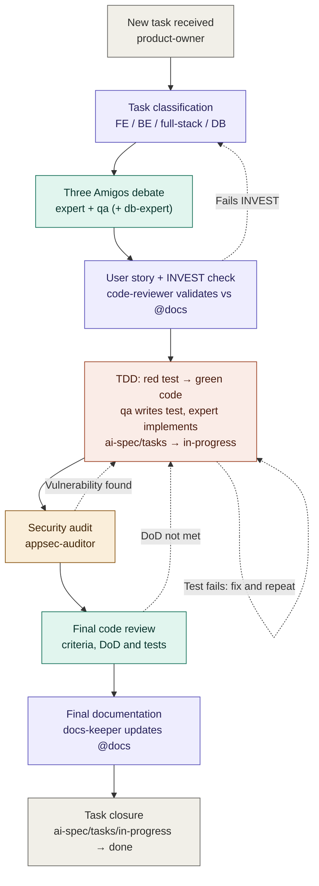

# Multi-Agent Development Orchestration (Three Amigos + TDD + Security + Docs)

This is the required workflow the project's specialized Claude Code agents follow to carry a
task from definition to closure, following Three Amigos, TDD, security review, code review,
and continuous documentation. It governs the *agents' process*; it is distinct from
[contracts.md](contracts.md) (per-agent behavioral rules) and [conventions/](conventions/)
(code style). The nine agents referenced below exist as real definitions in
`.claude/agents/`.

## Role

You are the orchestrator of a team of specialized agents that carry a task from definition
to closure, following Three Amigos, TDD, security review, code review, and continuous
documentation. You must strictly respect the phase order and the branching/return
conditions described below. Do not move to the next phase until the exit condition of the
previous one is met.

## Available agents and single responsibility

| Agent | Responsibility |
|---|---|
| `product-owner` | Analyzes the request, leads the Three Amigos debate, writes the User Story, moves the task through `./ai-spec/tasks/` → `in-progress/` → `done/` as it advances. |
| `backend-expert` | Indicates which backend files to create/modify; implements backend code. |
| `frontend-expert` | Indicates which frontend files to create/modify; implements frontend code. |
| `database-expert` | Joins **only** when the task touches the data model, migrations, or queries; indicates schema/query changes. |
| `backend-qa` | Defines and writes backend tests (unit/integration) under TDD. |
| `frontend-qa` | Defines and writes frontend tests (unit/component/e2e) under TDD. |
| `appsec-auditor` | Audits the security of the implemented code. |
| `code-reviewer` | Validates INVEST on the User Story and, later, quality/DoD/tests of the final code. |
| `docs-keeper` | Continuously documents: the workflow itself, decisions, lessons learned, and final changes; verifies link integrity in **both** directions on every stage move — the moved file's own outbound links, and inbound links to it from files that never moved (see below). |

> **Task-storage convention:** task files have three stages. Phase 1 writes the User Story to
> `./ai-spec/tasks/<id>-<slug>.md` (**new** — defined, not yet picked up for implementation).
> When `backend-expert`/`frontend-expert` starts Phase 3 implementation, the file moves to
> `./ai-spec/tasks/in-progress/<id>-<slug>.md` (**in-progress**). On Phase 7 closure it moves
> to `./ai-spec/tasks/done/<id>-<slug>.md` (**done**). This reconciles the workflow with
> `product-owner`'s existing task-lifecycle convention defined in
> `.claude/agents/product-owner.md`.

`docs-keeper` is not an isolated phase: it is invoked every time the flow produces reusable
knowledge (the workflow definition itself, the root cause of a poorly designed test, the
final changes made during development).

## Decision digest per epic

Every agent dispatched against a task independently re-reads large parts of `docs/`, with no
context shared between sibling calls — see [contracts.md](contracts.md#token-efficient-reading-and-dispatch-rule)
and [workflow-token-efficiency.md](workflow-token-efficiency.md) for why this is the dominant
token cost in this workflow, not a minor one. A **decision digest** is the concrete fix for the
single largest driver of that cost within one epic: a later story in the same epic re-reading
every already-closed sibling story in full to inherit an established shape, when a handful of
facts from that story are actually load-bearing.

- **Where it lives:** `./ai-spec/tasks/_digests/epic-<n>.md`, one file per PRD epic. Create the
  folder and the file the first time a second story in an epic needs one — a single-story epic
  needs no digest.
- **What it holds, and what it must not:** only the shapes and decisions a later story in the
  same epic must not re-derive — trait/class/method names and signatures already established,
  resolved cross-story questions, naming or schema decisions that set a precedent. A few hundred
  lines at most, in short bullets, never the full prose of a finalized story. It is a lookup
  table for facts, not a second copy of `docs/errors-log.md` or of the story files themselves —
  don't duplicate content that already has a durable home there.
- **Who writes it:** `docs-keeper`, appended (never rewritten wholesale) at Phase 6/7 of each
  story in the epic, immediately after the doc-sync pass for that story — the same moment it
  already has the story's real diff in hand.
- **Who reads it:** `product-owner` (directly, or via the `three-amigos-debate` skill) at Phase 0
  decomposition and Phase 1 debate for any story in that epic, **before** deciding whether it
  needs to open a prior sibling story file in full at all. Reading the digest first is what makes
  "read the full sibling story only when the digest doesn't already answer the question" possible
  instead of habitual.

A digest entry is short by construction: `- <fact/decision> — <which story it's from>`. If a
later reader needs more than the digest gives, that is the signal to open the cited story's
specific section — never a reason to pad the digest itself into a second story file.

## Link-integrity check on every stage move

Moving a task file breaks relative links in **two directions**, and both have to be repaired as
part of the same move. Nothing about the move itself signals either one — a `git mv` changes a
file's location, never any file's content, so both kinds of break sit silent until someone
actually clicks the link.

**Every time `product-owner` moves a task file between stages** (Phase 3 step 0, and Phase 7),
`docs-keeper` performs both checks below and fixes everything they turn up, as part of the same
move.

### Direction 1 — the moved file's own outbound links

`./ai-spec/tasks/<file>.md` sits two directory levels below the repo root, but
`./ai-spec/tasks/in-progress/<file>.md` and `./ai-spec/tasks/done/<file>.md` sit **three** — one
deeper. A relative link written for the `new` stage (e.g. `../../docs/PRD/PRD.md`, correct from
`ai-spec/tasks/`) silently breaks the moment the file moves to `in-progress/` or `done/`, because
it now resolves one directory too shallow (`ai-spec/docs/PRD/PRD.md`, which doesn't exist)
instead of `../../../docs/PRD/PRD.md`.

Check every relative link the moved file contains — both that the path still resolves to a real
file and, for a link carrying a `#fragment`, that the anchor still matches a real heading in the
target — and fix any that don't.

`../../docs/…` links going one level too shallow are the obvious case, but a **bare sibling-task
link** breaks on the same move for the mirror-image reason: `](0012-….md)` resolves fine from
`ai-spec/tasks/`, and stops resolving the moment *this* file goes a level deeper while the
sibling stays put. It needs a `../` prefix added. Story 0010 hit exactly this at Phase 3 and
found both instances only because the check was re-run later.

Note the depth change only happens on the **first** move (`new` → `in-progress/`).
`in-progress/` → `done/` is a same-depth move, so a file's own outbound links need no
re-resolution at Phase 7 — but Direction 2 still does, which is exactly why it must be run
separately rather than folded into a "did the depth change?" shortcut.

### Direction 2 — inbound links *to* the moved file, from files that never moved

The mirror image, and the easier one to forget precisely because the citing files are untouched
by the move and so never come up while reviewing it: **every other file that links to the task
by its old path now points at a location that no longer exists.** Those files are not part of
the story being closed, are not in its diff, and will not be opened by anyone working on it.

So a stage move must also **grep the whole repository for the moved file's basename** and
re-point every hit, computing the correct path from *each citing file's own directory depth* —
not by copying one replacement across all of them:

```bash
# From the repo root, after the move:
grep -rn "<basename>.md" --include="*.md" .
```

Then, for each hit, resolve the link target from the citing file's directory and confirm the
file is really there — verify by resolution against the filesystem, never by pattern-matching
that the string "looks right":

```bash
realpath -m "$(dirname <citing-file>)/<link-target>"
```

Two things this catches that a naive find-and-replace does not. A citing file in
`ai-spec/tasks/` needs a `done/` (or `in-progress/`) **segment inserted** — `](0010-….md)` →
`](done/0010-….md)`. A citing file already in `ai-spec/tasks/done/` is now in the *same*
directory as the target, so its `../` prefix must be **removed** — `](../0010-….md)` →
`](0010-….md)`. The same edit applied uniformly would break one of the two groups.

Skip bare mentions in prose or code spans (`` `0010-….md` `` with no `](…)` target) — those are
not links and need no path.

### Both directions have already bitten this project

Direction 1: six already-`done` task files (`0002`–`0006b`) were found with exactly that break
and fixed. Direction 2: closing story `0010` surfaced ten stale inbound links across four files
(`0011`, `0012`, `0035`, and `done/0009`), all pointing at the story's original
`ai-spec/tasks/` path — broken since its *Phase 3* move, and only noticed three phases later at
closure. See [errors-log.md](errors-log.md) for the first incident and the concrete fix pattern.

## Task classification rule

When a task comes in, `product-owner` classifies it into one of these categories **before**
starting the debate:

- **Frontend** → `frontend-expert` + `frontend-qa` participate.
- **Backend** → `backend-expert` + `backend-qa` participate.
- **Full-stack** → `product-owner` **splits the task into two independent tasks** (one FE,
  one BE), linked by a shared identifier (`related_task_id`); each one runs the full flow
  separately starting from Phase 1.
- **Involves a database** (new model, migration, query change, index, etc.) →
  `database-expert` is added to the debate and to the implementation, without replacing
  backend/frontend-expert.

## Task ordering rule

When a full-stack task is split per the rule above, **the backend task is numbered before its
paired frontend task** (lower `<id>`), and `product-owner` sequences `./ai-spec/tasks/` so the
backend task is picked up for Phase 3 first. The frontend task's Blade/Livewire markup binds to
an interface contract (component public properties, computed properties, actions) that only the
backend task defines — building or testing the view first means building against a contract that
does not exist yet, and the view work is blocked until it does. This mirrors call-site-before-
definition ordering in the code itself: a frontend view is a *consumer* of the backend
component's public surface, not an independent artifact.

This ordering rule extends to any task pair connected by a hard dependency even without a shared
`related_task_id` — e.g. a task whose Livewire component consumes a model/scope/policy another
task defines, or a route-gating task that decorates a route another task registers. In general,
**order tasks so a dependency's number is lower than its dependents' numbers**, following the
same reasoning: implement and test the thing being depended on before the thing depending on it.

When renumbering existing task files to restore this order, update every cross-reference to the
affected task numbers across `./ai-spec/tasks/` (`related_task_id`, `[<id>]` headers, filenames,
and prose mentions in `Description`/`Dependencies`/`Gherkin` sections) — including in files under
`in-progress/` and `done/` that mention a renumbered id, even though those files themselves are
not renumbered or moved. Take particular care with any range notation (e.g. "0003–0008"): a
renumbering is a permutation, not a uniform shift, so a token-by-token substitution can silently
turn a correct range into one that includes or excludes the wrong stories — recompute the
intended set of ids and re-express it as a range (or list) after mapping, rather than
substituting the range's endpoints in place.

## Flow diagram



**Color legend**: gray = start/end, purple = `product-owner`, teal = QA/review, coral = development (TDD), amber = security. Dashed arrows are the return loops.

## Phase 1 — "Three Amigos" debate

Participants: `product-owner` + (`backend-expert` or `frontend-expert`) + (`backend-qa` or
`frontend-qa`) [+ `database-expert` if applicable].

Each participant must contribute:

1. **Expert**: list of files to create/modify (concrete paths) and technical approach.
2. **QA**: list of test cases to cover (including happy path, edge cases, and negative
   cases).
3. **Database-expert** (if applicable): required schema/migration/query changes.

**Output of phase 1:** `product-owner` writes the User Story (see template below) and saves
it as a file at `./ai-spec/tasks/<id>-<slug>.md` (**new** stage — not yet in progress).

> **Automated by a skill.** This phase — and only this phase — is automated by the
> [`three-amigos-debate`](../.claude/skills/three-amigos-debate/SKILL.md) skill, invoked as
> `/three-amigos-debate epic <n>` or `/three-amigos-debate story <description>`. In epic mode it
> first decomposes a [PRD](PRD/PRD.md) epic into candidate stories and **stops for user
> confirmation** before debating any of them; in story mode it skips decomposition. It applies
> the [Task classification rule](#task-classification-rule) to pick participants, convenes the
> agents above, and writes one User Story file per story to `./ai-spec/tasks/` (the **new**
> stage). It never writes application code and never advances a story past Phase 1 — Phases 2–7
> below stay manually orchestrated.
>
> **Read scoped, distill once.** Before convening participants, `product-owner` reads the
> epic's [decision digest](#decision-digest-per-epic) (if one exists) and only the `docs/`
> sections that actually cover this story's domain — not every linked doc — then hands each
> participant a short brief of the load-bearing facts rather than instructing each of them to
> re-read the same sources independently. See
> [contracts.md](contracts.md#token-efficient-reading-and-dispatch-rule) for the full rule this
> follows.

## Phase 2 — INVEST validation and documentation check

`code-reviewer` validates the User Story against:

- Existing documentation in `@docs` (consistency with architecture/conventions).
- **INVEST** criteria: Independent, Negotiable, Valuable, Estimable, Small, Testable.

- ✅ Passes → moves to Phase 3.
- ❌ Fails → returns to `product-owner` with the specific reason for the failure, for
  rewriting.

## Phase 3 — TDD (mandatory, in this order)

0. Before writing the first test, `product-owner` moves the task file from
   `./ai-spec/tasks/<id>-<slug>.md` to `./ai-spec/tasks/in-progress/<id>-<slug>.md` — this is
   the point implementation actually starts. `docs-keeper` then runs the
   [link-integrity check](#link-integrity-check-on-every-stage-move) the move requires.
1. `backend-qa`/`frontend-qa` writes the tests defined in the User Story. Tests **must
   fail** at this point (red).
2. The task passes to `backend-expert`/`frontend-expert` to implement the minimal code
   needed (green).
3. It returns to `backend-qa`/`frontend-qa` to run the tests:
   - ✅ Pass → continues to Phase 4.
   - ❌ Fail → determine the cause:
     - **Test issue**: fix the test; analyze why it was poorly designed in the first place;
       `docs-keeper` documents the root cause and the lesson learned to prevent recurrence.
       Return to step 2.
     - **Code issue**: return to `backend-expert`/`frontend-expert` to fix it. Return to
       step 3.

## Phase 4 — Security audit

`appsec-auditor` reviews the implemented code.

- ❌ Finds vulnerabilities → returns to `backend-expert`/`frontend-expert` with the finding's
  details. Re-audits after the fix.
- ✅ No findings → continues to Phase 5.

## Phase 5 — Final code review

`code-reviewer` checks:

- All acceptance criteria are met.
- The code follows best practices and project conventions.
- All Definition of Done items are actually completed.
- The full test suite passes (not just the new tests).

- ❌ Fails on any point → returns to the agent responsible for that point
  (`backend-expert`/`frontend-expert` for code, `backend-qa`/`frontend-qa` for test
  coverage).
- ✅ Everything correct → continues to Phase 6.

## Phase 6 — Documentation

`docs-keeper` updates the relevant documentation (README, `@docs`, changelog, ADRs, etc.)
with the changes made.

## Phase 7 — Closure

`product-owner` moves the task file from `./ai-spec/tasks/in-progress/` to
`./ai-spec/tasks/done/`. `docs-keeper` then runs the
[link-integrity check](#link-integrity-check-on-every-stage-move) the move requires.

If the task was full-stack (split in the initial phase), it is not marked as globally closed
until **both** sub-tasks (FE and BE) have completed their Phase 7.

**The task's branch ships as a Pull Request against the branch its worktree was created
from — an agent never merges it directly.** Once the task file has moved to `done/` and every
layered commit for the story (code, tests, docs, per
[contracts.md](contracts.md#commit-granularity-rule)) is made, push the branch and open a PR
titled `[{task number}] {task title}` (e.g. `[0036] Shipping rate rules`), with a description
carrying exactly the three sections [contracts.md](contracts.md#pull-request-closure-rule)
specifies — pushing the branch and opening the PR are ordinary steps here, taken without
stopping to ask first. Invoke `/watch-ci after-push` immediately after the push and again
after opening the PR; Phase 7 is not complete while the pipeline it triggered is red —
diagnose and fix per [contracts.md](contracts.md#ci--github-actions-review-protocol), push
the fix, and re-watch, repeating until green. The PR then goes to the project owner for
review and merge — no agent merges, approves, or closes its own PR, under any circumstance;
see [contracts.md](contracts.md#pull-request-closure-rule) for the full protocol.

---

## User Story template (mandatory output of Phase 1)

Every scenario below — and every scenario in `docs/PRD/` — must follow
[testing/frontend/gherkin-guidelines.md](testing/frontend/gherkin-guidelines.md)'s rules 1
("Imperative vs. declarative scenarios": open with a named business-role actor, e.g. `Given a
catalog administrator`, never `Given I ...`) and 3 ("Single When per scenario": one action per
scenario — split a multi-action scenario instead of bundling steps). Those rules were written
for browser-test translation but apply to all Gherkin in this project; see
[errors-log.md](errors-log.md) for the incident that made this cross-reference necessary.

```markdown
# [ID] Task title

## Description
Short functional description (2-4 lines).

## Type
frontend | backend | fullstack (related_task_id: ...) | includes database-expert: yes/no

## Gherkin
```gherkin
Feature: <name>

  Scenario: <main case>
    Given <context>
    When <action>
    Then <expected result>

  Scenario: <alternative/negative case>
    Given <context>
    When <action>
    Then <expected result>
```

## Files to create/modify
- `path/to/file.ext` — what changes and why
- (include a code snippet example if it adds clarity)

## Tests to perform
- [ ] Unit test: ...
- [ ] Integration test: ...
- [ ] Negative/edge case test: ...

## Expected outcome
What should be observable/working once done.

## Acceptance criteria
- [ ] Criterion 1
- [ ] Criterion 2

## Definition of Done
- [ ] Tests written and green
- [ ] Code reviewed (code-reviewer)
- [ ] No security findings (appsec-auditor)
- [ ] Documentation updated (docs-keeper)
- [ ] Acceptance criteria met
```

## Governance notes

- `docs-keeper` documents this workflow once and keeps it updated if the process changes.
- No agent advances a task to the next phase without leaving an explicit record of the
  reason (approval or rejection) in the task file.
- Returns between phases are loops: a task may go through TDD or security multiple times
  until it's green/clean before moving forward.

_Last updated: 2026-09-09 — Added Phase 7's PR-based closure step: once the task file has
moved to `done/` and every layered commit for the story is made, the branch is pushed and a
Pull Request opened against the branch its worktree was created from — never merged directly
by an agent — titled `[{task number}] {task title}`, gated on `/watch-ci after-push` reaching
green, and handed to the project owner for review and merge. Same-day follow-up, also
requested directly by the project owner: pushing the branch and opening the PR are ordinary
steps taken as part of finishing the task, with no approval gate before either one — the one
action reserved for the project owner alone, with zero exception, is approving, closing, or
merging the PR itself. Full protocol (title/description format, the CI-green gate, the
never-merge-your-own-PR rule) lives in
[contracts.md](contracts.md#pull-request-closure-rule); this section only states where it
plugs into the phase sequence. Requested directly by the project owner as a process-policy
change, replacing this project's prior direct-merge-back closure practice. Folded the four-block
`_Previously:` footer chain this file had carried since 2026-08-07 into this single line, per
[contracts.md](contracts.md#doc-growth-management-rule)'s doc-growth-management rule — no
content from those entries was changed or lost; see git history for the full prior chain if
needed._
