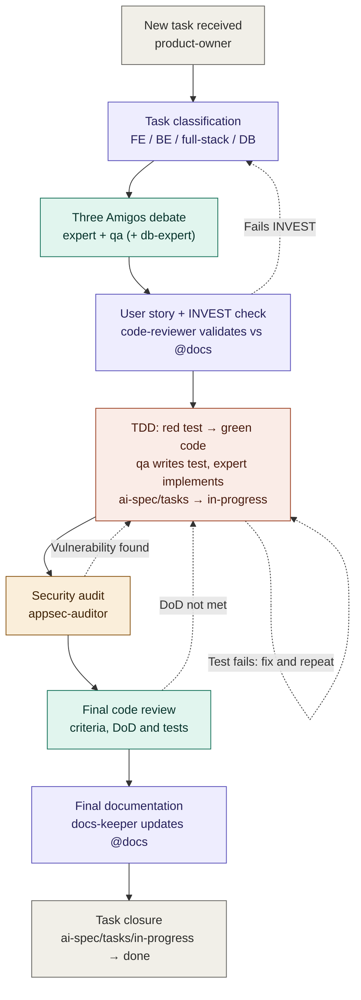

# Multi-Agent Development Orchestration — Flow diagram and Phases 1–7

> Part of [Multi-Agent Development Orchestration](../workflow.md). **Read this part when:** you run or resume any phase of a task, or need a phase's exit condition and return loop. The other parts are listed in the [hub](../workflow.md#parts).

## Flow diagram

**Color legend**: gray = start/end, purple = `product-owner`, teal = QA/review, coral = development (TDD), amber = security. Dashed arrows are the return loops.

## Phase 1 — "Three Amigos" debate

Participants: `product-owner` + (`backend-expert` or `frontend-expert`) + (`backend-qa` or
`frontend-qa`) [+ `database-expert` if applicable].

Each participant must contribute:

1. **Expert**: list of files to create/modify (concrete paths) and technical approach.
2. **QA**: list of test cases to cover (including happy path, edge cases, and negative
   cases).
3. **Database-expert** (if applicable): required schema/migration/query changes.

**Output of phase 1:** `product-owner` writes the User Story (see template below) and saves
it as a file at `./ai-spec/tasks/<id>-<slug>.md` (**new** stage — not yet in progress).
`docs-keeper` regenerates `ai-spec/tasks-map.md` and `ai-spec/tasks-status.json` for it in the
same pass — see [Regenerating the task-coordination files](task-files-links-and-ordering.md#regenerating-the-task-coordination-files).

> **Automated by a skill.** This phase — and only this phase — is automated by the
> [`three-amigos-debate`](../../.claude/skills/three-amigos-debate/SKILL.md) skill, invoked as
> `/three-amigos-debate epic <n>` or `/three-amigos-debate story <description>`. In epic mode it
> first decomposes a [PRD](../PRD/PRD.md) epic into candidate stories and **stops for user
> confirmation** before debating any of them; in story mode it skips decomposition. It applies
> the [Task classification rule](task-files-links-and-ordering.md#task-classification-rule) to pick participants, convenes the
> agents above, and writes one User Story file per story to `./ai-spec/tasks/` (the **new**
> stage). It never writes application code and never advances a story past Phase 1 — Phases 2–7
> below stay manually orchestrated.
>
> **Read scoped, distill once.** Before convening participants, `product-owner` reads the
> epic's [decision digest](agents-and-epic-digests.md#decision-digest-per-epic) (if one exists) and only the `docs/`
> sections that actually cover this story's domain — not every linked doc — then hands each
> participant a short brief of the load-bearing facts rather than instructing each of them to
> re-read the same sources independently. See
> [contracts.md](../contracts/token-and-doc-rules.md#token-efficient-reading-and-dispatch-rule) for the full rule this
> follows.

## Phase 2 — INVEST validation and documentation check

`code-reviewer` validates the User Story against:

- Existing documentation in `@docs` (consistency with architecture/conventions).
- **INVEST** criteria: Independent, Negotiable, Valuable, Estimable, Small, Testable.

- ✅ Passes → moves to Phase 3.
- ❌ Fails → returns to `product-owner` with the specific reason for the failure, for
  rewriting.

## Phase 3 — TDD (mandatory, in this order)

0. Before writing the first test, `product-owner` moves the task file from
   `./ai-spec/tasks/<id>-<slug>.md` to `./ai-spec/tasks/in-progress/<id>-<slug>.md` — this is
   the point implementation actually starts. `docs-keeper` then runs the
   [link-integrity check](task-files-links-and-ordering.md#link-integrity-check-on-every-stage-move) the move requires.
1. `backend-qa`/`frontend-qa` writes the tests defined in the User Story. Tests **must
   fail** at this point (red).
2. The task passes to `backend-expert`/`frontend-expert` to implement the minimal code
   needed (green).
3. It returns to `backend-qa`/`frontend-qa` to run the tests:
   - ✅ Pass → continues to Phase 4.
   - ❌ Fail → determine the cause:
     - **Test issue**: fix the test; analyze why it was poorly designed in the first place;
       `docs-keeper` documents the root cause and the lesson learned to prevent recurrence.
       Return to step 2.
     - **Code issue**: return to `backend-expert`/`frontend-expert` to fix it. Return to
       step 3.

## Phase 4 — Security audit

`appsec-auditor` reviews the implemented code.

- ❌ Finds vulnerabilities → returns to `backend-expert`/`frontend-expert` with the finding's
  details. Re-audits after the fix.
- ✅ No findings → continues to Phase 5.

## Phase 5 — Final code review

`code-reviewer` checks:

- All acceptance criteria are met.
- The code follows best practices and project conventions.
- All Definition of Done items are actually completed.
- The full test suite passes (not just the new tests).

- ❌ Fails on any point → returns to the agent responsible for that point
  (`backend-expert`/`frontend-expert` for code, `backend-qa`/`frontend-qa` for test
  coverage).
- ✅ Everything correct → continues to Phase 6.

## Phase 6 — Documentation

`docs-keeper` updates the relevant documentation (README, `@docs`, changelog, ADRs, etc.)
with the changes made.

## Phase 7 — Closure

`product-owner` moves the task file from `./ai-spec/tasks/in-progress/` to
`./ai-spec/tasks/done/`. `docs-keeper` then runs the
[link-integrity check](task-files-links-and-ordering.md#link-integrity-check-on-every-stage-move) the move requires.

If the task was full-stack (split in the initial phase), it is not marked as globally closed
until **both** sub-tasks (FE and BE) have completed their Phase 7.

**The task's branch ships as a Pull Request against the branch its worktree was created
from — an agent never merges it directly.** Once the task file has moved to `done/` and every
layered commit for the story (code, tests, docs, per
[contracts.md](../contracts/commits-and-pull-requests.md#commit-granularity-rule)) is made, push the branch and open a PR
titled `[{task number}] {task title}` (e.g. `[0036] Shipping rate rules`), with a description
carrying exactly the three sections [contracts.md](../contracts/commits-and-pull-requests.md#pull-request-closure-rule)
specifies — pushing the branch and opening the PR are ordinary steps here, taken without
stopping to ask first. Invoke `/watch-ci after-push` immediately after the push and again
after opening the PR; Phase 7 is not complete while the pipeline it triggered is red —
diagnose and fix per [contracts.md](../contracts/ci-protocol.md#ci--github-actions-review-protocol), push
the fix, and re-watch, repeating until green. The PR then goes to the project owner for
review and merge — no agent merges, approves, or closes its own PR, under any circumstance;
see [contracts.md](../contracts/commits-and-pull-requests.md#pull-request-closure-rule) for the full protocol.

---
