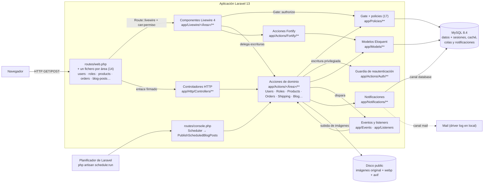
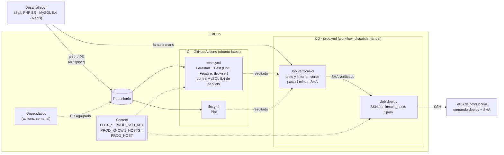
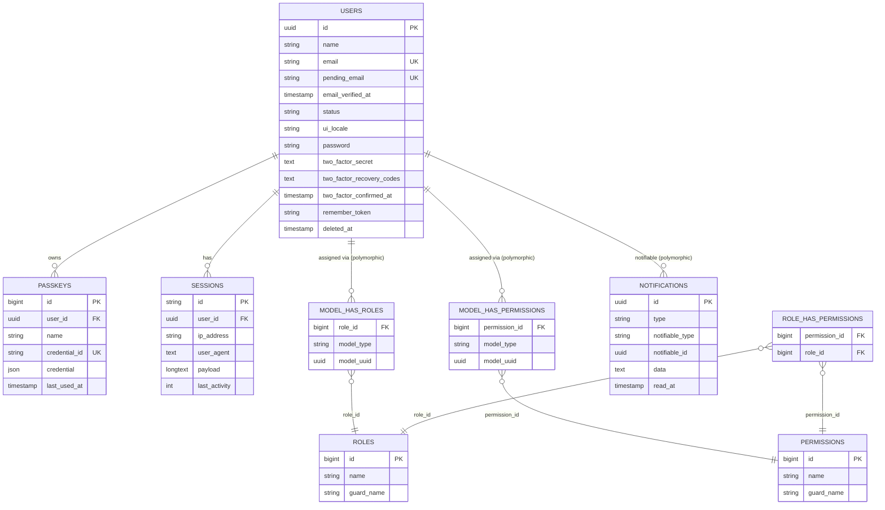
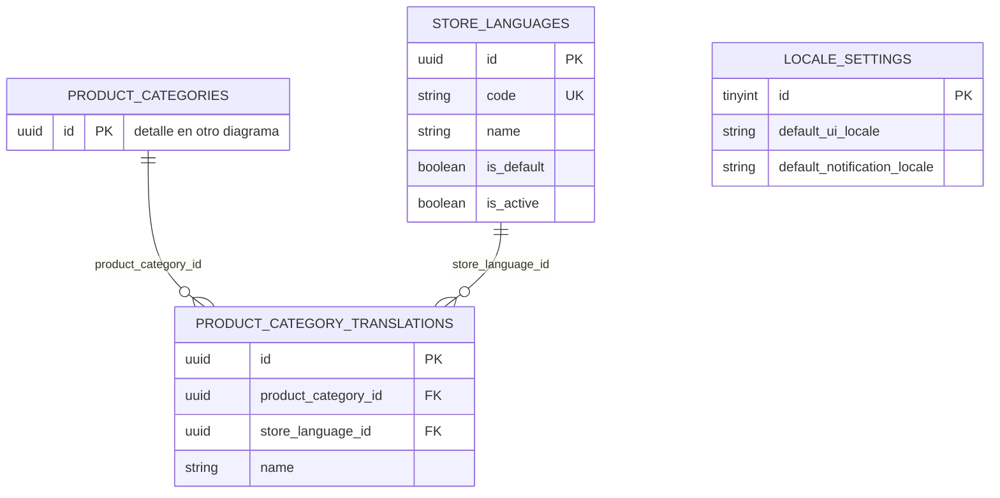
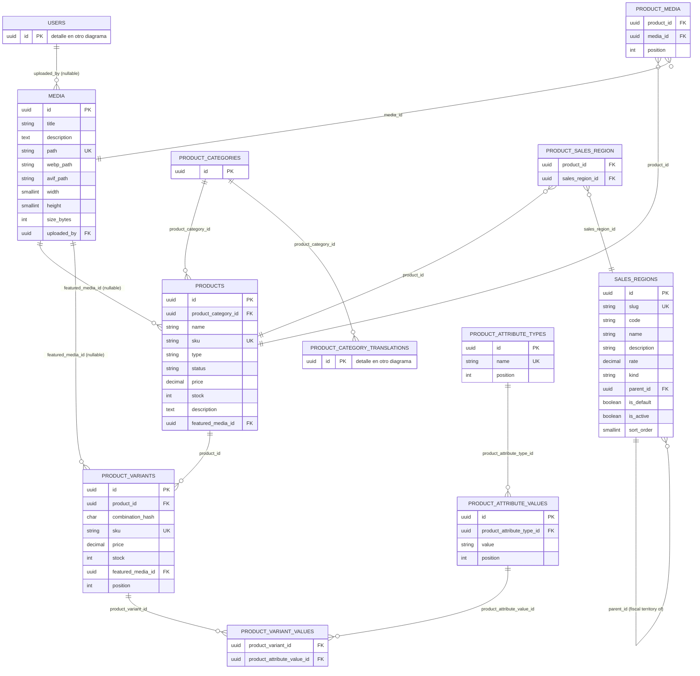
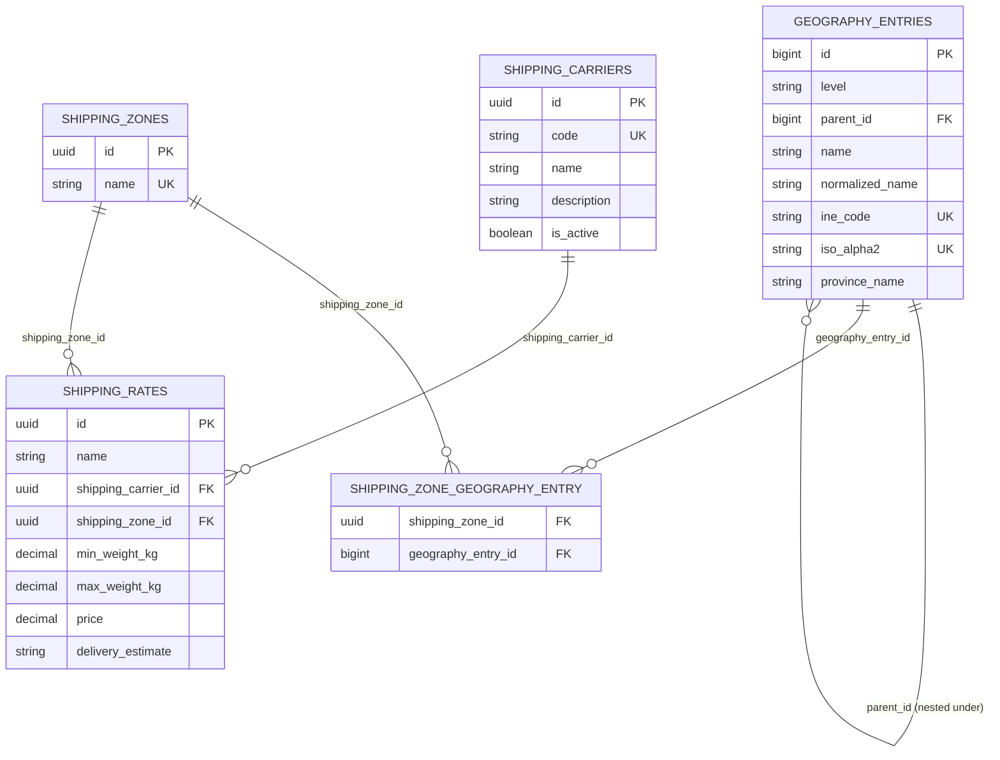
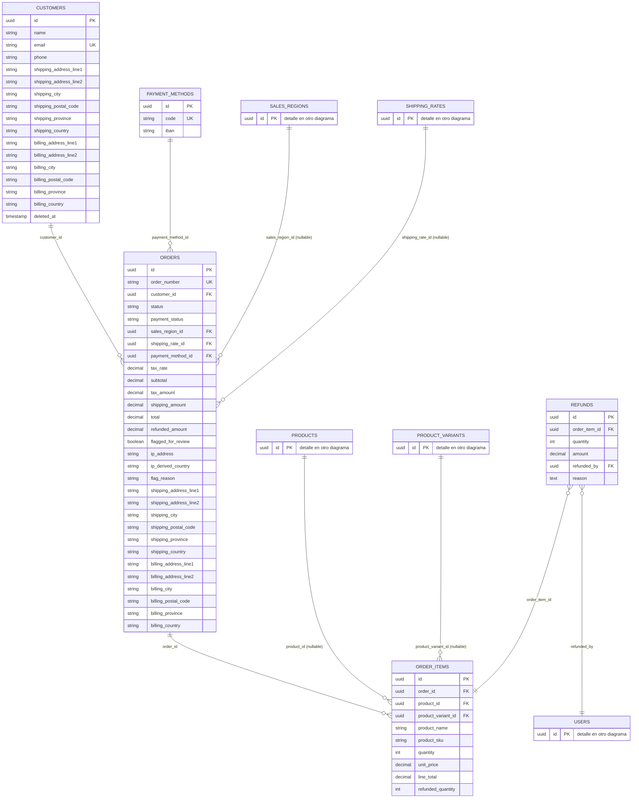
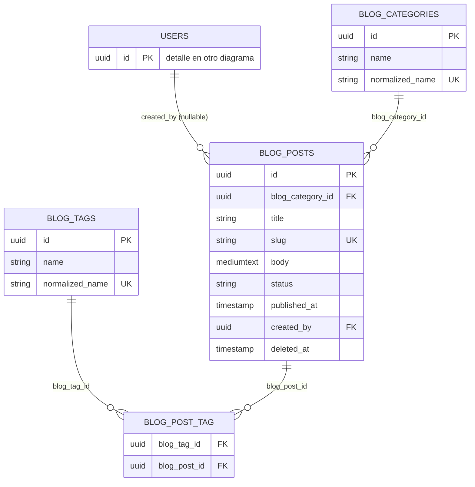

## Índice

0. [Ficha del proyecto](#0-ficha-del-proyecto)
1. [Descripción general del producto](#1-descripción-general-del-producto)
2. [Arquitectura del sistema](#2-arquitectura-del-sistema)
3. [Modelo de datos](#3-modelo-de-datos)
4. [Especificación de la API](#4-especificación-de-la-api)
5. [Historias de usuario](#5-historias-de-usuario)
6. [Tickets de trabajo](#6-tickets-de-trabajo)
7. [Pull requests](#7-pull-requests)

---

## 0. Ficha del proyecto

### **0.1. Tu nombre completo:**
Angel Rosso Pellisso

### **0.2. Nombre del proyecto:**
Arospe

### **0.3. Descripción breve del proyecto:**
Arospe es un dashboard de administración que centraliza la gestión de un ecommerce: usuarios y permisos, catálogo de productos, impuestos, envíos, clientes, pedidos y blog, con soporte multidioma, todo desde un solo panel intuitivo.

### **0.4. URL del proyecto:**

El proyecto se encuentra en https://angelrosso.com/login
Se está integrando en https://angelrosso.com para mi pagina personal aunque el proyecto se está preparando para tiendas online, yo consumiré la parte de blog en mi web personal que está fuera de scope de este proyecto.

Para acceder a https://angelrosso.com no necesitas contraseña pero para acceder al resto está protegido con contraseña y ademas necesitarás credenciales para acceder al dashboard, esto se enviará por email a [alvaro@lidr.co](mailto:alvaro@lidr.co)

### 0.5. URL o archivo comprimido del repositorio

https://github.com/shojen/AI4Devs-finalproject


---

## 1. Descripción general del producto

> Describe en detalle los siguientes aspectos del producto:

### **1.1. Objetivo:**

Arospe es un **backoffice de administración** para una operación de ecommerce: el panel interno desde el que un equipo gestiona los datos sobre los que corre una tienda (usuarios y sus permisos, un blog, el catálogo de productos, impuestos por región fiscal, transportistas y tarifas de envío, métodos de pago, clientes y pedidos, notificaciones internas e idiomas de la tienda), todo desde un único dashboard.

**Alcance deliberado — solo backoffice.** Arospe no incluye tienda pública, carrito ni checkout. Gestiona los datos que una tienda pública (futura y separada) consumiría; cuando el PRD menciona "el checkout" o "un cliente", lo hace para explicar *por qué* existe un dato administrativo, no porque esa pantalla forme parte de este proyecto.

**A quién va dirigido:** al equipo interno (administradores/editores) que necesita un panel único para dar de alta usuarios y roles, mantener el catálogo y sus reglas fiscales/logísticas, publicar contenido de blog y hacer seguimiento de clientes y pedidos, sin depender de acceso directo a la base de datos.

**Valor que aporta:** centraliza en una sola herramienta tareas que de otro modo estarían dispersas (gestión de usuarios, contenido, catálogo, fiscalidad, logística), con permisos granulares por módulo (vía roles dinámicos) en lugar de accesos todo-o-nada.

### **1.2. Características y funcionalidades principales:**

El backoffice cubre ya las cinco épicas del PRD ([`arospe/docs/PRD/PRD.md`](arospe/docs/PRD/PRD.md)). Cada funcionalidad se construyó como una historia de usuario con su propio fichero en [`arospe/ai-spec/tasks/done/`](arospe/ai-spec/tasks/done/); las pendientes están en [`arospe/ai-spec/tasks/`](arospe/ai-spec/tasks/). Todas las pantallas de módulo están protegidas por un permiso del catálogo (`can:<módulo>.view`) y el menú lateral solo muestra lo que el usuario puede abrir.

**Epic 1 — Usuarios, roles y permisos**

- **Autenticación** con Fortify: registro, login, verificación de email, reseteo de contraseña, 2FA (TOTP) y passkeys (WebAuthn).
- **Usuarios** (`/users`): alta con invitación por correo, edición y borrado lógico. El estado de la cuenta (`activo`/`inactivo`/`suspendido`) es un control de acceso: una cuenta no activa no obtiene sesión por ninguna vía. Un cambio de correo nunca se aplica hasta que se confirma desde la dirección nueva.
- **Roles y permisos** (`/roles`): roles personalizados con permisos por módulo, sobre un catálogo sembrado de 43 permisos. `Super Admin` es un rol fijo del sistema (no se edita, borra ni asigna desde el panel) y el rol `Administrator` sembrado no se puede renombrar ni borrar.
- **Reautenticación por escalado**: cambiar el rol, el estado o el correo de otra persona, borrar una cuenta o crear un administrador exige haber confirmado la contraseña recientemente. Ver [2.5](#25-seguridad).

**Epic 2 — Catálogo, impuestos, medios, envíos y pagos**

- **Regiones de venta e impuestos** (`/taxes/sales-regions`): catálogo sembrado de países ISO más los cinco territorios fiscales de España. Cada entrada es a la vez la regla fiscal (tipo, código, descripción) y siempre hay exactamente una por defecto, activa.
- **Productos** (`/products`): listado y editor con categoría, SKU, precio, stock, descripción en texto enriquecido (HTML saneado en el servidor), imagen destacada, galería y regiones fiscales asignadas. El tipo de IVA aplicable se resuelve por destino (la región asignada, o la de por defecto).
- **Categorías de producto** (`/product-categories`), con el nombre ya guardado por idioma de tienda, y **tipos de atributo** (`/products/attribute-types`: Talla, Color…) definidos por el administrador.
- **Variantes**: cada combinación de atributos con su propio SKU derivado, precio, stock e imagen. Un **generador** crea todas las combinaciones de una vez, sin duplicar las existentes.
- **Galería de medios compartida**: cada imagen conserva su original y genera versiones `.webp` y `.avif`. Se usa desde productos y blog mediante un modal común.
- **Envíos** (`/shipping`, `/shipping/zones`): catálogo geográfico sembrado (países, comunidades autónomas y municipios del INE), zonas de envío, los cuatro transportistas (SEUR, Correos, MRW, DHL Express) activables y reglas de tarifa por zona y rango de peso.
- **Métodos de pago** (`/payment-methods`): transferencia bancaria con su IBAN validado.

**Epic 3 — Clientes y pedidos**

- **Clientes** (`/customers`): alta, edición y borrado lógico, con direcciones de envío y facturación, e historial de pedidos en su ficha.
- **Pedidos** (`/orders`): listado y ficha con edición de líneas, cambios de estado, cancelación manual y reembolsos parciales o totales (un reembolso total cancela el pedido automáticamente). El precio de cada línea y las direcciones quedan **congeladas** al crear el pedido. La región fiscal se resuelve según la dirección de envío (productos físicos) o la de facturación (virtuales), y en los virtuales, si el país de la IP no coincide con el de facturación, el pedido se marca para revisión.

**Epic 4 — Blog**

- **Categorías** y **etiquetas** (`/blog/categories`, `/blog/tags`); las etiquetas también se crean al vuelo desde el editor del post.
- **Posts** (`/blog/posts`): editor con texto enriquecido, estados borrador / publicado / programado y borrado lógico con restauración. Un comando programado publica cada minuto los posts cuya fecha ha llegado y, si la publicación falla, avisa por correo al autor (o, si ya no está disponible, a quienes pueden editar el blog).

**Transversal — Notificaciones.** Se generan notificaciones en base de datos para nuevo cliente, nuevo pedido, post publicado y fallo al publicar un post programado. La campana de la barra superior las lista; las de cliente y pedido llevan resumen y enlace, y las del blog se muestran por ahora con un texto genérico.

**Epic 5 — Internacionalización.** Dos capas independientes:

- **Idioma del panel** (ES/EN): cada administrador guarda su preferencia y existe un idioma por defecto para el panel y otro para los correos. El backend está hecho; el selector de la interfaz es la historia pendiente [0067](arospe/ai-spec/tasks/0067-admin-ui-language-switcher-ui.md).
- **Idiomas de la tienda**: catálogo de idiomas del contenido y mecanismo de traducción por idioma, estrenado en las categorías de producto. Las pantallas y su extensión al resto del contenido son las historias pendientes 0069 y 0071–0079.

**Alcance del PRD y estado**

| Área | Estado |
| --- | --- |
| Usuarios, roles y permisos | ✅ Hecho |
| Catálogo de productos (categorías, atributos, variantes, generador) | ✅ Hecho |
| Regiones de venta e impuestos | ✅ Hecho |
| Galería de medios compartida | ✅ Hecho |
| Envíos (geografía, zonas, transportistas, tarifas) | ✅ Hecho |
| Métodos de pago (transferencia bancaria) | ✅ Hecho |
| Clientes y pedidos | ✅ Hecho |
| Blog (categorías, etiquetas, posts, publicación programada) | ✅ Hecho |
| Notificaciones: nuevo cliente, nuevo pedido, post publicado | ✅ Hecho |
| Internacionalización | 🟡 Backend hecho; faltan el selector de idioma del panel, la pantalla de idiomas de tienda y las pestañas de traducción de productos, categorías, etiquetas y posts |
| Notificaciones de stock bajo / agotado | ⏳ Pendiente |
| Búsqueda global (usuarios, productos, posts) | ⏳ Pendiente |

Quedan además como mejoras anotadas: restaurar desde el panel una cuenta de usuario borrada y cerrar las sesiones abiertas de un usuario al suspenderlo.


### **1.3. Diseño y experiencia de usuario:**

> Proporciona imágenes y/o videotutorial mostrando la experiencia del usuario desde que aterriza en la aplicación, pasando por todas las funcionalidades principales.

### **1.4. Instrucciones de instalación:**

**Prerrequisitos**

- PHP 8.4+ y Composer en el host, para el `composer install` inicial (después Sail provee PHP 8.5 dentro del contenedor)
- Node 22 (dentro de Sail ya está disponible; en el host solo hace falta para ejecutar Playwright fuera del contenedor)
- Docker (Docker Desktop) — el entorno local corre sobre Laravel Sail
- Windows: **WSL2 obligatorio**; todos los comandos se ejecutan desde la shell de WSL2 (Ubuntu), no desde PowerShell/CMD. Docker Desktop debe estar iniciado y con la integración WSL2 habilitada para la distro usada.

**1. Clonar el repositorio**

```bash
git clone https://github.com/shojen/AI4Devs-finalproject.git
cd AI4Devs-finalproject/arospe
git checkout finalproject-ARP
```

**2. Crear el fichero `.env`**

Hay un `.env.example` en el repo que muestra las claves existentes, pero los valores reales (credenciales de base de datos, ajustes de app, etc.) deben solicitarse de forma privada — no inventar ni reutilizar valores de otro entorno.

**3. Instalar dependencias PHP**

```bash
composer install
```

**4. Levantar los servicios con Sail**

```bash
./vendor/bin/sail up -d
```

Esto arranca, según `compose.yaml`:

| Servicio | Imagen | Propósito |
| --- | --- | --- |
| `laravel.test` | `sail-8.5/app` (build de `docker/8.5`) | Contenedor de la app, PHP 8.5. Sirve la app (puerto `80`) y el servidor de desarrollo de Vite (puerto `5173`). |
| `mysql` | `mysql:8.4` | Base de datos principal (puerto `3306`). También aprovisiona una base de datos de test vía `docker/mysql/create-testing-database.sh`. |
| `redis` | `redis:alpine` | Redis (puerto `6379`). El servicio arranca con Sail, pero la aplicación no lo usa: caché, sesiones y colas van por el driver `database` (ver `.env.example`). |

**5. Frontend**

```bash
./vendor/bin/sail npm install
./vendor/bin/sail npm run dev      # desarrollo: servidor Vite con hot reload
```

Para producción (o para ejecutar los tests de navegador sin el servidor de Vite) se compilan los assets una vez con `./vendor/bin/sail npm run build`. Como alternativa, `composer dev` (que invoca `php artisan dev`) arranca de una vez los procesos de desarrollo, y `composer setup` automatiza la instalación completa (`.env`, `key:generate`, `migrate`, `storage:link` y build de assets).

**6. Clave de aplicación, enlace de almacenamiento, migraciones y semillas**

```bash
./vendor/bin/sail artisan key:generate
./vendor/bin/sail artisan storage:link     # la galería de medios sirve las imágenes desde storage/app/public
./vendor/bin/sail artisan migrate --seed
```

En local (`APP_ENV=local`), `DatabaseSeeder` crea además un usuario de prueba, `test@example.com`, con la contraseña por defecto de la factory (`password`).

Para reconstruir la base de datos desde cero:

```bash
./vendor/bin/sail artisan migrate:fresh --seed
```

**El seed no es opcional.** Además de los roles y el catálogo de permisos contra los que autoriza la aplicación (`RolePermissionSeeder`), siembra los catálogos fijos de los que dependen las pantallas: regiones de venta, idiomas de tienda y ajustes de idioma, catálogo geográfico, transportistas y métodos de pago. Sin ellos la aplicación no funciona correctamente (ver la nota de despliegue en [`arospe/docs/architecture/overview.md`](arospe/docs/architecture/overview.md)). En producción se usa la clase explícita `ProductionSeeder`, que ejecuta exactamente esos catálogos y nunca los datos de prueba:

```bash
./vendor/bin/sail artisan db:seed --class=ProductionSeeder
```

Todos estos seeders son idempotentes: re-ejecutarlos no duplica nada, conserva lo que el administrador configuró y restaura los permisos revocados manualmente al rol `Administrator`.

**Variable de entorno opcional `SUPER_ADMIN_EMAIL`.** Define el email del usuario al que `RolePermissionSeeder` asigna el rol `Super Admin` (ver `.env.example` para la descripción completa). Si se deja sin definir, el rol se siembra sin asignar a nadie. Si coincide con un usuario existente **verificado**, ese usuario recibe el rol. Si no coincide con ningún usuario, el seeder **aprovisiona** una cuenta nueva con contraseña aleatoria y envía un enlace de reseteo para que el operador la reclame vía "He olvidado mi contraseña". Si coincide con un usuario existente **sin verificar**, o si el valor no es una dirección de email bien formada, el seeder **aborta** ese bootstrap de forma ruidosa y no concede el rol a nadie (el resto del seed sí continúa). El valor se normaliza a minúsculas, así que `Admin@Example.com` y `admin@example.com` son la misma dirección.

**7. Ejecutar los tests**

```bash
./vendor/bin/sail artisan test
```

También existe un script de Composer que limpia config, comprueba formato, ejecuta análisis estático y luego el test suite:

```bash
composer test
```

Los tests de navegador (Pest browser plugin + Playwright) requieren, la primera vez, descargar los binarios de navegador (no se versionan en el repo):

```bash
npx playwright install
```

**8. Calidad de código**

```bash
./vendor/bin/sail composer lint          # formatea con Pint
./vendor/bin/sail composer lint:check    # comprueba estilo sin modificar
./vendor/bin/sail composer types:check   # análisis estático con Larastan
```

**9. Parar el entorno**

```bash
./vendor/bin/sail down
```

---

## 2. Arquitectura del Sistema

### **2.1. Diagrama de arquitectura:**

Arospe es un **monolito Laravel 13 + Livewire 4**, construido sobre el starter kit oficial de Livewire (`laravel/livewire-starter-kit`). No hay SPA independiente ni API REST: los componentes Livewire renderizan UI server-driven directamente sobre el request lifecycle de Laravel.



**Patrón:** MVC clásico de Laravel, con Livewire sustituyendo la capa de "controlador + vista JS" por componentes de servidor con estado (full-stack reactivo sin escribir una API ni JavaScript de cliente para la lógica de negocio). Sesión, caché y colas usan el driver `database` (no hay servicios externos configurados todavía salvo el propio MySQL).

**Por qué esta arquitectura:** el proyecto es un backoffice interno (no una app pública de alto tráfico ni con necesidad de un cliente desacoplado), por lo que un monolito server-rendered reduce la complejidad operativa —no hay que versionar ni sincronizar un contrato de API entre backend y frontend— y acelera el desarrollo de CRUDs de administración, que es el grueso del alcance (ver [1.2](#12-características-y-funcionalidades-principales)).

**Beneficios:** menos piezas móviles (un solo repositorio, un solo despliegue), estado siempre en servidor (más fácil de validar/autorizar de forma centralizada), y reutilización directa de Eloquent/Blade/Livewire sin duplicar lógica de validación en un frontend separado.

**Costes/déficits:** no hay una API pública reutilizable por otros clientes (por ejemplo, una futura tienda pública tendría que construirse aparte o forzar la creación posterior de una API); la interactividad depende de round-trips al servidor por cada acción Livewire, lo que puede ser menos fluido que una SPA para interacciones muy ricas en cliente; y el acoplamiento UI-servidor dificulta escalar el frontend independientemente del backend.

### **2.2. Descripción de componentes principales:**

- **Rutas (`routes/web.php` + un fichero por área)** — puntos de entrada HTTP. No hay `routes/api.php`: la aplicación no expone API (ver [4](#4-especificación-de-la-api)). `web.php` solo declara la portada y el `dashboard` y requiere un fichero por área funcional: `settings.php`, `users.php`, `roles.php`, `sales-regions.php`, `product-categories.php`, `product-attribute-types.php`, `products.php`, `shipping.php`, `payment-methods.php`, `customers.php`, `orders.php`, `blog-tags.php`, `blog-categories.php`, `blog-posts.php` y `store-languages.php`. Cada uno abre su propio grupo `auth` + `verified` y protege cada pantalla con **un único `can:<módulo>.view` por ruta**. Se usa `can:` y no el `permission:` de Spatie porque es el único de los dos que Livewire vuelve a aplicar en sus peticiones internas (motivo en [2.5](#25-seguridad)); un nombre de habilidad mal escrito deniega en silencio, así que cada puerta tiene su test positivo (200) además del negativo (403). Dentro de `settings/*` hay una excepción deliberada: `email-change.confirm` solo lleva `signed` + `throttle:6,1`, porque lo que prueba el enlace es el control del buzón, no una sesión. `routes/console.php` no registra rutas HTTP: declara la tarea programada `PublishScheduledBlogPosts` (cada minuto, sin solapamiento).
- **Componentes Livewire (`app/Livewire/**`)** — lógica de UI con estado, en clases PHP con su vista Blade emparejada (convención *class-based*), una carpeta por área: `Users/`, `Roles/`, `SalesRegions/`, `ProductCategories/`, `Products/` (listado, editor, tipos de atributo y constructor de variantes), `Shipping/`, `PaymentMethods/`, `Customers/`, `Orders/`, `BlogCategories/`, `BlogTags/`, `BlogPosts/`, `StoreLanguages/`, `Notifications/` (la campana), `Settings/` y `Media/` (la galería modal). `Components/` agrupa los componentes compartidos: el editor de texto enriquecido y el selector multiselección con búsqueda en servidor.
- **Acciones (`app/Actions/**`)** — clases invocables de un solo propósito que poseen la lógica de escritura: el componente valida y delega, **la acción autoriza y persiste**. Es una regla del proyecto: una regla de autorización pertenece a la acción y no a uno de sus llamadores, de modo que un comando de consola o un job heredan la protección en lugar de tener que recordarla; el componente reautoriza también, pero solo como defensa en profundidad. Hay una carpeta por área (`Users/`, `Roles/`, `SalesRegions/`, `ProductCategories/`, `Products/`, `Media/`, `Shipping/`, `PaymentMethods/`, `Customers/`, `Orders/`, `Blog/`, `StoreLanguages/`) y cuatro transversales: `Fortify/` (contratos de Fortify y el *callback* de login que comprueba el estado de la cuenta), `Auth/` (la reautenticación por escalado y el registro de intentos privilegiados rechazados), `Localization/` (idiomas por defecto del panel y de los correos) y `Translations/` (escritura del contenido traducible). Muchas son **escritoras únicas** de las columnas que les pertenecen: por ejemplo, solo `SetDefaultSalesRegion` mueve la región por defecto y solo `SetUserUiLocale` escribe el idioma de un usuario.
- **Controladores (`app/Http/Controllers/**`)** — solo existe `ConfirmEmailChangeController`, y es a propósito: un controlador aparece únicamente cuando hay una preocupación de HTTP (el enlace firmado y la redirección) delante de una acción. Todas las pantallas son componentes Livewire.
- **Policies (`app/Policies/`, 17)** — responden a lo que un permiso no puede: no «¿puede este actor editar usuarios?», sino «¿puede editar **a este** usuario?». Hay una por modelo gestionable (`UserPolicy`, `RolePolicy`, `ProductPolicy`, `OrderPolicy`, `BlogPostPolicy`, `StoreLanguagePolicy`…), autodescubiertas por nombre. Las reglas que deben atar también al `Super Admin` no viven en una *policy*, porque su bypass `Gate::before` decide antes que cualquiera de ellas: son un `throw` directo dentro de la acción o del modelo.
- **Eventos, listeners y notificaciones** — `ActivateVerifiedUser` es el único punto que activa una cuenta al verificar su correo; `RejectNonActiveUserLogin` cierra la sesión de una cuenta no activa; `CancelFullyRefundedOrder` cancela un pedido reembolsado por completo (evento `OrderFullyRefunded`); y `SendBlogPostPublishedNotification` reacciona a `ScheduledBlogPostPublished`. Las seis notificaciones son `UserInvitation` y `PendingEmailVerification` (correo), `CustomerCreated`, `OrderCreated` y `BlogPostPublished` (base de datos) y `ScheduledBlogPostPublishFailed` (ambos canales). Solo `PendingEmailVerification` y `ScheduledBlogPostPublishFailed` pasan por la cola; la invitación se envía de forma síncrona para no dejar su token en la tabla `jobs`.
- **Enums y excepciones de dominio** — 14 enums respaldados por string (`UserStatus`, `OrderStatus`, `PaymentStatus`, `BlogPostStatus`, `UiLocale`, `GeographyLevel`…) y excepciones que se convierten solas en su respuesta HTTP: 403 para un rol inmutable, 409 para un rol en uso o un pedido que ya no admite el cambio, y 423 cuando falta la reconfirmación de contraseña.
- **Registro declarativo del menú (`config/modules.php`)** — declara los grupos del menú lateral («Tienda», «Contenido», «Ajustes»), los *clusters* que anidan entradas relacionadas («Productos», «Configuración de tienda», «Blog») y cada entrada con su ruta, icono, clave de traducción y **permisos exigidos**. Un único componente Blade lo lee, filtra por el `Gate` y agrupa lo que sobrevive, así que publicar un módulo es añadir una entrada y no editar plantillas. Dos tests lo protegen: uno ata el permiso de cada entrada al `can:` real de su ruta, y otro mantiene la lista blanca de las entradas que pueden ir sin permiso (hoy solo el panel de control). El fichero no contiene closures, para que `config:cache` pueda serializarlo.
- **Internacionalización** — dos capas independientes. Los textos de la interfaz viven en `lang/en/` y `lang/es/` (un fichero por área, 19 por idioma); cada administrador puede guardar su idioma (`users.ui_locale`) y `locale_settings` fija los idiomas por defecto del panel y de los correos. El **contenido** de la tienda se traduce aparte: `store_languages` define los idiomas y un mecanismo reutilizable (`HasTranslations` más una tabla de traducciones por entidad, estrenado en las categorías de producto) guarda un valor por idioma con vuelta al idioma por defecto. Los plurales se escriben como una sola clave con `|` y se resuelven con `trans_choice()`.
- **Modelos Eloquent (`app/Models/**`, 24)** — usan atributos PHP 8 (`#[Fillable]`, `#[Hidden]`) y un método `casts()`. Dejar una columna fuera de `#[Fillable]` es la protección contra la asignación masiva: columnas como `status`, `pending_email` o `ui_locale` solo se escriben con `forceFill()` desde su acción. Todas las entidades de negocio usan UUID v7 (ver [3.1](#31-diagrama-del-modelo-de-datos)). `Role` es una subclase del modelo de rol de Spatie sobre la misma tabla y es el único que el código puede usar, porque lleva las invariantes del `Super Admin` y del `Administrator`.
- **Autenticación — `laravel/fortify` (^1.37)**: registro, login, reseteo de contraseña, verificación de email y 2FA. **Passkeys (WebAuthn)** con `laravel/passkeys`, que llega como dependencia de Fortify y se gestiona desde `App\Livewire\Settings\Security`.
- **Autorización — `spatie/laravel-permission` (^8.3)**: `RolePermissionSeeder` siembra 2 roles (`Super Admin` y `Administrator`) y **43 permisos** (10 módulos × 4 acciones CRUD, más `roles.manage`, `roles.manage-administrators` y `orders.refund`). El `Super Admin` no tiene permisos propios: autoriza por el bypass `Gate::before` de `AppServiceProvider`. Detalle en [`arospe/docs/architecture/authorization.md`](arospe/docs/architecture/authorization.md).
- **Contenido y medios** — `symfony/html-sanitizer` sanea en el servidor el HTML de descripciones de producto y posts contra una lista blanca fija (`config/html-sanitizer.php`); `intervention/image-laravel` con el driver **Imagick** genera las versiones `.webp` y `.avif` de cada imagen (GD no soporta AVIF).
- **Base de datos — MySQL 8.4**, también backend de sesiones, caché, colas y notificaciones (driver `database`). Sail levanta además un contenedor Redis, pero la aplicación no lo usa.
- **Frontend — Vite ^8 + Tailwind CSS v4** (vía `@tailwindcss/vite`) + **Flux UI** (Livewire Flux) como librería de componentes; Alpine.js para la interactividad puramente de cliente.
- **Entorno de desarrollo — Laravel Sail** (contenedores `laravel.test` con PHP 8.5 y Vite, `mysql` y `redis`).
- **Calidad — Laravel Pint** (formateo), **Larastan** (nivel 7), **Pest 4** con el plugin de navegador sobre **Playwright**, y `brianium/paratest` para ejecutar la suite en paralelo.


### **2.3. Descripción de alto nivel del proyecto y estructura de ficheros**

Estructura real de `arospe/`, siguiendo la convención estándar de un proyecto Laravel:

```
app/
  Actions/            Acciones de dominio, una carpeta por área:
                        Users/ Roles/ SalesRegions/ ProductCategories/ Products/ Media/
                        Shipping/ PaymentMethods/ Customers/ Orders/ Blog/ StoreLanguages/
                      y transversales: Fortify/ Auth/ Localization/ Translations/
  Concerns/           Traits: un conjunto de reglas de validación por entidad, más HasTranslations/Translatable
  Console/Commands/   Comandos Artisan (PublishScheduledBlogPosts)
  Enums/              Enums respaldados por string (UserStatus, OrderStatus, PaymentStatus, BlogPostStatus, UiLocale...)
  Events/             Eventos de dominio (Blog/ScheduledBlogPostPublished, OrderFullyRefunded)
  Exceptions/         Excepciones de dominio que se renderizan solas (403/409/423)
  Http/Controllers/   Controlador base + ConfirmEmailChangeController (frontera HTTP ante una acción)
  Listeners/          ActivateVerifiedUser, RejectNonActiveUserLogin, CancelFullyRefundedOrder,
                      SendBlogPostPublishedNotification
  Livewire/           Componentes Livewire por área (Users/, Roles/, Products/, Orders/, Customers/,
                      Shipping/, BlogPosts/, StoreLanguages/, Notifications/, Settings/...) y Components/ compartidos
  Models/             24 modelos Eloquent (Role es subclase del modelo de rol de Spatie)
  Notifications/      6 notificaciones (correo y/o base de datos)
  Policies/           17 policies, autodescubiertas por nombre
  Providers/          AppServiceProvider, FortifyServiceProvider
  Rules/              Reglas de validación propias (Iban)
config/               Configuración de Laravel y paquetes, más modules.php (registro del menú lateral)
                      y html-sanitizer.php (lista blanca de HTML)
database/
  factories/
  migrations/
  seeders/            DatabaseSeeder (local), ProductionSeeder (despliegue) y un seeder por catálogo:
                      RolePermission, SalesRegion, StoreLanguage, LocaleSetting, GeographyCatalog,
                      ShippingCarrier, PaymentMethod
lang/                 Traducciones de la interfaz, un fichero por área (en/, es/)
resources/
  views/
    components/       Componentes Blade (incluido el menú lateral)
    layouts/          Shells de layout (auth/app)
    livewire/         Vistas de los componentes Livewire
    partials/
routes/               web.php + un fichero por área (14) + console.php (tareas programadas); sin api.php
tests/
  Feature/            Espeja app/ por área (Users/, Orders/, Blog/, Shipping/, Policies/, Seeders/...)
  Unit/               Enums/, Listeners/, Models/, Concerns/, Actions/, Exceptions/, Seeders/, ArchitectureTest
  Browser/            Tests end-to-end con Pest Browser + Playwright, por área
  Support/, Fixtures/ Ayudantes y datos de prueba compartidos
docker/               Assets de Docker para Sail (p. ej. aprovisionamiento de BD de test)
docs/                 Documentación: PRD, arquitectura, BD, convenciones, seguridad, testing, decisiones (ADR),
                      contratos del agente y registro de errores
ai-spec/tasks/        Historias de usuario: pendientes en la raíz, terminadas en done/
.claude/              Agentes, skills y comandos del flujo de desarrollo con IA
```

El proyecto sigue la organización por capas de Laravel (no hay estructura por módulo/dominio); dentro de cada capa, las clases se agrupan por área funcional. La convención del equipo es no crear carpetas base nuevas sin aprobación. El detalle por carpeta está en `docs/conventions/base-standards.md` y `docs/conventions/directory-structure.md`.


### **2.4. Infraestructura y despliegue**

La infraestructura se reparte en tres entornos: **desarrollo local** con Laravel Sail, **integración continua** en GitHub Actions y **producción** en un VPS al que se despliega por SSH. Toda la configuración de CI/CD vive en `.github/` (tres workflows más Dependabot).



**Entornos**

| Entorno | Dónde | Qué ejecuta |
| --- | --- | --- |
| Local | Docker vía Laravel Sail (`arospe/compose.yaml`) | Contenedores `laravel.test` (PHP 8.5 + Vite), `mysql` (8.4) y `redis`. Sesión, caché y colas usan el driver `database`. Ver [1.4](#14-instrucciones-de-instalación). |
| CI | GitHub Actions, runner `ubuntu-latest` efímero | Workflows `tests` y `linter`, disparados en `push` y `pull_request` a `main`, `develop`, `master`, `workos`, `feature-entrega2-ARP` y `finalproject-ARP`, **solo si cambian `arospe/**`** o el propio workflow. |
| Producción | VPS accesible por SSH | Un comando `deploy <sha>` en el servidor que despliega exactamente el commit validado por CI. |

**Pipeline de tests (`.github/workflows/tests.yml`).** Levanta un contenedor de servicio `mysql:8.4` (el mismo que Sail) con *healthcheck* `mysqladmin ping` y apunta la aplicación a la base `testing` mediante variables de entorno del job, que prevalecen sobre el `.env` copiado de `.env.example`; así CI y un `php artisan test` local siempre atacan la misma base. Los pasos, en orden:

1. Checkout y PHP **8.5** con `xdebug` y la extensión `imagick` (necesaria para generar las conversiones `.webp`/`.avif` de la mediateca; GD no soporta AVIF).
2. Instalación del plugin `libheif-plugin-aomenc`: los runners de GitHub traen `libheif` sin el codificador AVIF y, sin él, Imagick escribe un AVIF de 0 bytes en silencio. Se prefirió instalarlo a marcar esos tests como `skip`.
3. Node 22, `npm ci` y el navegador Chromium de Playwright (`npx --no playwright install --with-deps chromium`) para la suite `Browser`.
4. Credenciales de Flux UI (desde *secrets*), `composer install`, `.env` + `key:generate` y `npm run build`.
5. **Análisis estático** con Larastan (`composer types:check`).
6. **Suite completa en paralelo** (`php artisan test --parallel`): las tres suites `Unit`, `Feature` y `Browser` (367 ficheros de test), repartidas entre los núcleos del runner.

**Pipeline de estilo (`.github/workflows/lint.yml`).** Instala dependencias con PHP 8.4 y ejecuta `composer lint` (Pint). El paso de auto-commit de correcciones de estilo está desactivado a propósito: el estilo se corrige en local, no desde CI.

**Proceso de despliegue (`.github/workflows/prod.yml`).** El despliegue a producción es **manual y condicionado a CI**:

1. Se lanza a mano (`workflow_dispatch`) y solo continúa si se ejecuta sobre la rama `main`.
2. **Job `verificar-ci`:** consulta con `gh run list` las ejecuciones de CI del commit exacto que se va a desplegar y aborta si alguna no se ha ejecutado, sigue en curso o no terminó en `success`. No se despliega nada que CI no haya validado.
3. **Job `deploy`:** instala la clave SSH y el `known_hosts` desde *secrets* (el host está fijado, no se acepta cualquier huella) y ejecuta en el VPS `deploy <sha>`, pasando el SHA verificado en el paso anterior en lugar de "lo último de la rama".
4. `concurrency: prod-deploy` con `cancel-in-progress: false` impide dos despliegues simultáneos sin abortar uno que ya esté en marcha; `timeout-minutes: 30` acota un despliegue colgado.

**Endurecimiento de la cadena de CI/CD** (documentado en `arospe/docs/security/ci-workflow-hardening.md`):

- **Actions fijadas por SHA de commit**, no por etiqueta (`actions/checkout@9c091bb…`, `shivammathur/setup-php@f3e473d…`, `actions/setup-node@48b55a0…`). Dependabot las actualiza semanalmente en un solo PR agrupado y con 5 días de *cooldown*, para no adoptar una versión recién publicada (y potencialmente comprometida) el mismo día.
- **Mínimo privilegio:** `permissions: contents: read` en `tests` y `prod` (más `actions: read`, lo justo para consultar las ejecuciones) y `persist-credentials: false` en cada checkout.
- **Lo que ejecuta código de terceros va antes de escribir secretos en disco:** `npm ci` y la instalación de Playwright se ejecutan *antes* del paso que escribe las credenciales de Flux, de modo que un paquete comprometido no tiene nada que robar del sistema de ficheros.
- **El lockfile es el pin:** `npm ci` en lugar de `npm i` (falla si el lock deriva) y `npx --no`, que falla en vez de descargar en silencio `playwright@latest` si el binario no está instalado.
- **Ningún artefacto se sube:** las capturas que Pest genera al fallar un test de navegador pueden contener datos de páginas autenticadas y un repositorio público las expondría. Están en `.gitignore` y no hay `actions/upload-artifact`.
- **Los tests no pueden tocar una base real:** `phpunit.xml` fija `DB_DATABASE=testing` para todo el proceso y la app bajo test de la suite `Browser` corre en el mismo proceso PHP, sin un `artisan serve` que pudiera leer otro `.env`.

**Diagnóstico de fallos de CI.** `arospe/docs/contracts/ci-protocol.md` fija un protocolo de diagnóstico previo a cualquier cambio: listar las ejecuciones de la rama actual, leer solo el log del paso fallido (`gh run view <id> --log-failed`), **reproducir en local** con los comandos del proyecto (`php artisan test --filter=…`, `vendor/bin/pint`, `composer types:check`) y corregir la causa real, no relajar el test salvo que el test sea el que está mal. Tras cada `push` se vigila la ejecución hasta que termina en verde.

**Limitaciones conocidas. (se hará en un futuro)** CI todavía no exige un umbral de cobertura: `xdebug` ya está instalado, pero `Run Tests` no usa `--coverage --min=80` (la propuesta está en `arospe/docs/testing/ci/pipeline-integration.md`). Además, `lint.yml` conserva `permissions: contents: write`, que ya no usa ningún paso desde que se desactivó el auto-commit.

### **2.5. Seguridad**

**Autenticación (`laravel/fortify`).** Registro, login, verificación de email y reseteo de contraseña delegados en Fortify, con acciones propias en `app/Actions/Fortify/` y reglas de validación centralizadas en traits (`app/Concerns/PasswordValidationRules.php`, `ProfileValidationRules.php`) para que ninguna ruta de entrada se quede con una política más laxa que las demás. Sobre esa base:

- **2FA (TOTP)** con confirmación explícita: el usuario no queda protegido hasta enviar un código válido; si el flujo se abandona a medias, `App\Livewire\Settings\Security::mount()` limpia proactivamente el estado semi-activado. Los códigos de recuperación viven encriptados en la BD (`two_factor_secret` y `two_factor_recovery_codes` son `Hidden` y encriptados).
- **Passkeys (WebAuthn)** vía `laravel/passkeys`, gestionadas desde el mismo componente `Security`.
- **Reconfirmación de contraseña** (`password.confirm`) obligatoria en la pantalla que gestiona 2FA y passkeys, además de `auth` y `verified`. Desde la historia 0015a ese mismo flujo tiene un **segundo consumidor fuera de las pantallas de autenticación**: la reautenticación por escalado de la pantalla de Usuarios (ver "Reautenticación por escalado" más abajo), que lee la misma clave de sesión y el mismo `auth.password_timeout` — sin un segundo tiempo de caducidad ni un segundo flujo. Como consecuencia, la ruta `POST /user/confirm-password` pasa a estar **limitada a 5 intentos por minuto** por la propia aplicación: Fortify no consulta ninguna clave de configuración de limitadores para esa ruta —a diferencia de `login`, `two-factor` y `passkeys`—, así que no había nada que configurar y el limitador se añade sobre la ruta ya registrada desde un *callback* `booted()`.
- **Emails canónicamente en minúsculas**, en tres capas: `lowercase_usernames` en `config/fortify.php`, normalización *antes* de `validate()` en `App\Livewire\Settings\Profile` (para que la regla de unicidad vea el valor que realmente se va a guardar) y normalización como primera sentencia de `App\Actions\Users\RequestEmailChange`. `User` expone además un accessor de solo lectura que devuelve el email en minúsculas.
- **Política de contraseñas endurecida solo en producción** (`AppServiceProvider`: mínimo 12 caracteres, mayúsculas/minúsculas, números, símbolos y comprobación `uncompromised()` contra filtraciones conocidas).

**El estado de la cuenta como control de acceso.** `users.status` no es una etiqueta: una cuenta que no esté `activa` no obtiene sesión. Y como ninguna comprobación única alcanza todas las vías de acceso, el bloqueo se implementa en **tres** puntos —`Fortify::authenticateUsing()` para contraseña y 2FA, `Passkeys::authorizeLoginUsing()` para passkeys, y el listener `RejectNonActiveUserLogin` sobre `Login` y `Authenticated` para la cookie de "recuérdame" y la suspensión a mitad del reto 2FA—. Tres decisiones de diseño lo sostienen:

- **Primero las credenciales, después el estado.** Una contraseña incorrecta toma la ruta de fallo genérica de Fortify sin tocar, con el mismo mensaje byte a byte que produciría una cuenta activa. El mensaje "la cuenta no está activa" solo lo ve quien ya ha demostrado tener credenciales válidas, y **nunca dice cuál** de los dos estados no activos aplica: `users.login.not_active` es una sola clave para `inactivo` y `suspendido`. La divulgación es deliberada y está exigida por el PRD; estas dos propiedades son lo que la mantiene acotada.
- **El *callback* pasa por el `UserProvider` del guard, no por un `User::where()` propio.** Sustituir `$guard->attempt()` traslada al *callback* todo lo que `attempt()` hacía de camino al usuario, y dos de esas cosas son controles de seguridad: el rehasheo de la contraseña al iniciar sesión, y —sobre todo— el scope de borrado lógico, que vive íntegramente en la consulta del proveedor. Una búsqueda escrita a mano habría seguido pasando todos los tests de estado mientras readmitía en silencio a las cuentas borradas.
- **Rechazar en el evento `Login` por sí solo no funciona.** `SessionGuard::login()` dispara `Login` y en la línea siguiente llama a `setUser()`, que resucita la sesión que el *listener* acababa de cerrar. Por eso el listener está registrado también sobre `Authenticated`, que se dispara ya *dentro* de `setUser()`: el primer manejador marca la petición y el segundo ejecuta el cierre que sí persiste. Ese segundo enganche es justamente el que cubre a un usuario suspendido *entre* el paso de contraseña y el del código 2FA, porque el controlador del reto resuelve al usuario desde la sesión y no vuelve a consultar el *callback*.

**Ciclo de vida de la cuenta y cambio de correo verificado.** Ninguna cuenta llega a `activo` **por su propia acción** sin probar el control de su buzón: el registro parte de `inactivo` (valor por defecto de la columna) y la única transición automática a `activo` ocurre en un solo sitio, `App\Listeners\ActivateVerifiedUser`, al que llegan por igual la verificación de email de Fortify, el flujo de invitación/reset y la confirmación de un cambio de correo. Ese listener nunca reactiva una cuenta `suspendida`, y —desde que `inactivo` deniega el acceso— tampoco reactiva a quien un administrador haya desactivado: solo promueve a `activo` a quien **nunca** había verificado su correo antes. La escritura la hace `App\Actions\Users\ActivateInactiveUser` como un *compare-and-set* (solo cambia la fila si sigue en `inactivo`), para que una suspensión simultánea no se pierda (historia 0064c). Sobre esa base, un cambio de dirección de correo —propio o hecho por un administrador sobre otra cuenta— **nunca reescribe `users.email` en el momento**:

- La nueva dirección se aparca en `users.pending_email` y se envía un enlace **firmado, ligado a esa dirección concreta (`sha1`), de un solo uso y con 60 minutos de caducidad**, solo a la dirección nueva; jamás a la antigua.
- Solo al usar el enlace se escribe `users.email` y se marca `email_verified_at`. Reproducir, manipular, caducar, sustituir o cancelar un enlace deja la cuenta exactamente como estaba.
- La solicitud está limitada por **dos** contadores dentro de la propia acción (`RateLimiter`), compartidos por la pantalla de perfil y por el editor de administración: **3 por hora y pareja (destino, actor)** —comprobado primero— y **10 por hora y destino en agregado**, este segundo **omitido** cuando quien pide el cambio es el propio interesado. Antes era un único contador por usuario **destino**, correcto mientras el perfil era su único llamador y convertido en un arma en cuanto un administrador pudo pedirlo sobre una cuenta ajena: podía agotar el cupo de la víctima y dejarla sin poder cambiar su propia dirección durante una hora. Ninguna de las dos mitades del arreglo basta por separado —la clave compuesta sola elimina el techo de correo hacia un mismo buzón; el contador agregado solo no devuelve a la víctima su cupo—. La ruta de confirmación lleva además su propio `throttle:6,1`.
- `bootstrap/app.php` reordena globalmente el middleware para que `ValidateSignature` se ejecute **antes** que `SubstituteBindings`: sin eso, manipular el segmento `{user}` daría 404 (fallo de binding) mientras que manipular cualquier otro daría 403, lo que sería un oráculo para averiguar si un identificador de usuario existe.
- Todas las ramas de rechazo muestran **exactamente el mismo mensaje**, para no revelar *cuál* comprobación falló (en particular, que la dirección ya pertenece a otra cuenta).

Esto cierra la vía de suplantación registrada en `docs/errors-log.md`: hasta esta tarea, cualquier usuario autenticado podía apuntar su cuenta a una dirección que no controlaba. Ahora **`users.email` junto con un `email_verified_at` no nulo** sí prueba el control del buzón, que es exactamente el par del que depende la búsqueda del bootstrap del `Super Admin`.

**Modelo de autorización (`spatie/laravel-permission`).** Roles y permisos sembrados por `RolePermissionSeeder` con una convención de nombres canónica `<módulo>.<acción>`; el rol `Administrator` recibe 42 de los 43 permisos (todos menos `roles.manage-administrators`) y el rol `Super Admin` recibe **cero** permisos explícitos: autoriza exclusivamente por el bypass `Gate::before` instalado en `AppServiceProvider`. Ese bypass tiene un alcance deliberadamente acotado y documentado:

- La closure devuelve `true` o `null`, **nunca `false`**, para no denegar en bloque a los demás usuarios antes de consultar sus permisos reales.
- Comprueba el rol con el guard `web` explícito, de modo que un rol homónimo creado en otro guard no puede conceder el bypass.
- Solo cubre las comprobaciones que pasan por el Gate (`can()`, `authorize()`, `@can`, middleware `permission:` y `role_or_permission:`). **No** cubre `hasRole()`, `hasPermissionTo()` ni el middleware `role:`, que consultan el modelo directamente. De ahí la convención dura del proyecto: **gatear siempre por permiso, nunca por nombre de rol**.

**Autorización por registro concreto (`UserPolicy`).** Un permiso responde "¿puede este actor editar usuarios?"; hay decisiones que exigen responder "¿puede editar **a este** usuario?". `App\Policies\UserPolicy` fue la primera *policy* del proyecto (hoy hay 17, una por modelo gestionable) y concentra esas reglas: un usuario con el rol `Super Admin` no es editable ni borrable por nadie desde la pantalla; una cuenta ya borrada no puede volver a borrarse (para que la ofuscación no reescriba el marcador); y promover a `Administrator`, degradar a un `Administrator`, borrarlo, suspenderlo o cambiarle el correo exigen además el permiso `roles.manage-administrators` (que ningún rol posee: solo lo ejerce el `Super Admin` por el bypass). La autorización queda así en tres capas complementarias: el middleware de la ruta comprueba el **permiso** de página (`can:users.view`); dentro del componente, un `Gate::authorize()` —primera sentencia de cada método que modifica **y de cada uno que divulga**, incluidos los tres que abren los modales— consulta la **policy** sobre el registro concreto; y la propia **acción** vuelve a autorizar la operación completa, de modo que la protección no depende de que el llamador sea el panel. Ninguna de las tres sobra, por el motivo que explica el punto siguiente. Y desde la historia 0015a hay una cuarta comprobación que **no** es de permiso y que corre después de todas ellas: la reautenticación por escalado, descrita más abajo. Al pintar el listado, el componente consulta además esa **misma** policy por fila para deshabilitar las acciones que el actor no puede ejercer: es una ayuda de interfaz, nunca una capa de seguridad más —los métodos que modifican siguen reautorizando por su cuenta—. La regla es que la ayuda reproduzca **la llamada que el clic dispara**, no la escritura posterior: por eso el borrado consulta `Gate::allows('delete', $usuario)` y la edición consulta, desde la historia 0015, la misma habilidad reforzada (y la misma exención de la fila propia) que exige abrir el modal, y no ya el `update` que autoriza el guardado.

Esa coincidencia tiene hoy **dos excepciones conocidas y aceptadas**, y ambas por el mismo motivo estructural: una ayuda construida sobre `Gate::allows()` es ciega a cualquier regla que viva a propósito **fuera** del `Gate`. La primera: para un actor `Super Admin` que mira a un usuario que también ostenta `Super Admin`, la fila se pinta habilitada (el bypass `Gate::before` concede el permiso) mientras que `UpdateUser` rechaza el guardado con su `throw` directo. La segunda, desde la historia 0015: a quien la policy permite borrar, su **propia** fila se le pinta habilitada, pero el guardia de autoborrado convierte la confirmación en una operación vacía —que sí cierra el modal, para que el clic no parezca colgado—. Las dos desviaciones van siempre en el sentido *habilitado y luego rechazado*, nunca al revés, así que cuestan un clic confuso pero no filtran ninguna acción. Cerrarlas exigiría enseñar a la ayuda de interfaz reglas que a propósito no pasan por el `Gate`.

**Doble capa de autorización en Livewire, por necesidad y no por celo.** Cada acción de un componente Livewire (`save()`, `deleteUser()`…) viaja como `POST /livewire/update`, **no** como una petición a la ruta del componente, y Livewire solo vuelve a aplicar los middleware de ruta que figuran en una lista blanca fija (`PersistentMiddleware`). Esa lista incluye el `Authorize` de Laravel (`can:`) pero **no** el `permission:` de Spatie —ni `verified`, ni `password.confirm`, ni `throttle:`—. Por eso `/users` se protege con `can:users.view` y no con `permission:users.view`: escribirlo del modo aparentemente equivalente dejaría cada guardado sin autorizar en la capa de ruta. Y por eso, además, el componente reautoriza por su cuenta en cada método: la ruta protege la carga de la página, no las acciones. Ese mismo hueco de la lista blanca es el que fuerza la forma de la capa siguiente.

**Reautenticación por escalado (*step-up*): ostentar el permiso deja de bastar.** Las capas anteriores responden preguntas sobre la **cuenta**; ninguna responde si **sigue siendo el titular quien está al teclado**, que es justo lo que una sesión secuestrada, prestada o dejada abierta atraviesa sin esfuerzo. `App\Actions\Auth\EnsureRecentPasswordConfirmation` exige una contraseña **confirmada recientemente** —misma clave de sesión, mismo `auth.password_timeout` de 3 horas y la misma comparación exacta que usa el middleware de Laravel; ni un segundo tiempo de caducidad ni un segundo flujo— antes de cinco operaciones: cambiar el rol, el estado o el correo de **otra** persona, borrar una cuenta y crear una cuenta de nivel `Administrator`. Cinco propiedades hacen que la capa sea correcta y no un simple bloqueo:

- **Está dentro del método, no en el middleware de la ruta, y no por preferencia.** `password.confirm` es precisamente uno de los middleware que la lista blanca de Livewire deja caer, así que en la ruta habría protegido la carga inicial de `/users` y habría dejado sin guardia cada `save()` y `deleteUser()` — además de bloquear la edición de solo el nombre, que la regla exime a propósito. Ni `routes/users.php` ni `UserPolicy` cambian una línea por esta historia.
- **No es una habilidad de la *policy***, por tres motivos independientes: el bypass `Gate::before` del `Super Admin` la anularía justo para el actor al que más falta hace atar (por eso el rechazo es un `throw` directo, la misma técnica que ya usan las reglas de nivel `Super Admin`); la frescura de una confirmación es una propiedad de la **sesión**, idéntica para cualquier objetivo, y una *policy* responde siempre sobre la pareja actor-objetivo; y un 403 sería indistinguible de "no tienes permiso" cuando la premisa entera del rechazo es que el actor **sí** lo tiene.
- **El rechazo es un `423 Locked`**, que no es un código inventado para esta aplicación: es el que devuelve el propio middleware de Laravel para esta misma condición. Convive con las demás excepciones de dominio que se renderizan solas (`ImmutableRoleException` → 403; `RoleInUseException` y las tres de pedidos —pedido no editable, cancelación bloqueada y retroceso de estado sin confirmar— → 409). Quien llama desde el panel no lo ve: ahí la excepción se captura, se registra en el log y se redirige a la pantalla de reconfirmación, volviendo después a `/users`.
- **El orden es parte del guardia.** Corre **después** de todas las comprobaciones de permiso de su rama y **antes** de la primera escritura. Invertirlo produce lo contrario de lo que la capa persigue: pedirle la contraseña a quien iba a ser rechazado de todos modos es a la vez una superficie de credenciales innecesaria y una filtración —probaría que el registro objetivo se resolvió y que todo lo anterior pasó—. Y que una rama no tenga ninguna comprobación de permiso delante **no la exime**: cambiar un rol ordinario por otro ordinario no dispara ninguna, y aun así el rol cambió.
- **Bloquear de más también es un fallo.** La exención de la edición propia es **estructural**, no una segunda condición: la acción solo llega a ese bloque cuando el objetivo no es el actor. Los avisos de los modales leen **el mismo predicado** que el guardia, para que la advertencia no pueda desincronizarse de la regla, y ninguno de ellos añade un campo de contraseña — la reconfirmación ocurre en la pantalla de Fortify.

Quedan **dos puertas abiertas**, registradas como tales: la pantalla de 2FA/passkeys sigue confiando únicamente en el middleware de ruta —de modo que sus propias acciones de Livewire no se revalidan—, y `settings/profile` permite cambiarse el correo propio sin ninguna reconfirmación. Ambas son anteriores a esta historia y cada una es candidata a la suya.

**Un registro que expresa "sin puerta" por ausencia falla en abierto, y en silencio.** `config/modules.php` es el primer registro declarativo de permisos del proyecto, y está pensado para que cada épica futura le añada entradas: por eso lo que importa a largo plazo no son sus 15 entradas de hoy, sino la forma de su valor por defecto. "Sin permiso" se expresa como lista vacía y el componente la lee con `empty()`, que es la única construcción de PHP que lee una clave inexistente **sin emitir aviso**: una clave omitida, una clave mal escrita o un `null` pintan la entrada para todo el mundo, sin excepción, sin log y sin nada visible en el *diff*. La asimetría es lo que lo hace digno de recordar: los errores de aspecto peligroso —un texto en lugar de un array, un grupo inexistente, un permiso que no está sembrado— fallan todos **en cerrado**, y los silenciosos son los que abren. No es explotable por sí solo (la ruta sigue denegando), pero contradice el criterio de la propia historia —nunca anunciar un enlace que la ruta rechazaría— y lo hace justo en la dirección en la que un registro tiende a degradarse, porque el fallo es una omisión y las omisiones no se ven al revisar. Se cierra con una **lista blanca explícita** en un test: una entrada solo puede ir sin permiso si alguien escribe su nombre en esa línea. Un segundo test ata los permisos de cada entrada al `can:` real de su ruta, para que las dos mitades no se separen sin que nada falle.

**Una puerta con forma `.view` deja huecos de configuración, y conviene saberlo al configurar roles.** `users.index` se protege con `users.view`, así que un rol al que se concedan `users.create`, `users.edit` y `users.delete` **sin** `users.view` recibe un 403 en `/users` y no ve advertencia alguna: sus tres permisos quedan inalcanzables, porque en esta aplicación no hay forma de entrar a un módulo sin pasar por su pantalla de listado. El rechazo es *fail-closed* —deniega, no concede—, de modo que no es una vulnerabilidad, y la auditoría lo registró como nota informativa y no como hallazgo; pero es la mala configuración más probable que producirá la matriz de permisos de la pantalla de Roles, que presenta las cuatro acciones CRUD como cuatro casillas independientes sin nada que las acople. `roles.manage` no tiene esa forma: es una sola habilidad que cubre su pantalla entera. Hoy nada valida la combinación; avisar de ella sería el trabajo de una historia propia, dueña tanto de la regla como del sitio donde se avisa. Desde la historia del menú lateral esa mala configuración es además **silenciosa también en la navegación**: como la entrada de Usuarios se pinta con el mismo `users.view` que exige la ruta, ese rol ya ni siquiera ve el enlace. Es el comportamiento correcto —el menú no debe anunciar lo que la ruta rechazaría—, pero conviene tenerlo presente al diagnosticar: los tres permisos concedidos no fallan al pulsar, es que el módulo sencillamente no aparece.

**Otras capas de protección ya aplicadas.** Además de lo anterior, que se centra en cuentas y roles:

- **Acceso por módulo.** Cada pantalla exige su `can:<módulo>.view` en la ruta, y el menú lateral usa exactamente el mismo permiso para decidir si pinta la entrada (historias 0012 y 0013). Un test comprueba mecánicamente que ambos coinciden.
- **HTML saneado en el servidor.** La descripción de un producto y el cuerpo de un post se sanean con `symfony/html-sanitizer` contra una única lista blanca (`config/html-sanitizer.php`) **antes** de validar y guardar (historia 0024a). Es lo que hace seguro que el editor de texto enriquecido pinte ese contenido sin escapar.
- **Subida de imágenes endurecida** (historia 0019): validación por tipo de contenido y no solo por extensión, límites de recursos de Imagick para que una imagen manipulada no agote la memoria del proceso, y un fallo de escritura en disco tratado como error en lugar de ignorarse. Detalle en [`arospe/docs/security/image-upload-processing.md`](arospe/docs/security/image-upload-processing.md).
- **Intentos privilegiados rechazados registrados** (historia 0015b): cada rechazo en las pantallas de Usuarios y Roles, y en sus acciones, deja una línea de log estructurada (actor, habilidad denegada y objetivo). Un actor que tantea repetidamente a un administrador deja rastro.
- **Carreras de estado cerradas** (historias 0064c y 0064d): la activación automática de una cuenta es un *compare-and-set* (`ActivateInactiveUser` solo pasa a `activo` una fila que sigue en `inactivo`), y editar el estado o el rol de un usuario bloquea la fila y vuelve a comprobar su estado dentro de la transacción. Así una suspensión concurrente nunca se pierde.
- **Cadena de CI/CD endurecida**: actions fijadas por SHA, permisos mínimos por workflow y secretos escritos después de instalar dependencias de terceros. Ver [2.4](#24-infraestructura-y-despliegue).

**Prácticas derivadas del proceso de auditoría.** El flujo de trabajo del proyecto incluye una fase de auditoría de seguridad (`appsec-auditor`) cuyos hallazgos con valor duradero se convierten en reglas escritas en [`arospe/docs/security/README.md`](arospe/docs/security/README.md). Algunas de las que ya están aplicadas en el código:

- **Exigir `email_verified_at` antes de conceder un rol privilegiado por email configurado.** Como el registro es abierto y cualquier usuario autenticado puede cambiar su email desde su perfil, la mera existencia de una fila con la dirección de `SUPER_ADMIN_EMAIL` no prueba nada: alguien podría *ocupar* esa dirección por adelantado y recibir el rol en el siguiente seed. La verificación forma parte de la propia condición de búsqueda (`->whereNotNull('email_verified_at')`), y si la dirección está ocupada por una cuenta sin verificar el bootstrap aborta sin conceder el rol a nadie.
- **Aislamiento por entorno de los datos de fixture.** `DatabaseSeeder` crea la cuenta `test@example.com` solo bajo una **lista blanca** explícita de entornos (`app()->environment(['local', 'testing'])`), no bajo un "todo lo que no sea producción": `db:seed` sí se ejecuta en producción (no está entre los comandos que bloquea `DB::prohibitDestructiveCommands`), y entornos como `staging`, `demo` o `qa` suelen ser alcanzables desde internet.
- **Flush explícito de la caché de permisos, y también *después* del commit.** El seeder corre bajo `WithoutModelEvents`, que suprime el flush automático de Spatie; además, la caché de permisos vive en el store `database` compartido por todos los workers con un TTL de 24 h, así que un flush hecho solo *dentro* de la transacción deja una ventana en la que otro worker puede cachear el estado previo al commit. Por eso hay dos llamadas a `forgetCachedPermissions()` y ninguna sustituye a la otra. La última auditoría amplía la regla con el motivo por el que se incumplió, que es el más difícil de ver en una revisión: **el flush que se desplaza suele ser uno que nadie escribió**. Los dos métodos de escritura de la pantalla de Roles no contienen ningún flush propio —lo dispara Spatie desde dentro de `syncPermissions()` y el evento `deleted` del modelo—, y ambos eran correctos hasta que una historia anterior los envolvió en `DB::transaction()` por un motivo de atomicidad ajeno a la caché: ese envoltorio movió el flush al lado equivocado del commit **sin que apareciese, desapareciese ni se moviese una sola línea de flush en el diff**. De ahí la regla general: envolver código existente en una transacción es un cambio en **todos** los efectos secundarios que ese código ya producía, incluidos los de las llamadas de terceros —un flush de caché, un evento, un job encolado, un envío de correo—, y cada uno tiene su propio lado correcto del commit.
- **Abortar sin lanzar excepción dentro de la transacción**: un bootstrap de privilegio que falla degrada a "sin concesión", nunca a "sin catálogo de permisos".
- **Trazabilidad de la concesión de privilegios**: toda concesión, aprovisionamiento o rechazo del rol `Super Admin` se escribe en el log de aplicación (con `email`, `user_id` y un `outcome` legible por máquina), no solo por consola — y nunca incluye la contraseña generada, que jamás se imprime, registra ni almacena en claro.
- **Normalizar antes de firmar/hashear, nunca después.** Cuando un enlace queda ligado a un valor mediante `sha1()`, el valor persistido y el hasheado deben ser la misma cadena normalizada; hacerlo al revés no lanza ninguna excepción: simplemente todos los enlaces de una petición con mayúsculas quedan silenciosamente rechazados.
- **Una comprobación previa no es una protección contra carreras.** `ConfirmEmailChange` bloquea la fila (`lockForUpdate()`), revalida la disponibilidad de la dirección y, aun así, deja la última palabra al índice único de la base de datos (SQLSTATE `23000`), porque dos usuarios confirmando a la vez bloquean filas *distintas* y ninguno frena al otro.
- **Un permiso debe cubrir todo atributo que logre su efecto, no solo la operación que le da nombre.** La auditoría de la pantalla de Usuarios encontró que el guardia de nivel `Administrator` protegía únicamente el cambio de *rol*, mientras que `status` y `email` alcanzaban el mismo resultado sin pasar por ningún guardia: un administrador sin `roles.manage-administrators` podía suspender a otro `Administrator` —dejándolo fuera igual que si lo hubiera borrado— o apoderarse de su cuenta apuntando su correo a una dirección propia. Se cerró con la habilidad `UserPolicy::updateSensitiveAttributes()`, que exige el mismo permiso que promover, degradar o borrar.
- **Una regla que debe atar también al `Super Admin` no puede pasar por el `Gate`.** El bypass `Gate::before` decide **antes** que cualquier método de policy, así que una comprobación escrita como `Gate::authorize()` es, para ese actor, una concesión garantizada — precisamente para el actor al que una invariante categórica suele existir para atar. Por eso los dos rechazos del nivel `Super Admin` dentro de `CreateUser` / `UpdateUser` son un `throw new AuthorizationException(...)` directo. El error simétrico, encontrado en la misma auditoría, es comprobar solo el valor **que se envía** y nunca el estado **actual** del objetivo: `UpdateUser` rechazaba asignar el rol `Super Admin` pero permitía *quitárselo* a quien ya lo tenía, y como `syncRoles()` reemplaza el conjunto entero de roles, eso era un bloqueo irrecuperable de la plataforma.
- **La autorización que consulta una relación debe recargarla *por encima* de la primera comprobación que la lee.** `hasRole()` lee la colección de roles ya cargada en la instancia si la hay, así que el estado de hidratación que trae el llamador es entrada influida por el atacante: pasar una instancia hidratada con un `->with('roles')` obsoleto evadía la exclusión de objetivos `Super Admin` de la policy. `$user->load('roles')` es hoy la primera sentencia literal de `UpdateUser::__invoke()`, por encima incluso del `Gate::authorize()`. El camino obsoleto falla **en abierto** y en silencio: un rol ausente es indistinguible de un rol que el objetivo realmente no tiene.
- **Identificadores que el servidor deriva viajan bloqueados (`#[Locked]`).** El usuario que se está editando o borrando se guarda en propiedades marcadas `#[Locked]`, de modo que el cliente no puede intercambiar el objetivo entre el momento en que se abre el modal y el momento en que se actúa: sin eso, la identidad autorizada y la identidad escrita podrían no ser la misma.
- **La normalización del correo ocurre antes de validar, no dentro de la acción.** Si solo se normalizara al persistir, la regla de unicidad vería `MARTA@X.COM` mientras se guarda `marta@x.com`; con una *collation* que distinga mayúsculas serían valores distintos y un duplicado con otra caja de letras se colaría, así que la protección no debe depender de la configuración de la base de datos.
- **Liberar un identificador nunca es una operación de una sola tabla.** Al borrar un usuario se ofusca su correo para que la dirección vuelva a estar disponible, pero `password_reset_tokens` se indexa por la **cadena** del correo y sin clave foránea: el enlace de reseteo del titular anterior seguía validando para quien registrase esa dirección después, dentro de la ventana de 60 minutos — una toma de control de la cuenta nueva. Se cerró revocando esos tokens en la misma transacción que ofusca, y con la caja de letras normalizada **explícitamente** en la consulta en lugar de confiar en la *collation* de la conexión (un control de seguridad no puede depender de un valor por defecto de configuración). Registrado en `arospe/docs/errors-log.md`.
- **`{{ }}` escapa HTML, no JavaScript: dentro de una directiva `wire:` hay que usar `@js()`.** El valor de un `wire:click` se reescribe a `x-on:click` y acaba compilado con `new AsyncFunction`, y el navegador decodifica las entidades del atributo antes de que Livewire lo lea — así que el `&#039;` que produce Blade vuelve a ser una comilla capaz de cerrar el literal y ejecutar código. Las acciones por fila de la pantalla de Usuarios pasan sus argumentos por `@js(...)`, que codifica las comillas como `\uXXXX` dentro del literal JS. La regla es incondicional: nunca poner comillas propias alrededor de un valor interpolado en un atributo `wire:*`/`x-*`, ni siquiera cuando hoy sea un UUID generado por el servidor.
- **Una propiedad pública sin `wire:model` sigue siendo escribible por el cliente si no lleva `#[Locked]`.** El *payload* de actualización de Livewire puede fijar cualquier propiedad pública no bloqueada, sin que exista ningún enlace en el DOM. Por eso el nombre que muestra el modal de borrado (`$deletingUserName`) y la dirección pendiente que muestra el modal de edición (`$editingPendingEmail`) están bloqueados y se leen del modelo (`User::findOrFail()`), no de la lista `$users` que renderiza la tabla.
- **El scope global de `SoftDeletes` es, por sí solo, el rechazo de inicio de sesión.** Ninguna línea de `app/` comprueba si una cuenta está borrada: el rechazo lo produce `EloquentUserProvider` al resolver toda credencial por `newQuery()`, que aplica el scope. De ahí la regla: quitar ese scope para un `User` (`withTrashed()`, un *provider* propio, una vía de login que no pase por el proveedor de usuarios) es escribir un bypass de autenticación salvo que se reponga la comprobación a mano.
- **Cuando una columna deja de ser descriptiva y empieza a denegar acceso, hay que reauditar como concesión de privilegio toda escritura sobre ella** —incluidas las que ya se revisaron y aprobaron cuando era cosmética—. Al convertir `users.status` en control de autenticación, el listener que promueve `inactivo` → `activo` pasó a ser el único código capaz de levantar el bloqueo de un administrador, y su guardia resultó estar escrita contra la mitad equivocada del problema: cubría `suspendido`, pero para `inactivo` no era un guardia sino el disparador. Como el evento que lo activa se dispara desde una ruta deliberadamente sin sesión (la confirmación de cambio de correo), un usuario desactivado podía reactivarse a sí mismo con solo un enlace pendiente aún vigente. La regla derivada: preguntar qué **deniega** un estado y quién puede deshacerlo, no cómo se llama; un mismo valor de enum que significa dos cosas ("nunca probó su buzón" y "un administrador lo apagó") no se puede guardar comprobando solo el valor.
- **En un *listener* que corre después de `save()`, el valor previo es `getPrevious()`, nunca `getOriginal()`.** `Model::save()` termina en `finishSave()`, que llama a `syncOriginal()` tras **cada** guardado con éxito, así que para cuando el listener corre `getOriginal()` ya contiene el valor recién escrito. La primera corrección propuesta en la auditoría usaba `getOriginal()` y solo se descubrió errónea al ejecutar los tests: falla cerrada, es decir, habría desactivado en silencio todas las activaciones legítimas. Registrado en `arospe/docs/errors-log.md`.

- **Una identidad derivada de una columna mutable hay que blindarla en cuanto exista código capaz de mutarla.** La identidad del nivel `Administrator` se resuelve comparando `roles.name`, lo cual era seguro mientras nada pudiera escribir esa columna. La pantalla de gestión de roles es ese algo: renombrar el rol `Administrator` no daba ningún error, pero dejaba de responder a la comprobación de identidad y con ello desaparecían **todas** las protecciones de ese nivel en la aplicación —el rol conservaba todos sus permisos y sus titulares su acceso; lo único que se esfumaba era la protección—. La regla derivada no es sobre esa columna concreta: la pregunta de revisión, al abrir una pantalla nueva, no es "¿autoriza bien?" sino "**¿qué invariantes ya existentes alcanza ahora su superficie de escritura?**". Y el blindaje debe cubrir exactamente la identidad y no la fila entera: aquí se bloquean el nombre y el borrado, pero el conjunto de permisos sigue siendo editable a propósito.
- **Los dos guardias que transforman una misma carga tienen que estar de acuerdo en qué significa una omisión.** En el guardado de un rol corren dos acciones sobre la misma lista de permisos enviada, y tratan una omisión de forma **opuesta**: una la preserva, la otra deja que la sincronización revoque. Ambas son correctas para su propia regla, y la combinación solo es segura por una propiedad que no vive en ninguna de las dos: el formulario pinta el catálogo de permisos **sin filtrar**, así que nada que un rol tenga puede faltar invisiblemente. Filtrar ese catálogo convertiría la segunda en una revocación silenciosa. Está anotado como advertencia en la documentación de seguridad precisamente porque la condición que lo invalida está en otro fichero — y ese otro fichero, la vista, ya existe: retira **exactamente un** permiso del DOM, y es seguro solo porque es justamente aquel cuya acción guardiana preserva una omisión. Un control que se omite del DOM es seguro únicamente para ese valor; cualquier segundo candidato exige primero darle a la otra acción la misma rama de preservación.
- **Las dos verificaciones por cambio de este proyecto están acotadas por defecto, y ambas dan "pasa".** `vendor/bin/pint --dirty` solo mira ficheros con cambios **sin confirmar**, así que se vuelve inocuo en cuanto el árbol está confirmado —está inversamente acoplado a la disciplina de commits—, y `php artisan test --filter=…` no puede observar el efecto de un cambio sobre el resto de la suite. Ninguna de las dos distingue en su salida "he mirado y no hay nada" de "casi no he mirado". Ambas se saltaron problemas reales en esta historia; la regla es ejecutarlas también **sin acotar** antes de dar el trabajo por terminado, y tener presente que una historia que registra un evento de modelo, un observer, un scope global o un middleware tiene por construcción un radio de impacto de suite entera. Registrado en `arospe/docs/errors-log.md`.

- **Una instancia de modelo que llega como parámetro es entrada no confiable por los dos lados.** Todas las reglas anteriores de "deriva el estado, nunca lo aceptes" hablan de un *parámetro junto* al modelo (un booleano, una lista, una relación hidratada); esta es la misma clase de fallo un nivel más abajo, donde la entrada no confiable **es** el modelo. Del lado de la **lectura**: un guardia colocado correctamente dentro de su transacción sigue sin poder sostenerse si el valor que comprueba se leyó de un atributo en memoria **antes** de que esa transacción existiera — y el `lockForUpdate()` no lo arregla, porque un bloqueo impide que una fila cambie pero no puede refrescar un valor que ya está en una variable de PHP. Del lado de la **escritura**: `save()` persiste **todo el conjunto de atributos sucios** de la instancia, no las claves que la acción nombró en su `fill()`, así que "esta clase es la escritora única de esta columna" es una convención entre llamadores y no una imposición — quien llame puede ensuciar la columna protegida antes de invocar la acción. Un mismo remedio cierra ambos: releer bajo bloqueo, dentro de la propia transacción de la acción, las filas que le pertenecen, y leer y escribir solo a través de esa copia fresca (cuyo conjunto sucio empieza vacío). Y una regla sobre las pruebas que se deriva de ello: un test que entrega a la acción un modelo recién recuperado y limpio **no puede fallar** ante ninguno de los dos defectos, que es exactamente por qué los 110 tests de la historia estaban en verde con ambos abiertos; hay que ensuciar la instancia —o mover la fila por detrás— **entre** la hidratación y la llamada.
- **Y un aviso sobre el remedio, no sobre el defecto: una corrección de seguridad es código nuevo y hay que auditarla como tal.** La primera versión de ese arreglo pidió sus bloqueos en **dos consultas separadas** y con ello introdujo un interbloqueo real —dos administradores promoviendo regiones distintas a la vez—, confirmado con dos sesiones MySQL en vivo y cerrado en la segunda ronda unificándolos en una sola consulta ordenada por clave primaria; y su propio comentario justificaba el orden de bloqueo contra un escenario que la invariante de la historia hace imposible. Es la tercera historia seguida en la que una ronda de auditoría encuentra el fallo de la ronda anterior.
- **Un candado de reintento sobre una transacción es un cambio en el contrato del *closure*, no un simple interruptor.** La historia de variantes de producto añadió `attempts: 3` a tres transacciones para que el orden fijo de bloqueos que necesitan convergiera ante un interbloqueo real en vez de fallar con un 500. Una de las tres —la que actualiza un producto ya existente— muta un objeto Eloquent **creado fuera** del *closure*, y `save()` marca su propio estado de "sucio" como sincronizado tras cada guardado con éxito: un reintento después de una espera de bloqueo agotada volvía a comprobar ese objeto ya "limpio" en memoria, no emitía ninguna sentencia SQL y devolvía éxito sin haber escrito nada ni recalculado el SKU derivado de las variantes del producto — una pérdida de escritura silenciosa, encontrada auditando el propio arreglo como código nuevo. Se cerró quitando el reintento de esa transacción en concreto, no reescribiéndola: la regla que queda es que `attempts: N` solo es segura cuando cada modelo que el *closure* modifica se crea o se vuelve a leer **dentro** de él, en cada intento — construir la fila con `forceCreate()` dentro del propio *closure* es el caso seguro; mutar una instancia recibida por parámetro no lo es.

El detalle completo de cada regla, con el razonamiento y ejemplos ✅/❌ extraídos del código real, está repartido en páginas temáticas; el índice es [`arospe/docs/security/README.md`](arospe/docs/security/README.md).

### **2.6. Tests**

Suite de test basada en **Pest 4** (`pestphp/pest` + `pest-plugin-laravel`), organizada en las tres suites que declara `phpunit.xml`: `tests/Feature/` (291 ficheros, la mayoría, espejando `app/` por área), `tests/Unit/` (46) y `tests/Browser/` (30). Todas se ejecutan contra MySQL (base `testing`); no hay SQLite de respaldo.

- **Tests de backend (Feature/Unit)** — cubren todas las áreas: autenticación (Fortify, 2FA, passkeys), usuarios y roles, políticas y autorización, catálogo de productos y variantes, regiones fiscales, envíos, métodos de pago, clientes, pedidos (estados, reembolsos, impuestos), blog y publicación programada, notificaciones, idiomas y traducciones, seeders y menú lateral. Hay además un test de arquitectura (`tests/Unit/ArchitectureTest.php`). Usan factories (`database/factories/`) en lugar de crear modelos a mano. A continuación se destacan algunas suites por lo que enseñan sobre el enfoque de pruebas.
- **Suite del ciclo de vida de la cuenta** — `tests/Feature/Settings/EmailChangeTest.php` recorre el cambio de correo pendiente de punta a punta: mecánica del enlace firmado (reproducción, manipulación, caducidad, sustitución, cancelación), el *throttle* por usuario, las colisiones de unicidad en las dos columnas, la carrera resuelta dentro de la transacción de confirmación y los avisos mostrados al volver al perfil. `tests/Unit/Enums/` y `tests/Unit/Listeners/` fijan el enum de estado y las ramas del listener de activación: inactivo **nunca verificado** → activo, inactivo **ya verificado antes** (desactivación administrativa) intacto, suspendido intacto y activo sin efecto.
- **Suite del bloqueo de inicio de sesión por estado** — reparte la cobertura por vía de acceso, porque cada una entra por un punto de aplicación distinto. `tests/Feature/Auth/AuthenticationTest.php` cubre correo+contraseña (rechazo con credenciales correctas para `inactivo` y `suspendido`, comprobando que **no queda fila en `sessions`**; restauración del acceso al volver a `activo`; el mensaje de contraseña incorrecta idéntico byte a byte cualquiera que sea el estado; el conteo de los intentos bloqueados en el limitador; y la conservación del rehasheo de contraseña). `tests/Feature/Auth/TwoFactorChallengeTest.php` comprueba que una cuenta no activa se rechaza **antes** del reto —con `assertSessionMissing('login.id')`, que es la aserción que prueba realmente el orden— y que un código válido tampoco sirve si el estado cambió a mitad. `tests/Feature/Auth/PasskeyAuthenticationTest.php` ejercita el *callback* `authorizeLoginUsing` registrado, en lugar de fabricar una ceremonia WebAuthn falsa. Y el nuevo `tests/Feature/Auth/RememberMeAuthenticationTest.php` captura la cookie de "recuérdame", vacía la sesión de servidor, suspende la cuenta y comprueba que volver con solo esa cookie no concede acceso.
- **Suites de la base de autorización** — `tests/Feature/Seeders/` verifica el sembrado (2 roles, 43 permisos, guard `web`, idempotencia del re-seed, doble flush de caché y las cinco ramas del bootstrap de `SUPER_ADMIN_EMAIL`: no-op, formato inválido, cuenta verificada, ocupante sin verificar y aprovisionamiento). `tests/Feature/Authorization/` fija el comportamiento del bypass del `Super Admin` y de los middleware: qué comprobaciones llegan al Gate y cuáles no, que la closure devuelve `null` (no `false`) para el resto de usuarios, y que un rol homónimo en otro guard no concede el bypass.
- **Suites de la pantalla de Usuarios** — `tests/Feature/Policies/UserPolicyTest.php` prueba cada habilidad de `UserPolicy` por separado, en ambos sentidos (permitida y denegada) y también invocando `promoteToAdministrator` a nivel de clase, que es la forma que usa el alta y la única que detectaría una firma no anulable. `tests/Feature/Users/` cubre el componente: el listado y su orden determinista, los contadores por consulta, el alta con invitación, la unicidad del correo ignorando **el registro editado** (y no al actor), el cambio de correo que solo aparca la dirección, el guardia de autoedición que impide el autobloqueo, y —desde la historia de endurecimiento— cinco ficheros nuevos que fijan lo que esa historia cambió: la autorización de los tres métodos que abren modales (incluida la exención de la fila propia y la comprobación de que el rechazo ocurre **antes** de copiar el estado y el correo pendiente al componente), el no-op de autoborrado en sus tres variantes de actor, los dos limitadores de cambio de correo (incluido que un actor no consume el cupo agregado de otro, y que el interesado sigue teniendo tope propio), el envío síncrono de la invitación (ningún job encolado, ningún token en la tabla `jobs`) y las tres líneas de auditoría con sus valores **anteriores** a la escritura. Y la autorización comprobada por las **dos** vías —`Livewire::test()`, que salta el middleware de ruta, y una petición HTTP real a `route('users.index')`, que lo ejerce—, porque ninguna de las dos prueba lo que prueba la otra. La historia de reautenticación por escalado añade cuatro ficheros más y una exigencia de diseño de pruebas que no tenían las anteriores: junto a cada rechazo hay que fijar también las **exenciones** (editar solo el nombre, la fila propia, el alta con rol ordinario), porque en esta capa bloquear de más es tan defecto como bloquear de menos y ninguna prueba de `Gate` lo detectaría; que un rechazo por **permiso** gana siempre a uno por reconfirmación cuando ambos aplicarían; y el límite de caducidad por **los dos lados** —exactamente `password_timeout` sigue siendo válido y un segundo más no—, porque la comparación del framework es `>` y no `>=` y una frontera comprobada por un solo lado no distingue una de otra. Las 29 pruebas anteriores que esta historia tocó lo hicieron todas con la misma línea —sembrar la confirmación en sesión— y están enumeradas una a una en el fichero de la historia: ninguna aserción se debilitó para que pasara.
- **Suite del borrado lógico** — `tests/Feature/Models/UserSoftDeleteTest.php` fija la mecánica completa: la fila sobrevive y `withTrashed()` la recupera, el nombre y los roles quedan intactos, el correo queda ofuscado y su dirección (y la pendiente) vuelven a estar disponibles para un alta nueva, las passkeys no se borran en cascada, los `password_reset_tokens` de la dirección anterior se revocan, y borrar una instancia **no persistida** no inserta ninguna fila fantasma. `tests/Feature/Auth/AuthenticationTest.php` prueba que una cuenta borrada no inicia sesión con sus credenciales anteriores y el nuevo `tests/Feature/Auth/PasskeyAuthenticationTest.php` que su passkey ya no resuelve titular —la relación exacta de la que depende el login por passkey—, y `tests/Feature/Models/UserRouteBindingTest.php` que su identificador da 404.
- **Suite de renderizado de la pantalla de Usuarios** — `tests/Feature/Users/IndexRenderingTest.php` cubre lo que aporta la vista: el listado con nombre, correo, rol y estado; el recuento en vivo de la cabecera; la etiqueta de cada *badge* de estado (con dataset por cada caso del enum); el estado vacío; la fila de un usuario **sin rol**; el marcador de correo pendiente en sus **dos** sentidos (presente cuando lo hay y ausente cuando no, porque un marcador incondicional aprobaría solo el caso positivo); el aviso explicativo del modal de edición; el selector de rol omitiendo `Super Admin`; y los mensajes de validación en línea con el modal abierto.
- **Suite de renderizado de la pantalla de Regiones de venta** — `tests/Feature/SalesRegions/IndexRenderingTest.php` fija lo que aporta la vista, con dos aserciones que merecen mención porque nacieron de fallos reales. La distinción entre "sin configurar" y un 0 % legítimo se comprueba **en los dos sentidos** —un solo sentido aprobaría la implementación rota— y **acotada a la celda de esa fila** mediante un `data-test` propio, porque un `assertSee('0%')` sobre la página entera casa también dentro de `10%` o `100%`. Y una invariante general en vez de un caso: **cada identificador presente en el estado del componente debe pintar exactamente un control de edición**, comprobado sobre un árbol deliberadamente mixto (un padre inactivo con una hija activa que ostenta la marca por defecto, una hermana inactiva, y dos países sueltos); esa única prueba cierra toda la clase de fallos de partición o agrupación que hacen desaparecer una fila, en lugar de reproducir una segunda vez el caso concreto que la auditoría encontró.
- **Tests de navegador (`tests/Browser/`)** — vía **Pest Browser Plugin** (`pest-plugin-browser` ^4.3), que dirige **Playwright** (^1.61) para pruebas end-to-end reales sobre navegador. El flujo de trabajo documentado va de historia de usuario → escenario Gherkin → test Pest (ver `docs/testing/frontend/`), con ejemplos ya escritos para login, borrado de passkeys y el reto de 2FA. La suite **ya está conectada**: `phpunit.xml` declara el conjunto `Browser`, `tests/Pest.php` le aplica `RefreshDatabase` igual que a `Feature`, las capturas de pantalla quedan fuera del repositorio, y hoy contiene 30 ficheros que cubren todas las pantallas (autenticación, usuarios, roles, regiones, productos, envíos, métodos de pago, clientes, pedidos, blog, galería de medios, notificaciones y menú lateral). Dos ejemplos de lo que solo el navegador puede probar: `tests/Browser/UsersIndexTest.php` comprueba en la pantalla de Usuarios —que la acción de editar abre el modal **con los datos de esa fila** (el fallo silencioso más caro), que cancelar el alta no crea ningún usuario, que confirmar el borrado quita la fila y descartarlo la mantiene, y que ni la carga ni ninguna apertura/cierre de modal produce errores de JavaScript—; y `tests/Browser/SalesRegionsIndexTest.php` cubre la pantalla cuyo diseño **exige** este nivel de prueba más que ninguna otra: la coma decimal escrita en el campo real (invisible para cualquier test de componente, que escribe la propiedad y se salta el campo), el cambio atómico de entrada por defecto a través del desplegable real, el plegado y desplegado de los territorios de España, y que la sección de países se mantenga abierta con su filtro intacto tras activar una fila. CI la ejecuta en cada push/PR, en paralelo con el resto de la suite y **solo sobre Chromium**; la cobertura multinavegador sigue pendiente (ver `docs/testing/frontend/playwright-setup.md`).
- **Dos reglas de espera propias de este repositorio, aprendidas a base de perder horas** (`docs/testing/frontend/playwright-setup.md`): `->waitForEvent('networkidle')` está **prohibido** —en este entorno no se estabiliza nunca y cuelga más de quince minutos; una sesión de depuración con varias esperas así dejó ~60 procesos `playwright run-server` huérfanos y el contenedor de MySQL muerto por falta de memoria—, y una espera **breve y acotada** con su comentario explicando qué compensa es la única mitigación aceptada. Debajo de ambas hay una lección más general: cuando un test de navegador se porta mal, lo barato es **leer la verdad del propio DOM** (el atributo `wire:snapshot`, que es literalmente lo que enviará la siguiente petición) y no esperar más tiempo — "el clic no se registró" y "el clic se registró pero la propiedad no se sincronizó" son indistinguibles desde un test en rojo. Un síntoma que parecía exactamente flakiness asíncrona resultó ser un error de compilación de Blade que dejaba un `wire:click` sin efecto: una espera más larga lo habría ocultado para siempre.
- **Filosofía de testing** — documentada en `docs/testing/philosophy.md` y `docs/testing/qa/` (pensamiento de riesgo, qué no testear, checklist de cobertura), pensada para evitar tests frágiles o redundantes.
- **Puertas de calidad, en este orden, antes de dar un cambio por terminado:**
  1. `php artisan test --compact --filter=<Nombre>` — el test más específico relacionado con el cambio.
  2. `vendor/bin/pint --dirty --format agent` — formateo automático (preset `laravel`).

  Los dos primeros son las formas de **iteración**: ambos aceptan un ámbito y ambos informan "correcto" en lugar de "no comprobado", así que antes de dar el trabajo por terminado hay que repetirlos **sin acotar** (`php artisan test` y `vendor/bin/pint --format agent`). `--dirty` deja de ver nada en cuanto el trabajo está confirmado en un commit, y `--filter` nunca observa el efecto del cambio sobre el resto de la suite.
  3. Larastan nivel 7 (`phpstan.neon`) sobre `app/`, `bootstrap/app.php`, `config/`, `database/`, `routes/`.

  La suite completa sin acotar (`php artisan test`, o `--parallel` para repartirla entre procesos) incluye la suite `Browser`, así que lanza un navegador real: necesita los binarios de Playwright instalados y un MySQL accesible. Para iterar sin navegador basta `--testsuite=Unit` o `--testsuite=Feature`.

  Y una lección de proceso sobre esa tercera puerta, aprendida a base de saltársela: **un registro de verificación que enumera dos de las tres puertas es el registro de dos puertas, no de tres.** En la historia del backend de Regiones de venta, tres pasadas de verificación consecutivas dejaron por escrito el resultado del test y el de Pint —con su recuento exacto de pruebas y aserciones, que es justo lo que impide preguntarse qué *no* aparece— y ninguna llegó a ejecutar Larastan; lo ejecutó la revisión de código, tres fases después, y encontró dos errores reales en el método central de la historia. Las dos puertas que sí se ejecutaron son las que tienen realimentación inmediata y por fichero, es decir, las que uno abre igualmente mientras itera; la que falta es la única que nada te recuerda. La regla derivada no es sobre estos tres comandos: **una omisión es invisible en un registro de positivos**, así que la lista de comprobación la enumera la lista, nunca el informe. Registrado en `arospe/docs/errors-log.md`.
- **Comando agregado:** `composer test` limpia config, comprueba formato, corre análisis estático y ejecuta el test suite completo, en ese orden.

---

## 3. Modelo de Datos

### **3.1. Diagrama del modelo de datos:**

El modelo cubre ya las cinco áreas del PRD: usuarios y autorización (Epic 1), catálogo, impuestos, medios y envíos (Epic 2), clientes y pedidos (Epic 3), blog (Epic 4) e idiomas (Epic 5). Son 35 tablas de dominio sobre MySQL 8.4. Para que sea legible se presenta en **seis diagramas por dominio**. Cuando una entidad de otro dominio participa en una relación, aparece solo con su clave primaria y la nota *"detalle en otro diagrama"*. La fuente canónica, con todas las tablas en un único diagrama, es [`arospe/docs/database/schema.md`](arospe/docs/database/schema.md).

#### 3.1.1. Usuarios, autorización y notificaciones



#### 3.1.2. Idiomas y configuración regional



#### 3.1.3. Catálogo de productos, impuestos y medios



#### 3.1.4. Envíos



#### 3.1.5. Clientes, pedidos y pagos



#### 3.1.6. Blog



Tablas de infraestructura de Laravel, sin relaciones con el dominio (no aparecen en los diagramas): `password_reset_tokens`, `cache`, `cache_locks`, `jobs`, `job_batches`, `failed_jobs` y `migrations`.

> **Claves primarias UUID v7 ([ADR 0001](arospe/docs/decisions/0001-uuid-primary-keys.md)).** Toda entidad de negocio usa UUID v7 (`CHAR(36)`, trait `HasUuids` de Laravel). Las siete entidades que nombraba el ADR ya existen: `users`, `products`, `product_categories`, `product_variants`, `blog_categories`, `blog_tags` y `blog_posts`. Una [enmienda](arospe/docs/decisions/0001-uuid-primary-keys.md#amendment-1-2026-08-27--the-scope-is-the-policy-not-the-list-of-seven) convirtió la lista en política, así que el resto de tablas de negocio (`sales_regions`, `media`, envíos, clientes, pedidos, idiomas…) nació también con UUID v7. `users` fue la única que tuvo que **migrarse** desde `bigint`: una migración de ruptura con *backfill*, en 5 migraciones de alteración (`2026_07_22_100001..100005_*.php`), que arrastró `passkeys.user_id`, `sessions.user_id` y la clave polimórfica de `spatie/laravel-permission` (renombrada a `model_uuid`).
>
> **Excepciones documentadas:** `geography_entries` conserva `bigint` autoincremental por ser un catálogo interno de alto volumen (unas 8.300 filas) que nunca se expone en URLs; `locale_settings` usa un `TINYINT` fijado a `1` por ser una tabla de una sola fila; `roles`, `permissions` y `passkeys` mantienen el `bigint` de sus paquetes; y `notifications` usa el UUID v4 que genera el propio framework.

### **3.2. Descripción de entidades principales:**

**`users`**

| Columna | Tipo | Notas |
| --- | --- | --- |
| `id` | uuid (v7), PK | `CHAR(36)`, generado por `HasUuids` — ver [ADR 0001](arospe/docs/decisions/0001-uuid-primary-keys.md) |
| `name` | string | |
| `email` | string | **unique**; canónicamente en minúsculas. Un *cambio* de esta columna solo se aplica al usar su enlace de verificación |
| `pending_email` | string, nullable | **unique**; dirección a la espera de confirmación. **No** es asignable en masa: solo se escribe con `forceFill()` desde `RequestEmailChange`/`ConfirmEmailChange` |
| `email_verified_at` | timestamp, nullable | prueba del control del buzón. **Ya no** se pone a `null` al cambiar el email: la dirección no se mueve hasta estar verificada |
| `status` | `VARCHAR(20)`, por defecto `inactive` | casteado a `App\Enums\UserStatus` (`active`/`inactive`/`suspended`). **No** es asignable en masa. Es un **control de autenticación**: solo `active` obtiene sesión, por cualquier vía (ver [2.5](#25-seguridad)). Sin índice: la tabla es de 10²–10³ filas y un índice costaría una escritura en cada alta/edición; el bloqueo de acceso no lo cambia, porque lee `status` de una fila ya recuperada por el índice único de `email` |
| `ui_locale` | `VARCHAR(5)`, nullable | idioma del panel elegido por el propio administrador (`en`/`es`); `NULL` = nunca ha elegido y se usa el de `locale_settings`. Sin cast a enum y **no** asignable en masa: solo lo escribe `SetUserUiLocale` |
| `password` | string | hasheado (`cast`), oculto en serialización (`Hidden`) |
| `two_factor_secret` | text, nullable | encriptado, `Hidden` |
| `two_factor_recovery_codes` | text, nullable | JSON encriptado, `Hidden` |
| `two_factor_confirmed_at` | timestamp, nullable | |
| `remember_token` | string, nullable | `Hidden` |
| `deleted_at` | timestamp, nullable | marca de **borrado lógico** (`SoftDeletes`), añadida `after('updated_at')`. Sin índice: `deleted_at IS NULL` casa con la mayoría de las filas, así que el optimizador haría *scan* igualmente y el índice solo costaría escrituras; si algún día hace falta, la forma correcta es el compuesto `(deleted_at, status)`, nunca `deleted_at` a secas |

Relaciones: `hasMany` → `passkeys` (vía `PasskeyAuthenticatable`); `hasMany` → `sessions` (informal, por `user_id`); `morphToMany` polimórfico → `roles`/`permissions` vía `HasRoles` (**ya adjunto** a `User`, con roles y permisos sembrados y en uso real — ver [`arospe/docs/architecture/authorization.md`](arospe/docs/architecture/authorization.md)).

`users.pending_email` es `unique` y nullable a propósito: MySQL permite `NULL`s ilimitados en un índice único, así que la restricción solo ata a las filas que realmente tienen un cambio en curso, convirtiendo "dos cuentas no pueden esperar la misma dirección" en una invariante de base de datos y no solo de validación.

**Borrado lógico.** `User` fue el primer modelo con `SoftDeletes` (hoy también `Customer` y `BlogPost`): borrar emite un `UPDATE` que sella `deleted_at`, nunca un `DELETE`, así que la FK `cascadeOnDelete()` de `passkeys` no llega a dispararse y las filas de `model_has_roles` tampoco se desasignan. `App\Models\User::delete()` está sobrescrito para, en la misma transacción, ofuscar el correo a `deleted+{id}@deleted.invalid`, poner a `null` `email_verified_at` y `pending_email`, y borrar los `password_reset_tokens` de la dirección real anterior — esa tabla se indexa por la **cadena** del correo y no tiene FK a `users`, así que liberar la dirección sin revocar el token le habría regalado un enlace de reseteo válido a quien registrase después esa dirección. Dos decisiones deliberadas de esquema: no se indexa `deleted_at` (ver la tabla) y **no se toca el índice único de `email`** — un compuesto `(email, deleted_at)` se descartó por inseguro en MySQL, donde `NULL <> NULL` a efectos de unicidad dejaría de restringir precisamente a los usuarios activos. Como el proyecto no tiene tabla de auditoría, la dirección original se pierde de forma irreversible: liberarla para reutilización se eligió conscientemente frente a conservarla.

> **Deuda cerrada:** `users` arrastró durante un tiempo un índice `users_uuid_unique` **redundante** sobre `id`, heredado de la conversión a UUID — la migración que renombró la columna a `id` y la promovió a PRIMARY no llegó a eliminar el índice único que la columna transitoria tenía. No rompía nada, pero costaba una escritura de índice `CHAR(36)` en cada alta. Lo elimina `database/migrations/2026_08_17_132646_drop_redundant_uuid_unique_index_from_users_table.php`, así que `users.id` tiene hoy un único índice `PRIMARY` (reverificado con `php artisan db:table users`). La lección —en una conversión de columna por pasos, la migración final es la dueña de limpiar todo índice que crearon los pasos intermedios— queda registrada en `arospe/docs/errors-log.md`.

**`passkeys`** — provista por `laravel/passkeys`

| Columna | Tipo | Notas |
| --- | --- | --- |
| `id` | bigint, PK | la PK propia de la passkey sigue siendo `bigint`; solo cambió la FK |
| `user_id` | uuid, **FK → `users.id`** | `CHAR(36)`, `cascadeOnDelete()` |
| `name` | string | etiqueta elegida por el usuario |
| `credential_id` | string | **unique**, ID de credencial WebAuthn |
| `credential` | json | payload completo de la credencial WebAuthn |
| `last_used_at` | timestamp, nullable | |

**`sessions`**

| Columna | Tipo | Notas |
| --- | --- | --- |
| `id` | string, PK | |
| `user_id` | uuid, FK → `users.id` | `CHAR(36)` |
| `ip_address` | string | |
| `user_agent` | text | |
| `payload` | longtext | |
| `last_activity` | int | |

**`roles` / `permissions`** (`spatie/laravel-permission`)

| Columna | Tipo | Notas |
| --- | --- | --- |
| `id` | bigint, PK | |
| `name` | string | |
| `guard_name` | string | |

**`sales_regions`** — el catálogo de regiones fiscales de la Epic 2 (una entrada *es* a la vez la regla fiscal; no hay tabla de impuestos aparte)

| Columna | Tipo | Notas |
| --- | --- | --- |
| `id` | uuid (v7), PK | `CHAR(36)`, generado por `HasUuids`. UUID v7 por la enmienda 1 del ADR 0001, que convirtió su lista de siete entidades en política — ver la nota de [3.1](#31-diagrama-del-modelo-de-datos) |
| `slug` | `VARCHAR(64)` | **unique**; la clave de identidad **inmutable** que usa el *seeder*, nunca `code`. No es asignable en masa |
| `code` | `VARCHAR(10)`, nullable | distintivo fiscal editable por el administrador (`ES`, `ES-CN`). Con longitud acotada a propósito: un `string()` pelado sería `VARCHAR(255)` para un token de 2–6 caracteres |
| `name` | `VARCHAR(150)` | nombre canónico, en español. Propiedad del *seeder*, **no** asignable en masa |
| `description` | `VARCHAR(255)`, nullable | editable por el administrador |
| `rate` | `DECIMAL(6,3)`, nullable | **nunca `float`**: alimenta aritmética de impuestos y el binario no representa `21.00` de forma exacta. `NULL` significa *sin configurar*; `0.000` es un 0 % legítimo, así que ambos no pueden compartir representación. Rechazar valores negativos es trabajo de la validación, no de la columna |
| `kind` | `VARCHAR(20)`, **sin valor por defecto** | casteado a `App\Enums\SalesRegionKind` (`country`/`fiscal_territory`). Sin defecto a propósito: toda fila se escribe de forma explícita, y un defecto dejaría pasar como país una fila mal sembrada |
| `parent_id` | uuid, FK → `sales_regions.id`, nullable | autorreferencial, `restrictOnDelete()` — una cascada destruiría en silencio las tarifas que un administrador configuró bajo "España" |
| `is_default` | boolean, por defecto `false` | exactamente una fila lo lleva; **ninguna restricción de base de datos lo impone** (ver más abajo) |
| `is_active` | boolean, por defecto `false` | el estado "blando" del catálogo: las entradas se desactivan, nunca se borran |
| `sort_order` | `SMALLINT UNSIGNED`, por defecto `0` | los territorios de España se listan en orden **fiscal** (Península, Baleares, Canarias, Ceuta, Melilla), que no es alfabético ni deducible de ninguna otra columna |

**Sin `SoftDeletes`, a propósito:** `is_active` *es* el estado blando, y un `deleted_at` pelearía con el *seeder* — una fila en la papelera es invisible para su búsqueda, así que la siguiente siembra insertaría un duplicado. El árbol de `parent_id` tiene **exactamente un nivel** por definición del dominio (unos 249 países ISO en el nivel superior, y bajo la fila "España" sus cinco territorios fiscales), con la invariante `kind === fiscal_territory` ⟺ `parent_id IS NOT NULL` sostenida por el *seeder* y no por la base de datos. Índices: exactamente tres, y es la lista pretendida —`PRIMARY` sobre `id`, el único de `slug` y el de la clave foránea `parent_id`—; ese último **no** se declara a mano, porque InnoDB ya crea uno para toda FK y declararlo produciría dos índices sobre la misma columna, que es justo la deuda del `users_uuid_unique` de más arriba.

> ⚠️ **Nada en la base de datos impone hoy que haya como mucho una `is_default`.** MySQL 8.4 no tiene índices parciales, pero una columna generada `STORED` (`CASE WHEN is_default THEN 1 END`) más un índice único sí lo impondría, porque los índices únicos ignoran los `NULL`. Se descartó deliberadamente —obligaría a un orden estricto en la actualización "limpiar la antigua, marcar la nueva"— y no hay ninguna historia planificada que la añada: es la misma decisión que se tomó después para `store_languages.is_default`. Hoy la propiedad se sostiene porque la escritura de `is_default` tiene **una única clase escritora** (`SetDefaultSalesRegion`, dentro de una transacción con bloqueo de fila) y la columna no es asignable en masa.

**`media`** — la galería de medios compartida ([PRD §2.3](arospe/docs/PRD/PRD.md)): cada imagen subida conserva su original y genera dos variantes obligatorias, `webp_path` y `avif_path` (columnas `NOT NULL`, la forma en que el esquema exige que ninguna imagen quede sin sus dos formatos), más `width`/`height`/`size_bytes` capturados en el momento de subida. `uploaded_by` es una FK opcional a `users.id` con `nullOnDelete()` que en la práctica casi nunca se dispara, porque `users` usa borrado lógico y un borrado ahí es un `UPDATE`, no un `DELETE`. Sin `deleted_at` ni vía de borrado: la referencian ya `products`, `product_media` y `product_variants`, y borrar imágenes queda fuera del alcance actual (decisión D11, documentada en `MediaPolicy`).

**`product_categories`** / **`product_category_translations`** — el catálogo de categorías de producto ([PRD §2.2](arospe/docs/PRD/PRD.md)) y el primer contenido traducible por idioma de la tienda (Epic 5). `product_categories` ha quedado reducida a su `id` y sus *timestamps*: el `name` se trasladó a `product_category_translations`, una fila por par (categoría, idioma), rellenada desde la columna antigua en la propia migración que la eliminó. Dos índices únicos protegen las traducciones: uno sobre (categoría, idioma) y otro sobre (idioma, `name`), de modo que el nombre es único **dentro de cada idioma**. Si falta la traducción de un idioma, se muestra la del idioma por defecto. `product_category_id` borra las traducciones en cascada; `store_language_id` restringe el borrado, aunque los idiomas nunca se borran. Sin `SoftDeletes` y sin filas sembradas: solo se crean desde `CreateProductCategory`, que escribe a la vez la traducción del idioma por defecto. No se puede borrar una categoría que aún usan productos (se informa del recuento).

**`products`** — el producto ([PRD §2.2](arospe/docs/PRD/PRD.md)): FK obligatoria hacia `product_categories`, FK opcional hacia `media` (la imagen destacada), `sku` único y canonicalizado (mayúsculas, sin espacios) antes de guardarse, `price` como `DECIMAL(10,2)` — nunca `float` — y `status` con únicamente dos valores persistidos (`active`/`draft`); "agotado" es un tercer estado, pero se **calcula** a partir de `stock` en el momento de lectura y nunca se almacena, para que ningún futuro descuento de inventario tenga que mantener sincronizadas dos columnas.

**`product_media`** — tabla pivote de la galería de cada producto: sin clave primaria propia (compuesta por `product_id` + `media_id`, como las tablas pivote de `spatie/laravel-permission`), con una columna `position` explícita que reescribe siempre el llamador — nunca un contador que solo incrementa — para que reordenar la galería sea un guardado ordinario.

**`product_sales_region`** — la tabla pivote más escueta del esquema: solo `product_id` + `sales_region_id` como clave primaria compuesta, sin ninguna otra columna (ni `position`, ni un tipo impositivo propio — el tipo vive solo en `sales_regions.rate`). `product_id` borra en cascada; `sales_region_id` rechaza el borrado de una región en uso, aunque hoy esa rama es inalcanzable porque el catálogo de regiones no tiene ningún camino de borrado. Responde solo a "¿a qué regiones está asignado este producto?" — la pregunta de "¿qué tipo se le aplica en tal destino?" la resuelve por separado `App\Actions\Products\ResolveProductTaxRate`, en exactamente dos niveles (la región asignada si coincide con el destino, o la región por defecto si no).

**`product_attribute_types`** / **`product_attribute_values`** — la taxonomía de atributos de variante, definida por el administrador (a diferencia del catálogo *sembrado* de `sales_regions`): la raíz del subdominio de variantes ([PRD §2.2](arospe/docs/PRD/PRD.md)). `product_attribute_types.name` es único a nivel global (`VARCHAR(100)`); `product_attribute_values.value` es único solo **dentro de su tipo** (`UNIQUE(product_attribute_type_id, value)`), a propósito — "Negro" debe poder ser tanto un valor de Color como de Material — que es también el motivo de que el dominio use dos tablas relacionadas por una FK normal en vez de una única tabla autorreferencial con discriminador: esa segunda forma habría hecho la unicidad global de `name` **silenciosamente inaplicable** (`UNIQUE(parent_id, name)` con `parent_id IS NULL` en las filas de tipo — MySQL permite `NULL`s ilimitados en un índice único). `product_attribute_type_id` borra en cascada — un valor no puede sobrevivir a su tipo. Ambas tablas llevan una columna `position`, pero solo la de `product_attribute_values` se escribe hoy: cada guardado reescribe la posición de **todas** las filas supervivientes como su índice 0-based en el array enviado, nunca un contador que solo incrementa, lo que es lo que permite que reordenar sea un guardado ordinario. La edición del listado de valores de un tipo es un **diff**, nunca un borrar-y-recrear: `App\Actions\Products\SyncProductAttributeValues` reescribe en el sitio las filas cuyo id sigue perteneciendo al tipo, trata cualquier id no reconocido como una fila nueva y borra los ids ausentes de lo enviado — así ningún guardado (incluido uno que solo cambia el nombre del tipo) vuelve a asignar el id de un valor que no se tocó, la garantía de la que dependerá la futura tabla de combinaciones de variante.

**`product_variants`** / **`product_variant_values`** — la combinación de variante en sí: una fila de `product_variants` es un producto padre más un conjunto concreto de valores de atributo, con su propio precio, su propio stock y una imagen destacada opcional que, si no se define, **hereda la del producto padre en el momento de leerse** (nunca se copia al crearse, así que un cambio posterior en la imagen del producto sigue propagándose a toda variante que no eligió una propia). `product_variant_values` es la tabla pivote de esa combinación — nombrada así, más corta que cualquier alternativa "más descriptiva", porque ambas alternativas probadas generan un nombre de restricción de clave foránea que supera el límite de 64 caracteres de MySQL. `product_variants.sku` **no lo escribe el administrador**: se deriva de la SKU del producto más un segmento por cada valor de la combinación, en un orden fijo, y se recalcula automáticamente si cambia la SKU del producto o el nombre de un valor de atributo que alguna variante use. `product_variants.combination_hash` es la segunda pieza derivada: un hash de los ids de valores de la combinación, insensible al orden en que se enviaron y calculado siempre a partir de lo que hay en base de datos —nunca de lo que llegó en el formulario—, que es lo que impide que dos variantes del mismo producto puedan compartir la misma combinación. Sin `SoftDeletes`: una variante en la papelera seguiría bloqueando para siempre su propia SKU y su propia combinación.

**`store_languages`** / **`locale_settings`** — los idiomas del contenido de la tienda y los idiomas por defecto de la aplicación (Epic 5). `store_languages.code` es un código ISO 639-1 único (`VARCHAR(10)`) y `name` sale de un fichero ISO incluido en el proyecto, nunca lo escribe el usuario. Puede contener idiomas que el panel no ofrece (francés, japonés…). Exactamente una fila lleva `is_default`; como MySQL 8.4 no tiene índices parciales, lo garantiza la aplicación con un bloqueo de fila. "Eliminar" un idioma solo pone `is_active = false`, así que las traducciones nunca se pierden en cascada, y siempre debe quedar al menos uno activo. `locale_settings` es la primera tabla de una sola fila del repositorio (PK `TINYINT` fijada a `1`): guarda el idioma por defecto del panel y el de los correos de notificación (`en`/`es`). El idioma propio de cada administrador vive en `users.ui_locale`; `NULL` significa que nunca ha elegido uno.

**`geography_entries`** — el catálogo de lugares de envío ([PRD §2.4](arospe/docs/PRD/PRD.md)): los 249 países ISO, las 17 comunidades autónomas y todos los municipios del INE, unas 8.300 filas. `level` se castea al enum `GeographyLevel` (`country`/`community`/`municipality`) y `parent_id` es autorreferencial con `restrictOnDelete()`. `ine_code` e `iso_alpha2` son únicos y opcionales, y un índice compuesto (`level`, `normalized_name`) sirve las búsquedas del selector. Se siembra con `upsert` (idempotente, nunca `truncate`) tanto en desarrollo como en producción. No tiene CRUD de administración ni `SoftDeletes`.

**`shipping_zones`** / **`shipping_zone_geography_entry`** — zonas de envío creadas por el administrador y los lugares que agrupan. El `name` de la zona es único (`VARCHAR(150)`); el índice es solo un respaldo, porque PHP compara antes ignorando mayúsculas y acentos. La tabla pivote tiene PK compuesta, sin `id` ni *timestamps*, y une una FK UUID con una FK `bigint`. Un mismo lugar puede estar en varias zonas, así que hacer único `geography_entry_id` está explícitamente prohibido. Borrar una zona borra sus filas del pivote en cascada, pero se rechaza mientras alguna tarifa la use.

**`shipping_carriers`** / **`shipping_rates`** — los cuatro transportistas integrados (SEUR, Correos, MRW y DHL Express) y sus reglas de tarifa. Los transportistas se siembran por `code` único, no tienen ninguna vía de borrado y solo se activan o desactivan (`is_active`). Cada tarifa une transportista y zona con un rango de peso (`min_weight_kg`/`max_weight_kg`, `DECIMAL(8,3)`; un máximo `NULL` significa "en adelante"), un `price` `DECIMAL(10,2)` y un plazo de entrega en texto libre (`'24h'`, `'3-5 días'`). Ambas FK restringen el borrado. A propósito, no hay índice único sobre (transportista, zona, rango): dos servicios con nombre distinto pueden compartir rango de peso.

**`customers`** — el cliente (Epic 3, [PRD §3.1](arospe/docs/PRD/PRD.md)). `email` es único y las direcciones de envío y facturación son columnas estructuradas, sin JSON ni tabla de direcciones. No guarda región fiscal: el pedido la calcula a partir de su propia dirección. Usa **`SoftDeletes`**, obligatorio porque `orders.customer_id` restringe el borrado y un pedido nunca debe quedar huérfano; el email de un cliente en la papelera sigue reservado. No se siembra: son datos de usuario.

**`payment_methods`** — el catálogo de métodos de pago ([PRD §2.5](arospe/docs/PRD/PRD.md)). En esta fase solo existe la transferencia bancaria (`code` único, casteado a `PaymentMethodCode`). El único campo editable es el `iban` (`VARCHAR(34)`, `NULL` = sin configurar). Se siembra si falta, y la *policy* niega tanto crear como borrar.

**`orders`** — el pedido ([PRD §3.2](arospe/docs/PRD/PRD.md)). Además del UUID tiene un `order_number` legible y único (`ORD-YYYY-NNNNNN`, numerado por año). Dos estados independientes: `status` (`pending`, `processing`, `shipped`, `delivered`, `cancelled`) y `payment_status` (`pending_payment`, `paid`, `refunded`, `partially_refunded`). Todas sus FK restringen el borrado: cliente, método de pago, región fiscal y tarifa de envío (las dos últimas opcionales). Los importes son `DECIMAL(10,2)` y se recalculan cada vez que cambian las líneas. `tax_rate` (`DECIMAL(6,3)`) se **copia** una vez al resolver la región fiscal y nunca se consulta en vivo. Las direcciones de envío y facturación también se **congelan** en 12 columnas en el momento del pedido. Para la revisión antifraude guarda `flagged_for_review`, `ip_address`, `ip_derived_country` y `flag_reason`. Sin `SoftDeletes`: un pedido no se borra, se cancela.

**`order_items`** / **`refunds`** — las líneas del pedido y su registro de reembolsos. `unit_price` es **el precio en el momento del pedido** y no cambia después de insertarse; `product_name` y `product_sku` también se copian, así que la línea sobrevive aunque se borre el producto (`product_id` y `product_variant_id` pasan a `NULL`). Si la línea es una variante, precio y SKU salen de la variante. `order_id` es el único borrado en cascada del área de pedidos. `refunds` es un registro de eventos: cada fila guarda cantidad, importe (cantidad × `unit_price`, copiado en ese momento), motivo y el usuario que lo hizo (`refunded_by`, obligatorio). Ambas FK restringen el borrado. `order_items.refunded_quantity` y `orders.refunded_amount` son acumulados de este registro.

**`notifications`** — la tabla de notificaciones en base de datos de Laravel: una fila por destinatario y evento. Usa `uuidMorphs` en vez de `morphs` porque `users.id` es un UUID, y `data` (JSON) no se modifica nunca tras escribirse.

**`blog_categories`** / **`blog_tags`** — las taxonomías del blog (Epic 4), independientes de las categorías de producto. En ambas la unicidad está en `normalized_name` (sin mayúsculas ni acentos), no en `name`, y ninguna usa `SoftDeletes`, así que un nombre borrado puede reutilizarse. Una categoría no se puede borrar mientras la use algún post, incluidos los que están en la papelera. Una etiqueta, en cambio, se borra siempre y la cascada del pivote la quita de todos los posts.

**`blog_posts`** / **`blog_post_tag`** — el post y sus etiquetas. `slug` es único y se genera a partir del título; el título no es único. `body` es HTML saneado (`MEDIUMTEXT`, opcional en borradores). `status` puede ser `draft`, `published` o `scheduled`, y `published_at` es coherente con él: nulo en un borrador, futuro en uno programado y pasado o presente en uno publicado. Un índice compuesto (`deleted_at`, `status`, `published_at`) sirve al comando programado que publica los posts a su hora. `blog_category_id` es obligatorio y restringe el borrado; `created_by` (el autor, no el último editor) pasa a `NULL` si se borra el usuario. Es el tercer modelo con **`SoftDeletes`**, tras `users` y `customers`, para poder recuperar un post borrado por error. Como el borrado lógico es un `UPDATE`, un post en la papelera conserva sus etiquetas; las dos FK del pivote borran en cascada.

**`model_has_roles` / `model_has_permissions`** — tablas pivote polimórficas: `role_id`/`permission_id` (FK) + `model_type` + `model_uuid` (identifican el modelo asignado, hoy solo `User`; renombrada desde el `model_id` por defecto del paquete y retipada a `uuid`).

**`role_has_permissions`** — tabla pivote con clave primaria compuesta: `permission_id` (FK) + `role_id` (FK).

Instaladas, migradas, con `HasRoles` **ya conectado** al modelo `User` y **ya sembradas**: [`database/seeders/RolePermissionSeeder.php`](arospe/database/seeders/RolePermissionSeeder.php) crea 2 roles (`Super Admin` y `Administrator`, ambos en el guard `web`) y un catálogo de 43 permisos (10 módulos × 4 acciones CRUD, más `roles.manage`, `roles.manage-administrators` y `orders.refund`, este último añadido por la historia de reembolsos 0051). Los middleware `role`, `permission` y `role_or_permission` de Spatie están registrados como alias en `bootstrap/app.php`. Desde la pantalla de Roles, esas dos filas sembradas conviven con los **roles personalizados** que un administrador cree desde el panel: el seeder no los toca, y ninguna de las dos filas sembradas es renombrable ni borrable. El detalle completo — catálogo de permisos, reparto de grants por rol, bypass del `Super Admin` vía `Gate::before` y bootstrap por `SUPER_ADMIN_EMAIL` — está en [`arospe/docs/architecture/authorization.md`](arospe/docs/architecture/authorization.md).

---

## 4. Especificación de la API

> Si tu backend se comunica a través de API, describe los endpoints principales (máximo 3) en formato OpenAPI. Opcionalmente puedes añadir un ejemplo de petición y de respuesta para mayor claridad

**Arospe no expone una API REST.** Es un monolito Laravel + Livewire (ver [2.1](#21-diagrama-de-arquitectura)): no existe `routes/api.php`, y ningún cliente externo consume JSON. Cada pantalla es una ruta web que devuelve HTML, y las acciones del usuario (guardar, borrar, cambiar un estado) viajan como peticiones internas de Livewire a `POST /livewire/update`, que invocan métodos del componente y, a través de ellos, las acciones de dominio de `app/Actions/`. La autorización se aplica en tres capas: el `can:` de la ruta, el componente y la propia acción (ver [2.5](#25-seguridad)).

Como referencia, estas son tres de las entradas HTTP principales descritas en formato OpenAPI. Todas exigen una sesión iniciada con email verificado y un permiso concreto:

```yaml
openapi: 3.0.3
info:
  title: Arospe — rutas web principales (HTML, no JSON)
  version: "1.0"
components:
  securitySchemes:
    session:
      type: apiKey
      in: cookie
      name: laravel-session  # por defecto: slug de APP_NAME + "-session"
  responses:
    Html:
      description: Página renderizada por Livewire
      content:
        text/html: {}
    RedirectToLogin:
      description: Sin sesión, redirige a /login (o al aviso de verificación si el email no está verificado)
    Forbidden:
      description: El usuario no tiene el permiso exigido por la ruta
security:
  - session: []
paths:
  /orders:
    get:
      summary: Listado de pedidos (orders.index)
      description: Requiere el permiso `orders.view`. Listado de pedidos, con la marca de revisión antifraude de los que la tengan.
      responses:
        "200": { $ref: "#/components/responses/Html" }
        "302": { $ref: "#/components/responses/RedirectToLogin" }
        "403": { $ref: "#/components/responses/Forbidden" }
  /orders/{order}:
    get:
      summary: Ficha del pedido (orders.show)
      description: >
        Requiere `orders.view`. Desde esta pantalla se editan líneas, se cambia el estado, se cancela
        y se reembolsa; cada una de esas acciones comprueba además su propio permiso
        (`orders.edit`, `orders.refund`…) dentro de la acción.
      parameters:
        - name: order
          in: path
          required: true
          schema: { type: string, format: uuid }
      responses:
        "200": { $ref: "#/components/responses/Html" }
        "302": { $ref: "#/components/responses/RedirectToLogin" }
        "403": { $ref: "#/components/responses/Forbidden" }
        "404": { description: El pedido no existe }
  /products/{product}/edit:
    get:
      summary: Editor de producto (products.edit)
      description: >
        Requiere `products.view` para abrir la pantalla; guardar exige `products.edit`. Edita datos,
        galería, regiones fiscales y variantes del producto.
      parameters:
        - name: product
          in: path
          required: true
          schema: { type: string, format: uuid }
      responses:
        "200": { $ref: "#/components/responses/Html" }
        "302": { $ref: "#/components/responses/RedirectToLogin" }
        "403": { $ref: "#/components/responses/Forbidden" }
        "404": { description: El producto no existe }
```

El listado completo de rutas y los contratos de los componentes Livewire están en [`arospe/docs/api/routes.md`](arospe/docs/api/routes.md).


---

## 5. Historias de Usuario

Cada historia de usuario del proyecto vive en su propio fichero, con descripción, escenarios Gherkin, ficheros a crear o modificar, pruebas, criterios de aceptación y el registro de cada fase del flujo de trabajo (Three Amigos, INVEST, TDD, auditoría de seguridad, code review y documentación). Las terminadas están en [`arospe/ai-spec/tasks/done/`](arospe/ai-spec/tasks/done/) y las pendientes en [`arospe/ai-spec/tasks/`](arospe/ai-spec/tasks/). Estas son tres de las más representativas:

**Historia de Usuario 1 — Generador de combinaciones de variantes**
[`arospe/ai-spec/tasks/done/0029b-product-variant-combination-generator-backend.md`](arospe/ai-spec/tasks/done/0029b-product-variant-combination-generator-backend.md)
- Es la historia con el valor de negocio más fácil de entender: con Talla (38, 39, 40) y Color (Negro, Blanco), el administrador genera las 6 variantes en un solo paso en vez de crearlas una a una.
- Tiene criterios de aceptación que se pueden comprobar: omite las combinaciones que ya existen, rechaza las colisiones de SKU y devuelve un resumen `created`/`skipped`/`refused`.
- Reutiliza código ya hecho (`CreateProductVariant`) en lugar de duplicarlo. Su interfaz es la historia [0031a](arospe/ai-spec/tasks/done/0031a-product-variant-generator-ui.md).

**Historia de Usuario 2 — Resolución de la región fiscal del pedido (productos físicos)**
[`arospe/ai-spec/tasks/done/0053-order-tax-region-resolution-physical-backend.md`](arospe/ai-spec/tasks/done/0053-order-tax-region-resolution-physical-backend.md)
- Es la regla de dominio más compleja del proyecto: el IVA según la dirección de envío, con los territorios fiscales de España (Canarias, Ceuta, Melilla…) y un valor por defecto cuando ninguna región aplica.
- Recoge una enmienda posterior documentada (D-13), que muestra que las historias se revisan y no solo se escriben una vez.
- Enlaza de forma explícita con el PRD (§3.2 Orders) y deja claro lo que queda fuera de su alcance. Su pareja para productos virtuales es la [0054](arospe/ai-spec/tasks/done/0054-order-tax-region-resolution-virtual-backend.md).

**Historia de Usuario 3 — Publicación automática de posts programados**
[`arospe/ai-spec/tasks/done/0064-scheduled-post-auto-publish-backend.md`](arospe/ai-spec/tasks/done/0064-scheduled-post-auto-publish-backend.md)
- Es de otro módulo (Blog), así que junto a las anteriores cubre tres épicas distintas: catálogo, pedidos y contenido.
- Tiene un comportamiento que depende del tiempo (el primer comando programado de la app) y dispara el evento que usa la historia de notificaciones [0065](arospe/ai-spec/tasks/done/0065-blog-post-published-notification-backend.md), lo que muestra cómo dependen unas historias de otras.
- Es un buen ejemplo de historia con alcance acotado: no toca ninguna migración ni ninguna UI.

---

## 6. Tickets de Trabajo

Los tickets técnicos son los mismos ficheros de [`arospe/ai-spec/tasks/done/`](arospe/ai-spec/tasks/done/): cada historia se clasifica como backend, frontend o base de datos, y una historia full-stack se parte en dos tickets enlazados (backend primero). Cada fichero detalla los ficheros a crear o modificar, las pruebas por riesgo y la definición de hecho.

**Ticket 1 — Backend: CRUD principal de pedidos**
[`arospe/ai-spec/tasks/done/0045-orders-core-crud-backend.md`](arospe/ai-spec/tasks/done/0045-orders-core-crud-backend.md)
- Es el núcleo de un e-commerce: `Order`, `OrderItem`, enums, `OrderPolicy` y `CreateOrder`.
- Tiene todo lo necesario para desarrollarlo de principio a fin: lista los ficheros a crear, la política de permisos y las pruebas agrupadas por riesgo (por ejemplo, que se guarde el precio que tenía el producto al hacer el pedido).
- Incluye el bloqueo por dependencias entre épicas y una decisión registrada (DR-1), así que muestra planificación y no solo código.

**Ticket 2 — Frontend: listado y ficha de pedidos**
[`arospe/ai-spec/tasks/done/0055-orders-list-detail-editor-ui.md`](arospe/ai-spec/tasks/done/0055-orders-list-detail-editor-ui.md)
- Es la pantalla donde se usa todo lo construido en backend (0048–0054): edición de líneas, cambios de estado, reembolsos e impuestos.
- Deja clara la regla de que la UI no añade lógica de negocio: cada control refleja una comprobación que ya existe en backend.
- Cubre rutas con permisos, componentes Livewire y vistas Flux, además de su entrada en el menú lateral.

**Ticket 3 — Base de datos: clave primaria UUID v7 en `users`**
[`arospe/ai-spec/tasks/done/0001-users-uuid-primary-key.md`](arospe/ai-spec/tasks/done/0001-users-uuid-primary-key.md)
- Es el ticket de base de datos más puro y con más riesgo técnico: cambia el tipo de la clave primaria de una tabla que ya existe y migra los datos existentes, propagando el cambio a `passkeys`, `sessions` y las claves polimórficas de Spatie.
- Se apoya en un ADR ([`arospe/docs/decisions/0001-uuid-primary-keys.md`](arospe/docs/decisions/0001-uuid-primary-keys.md)), así que la decisión técnica está justificada.


---

## 7. Pull Requests

> Documenta 3 de las Pull Requests realizadas durante la ejecución del proyecto

**Pull Request 1**

[#269](https://github.com/LIDR-academy/AI4Devs-finalproject/pull/269)

**Pull Request 2**
[#314](https://github.com/LIDR-academy/AI4Devs-finalproject/pull/314)

**Pull Request 3**

